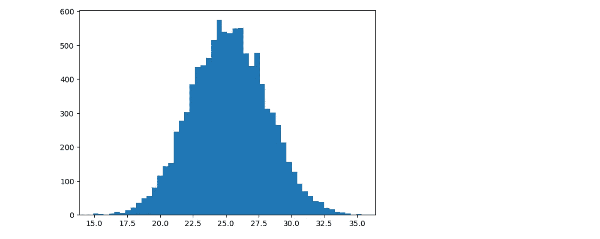
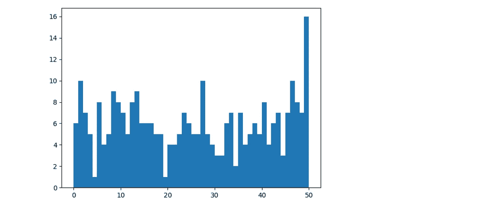
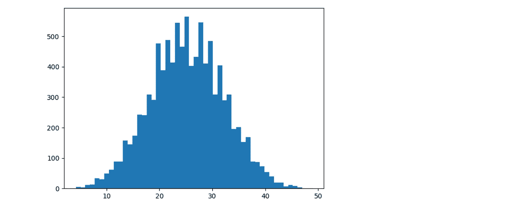

# 中心极限定理简介

> 原文：<https://towardsdatascience.com/a-brief-intro-to-the-central-limit-theorem-ccbd2b661b32?source=collection_archive---------26----------------------->

## 他们说你不可能成为一名数据科学家，如果你不知道…



根据[维基百科](https://en.wikipedia.org/wiki/Central_limit_theorem)。

> 在[概率论](https://en.wikipedia.org/wiki/Probability_theory)中，**中心极限定理** ( **CLT** )确立了，在某些情况下，当[个独立随机变量](https://en.wikipedia.org/wiki/Statistical_independence)相加时，它们的正常归一化和趋向于一个[正态分布](https://en.wikipedia.org/wiki/Normal_distribution)(非正式的一个“*钟形曲线*”)，即使原始变量本身不是正态分布。

**翻译:**如果从总体中抽取足够多的样本，这些样本的均值将接近正态分布。

酷的是，这适用于(几乎)任何分布的人群。让我们举一些例子来证明这一点。

# 生成随机数据

生成 300 个 0 到 50 之间的随机数。

```
import matplotlib.pyplot as plt
import randomX = []for i in range(0,300):
    v = random.randint(0,50)
    X.append(v)
```

画出来，这样我们就能看到数据的形状。

```
plt.rcParams.update({'figure.figsize':(7,5), 'figure.dpi':100})
plt.hist(X, bins = 50)
```



Definitely not a normal distribution

# 取样并计算平均值

现在取 10，000 个样本，样本大小为 5，计算每个样本的平均值，并绘制平均值的频率。

```
import numpy as npmeans = []for i in range(0,10000):
    sample = []

    for ii in range(0,5):
        v = random.choice(X)
        sample.append(v)

    mean = np.mean(sample)
    means.append(mean)
```

# 绘制分布图

画出每个样本平均值的频率。



看起来有点像正态分布。很酷吧。

现在让我们把样本量从 5 个增加到 30 个。


更像是正态分布。

尽管原始人口根本不遵循正态分布，这种情况还是发生了。

我生成的数据是随机的。但是几乎任何分布，连续的或离散的，贝塔的，伽马的或均匀的，都能达到完全相同的效果。

# 为什么这很重要

如果足够多样本的平均值接近正态分布，我们可以“假装”样本本身的分布也是正态的。在给定一个样本的情况下，对整体人口做出推断时会感觉更舒服。

以上是我的理解，但我不是统计学家。所以我想向大众展示一下。为什么中心极限定理对统计学和机器学习如此重要？