# 几种常见统计检验简介

> 原文：<https://towardsdatascience.com/a-brief-introduction-of-some-common-statistical-tests-5f2963014641?source=collection_archive---------8----------------------->

统计测试是理解数据集、执行特征工程和特征选择的重要工具。本博客将简要介绍一些常见的统计测试，它们的作用以及何时使用。

**测试类型:**

*   相关性:检查变量之间的关联。
*   均值比较:检查变量均值之间的差异。
*   回归:检查一个变量是否能预测另一个变量的变化。
*   非参数检验:当数据不符合参数检验的假设时使用的检验。

**开始前的几个概念:**

*   *:零假设，两个总体(变量)之间没有变化，例如，如果两个变量具有相同的分布。*
*   ****Hₐ*** :两个总体(变量)不相等。*
*   ****p 值*** :如果 ***p 值*** 小于规定的显著性水平 **α** (通常为 0.05)，差异显著，拒绝零假设*。**
*   *****H₀*** 被拒绝:两个变量不是来自同一个分布。**

# ****相关性****

## ****1。皮尔逊相关性****

**皮尔逊相关系数是两个变量 ***X*** 和 ***Y*** 之间线性相关的度量，可以计算为:**

**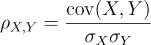**

**Pearson’s correlation coefficient**

**其中 ***cov*** 为协方差 ***σ*** 为标准差。**

**皮尔逊相关系数是介于-1 和 1 之间的值，其中-1 是完全负相关，1 是完全正相关，0 是不相关。**

## ****2。斯皮尔曼关联****

**Spearman 相关性是两个变量之间等级相关性的非参数度量，它评估两个变量之间的单调关系(是否线性)。它可用于连续和离散序数变量，计算公式如下:**

**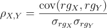**

**Spearman’s correlation coefficient**

**其中 ***rg*** 是 ***X*** 和 ***Y*** 的排名变量，因此 Spearman 相关系数就是两个排名变量之间的 Pearson 相关系数。与皮尔逊相关系数相同，-1 表示完全负相关，1 表示完全正相关，0 表示不相关。**

## ****3。卡方****

**卡方检验检查分类变量的分布是否彼此不同，非常小的卡方检验统计量意味着两个分类变量之间有关系，而非常大的卡方检验统计量意味着没有关系。卡方检验统计量的计算方法如下:**

**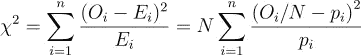**

**Chi-square test statistic**

**在哪里**

*   ***是观察次数如果键入 ***i*** 。***
*   *****N*** 是观察的总数。**
*   ***=*是类型 ***i*** 的期望(理论)计数，由零假设断言类型 ***i*** 在总体中的分数是***【pᵢ***。****
*   *****n*** 是表中单元格的个数。**

**p 值可以通过卡方检验统计和自由度计算得出，通常为＄p<0.05$ is significant and the null hypothesis can be rejected.**

# ****平均值比较****

## ****1。配对 T 检验****

**配对 t 检验比较两个不同时间或两种不同条件下相同变量的两个平均值。换句话说，这里的零假设是真实的均值差为零。**

**它只能比较**正态分布**的连续结果中两个(且只有两个)相关(成对)单位的平均值。**

**T 统计量**T43T**可以计算为:**

*   **1.计算每对中两个观察值之间的差异 ***dᵢ=yᵢ−xᵢ*** 。**
*   **2.计算平均差值 ***d̅*** 。**
*   **3.计算平均差值的标准误差***【se(d̅】***:**

**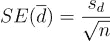**

**standard error of the mean difference**

**其中 ***n*** 为样本量。**

*   **4.计算 ***T*** 由:**

**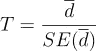**

**t-statistic**

**在零假设下， ***T*** 遵循一个 ***t 分布*** 与***n1***的自由度。**

*   **5.从 ***学生的 t 分布****中获取 ***p 值***使用 ***T*** 和自由度根据[值表确定是否拒绝零假设。](https://en.wikipedia.org/wiki/Student%27s_t-distribution#Table_of_selected_values)***

## ****2。独立 T 检验****

**这类似于配对 t 检验，除了这里的两个变量应该是独立的和同分布的。**

## ****3。ANOVA —方差分析****

**ANOVA 检验比较三个或更多变量之间的平均值，当只有两个变量时，它相当于独立 T 检验。然而，如果我们对每两个变量进行 t 检验，它将对结果的误差率产生复合影响。**

**这里的零假设是所有变量具有相同的样本均值。拒绝零假设告诉我们至少有两个变量有不同的含义，但我们不知道是哪一个。因此，需要进行更多的测试来缩小哪些变量的均值不同。**

*****F 统计量*** 可以计算为:**

*   **1.计算组间变异性的**平方和 *SS_between*** :**

**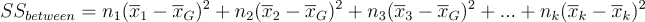**

**其中 ***n*** 为样本量， ***x̅*** 为均值， ***x̅_G*** 为**大均值**为所有变量均值的均值。 ***k*** 是样本平均数。**

**2.计算组间变异性的**均方值 *MS_between*** :**

**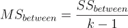**

**3.计算组内变异性的**平方和 *SS_within*** :**

**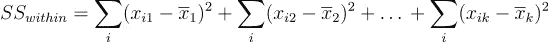**

**其中*是第一个变量的第 ***i*** 个值。***

**4.计算组间变异性的**均方值 *MS_between*** :**

**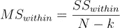**

**其中 ***N*** 是样本量的总和。**

**5.计算***F-统计量*** :**

**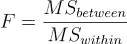**

**6.根据[参考表](http://users.sussex.ac.uk/~grahamh/RM1web/F-ratio%20table%202005.pdf)使用 ***F*** 和显著性水平(通常为 0.05)确定是否拒绝零假设。**

# ****回归****

**简单回归测试一个变量的变化如何预测结果变量的变化，而多重回归测试两个或更多变量组合的变化如何预测结果变量的变化。**

# ****非参数化****

## ****1。Wilcoxon 秩和检验****

**检验两个独立变量的平均值之间的差异。Wilcoxon 秩和检验统计量 ***U*** 可计算如下:**

*   **1.给数字变量分配等级。**
*   **2.计算两个变量的秩和(***【r₁】***，*)。***
*   ***3.计算 ***U₁*** 和 ***U₂*** :***

**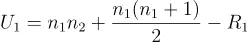****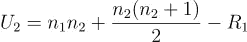**

**其中 ***n₁*** ， ***n₂*** 为两个变量的样本量。**

**Wilcoxon 秩和检验统计量*是 ***U₁*** 和 ***U₂*** 中的较小者。***

*   **4.根据曼-惠特尼 U 表中的[临界值，使用样本大小和显著性水平(通常为 0.05)找到合适的临界值。](http://ocw.umb.edu/psychology/psych-270/other-materials/RelativeResourceManager.pdf)**

**5.如果*小于临界值，则拒绝 ***H₀*** 。***

**好的教程可以在[这里](http://sphweb.bumc.bu.edu/otlt/mph-modules/bs/bs704_nonparametric/BS704_Nonparametric4.html)找到。**

## ****2。Wilcoxon 符号等级测试****

**检验两个相关变量的均值之间的差异，当样本量较小且变量不呈正态分布时，它可以作为配对 t 检验的替代方法。它假设变量是成对的，并且来自同一个总体。**

**更具体地说，这里的假设是:**

*   *****H₀*** :线对之间的差值在零附近呈对称分布。**
*   *****Hₐ*** :线对之间的差异不遵循零附近的对称分布。**

**Wilconxon 符号秩检验统计量可计算如下:**

*   **1.对于 ***i=1，…，N*** ，计算 ***|X₂,ᵢ - X₁,ᵢ|*** 和***sgn(x₂,ᵢ-x₁,ᵢ)***，其中 ***sgn*** 为符号函数。**
*   **2.排除与***|x₂,ᵢ-x₁,ᵢ|=0***的配对。设 ***Nᵣ*** 为缩减后的样本量。**
*   **3.将剩余的 ***Nᵣ*** 对从最小绝对差到最大绝对差依次排列，***|x₂,ᵢ—***。**
*   **4.对配对进行排序，从非零绝对差值最小的配对开始，数值为 1。平局的等级等于他们所跨越等级的平均值。让 ***Rᵢ*** 表示军衔。**
*   **5.计算检验统计量 ***W*** :**

**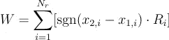**

**Wilcoxon Sign-Rank test statistic**

*   **6.根据[参考表](http://vassarstats.net/textbook/ch12a.html)，使用样本大小和显著性水平(通常为 0.05)找到合适的临界值。**
*   **7.如果 ***W*** 小于临界值，则拒绝*。***

# ***结论***

***使用哪种统计检验以及何时使用取决于数据的性质(连续或分类、相关或独立、配对或不配对等)以及您有兴趣探索的关系。感谢阅读！***