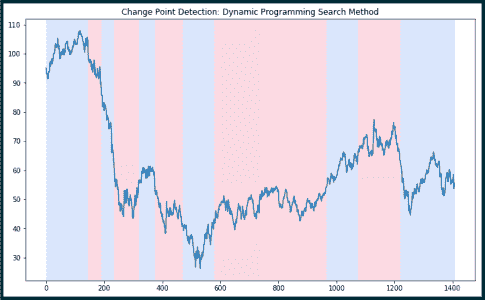

# 使用 Python 进行变化点检测的简介

> 原文：<https://towardsdatascience.com/a-brief-introduction-to-change-point-detection-using-python-d9bcb5299aa7?source=collection_archive---------18----------------------->

## 我的很多工作都大量涉及时间序列分析。我使用的一个很棒但不太为人所知的算法是变化点检测。

变点检测(或 CPD)检测时间序列趋势的突然变化(即时间序列瞬时速度的变化)，这可以通过人眼轻松识别，但使用传统的统计方法很难精确定位。CPD 适用于一系列行业，包括金融、制造质量控制、能源、医疗诊断和人类活动分析。

CPD 非常适合以下使用案例:

1.  检测时间序列中的异常序列/状态
2.  检测时间序列中唯一状态的平均速度
3.  实时检测时间序列状态的突变

我发现 CPD 在自动识别和去除时间序列中的异常序列时特别有用，如下所示:


*Change point detection using the Python ruptures package: We can identify anomalous data sequences that need to be removed from the time series*

如果我试图确定系统中的速率变化，这也很好，使我可以专注于类似序列的平均速率:


*Change Point Detection in R using the PELT Algorithm: We can split up average velocity of a time series across phases using CPD*

本文提供了关于变化点检测的简单易懂的背景知识，以及用 Python 实现的实用包(包括示例代码！).

# 算法背景

CPD 有两种不同的类别——离线和在线。在本节中，我将对这两者进行简要概述。

**离线变化点检测**

当不使用实时流数据时，变化点检测方法是“离线”的，并且需要完整的时间序列来进行统计分析。因为离线方法分析整个时间序列，它们通常更准确。离线变化点检测的一些特征如下(1):

1.  所有数据同时被接收和处理
2.  所有的变化都是感兴趣的，而不仅仅是序列中最近的变化

**在线变点检测**

与离线变化点检测相比，在线变化点检测用于实时流时间序列，通常用于持续监控或即时异常检测(1)。在线 CPD 在单个数据点可用时对其进行处理，目的是在它们发生时立即检测到状态变化(2)。在线变化点检测有几个特征:

1.  快速“即时”处理，以便快速评估时间序列趋势的变化
2.  仅评估时间序列中最近的变化，而不是以前的变化

# 用于变化点检测的 Python 包

r 有一个优秀的包用于变点检测，叫做 [changepoint](https://cran.r-project.org/web/packages/changepoint/changepoint.pdf) 。该软件包允许用户使用多种搜索方法对时间序列进行变点分析。不幸的是，没有与 R 的 changepoint 包直接对应的 Python。然而，还有其他几个包提供了变化点检测，可通过 Python 获得:

1.  [破坏了包](https://github.com/deepcharles/ruptures)，这是一个用于执行离线变化点检测的 Python 库
2.  使用一个 R 到 Python 的接口 [rpy2 包](https://rpy2.readthedocs.io/en/version_2.8.x/overview.html)将 R changepoint 包调用到 Python 中
3.  [changefinder 包](https://github.com/shunsukeaihara/changefinder)，一个用于在线变更点检测的 Python 库

在这三个选项中，我发现选项#1 和#3 最容易实现，因为它们不需要在 Python 环境中下载和配置 R 和 rpy2。R changepoint 包的功能是迄今为止最健壮的，但是配置它很耗时。因此，这不是这篇文章的重点。

***如果您对使用 rpy2 通过 Python 调用 R changepoint 包的深入背景感兴趣，请查看 Steven Reitsma 的本教程*** [***】。***](https://medium.com/bigdatarepublic/contextual-changepoint-detection-with-python-and-r-using-rpy2-fa7d86259ba9)

让我们进一步探讨选项 1 和选项 3。

# 破裂包装

Charles Truong 改编了 R changepoint 包的[破裂包](http://ctruong.perso.math.cnrs.fr/ruptures-docs/build/html/index.html)。它特别关注离线变点检测，在这里对整个序列进行分析。在所有 Python changepoint 选项中，它是最好的文档。我们可以使用基本的 pip 安装命令来安装它:

```
pip install ruptures
```

该软件包提供了多种搜索方法(二进制分割、毛皮、基于窗口的变化检测、动态编程等)。)，以及多种成本函数。在本教程中，我们特别关注搜索方法。

**搜索方法背景**

本节简要介绍了 surfaces 包中可用的一些搜索方法，包括二进制分割、PELT、基于窗口的变化检测和动态编程。

*修剪精确线性时间(毛皮)搜索方法:*毛皮方法是一种精确的方法，并且通常产生快速且一致的结果。它通过最小化成本来检测变化点(4)。该算法的计算成本为 O(n)，其中 n 是数据点的数量(4)。更多关于毛皮方法的信息，请查看[这篇论文](https://pdfs.semanticscholar.org/a7bc/09b7a73dc96be7cf844978014ad13cf0475a.pdf?_ga=2.100774593.1133001833.1565582238-1351709189.1562946956)。

*动态规划搜索法:*这是一种精确法，计算量相当大，为 O(Qn)，其中 Q 为最大变化点数，n 为数据点数(4)。有关动态编程搜索方法的更多信息，请查看本文。

*二分分割搜索法:*这种方法可以说是文献中最成立的(4)。二进制分割是一种近似方法，其有效计算成本为 O (n log n)，其中 n 是数据点的数量(4)。该算法通过对整个序列反复应用单个改变点方法来确定是否存在分裂。如果检测到分裂，则序列分裂成两个子序列(5)。然后将相同的过程应用于两个子序列，等等(5)。欲了解更多关于二进制分割的信息，请查看本文。

*基于窗口的搜索方法:*这是一种比较简单的近似搜索方法。基于窗口的搜索方法“计算随信号 y 移动的两个相邻窗口之间的差异”(6)。当两个窗口非常不相似时，两个值之间会出现很大的差异，这指示了一个变化点(6)。在生成差异曲线时，该算法在序列中定位最佳变化点索引(6)。有关基于窗口的搜索方法的更多信息，请查看[本文](https://arxiv.org/pdf/1801.00718.pdf)。

**代码示例**

在下面的代码中，我们使用上面描述的搜索方法来执行变化点检测。我们使用每日 WTI 石油价格的时间序列，从 2014 年到现在，通过能源信息管理局(EIA)的 API 提取([参见本教程了解更多关于使用 EIA API 提取数据的信息](https://techrando.com/2019/06/26/how-to-use-the-energy-information-administration-eia-application-programming-interface-api-and-pull-live-data-directly-into-python-for-analysis/)):

```
def retrieve_time_series(api, series_ID):
    """
    Return the time series dataframe, 
    based on API and unique Series   ID
    api: API that we're connected to
    series_ID: string. Name of the series that we want 
    to pull from the EIA API
    """
    #Retrieve Data By Series ID 
    series_search = api.data_by_series(series=series_ID)
    ##Create a pandas dataframe from the retrieved time series
    df = pd.DataFrame(series_search)
    return df """
Execution in main block
"""#Create EIA API using your specific API key
api_key = 'YOUR API KEY HERE'
api = eia.API(api_key)

#Pull the oil WTI price data
series_ID='PET.RWTC.D'
price_df=retrieve_time_series(api, series_ID)
price_df.reset_index(level=0, inplace=True)
#Rename the columns for easier analysis
price_df.rename(columns={'index':'Date',
            price_df.columns[1]:'WTI_Price'}, 
            inplace=True)
#Format the 'Date' column 
price_df['Date']=price_df['Date'].astype(str).str[:-3]
#Convert the Date column into a date object
price_df['Date']=pd.to_datetime(price_df['Date'], format='%Y %m%d')
#Subset to only include data going back to 2014
price_df=price_df[(price_df['Date']>='2014-01-01')]#Convert the time series values to a numpy 1D array
points=np.array(price_df['WTI_Price'])

#RUPTURES PACKAGE
#Changepoint detection with the Pelt search method
model="rbf"
algo = rpt.Pelt(model=model).fit(points)
result = algo.predict(pen=10)
rpt.display(points, result, figsize=(10, 6))
plt.title('Change Point Detection: Pelt Search Method')
plt.show()  

#Changepoint detection with the Binary Segmentation search method
model = "l2"  
algo = rpt.Binseg(model=model).fit(points)
my_bkps = algo.predict(n_bkps=10)
# show results
rpt.show.display(points, my_bkps, figsize=(10, 6))
plt.title('Change Point Detection: Binary Segmentation Search Method')
plt.show()

#Changepoint detection with window-based search method
model = "l2"  
algo = rpt.Window(width=40, model=model).fit(points)
my_bkps = algo.predict(n_bkps=10)
rpt.show.display(points, my_bkps, figsize=(10, 6))
plt.title('Change Point Detection: Window-Based Search Method')
plt.show()

#Changepoint detection with dynamic programming search method
model = "l1"  
algo = rpt.Dynp(model=model, min_size=3, jump=5).fit(points)
my_bkps = algo.predict(n_bkps=10)
rpt.show.display(points, my_bkps, figsize=(10, 6))
plt.title('Change Point Detection: Dynamic Programming Search Method')
plt.show()
```


*Snapshot of the WTI Oil Price Time Series, pulled via the EIA API*


*Change Point Detection with Pelt Search Method, WTI Oil Price Time Series, 2014-Present*


*Change Point Detection with Binary Segmentation Search Method, WTI Oil Price Time Series, 2014-Present*


*Change Point Detection with Window-Based Search Method, WTI Oil Price Time Series, 2014-Present*



*Change Point Detection with Dynamic Programming Search Method, WTI Oil Price Time Series, 2014-Present*

如上图所示，序列中检测到的变化点因使用的搜索方法而异。最佳搜索方法取决于您在对时间序列进行子集化时最重视的内容。PELT 和动态规划方法都是精确(与近似相反)方法，因此它们通常更精确。

# changefinder 包

changefinder 包专门用于在线变化点检测。为了执行变点检测，该包使用 SDAR 建模，或顺序贴现自回归时间序列建模。SDAR 就像它听起来的那样——它是自回归(AR)模型的扩展，其中序列中较旧的数据点被“贴现”，即不如序列中较新的值重要。因为最近的数据在 SDAR 模型中权重更大，所以 SDAR 非常适合在线变化点检测，这种检测侧重于检测序列中最近的变化。

自回归建模(AR)是时间序列建模最流行的形式之一，其中当前值是根据序列中以前的值预测的(3)。有关 SDAR 模型(以及多元标准差模型)的更多信息，请查看本文。

**代码示例**

现在我们已经有了 changefinder 包的一些初始背景，让我们用它来执行在线变更点检测。

对于本例，我们将使用 random()和 numpy()包自动生成数据:

```
#Create a synthetic data set to test against
points=np.concatenate([np.random.rand(100)+5,
                       np.random.rand(100)+10,
                       np.random.rand(100)+5])
```

生成一些合成数据后，我们通过 ChangeFinder 函数运行这些数据，并根据 SDAR 为每个数据点生成一个异常值:

```
#CHANGEFINDER PACKAGE
f, (ax1, ax2) = plt.subplots(2, 1)
f.subplots_adjust(hspace=0.4)
ax1.plot(points)
ax1.set_title("data point")
#Initiate changefinder function
cf = changefinder.ChangeFinder()
scores = [cf.update(p) for p in points]
ax2.plot(scores)
ax2.set_title("anomaly score")
plt.show()
```


*ChangeFinder Results: Top graph represents the synthetic data, and bottom graph represents corresponding anomaly scores*

在上面的图像中，异常分数在时间 100 和时间 200 达到峰值，这对应于时间序列中发生巨大变化的点。为异常分数设置一个最小阈值，其中任何高于某个阈值的分数都对应于序列中的一个变化点，这是识别序列中单个变化点的最佳方法。

我对变化点检测的简要介绍到此结束。要访问我在本教程中使用的代码，请查看[我的 Github repo](https://github.com/kperry2215/change_point_detection) 。

一如既往的感谢阅读！

查看我的其他数据科学文章和教程:

[](https://techrando.com/2019/07/30/using-ml-to-predict-the-best-time-to-sell-electricity-back-to-the-grid/) [## 用最大似然法预测向电网售电的最佳时间

### 随着新技术在可再生能源和能源存储行业的兴起，有许多新的机会…

techrando.com](https://techrando.com/2019/07/30/using-ml-to-predict-the-best-time-to-sell-electricity-back-to-the-grid/) [](https://techrando.com/2019/07/19/analyzing-electricity-price-time-series-data-using-python-time-series-decomposition-and-price-forecasting-using-a-vector-autoregression-var-model/) [## 使用 Python 分析电价时间序列数据:时间序列分解和价格…

### 欢迎来到科技兰多博客！在今天的帖子中，我将使用能源信息管理局的 API…

techrando.com](https://techrando.com/2019/07/19/analyzing-electricity-price-time-series-data-using-python-time-series-decomposition-and-price-forecasting-using-a-vector-autoregression-var-model/) 

# 来源

1.  基利克，丽贝卡。2017.*最佳变点检测算法介绍*。[http://members . cbio . mines-Paris tech . fr/~ thocking/change-tutorial/RK-cptworkshop . html](http://members.cbio.mines-paristech.fr/~thocking/change-tutorial/RK-CptWorkshop.html)
2.  Aminikhanghahi，Samaneh 和 Cook，Diane。2017 年 5 月。*时间序列突变点检测方法综述。*[https://www.ncbi.nlm.nih.gov/pmc/articles/PMC5464762/#R7](https://www.ncbi.nlm.nih.gov/pmc/articles/PMC5464762/#R7)
3.  法蒂玛·萨伊德；努尔、达尔菲亚纳；国王，罗伯特。2012.*利用 SDVAR 算法检测向量自回归模型的变点。*[https://pdfs . semantic scholar . org/c56d/4 adad 7 ed 3 f 504015 BC 6 BBC 663 e 21 e 55 f 174 b . pdf](https://pdfs.semanticscholar.org/c56d/4adad7ed3f504015bc6bbc663e21e55f174b.pdf)
4.  Wambui，Gachomo Dorcas 吉丘希·安东尼·怀蒂图；安东尼·万何亚。2015 年 12 月。*多变点检测中修剪精确线性时间(PELT)检验的功效。*[https://pdfs . semantic scholar . org/a7bc/09 B7 a 73 DC 96 be 7 cf 844978014 ad 13 cf 0475 a . pdf？_ ga = 2.100775582238-1351705](https://pdfs.semanticscholar.org/a7bc/09b7a73dc96be7cf844978014ad13cf0475a.pdf?_ga=2.100774593.1133001833.1565582238-1351709189.1562946956)
5.  克里斯蒂安·罗尔贝克。*使用二元分割和最优分割检测方差变化*。[https://www.lancaster.ac.uk/pg/rohrbeck/ResearchTopicI.pdf](https://www.lancaster.ac.uk/pg/rohrbeck/ResearchTopicI.pdf)
6.  查尔斯·张；劳伦特·奥德雷；尼古拉·瓦亚提斯。2019 年 1 月。*离线变点检测方法的选择性审查。[https://arxiv.org/pdf/1801.00718.pdf](https://arxiv.org/pdf/1801.00718.pdf)T21*

*原载于 2019 年 8 月 14 日*[*https://techrando.com*](https://techrando.com/2019/08/14/a-brief-introduction-to-change-point-detection-using-python/)*。*