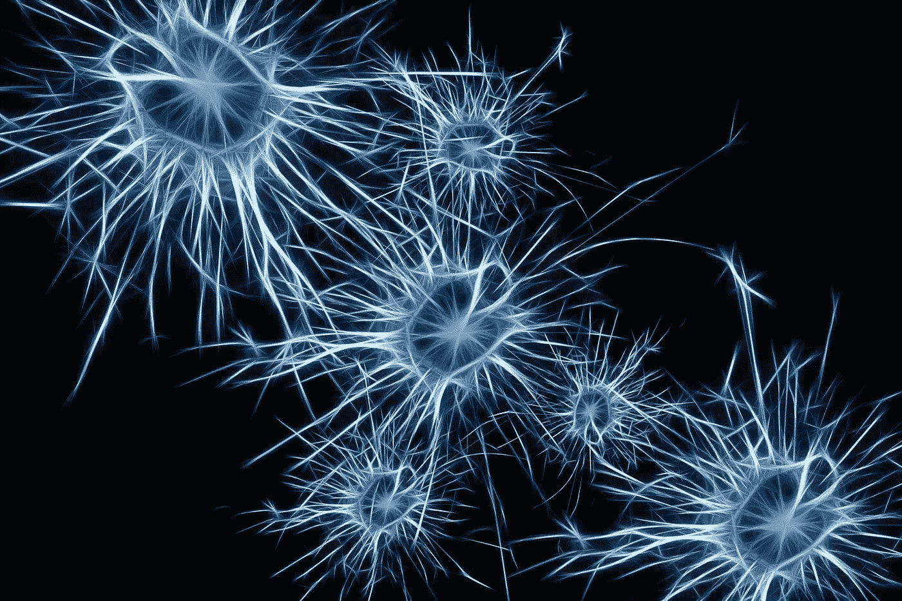
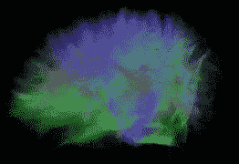
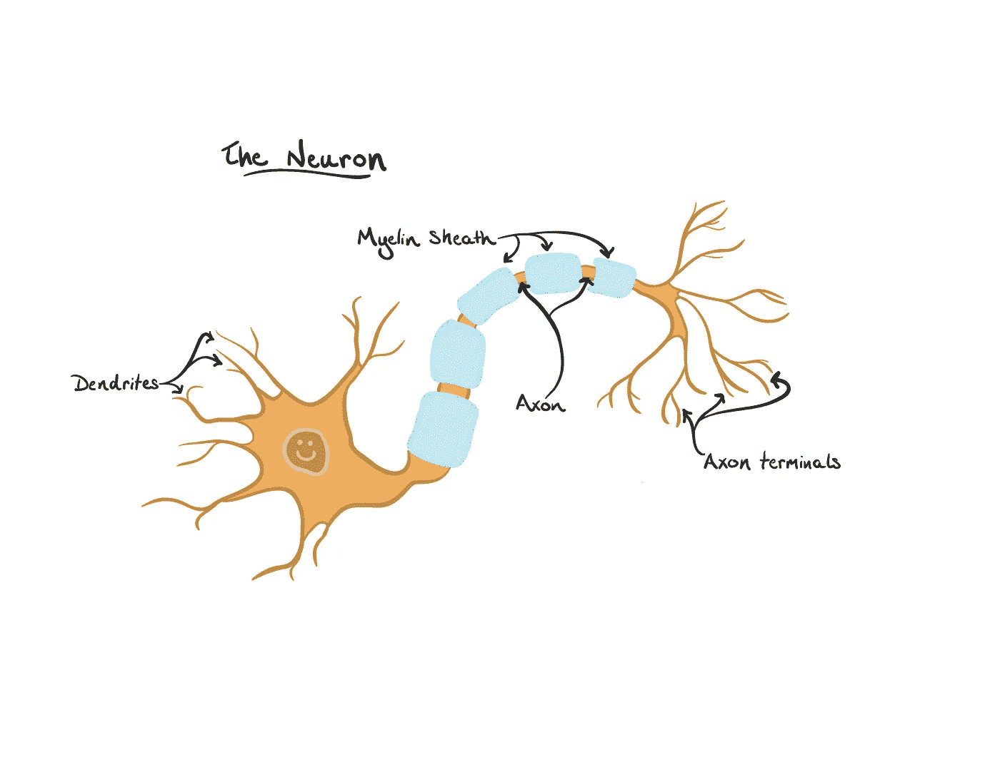
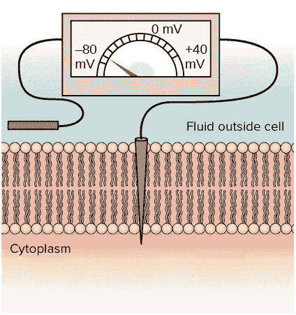
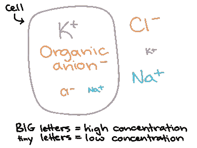
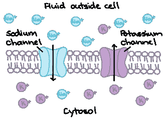
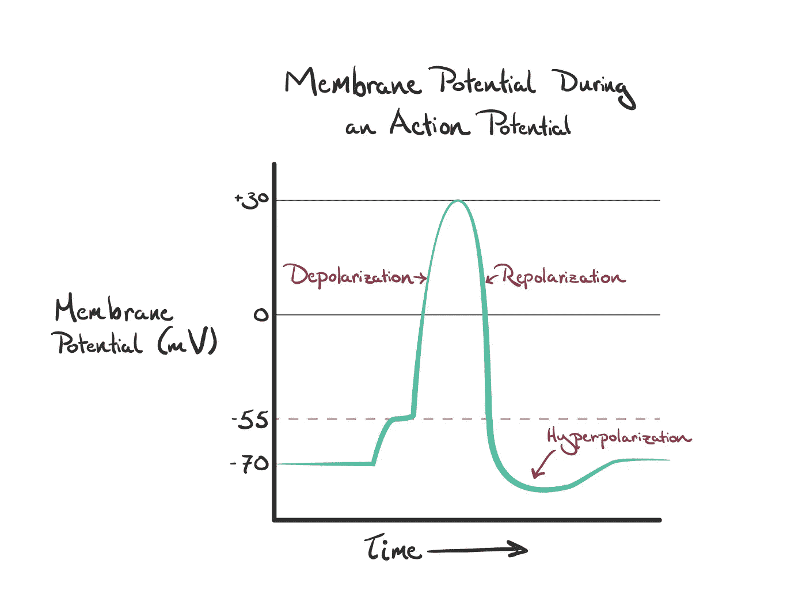
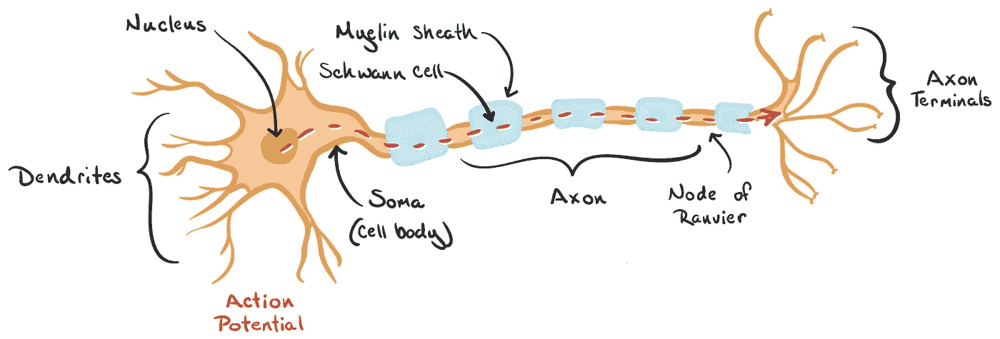
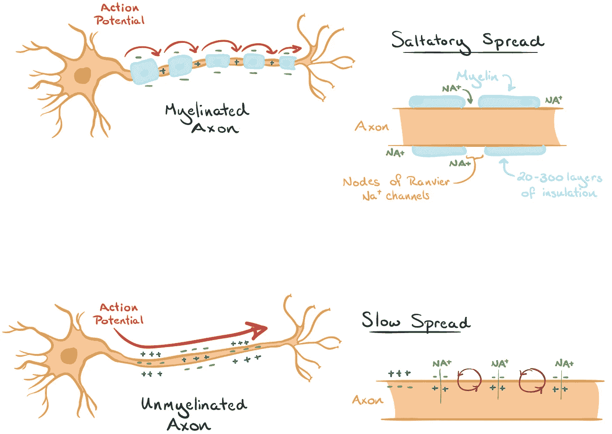

# 计算神经科学简介第一部分

> 原文：<https://towardsdatascience.com/a-brief-introduction-to-computational-neuroscience-part-1-42171791f613?source=collection_archive---------6----------------------->

## **人脑的直觉和建模**

# **1.0 简介**

计算神经科学是唯一可以帮助你理解，你如何在大脑中思考和处理信息的领域。即使在你完成这句话的时候，你的大脑中也会发生大量的动作，这些动作可以通过对神经元的研究来解码。**计算神经科学的最终目标是解释大脑中如何使用电信号和化学信号来表示和处理信息。**它解释了神经元计算的生物物理机制、神经回路的计算机模拟和学习模型。

在你开始阅读这篇文章之前，你的大脑(你)可能会有一些想法，为什么我们需要阅读这篇文章？我们能从中学到什么？还是这个内容会让我知道，大脑在各种情况下是如何反应和解决问题的？是啊！所有的数学，排列，化学方程式都发生在我们自己的大脑里。本文分为三个部分。在文章的第一部分，我们简要介绍了计算神经科学，包括神经元的作用，神经元的解剖结构和可以解释大脑功能的模型，即所谓的大脑模型。

现在，让我们看看通过理解或学习大脑，我们能得到什么。在过去的几年里，我们已经看到了神经网络的进步，这些进步完全是受“计算神经科学”的启发。在神经网络/计算机视觉的几个领域中使用的算法或模型是通过对神经科学的理论理解而得到的。我们所知道的是，我们的大脑快速、聪明，它们从环境中接受输入，发生一些化学反应/融合，最后，它们给我们答案或输出。通过阅读，你将了解我们大脑内部程序的执行情况。我们开始吧！

这是 Lex Friedman 最近发布的推文。他在麻省理工学院担任研究科学家。

> **人脑真是不可思议。这里可以看到大脑中 3%的神经元和 0.0001%的突触，构成了大脑丘脑皮层系统的一部分。通过 DigiCortex 引擎实现可视化。**

# **2.0 神经科学**

## **背景**

“计算神经科学”一词是由 Eric L. Schwartz 在一次会议上提出的，该会议对一个领域进行了回顾，在此之前，该领域有多种名称，如神经建模、大脑理论和神经网络。后来，Hubel & Wiesel 在初级视觉皮层(第一皮层区域)发现了跨视网膜神经元的工作。这将在第 3 节中解释。此外，随着计算能力的提高，大多数计算神经科学家在分析不同的数据和合成生物现象的新模型方面与实验学家密切合作。

## **理论神经科学**

神经科学包括从分子和细胞研究到**人类心理物理学和心理学**的方法。计算神经科学的目的是描述大脑中如何使用电信号和化学信号来解释和处理信息。这一意图并不新鲜，但在过去十年里发生了很大变化。由于神经科学的进步，现在对大脑有了更多的了解，更多的计算能力可用于执行神经系统的现实模拟，新的见解正在从对大型神经元网络的简化模型的研究中得出。

了解大脑是一项挑战，吸引了越来越多来自不同学科的科学家。虽然在过去的几十年里，在细胞和分子水平上对大脑的结构有了大量的发现，但我们仍然不明白神经系统是如何使我们能够看、听、学习、记忆和计划某些行为的。但是有许多领域依赖于计算神经科学，下面列出了一些，

*   深度学习、人工智能和机器学习
*   人类心理学
*   医学科学
*   心理模型
*   计算解剖学
*   信息论

# **3.0 Hubel 和 Wiesel 实验**

这个实验似乎是已经发现的神经元洞察力的先兆。为深入探索计算神经科学奠定了基础。让我们看看这里面是什么。

David Hubel 和 Torsten Wiesel 教授在 20 世纪 50 年代进行了实验，他们记录了猫在移动强光时视网膜上的神经元活动。在实验进行的过程中，他们记录了一些令人兴奋的观察结果

*   神经元只在某些情况下被激发，但并不总是如此。
*   神经元的活动根据光线的方向和位置而变化。

(不要担心神经元术语，我们将在以下主题中探索所有术语。)连接视网膜和大脑的细胞中记录的电信号和化学信号被转换成声音信号。然后播放这些声音信号，结果是“啪”的一声！“砰！”爆裂声。这些不是连续的，而是仅在神经元激活时播放。此后，它对神经元如何提取视网膜投射的信息建立了基本的理解，然后清楚地解释了视觉皮层神经元(存在于大脑中的初级视觉皮层 V1 中)如何形成图像。

# **4.0 神经细胞、神经元的解剖学和电个性**

因此，为了清楚地了解大脑是如何工作的，以及我们如何能够感知我们周围的世界，让我们看看大脑的主要部分，即**神经元**。这些是人脑的计算单元。

大脑可以被分解成称为神经元的独立的离散部分。有许多可能的神经元形状，例如，在视觉皮层，神经元是锥体，在小脑，它们被称为浦肯野细胞。

## **神经元的结构**

神经元由三个主要部分组成，即体细胞、树突和轴突。**胞体是细胞体。树突是神经元的输入端，而轴突是输出端。**因此，树突接收来自相邻神经元轴突的输入。这些输入产生了**兴奋性突触后电位(EPSP)** ，当从几个其他神经元的组合中提取时，它提供了**动作电位或尖峰**。只有当输入达到某个阈值时，这种尖峰才会发生。

Structure of neuron ([src](https://www.khanacademy.org/test-prep/mcat/organ-systems/neuron-membrane-potentials/a/neuron-action-potentials-the-creation-of-a-brain-signal))

## **窥视内部**

有趣的是，神经元可以被定义为**“带电液体的漏袋”那么，突然之间，化学物质是如何出现的呢？这是一件我们很多人都没有意识到的重要事情。**神经元完全处理化学物质，化学反应驱动所有的棘波和突触。我们的大脑中确实有钠离子、氯离子、钾离子等。很迷人，不是吗？****

神经元的内容物被包裹在脂质双层中，简单来说脂质就是“脂肪”。这种双层对于带电离子是不可渗透的，例如 Na+，K+，Cl-等。那么，这些化学物质是如何在神经元之间移动的呢？为了回答这个问题，让我们深入研究离子通道。

## **离子通道**

**离子通道**允许这些离子的传递，即进出神经元。这导致在神经元的内部和外部之间存在电势差，**内部电势相对于外部为-70mv。**

Membrane potential ([src](https://www.khanacademy.org/science/biology/human-biology/modal/a/the-membrane-potential))

我们在外部有 Na+，Cl-，而 K+，有机阴离子-存在于神经元内部。反之亦然，但在这种情况下，离子浓度较低，如下图所示。

Types of ions found in neurons ([src](https://www.khanacademy.org/science/biology/human-biology/modal/a/the-membrane-potential))

那么，电位怎么总是-70mv 呢？这是通过将离子泵入和泵出神经元来维持的，即通过排出 Na+并允许 K+进入。离子通道仅允许特定的神经元通过，并可分为三种门控通道，

*   **电压门控** —通道打开的概率取决于膜电压。
*   **化学门控**——与化学物质结合导致通道打开。
*   **机械门控** —压力或拉伸影响通道打开/关闭。

Ionic passage across the neuron membrane ([src](https://www.khanacademy.org/science/biology/human-biology/modal/a/the-membrane-potential))

## **神经元信号**

神经元信号传递是通过信号传递在神经元之间发生的相互作用。上面讨论的门控通道允许神经元发出信号，让我们看看如何，

*   首先，来自其他神经元的输入激活化学门控通道，即打开通道，这导致局部膜电位的变化。
*   接下来，这导致电压门控通道的打开/关闭，从而导致**去极化**(电压的正变化)和**超极化**(电压的负变化)。**复极**是细胞回到实际电位的地方。
*   足够强的去极化将导致尖峰或动作电位。
*   这确实打开了 Na+通道(电压门控)，随后 Na+快速流入(从外向内),驱使更多的通道打开，直到它们失活。
*   当 Na+通道开始缓慢失活时，K+流出(从内向外)恢复膜电位或 K+通道打开，从而减少尖峰。这就是复极。
*   此后，随着 K+通道保持开放并继续让正离子离开神经元，细胞变得更负。这被称为超极化。
*   随着钾通道关闭，钠钾泵再次恢复静息状态。
*   棘波产生后，沿着轴突传播。
*   沿着轴突，Na+通道首先开放，导致动作电位上升，随后 Na+通道关闭，K+通道开放，导致动作电位下降。

从图形上看，这是膜电位随时间变化的记录方式，

Membrane potential during an action potential ([src](https://www.khanacademy.org/test-prep/mcat/organ-systems/neuron-membrane-potentials/a/neuron-action-potentials-the-creation-of-a-brain-signal))

## **速度**

信号沿着轴突传播得非常快，主要有两个原因；尺寸和**髓鞘**。这是一种绝缘物质，不允许离子通过。

Anatomy of neuron ([src](https://www.khanacademy.org/test-prep/mcat/organ-systems/neuron-membrane-potentials/a/action-potential-velocity))

在上述神经元中描绘的 Ranvier 的**节点是存在于轴突周围髓鞘包裹之间的空间。在外周神经系统中，髓磷脂存在于施万细胞膜中。在中枢神经系统中，少突胶质细胞负责绝缘。**

> **周围神经系统是由大脑和脊髓以外的神经和神经节组成的。中枢神经系统由大脑和脊髓组成。**

当动作电位穿过轴突时，有可能会丢失，所以髓鞘的存在保护了它。

Myelinated vs Unmyelinated Axon ([src](https://www.khanacademy.org/test-prep/mcat/organ-systems/neuron-membrane-potentials/a/action-potential-velocity))

髓鞘降低了其覆盖区域的神经元的电容。因此，神经元会产生大量需要平衡的激动的负离子。因此，它们扩散到膜的末端，希望找到正离子。然后正离子靠近它们，让它们平静下来。这反过来导致在外面形成正离子薄层，在里面形成负离子薄层。当髓鞘包裹在轴突周围时，在轴突的髓鞘包裹部分积累的负离子较少，从那时起，它们将不能容易地接近正离子。这意味着，当动作电位快速通过时，被保护的区域更容易去极化(电压的正变化),因为需要抵消的负离子更少。

ranvier 的节点具有这些正门控电压通道，其中正离子形成群集，因为它们是未覆盖的区域。所以，轴突中的负离子想要到达兰维尔的节点来平衡自己。这种动作电位的传播看起来像一个信号从一个节点跳到另一个节点，称为“**跳跃传导**”。

这也解释了尖峰的形状，它在一定程度上增加，然后减少。

# **5.0 理解大脑**

既然我们已经看到了神经元的结构以及它们如何通过发送信号和产生化学物质来进行计算，现在是时候将一组神经元分组来了解大脑了。理解大脑总是一个棘手的问题，有时我们无法预测人/大脑在一些场景下会如何反应，尽管他们沉迷于日常活动。它们根据不断触发的动作，在神经元内部存储了大量信息。所以这里的问题是，我们需要如何解读这些信息？有三种理解大脑的计算模型，它们解释了三个问题:“什么、如何和为什么”。这些模型分别被命名为描述性模型、机械论模型和解释模型。现在让我们简单讨论一下这些，

**描述性模型**:这个模型回答了问题“**什么**是神经元对外界刺激的反应？”他们回顾了大量的实验数据，从而描述了神经元和神经回路的功能。这些模型可能松散地基于生物物理学、解剖学和生理学的发现，但它们的主要目的是描述现象，而不是解释现象。

描述性模型的两个主要属性是，

*   它们定性地定义了如何通过神经编码来描述场景或数据。
*   它们还定义了我们如何通过神经解码技术从神经元中提取信息。

**机械模型**:另一方面，机械模型解决了“**神经系统如何通过已知的解剖学、生理学和电路运作”的问题。这种模型通常在不同层次的描述性模型之间形成一座桥梁。**

**机械模型的两个主要特性是，**

*   **我们如何在计算机上模拟单个神经元的行为？**
*   **我们如何模拟神经元网络？**

****解释性模型:**这些模型使用计算和信息论原理来探索神经系统功能各方面的行为和认知意义，解决“**为什么**神经系统像它们那样运作”的问题。**

**解释模型的两个主要属性是，**

*   **为什么大脑以这样的方式运作？**
*   **它们背后的计算原理是什么？**

**感谢阅读。本文作者是萨姆希塔·阿拉和维哈尔·鞍马。**

**敬请关注我们即将到来的部分，**“大脑的编码和解码”**。✨**

**参考资料: [HubelAndWeisel](https://knowingneurons.com/2014/10/29/hubel-and-wiesel-the-neural-basis-of-visual-perception/) ，[学计算神经科学](https://www.coursera.org/learn/computational-neuroscience)， [KhanAcademy](https://www.khanacademy.org/science/biology/human-biology#neuron-nervous-system) 。**