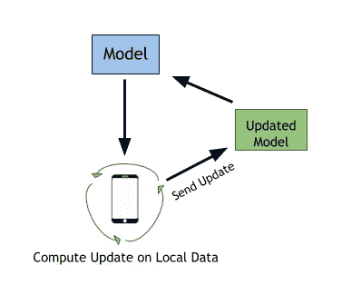

# 深度学习中的隐私简介

> 原文：<https://towardsdatascience.com/a-brief-introduction-to-privacy-in-deep-learning-24e0f3eab3da?source=collection_archive---------25----------------------->

成功的最先进的深度学习技术需要大量集中的训练数据，或者保存在一台机器或一个位置的数据。尽管深度学习在大量任务中表现出前所未有的准确性和成功，但集中式训练数据的普遍使用限制了深度学习在暴露数据不会带来隐私风险的领域中的适用性。这导致医疗保健等一些领域从深度学习中受益有限。

众所周知，要从深度学习模型中获得最佳结果，训练数据集必须更大，种类更多。学习的数据越多，结果就越好。缺乏对更大数据集和多样性的访问的模型通常会受到过度拟合和不良最终结果的影响。

在医学领域，深度学习已被证明有可能挽救生命，对该领域的发展至关重要。医疗机构携带的高度隐私和敏感信息带来了问题。由于高隐私期望和法规，数据不能合法地与其他机构共享。然后，每个机构被迫只根据他们可用的数据训练模型:他们自己的病人数据，而不是来自其他机构的数据。这导致模型产生的结果无法概括，并且在呈现新数据时表现不佳。

# 联合学习

联邦学习算法的目标是在大量不同参与设备之间保存的数据上训练一个模型，这些设备称为**客户端**。如前所述，训练深度学习模型需要将数据与模型本身一起存储在本地。换句话说，训练数据被带到深度学习模型中。联合学习旨在将模型引入训练数据。

该模型将使用大量的客户端。训练数据仍将被本地存储在每个设备上，但是每个设备将下载模型，对它们的本地数据执行计算，产生模型的小更新，然后更新模型并将其发送回中央服务器。这使得每个客户端能够在本地存储其数据的同时对全局模型训练做出贡献。每个客户端将只向全局模型发回一个更新，然后在全局模型中与其他客户端的更新进行平均。

**推荐阅读:**

*   [联合学习:提高沟通效率的策略](https://arxiv.org/pdf/1610.05492.pdf)

# 安全多方计算

安全多方计算(MPC)旨在允许多方对其输入数据执行计算，同时确保数据保密且最终结果准确。

想象有五个朋友坐在一张桌子旁。他们想知道他们中谁的工资最高，但是他们五个人都不想让别人知道他们自己的工资，除非他们的工资最高。解决这个问题的一个简单方法是引入一个可信任的第三方，五个朋友中的每一个都可以告诉这个第三方他们的工资，第三方将宣布谁的工资最高，而不会给出任何其他人的工资信息。不幸的是，这样一个值得信任的第三方很难得到。因此，MPC 的目标是用一个仍能确保数据隐私的加密协议来取代这个需要的可信任的第三方。

MPC 是机器学习和深度学习中一个不断发展的密码学领域。以下是一些其他资源和推荐读物:

*   [用于隐私保护数据挖掘的安全多方计算](http://citeseerx.ist.psu.edu/viewdoc/download?doi=10.1.1.215.6337&rep=rep1&type=pdf)
*   [多方计算在实践中有用吗？](http://cs.au.dk/~orlandi/icassp-draft.pdf)

# 差异隐私

如果分析数据的算法的输出不能用于确定在执行计算的原始数据集中是否使用了个人数据，则该算法可被定义为差分私有算法。差异隐私的目标是通过让计算运行在不完全依赖个人信息的数据上来降低个人信息被泄露的风险。

这是通过向数据集添加足够的噪声来影响数据，从而无法确定个人的具体细节。为了确保每个人的匿名级别相同，随着数据集规模的减小，会添加更多的噪声。随着数据集的增长，需要使用更少的噪声来实现每个人相同的隐私。

例如，对于包含来自两个人的信息的数据集，每个人占数据集的 50%。将需要添加更大量的噪声来确保两个人的数据都是保密的。一个有一百万人的数据集将使每个人占数据集的 0.000001%。因此，需要更少的噪声来掩盖个体的数据。

**推荐阅读:**

*   [垂直分区数据库上的隐私保护数据挖掘](https://www.microsoft.com/en-us/research/wp-content/uploads/2016/02/crypto04-dn.pdf)
*   [差分隐私](https://www.microsoft.com/en-us/research/wp-content/uploads/2016/02/dwork.pdf)
*   [在保护隐私的同时泄露信息](http://citeseerx.ist.psu.edu/viewdoc/download?doi=10.1.1.101.1298&rep=rep1&type=pdf)