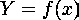
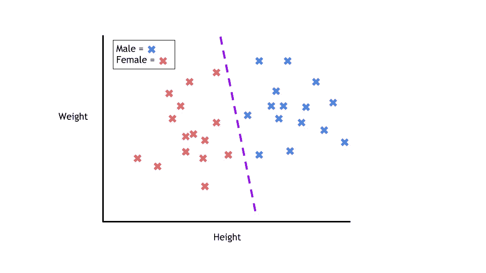
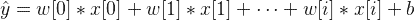
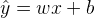
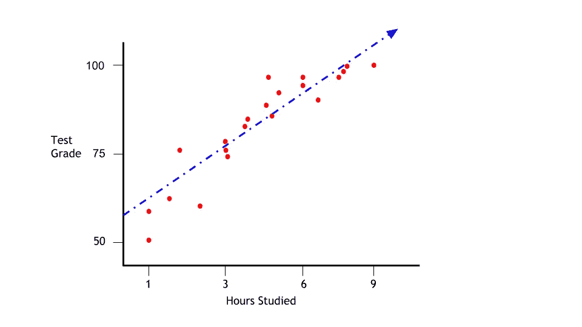
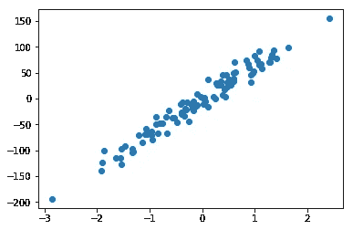
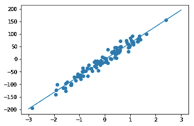
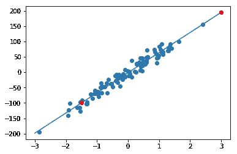

# 监督学习简介

> 原文：<https://towardsdatascience.com/a-brief-introduction-to-supervised-learning-54a3e3932590?source=collection_archive---------2----------------------->

监督学习是当今机器学习最常见的分支。通常，新的机器学习实践者将从监督学习算法开始他们的旅程。因此，这三篇文章系列的第一篇将是关于监督学习的。

监督机器学习算法被设计成通过例子来学习。“受监督的”学习这个名称源于这样一种想法，即训练这种类型的算法就像让一个老师监督整个过程。

当训练监督学习算法时，训练数据将由与正确输出配对的输入组成。在训练期间，算法将在数据中搜索与期望输出相关的模式。训练后，监督学习算法将接受新的未知输入，并根据之前的训练数据确定新输入将被分类为哪个标签。监督学习模型的目标是为新出现的输入数据预测正确的标签。在其最基本的形式下，监督学习算法可以简单地写成:



其中 *Y* 是由映射函数确定的预测输出，该映射函数将类别分配给输入值 *x* 。用于将输入特征连接到预测输出的函数是由机器学习模型在训练期间创建的。

监督学习可以分为两个子类别:**分类**和**回归**。

# **分类**



在训练过程中，将为分类算法提供具有指定类别的数据点。分类算法的工作是获取一个输入值，并根据提供的训练数据为其指定一个类别或种类。

最常见的分类示例是确定电子邮件是否是垃圾邮件。有两个类别可供选择(垃圾邮件或非垃圾邮件)，这个问题被称为二元分类问题。该算法将获得带有垃圾邮件和非垃圾邮件的训练数据。该模型将在数据中找到与任一类相关的特征，并创建前面提到的映射函数: *Y=f(x)* 。然后，当收到一封看不见的电子邮件时，该模型将使用该函数来确定该电子邮件是否是垃圾邮件。

分类问题可以用大量的算法来解决。选择使用哪种算法取决于数据和情况。以下是一些流行的分类算法:

*   线性分类器
*   支持向量机
*   决策树
*   k-最近邻
*   随机森林

# 回归

回归是一个预测性的统计过程，其中模型试图找到因变量和自变量之间的重要关系。回归算法的目标是预测连续的数字，如销售额、收入和考试分数。基本线性回归方程可以写成这样:



其中 *x[i]* 是数据的特征，其中 *w[i]* 和 *b* 是在训练期间开发的参数。对于数据中只有一个要素的简单线性回归模型，公式如下所示:



其中 *w* 是斜率， *x* 是单一特征， *b* 是 y 轴截距。熟悉吗？对于像这样的简单回归问题，模型预测由最佳拟合线表示。对于使用两个特征的模型，将使用平面。最后，对于使用两个以上特征的模型，将使用超平面。

假设我们想根据学生在考试的那一周学习了多少小时来确定他们的考试成绩。假设用最佳拟合线绘制的数据如下所示:



学习时间(自变量)和学生的最终考试成绩(因变量)之间有明显的正相关关系。当给定新的输入时，可以通过数据点绘制最佳拟合线来显示模型预测。比方说，我们想知道一个学生学习五个小时会有多好。我们可以根据其他学生的表现，使用最佳拟合线来预测考试分数。

有许多不同类型的回归算法。下面列出了三种最常见的方法:

*   线性回归
*   逻辑回归
*   多项式回归

# 简单回归示例

首先，我们将导入所需的库，然后创建一个输出不断增加的随机数据集。



然后，我们可以将最佳拟合线与所有数据点一起放在图上。



然后我们将打印出回归模型的斜率和截距。

```
**print**("Slope:    ", reg**.**coef_[0])
**print**("Intercept:", reg**.**intercept_)
```

输出:

```
Slope:     65.54726684409927
Intercept: -1.8464500230055103
```

中学的时候我们都学过一条直线的方程是 *y = mx + b* 。我们现在可以创建一个名为“predict”的函数，它将把斜率( *w* )乘以新的输入( *x* )。该函数也将使用截距( *b* )返回一个输出值。创建函数后，我们可以预测当 *x = 3* 和 *x = -1.5* 时的输出值。

```
Predict y For 3:      194.7953505092923
Predict y For -1.5:  -100.16735028915441
```

现在让我们用最佳拟合线来绘制原始数据点。然后，我们可以添加我们预测的新点(红色)。不出所料，它们落在最佳拟合线上。



# 结论

监督学习是机器学习的最简单的子类别，是许多机器学习从业者对机器学习的介绍。监督学习是最常用的机器学习形式，并已被证明是许多领域的优秀工具。这篇文章是三部分系列文章的第一部分。第二部分将涵盖**无监督学习**。