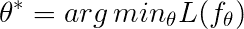
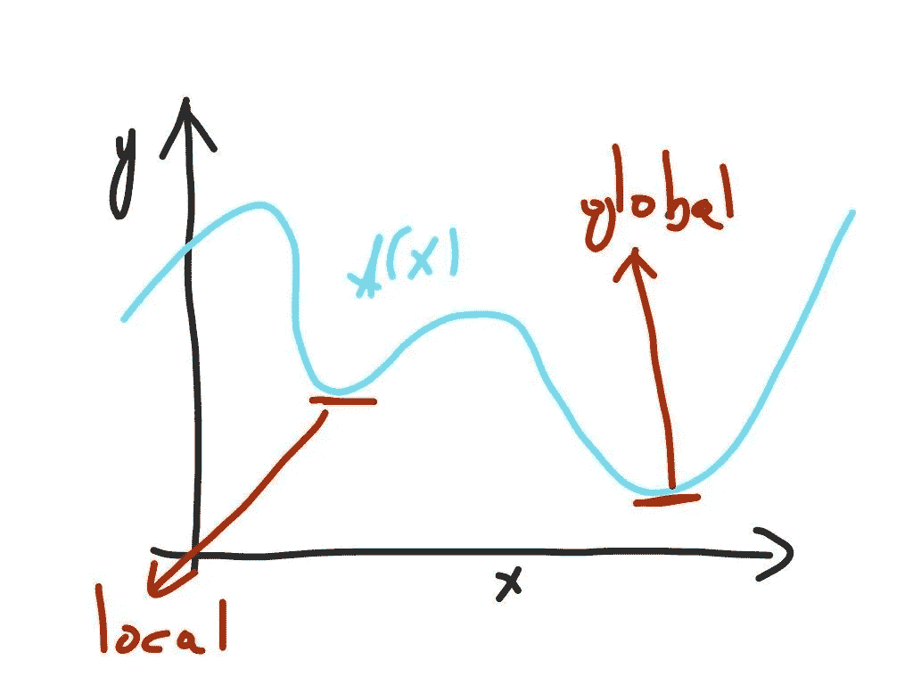
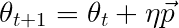
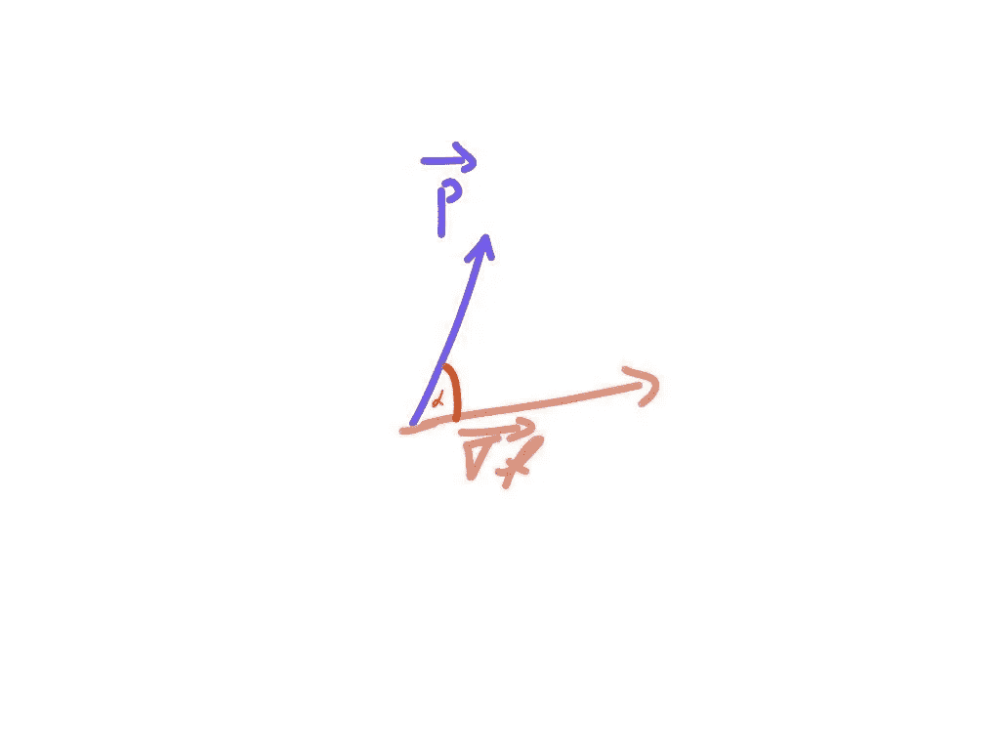
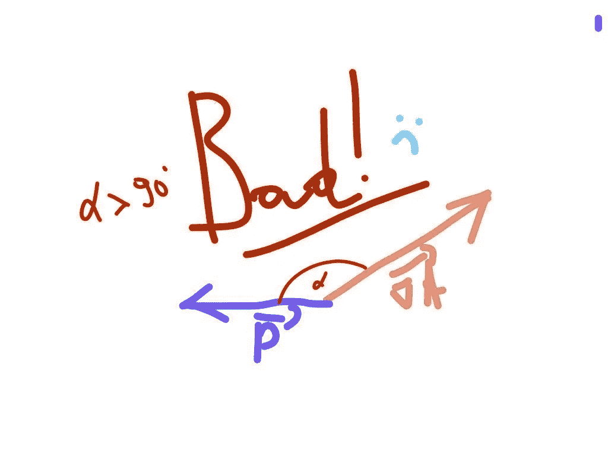
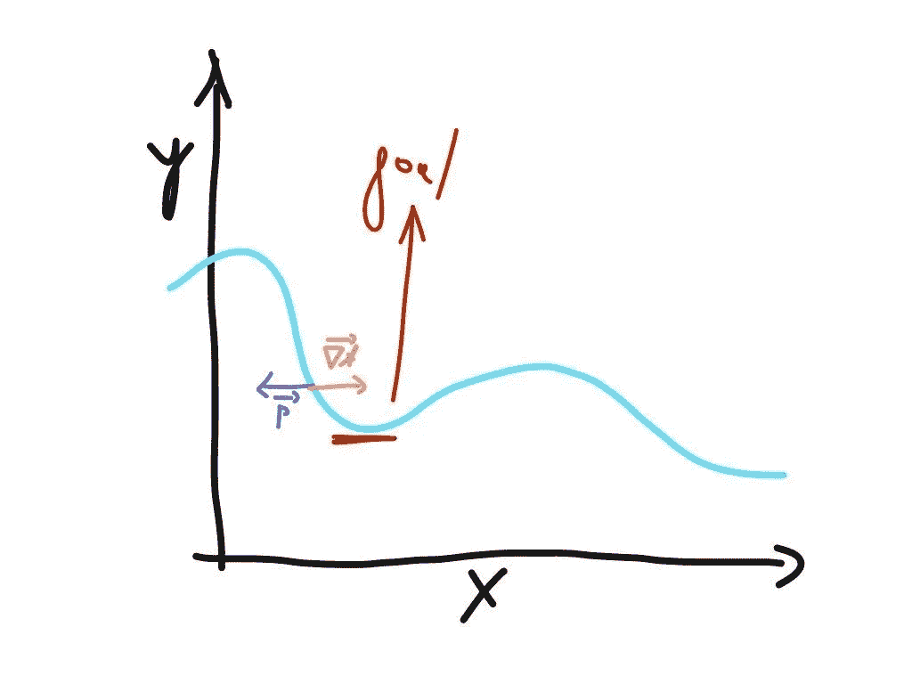
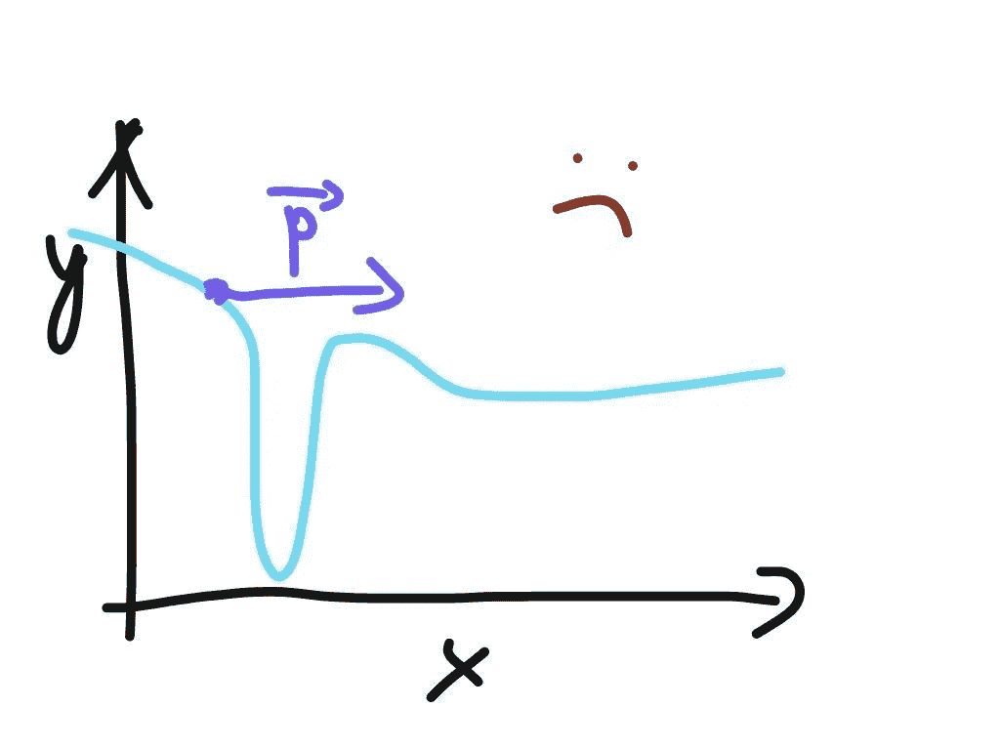
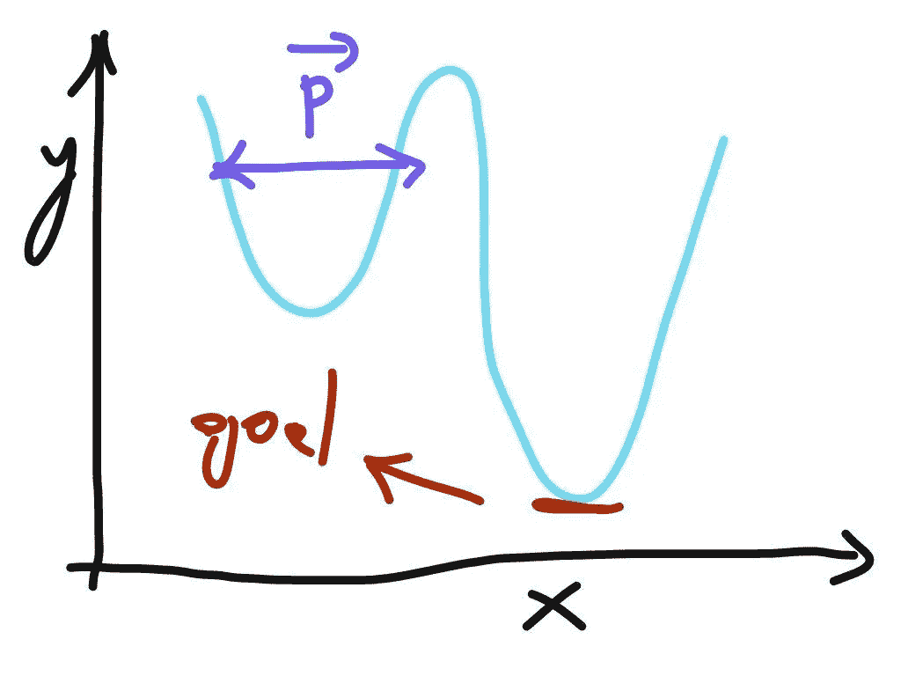

# 幻灭优化的简单入门

> 原文：<https://towardsdatascience.com/a-brief-primer-on-optimization-to-unlock-the-universe-7d5c72af59e1?source=collection_archive---------25----------------------->

Photo by [Luca Bravo](https://unsplash.com/@lucabravo?utm_source=medium&utm_medium=referral) on [Unsplash](https://unsplash.com?utm_source=medium&utm_medium=referral)

## 人工智能、机器学习和运筹学之间有什么共同点？优化，优化，优化…

你有没有想过所有这些疯狂的深度学习算法和机器学习论文的背后是什么？核心是优化，即拟合参数以最小化或最大化某个目标函数。在这篇文章中，我将给出一个关于优化和各种子类别的简要概述。在进一步阅读之前只要记住一件事，**针对人工智能和机器学习爱好者**:

实际上，我还要写一份免责声明:

> 这里没有高等数学，只有纯粹的直觉。

首先，让我们明确一件重要的事情，什么是优化。大多数情况下，我们需要学习某种参数θ，以便最小化目标函数。具体来说，我们写如下:

所以有某种函数， **L** 我们称之为目标函数。我们想把它最小化。现在，我们不会对如何实际最小化它感兴趣，但是我们将在优化类型之间进行高层次的区分。

1.  我们有**无约束最优化。**这基本上意味着我们可以最小化/最大化目标函数，而不用考虑其他任何事情，这使得问题变得简单了一些。
2.  另一方面，有**约束优化**在这种情况下，我们有一组特定的约束。这些规则规定了我们可以使用什么样的参数 **θ** 进行最小化。

现在我们知道了什么是约束优化，什么是无约束优化。让我们转向最低限度的问题。显然，各种优化都与寻找某种最大值的最小值有关。正确的措辞应该是**极端**。关键在于搜索是局部极值还是全局极值。

1.  **局部极值**更容易找到，我们可以只看一下一阶和二阶条件来检查某个东西是否是局部最小值或最大值。一阶意味着检查目标函数的一阶导数是否等于 0，并检查我们是否具有正曲率或负曲率(二阶导数)。
2.  **全局极值，**则有点奸计。找到全局最小值或最大值并确认它们是全局的真的很难！然而，在某些情况下，函数有很好的性质，比如凸性，我们可以说我们的算法肯定会收敛到全局最小值。虽然很吸引人，但实际上这种情况很少发生，我们无法保证全局最小值/最大值。

在这个超级简单的 2D 例子中，我们看到了一个全局最小值和一个局部最小值。如果我们进行基于梯度的优化，我们通常会对参数进行如下更新:

所以我们在时间步 **t** 有一些参数，它们在时间步 **t+1** 结束。更新是神秘的 **η** 乘以向量**p**的简单加法。这些方法中的整个研究基本上关注于为更新方向(向量 **p** )和步长参数 **η定义良好的值。**

你可以想象一下，如果算法的步长和方向都不够好的话，想要走到全局最小值是相当困难的。一开始就有好的方向是什么意思？嗯，这意味着我们的参数更新的方向向量 **p** 与梯度向量形成一个小于或等于 90 度的角度 **α** (对正在优化的函数性质的一些细节取模)，如下图所示:

实际上是一个不好的方向，显然与我之前说的相反。当角度大于 90 度时。也许这对你来说听起来不太直观，但是想象一下下面的情况:

将它直接放在函数的上下文中，您可以查看下图并了解其效果:

你走反了方向！显然你不会达到当地的最低值。但是方向不是唯一要担心的…

是的……步长非常重要，选择时也很重要。为了说明这一点，请看下图:

Big step in the wrong direction = missing the minimum.

我们在优化中迈出了太大的一步，因此我们错过了函数的实际最小值。为了进一步说明这一点，请看下图:

如果在我们用向量 **p** 进行更新的点处，步长是相同的，那么我们将被卡住。因此，所有这些学习率的调整，适应性时刻等等——都是为了避免这种情况。

区分不同优化方法的另一个因素是目标函数的性质。你可能已经假设目标函数只是一个简单的连续函数。但事实未必如此，如果是随机的呢？

1.  **确定性优化**关注相对“正常”的函数。它们是正常的，因为它们不会在随机过程中发生变化。
2.  在**随机(随机)**的情况下，基础函数可能会在未来发生变化，因此我们只能处理期望值并最小化我们估计的不确定性。

约束优化是一个有点高级的话题，所以让我们来谈谈无约束优化和不同的可能方法。显然，一篇博客文章不足以涵盖所有的优化方法。但是我们可以有把握地说，大多数约束优化方法本质上是基于无约束方法的。无约束方法可以分为以下几大类:

1.  **线搜索法**是更常用的方法。这是你古老的梯度下降法。本质上，这些方法试图确定方向和步长，以基于关于目标函数的信息来更新参数。
2.  **信赖域方法**只不过是线搜索方法，但它们在某一点周围对与原始函数相似的模型函数进行线搜索，并根据模型函数与原始目标函数相比的良好程度来限制参数的移动。

优化文献很广泛，但我可以理解每个人都想跳入机器学习和人工智能。就我个人而言，我发现深入挖掘所有这些方法来理解所有这些方法的基本原理是非常有用的，这些方法被反复使用。

我希望这篇文章有助于揭示这些优化器在更高层次上实际做了什么。一旦你摆脱了那些让整个事情看起来过于“复杂”的丑陋等式，这些概念就相对容易掌握了。实际上，一些关于梯度优化器的同样复杂的论文在他们的证明中有著名的错误，但是直觉上这些方法是相当简单的。(不会指名道姓，可能会在后面的文章中涉及:)。

感谢您的关注！

