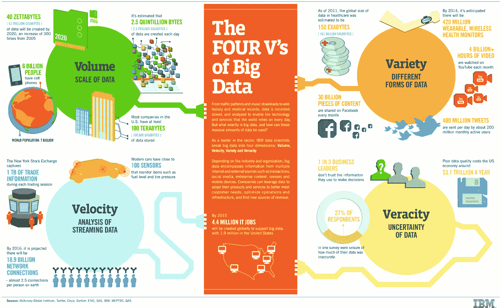
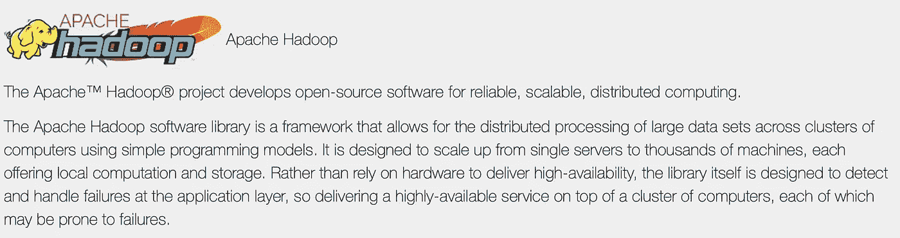
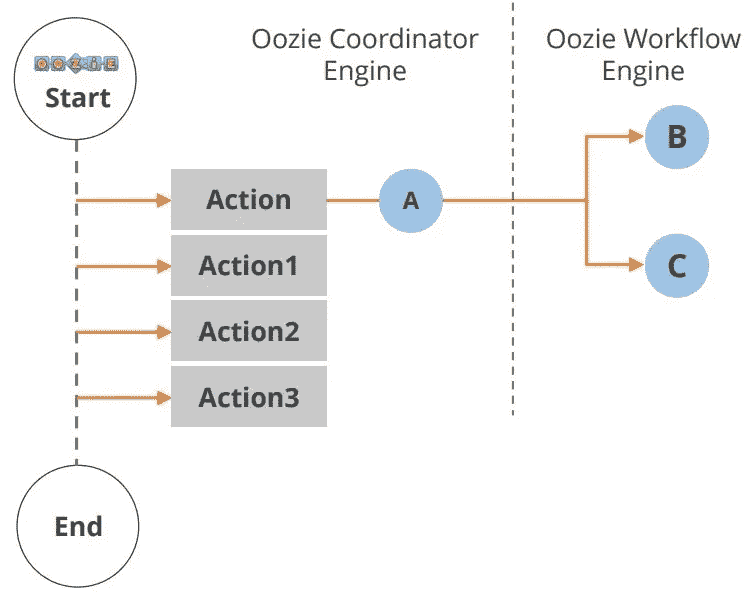
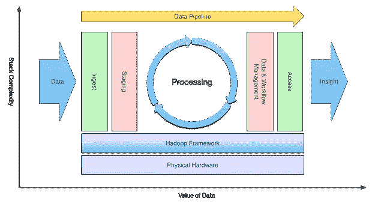

# Apache Hadoop 小结:大数据问题的解决方案和来自 Google 的提示

> 原文：<https://towardsdatascience.com/a-brief-summary-of-apache-hadoop-a-solution-of-big-data-problem-and-hint-comes-from-google-95fd63b83623?source=collection_archive---------3----------------------->

*欢迎来到大数据和 Hadoop 简介，我们将在这里讨论 Apache Hadoop 以及大数据带来的问题。Apache Hadoop 如何帮助解决所有这些问题，然后我们将讨论 Apache Hadoop 框架及其工作原理。*

# **关于大数据**

据估计，全球约 90%的数据是在过去两年中创建的。此外，80%的数据是非结构化的，或者以各种各样的结构存在，这很难分析。
现在，你知道产生的数据量了。虽然如此大量的数据带来了巨大的挑战，但更大的挑战是这些数据没有安排好的格式。它有图像，线流记录，视频，传感器记录，GPS 跟踪细节。简而言之，它是非结构化数据。传统系统在处理结构化数据方面很有用(也很有限)，但它们无法管理如此大量的非结构化数据。

有人可能会问，为什么还要关心存储和处理这些数据呢？出于什么目的？答案是，无论我们在哪个领域工作，我们都需要这些数据来做出更明智、更有计算力的决策。商业预测并不是一件新鲜事。过去也编制过，但数据很少。在竞争中遥遥领先，企业必须使用这些数据，然后做出更明智的决策。这些决策从猜测消费者的偏好到提前预防欺诈活动。每个领域的专业人士可能会找到他们分析这些数据的原因。

The four V’s of Big data(IBM big data club)

# **大数据系统的特征**

当您需要确定您需要在后续项目中使用任何大数据系统时，请查看您的应用程序将构建的数据，并尝试观察这些特性。这几个点在大数据行业被称为 4 V。

***卷***

量绝对是大数据的一部分。互联网-移动周期带来了大量的社交媒体更新、来自工具的传感器数据和电子商务的爆发，这意味着所有行业都被数据淹没，如果你知道如何处理数据，这些数据会有惊人的价值。

***品种***

SQL 表中收集的结构化数据已经成为历史。如今，产生的 90%的数据是“非结构化的”，以各种形状和形式出现——从地理空间数据到可以调查内容和思想的推文，再到照片和视频等视觉数据。
那么，它总是以结构化形式出现，还是以非结构化或半结构化形式出现？

***速度***

每天每分钟，全球用户在 Youtube 上上传 200 小时的视频，发送 30 万条推文，携带超过 2 亿封电子邮件。随着网速越来越快，这个数字还在增长。
那么，您的数据和速度的未来如何？

***大实话***

这适用于营销人员可用数据的不确定性。这也可以称为数据流的可变性，它是可变的，使组织很难快速和更恰当地做出响应。

# ***Google 如何解决大数据问题？***

这个问题首先引起了谷歌的兴趣，因为他们的搜索引擎数据随着互联网行业的革命而爆炸。很难找到任何证据证明它的互联网产业。他们利用并行处理理论巧妙地解决了这个难题。他们设计了一种叫做 MapReduce 的算法。该算法将任务分成小块，并将这些小块分配给通过网络连接的许多计算机，并将所有事件集合起来形成最后的事件数据集。

Google.com

当你明白 I/O 是数据处理中成本最高的操作时，这看起来是合乎逻辑的。传统上，数据库系统将数据存储在一台机器中，当您需要数据时，您可以以 SQL 查询的形式向它们发送一些命令。这些系统从存储中获取数据，将其放入本地存储区，进行处理，然后发送回给你。这是您可以用有限的控制数据和有限的处理能力来做的真正的事情。

但是当你看到大数据时，你不能在一台机器上收集所有的数据。你必须把它保存到多台电脑中(可能是数千台设备)。当您需要运行查询时，由于高 I/O 成本，您不能将数据聚集到一个位置。所以 MapReduce 算法做什么；它处理您对所有节点的查询，每个节点都有数据，然后汇总最终结果并返回给您。

它带来了两个显著的改进，即非常低的 I/O 成本，因为数据移动是最小的；因为您的作业并行运行在多个机器上，变成更小的数据集。

Apache Hadoop ( hadoop.apache.org)

# **Hadoop 简介**

Hadoop 支持利用大数据提供的机会，克服遇到的挑战。

**什么是 Hadoop？**

Hadoop 是一个开源的、基于 Java 的编程框架，在分布式计算环境中继续处理大型数据集。它基于谷歌文件系统或 GFS。

**为什么选择 Hadoop？**
Hadoop 在包含数 Pb 信息的数千个节点的分布式系统上运行的应用程序很少。它有一个分布式文件系统，称为 Hadoop 分布式文件系统或 HDFS，可以在节点之间快速传输数据。

# Hadoop 框架

Hadoop Framework

***Hadoop 分布式文件系统(Hadoop HDFS):***
它为 Hadoop 提供一个存储层。它适用于分布式存储和处理，即当数据被存储时，它首先被分配&然后继续。
HDFS 提供命令行界面与 Hadoop 交互。它提供对文件系统数据的流访问。所以，它包括文件权限和认证。那么，这里存储数据的是在 HDFS 存储数据的 HBase。

***HBase:***
它有助于在 HDFS 存储数据。它是一个 NoSQL 数据库或非关系数据库。HBase 主要用于需要对大数据进行随机、实时读/写访问的情况。它支持大量数据和高吞吐量。在 HBase 中，一个表可以有数千列。
因此，到目前为止我们已经讨论了数据如何分发&存储，如何理解这些数据如何被摄取&传输到 HDFS。Sqoop 做到了。

***Sqoop:***
Sqoop 是一个设计用来在 Hadoop 和 NoSQL 之间传输数据的工具。它可以将 Oracle 和 MySQL 等关系数据库中的数据导入 HDFS，并将 HDFS 的数据导出到关系数据库。
如果想摄取流数据、传感器数据或日志文件等数据，那么可以使用 Flume。

***Flume:***
Flume 分布式服务，用于摄取流数据。所以，分布式数据收集事件数据&把它传送到 HDFS。它非常适合来自多个系统的事件数据。

数据在 HDFS 中传输后，它进行处理，其中一个处理数据的框架是 **SPARK。**

***SPARK:***
一个开源的集群计算框架。它提供了比 MapReduce 快 100 倍的性能。与基于双态磁盘的 MapReduce 相比，对于具有内存原语的少数应用程序。Spark 在 Hadoop 集群中运行&在 HDFS 处理数据它也支持多种多样的工作负载。
Spark 有以下主要部件:

Spark Major components

***Hadoop MapReduce:***
是另一个处理数据的框架。最初的 Hadoop 处理引擎主要基于 JAVA。基于 Map 和 Reduce 编程模型。许多工具，如蜂巢，猪建立在地图上减少模型。它是广泛的&成熟的容错框架。它是最常用的框架。
数据处理之后，就是开源的数据流系统 Pig 做的分析。

***猪:***
它是一个开源的数据流系统。它主要用于分析。它将 pig 脚本转换为 Map-Reduce 代码，使生产者不必编写 Map-Reduce 代码。像 filter & join 这样在 Map-Reduce 中很难执行的特殊查询可以使用 Pig 有效地完成。这是编写 Map-Reduce 代码的替代方法。
也可以练习 Impala 分析数据。

***Impala:***
它是一个运行在 Hadoop 集群上的高性能 SQL 引擎。它是交互式分析的理想选择。它的延迟非常低，可以用毫秒来衡量。
支持 SQL 的一种方言(Impala SQL)。Impala 支持续集的方言。因此，HDFS 的数据被模拟成一个数据库表。还可以使用 Hive 实现数据分析。

***Hive:***
它是 Hadoop 上面的一个抽象盖。和黑斑羚很像。但是，它更适合数据处理和 ETL(提取、转换和加载)操作。Impala 优先用于即席查询，hive 使用 Map-Reduce 执行查询。然而，用户不需要在低级 Map-Reduce 中编写任何代码。Hive 适用于结构化数据。在对数据进行检查之后，用户就可以访问支持数据搜索的内容了，这可以使用 clutter is Search Cloudera 来完成。

***cloud era Search:***
这是一款接近实时的访问产品，它使非技术用户能够搜索和浏览存储在 Hadoop 和 HBase 中的数据，或将数据摄取到其中。在 Cloudera 中，用户不需要 SQL 或编程技能就可以使用 Cloudera search，因为它提供了一个简单的全文搜索界面。这是一个完全混合的数据处理平台。
Cloudera search 提供灵活、可扩展且强大的存储系统，并结合了包括 Hadoop 在内的 CD8 或 Cloudera 发行版。这排除了跨基础架构移动大型数据集来处理业务任务的需要。MapReduce、Pig、Hive 和 Sqoop 等 Hadoop 作业都有工作流。

***oo zie:***
oo zie 是一种工作流或协调方法，可以用来管理 Hadoop 作业。Oozie 应用程序生命周期如图所示。

Oozie lifecycle ( Simpliearn.com)

在工作流的开始和结束处发生了多个操作。

***Hue:***
Hue 是 Haddop 用户体验的缩写。它是一个开源的 web 接口，用于使用 Hadoop 分析数据。您可以使用 Hue 执行以下操作。
1。上传和浏览数据
2。在 Hive 和 Impala
3 中查询一个表。运行 Spark 和 Pig 作业
4。工作流搜索数据。
Hue 让 Hadoop 变得易于使用。它还为 hive、impala、MySQL、Oracle、Postgre SQL、Spark SQL 和 Solar SQL 提供了编辑器。
现在，我们将讨论所有这些组件如何协同工作来处理大数据。
大数据处理有****四个阶段。****

**

*Four stages of Big data processing ( blog.cloudera.com/blog)*

*第一阶段**获取**，从各种资源(如关系数据库系统或本地文件)获取数据或将其传输到 Hadoop。正如我们前面讨论的，sqoop 将数据从我们的 RDMS(关系数据库)转移到 HDFS。
鉴于水槽转移事件数据。第二阶段是**加工**。在这个阶段，数据被存储和处理。我们前面讨论过，信息存储在分布式文件系统 HDFS 和 NoSQL 分布式数据库中。Spark 和 MapReduce 执行数据处理。*

*第三阶段是**分析**；这里的数据由处理框架如 Pig、Hive & Impala 解释。Pig 使用 Map 和 Reduce 转换数据，然后解释它。Hive 还基于映射和 Reduce 编程，更适合结构化数据。
第四阶段是**访问**，通过 Hue 和 Cloudera search 等工具执行。在此阶段，用户可以访问已分析的数据。Hue 是探索数据的网络界面。*

*现在，您已经了解了 Hadoop 框架的所有基础知识，可以继续努力，成为数据工程师专家。但我会继续写关于 Hadoop 和其他机器学习主题的文章。如果你喜欢随时了解最新消息，你可以关注我或者 LinkedIn。你也可以看看我的基于从网上导入的数据的系列。我在这个系列中谈到的一切都是基本的。*

* [## 一些你不知道的数据文件如果你只是一个数据科学的初学者，导入数据文件…

### 如果你是数据科学领域的新手，那么你必须努力学习数据科学概念。现在…

towardsdatascience.com](/something-you-dont-know-about-data-file-if-you-just-a-starter-in-data-science-import-data-file-e2e007a154c4)  [## 忘记 API 用漂亮的汤做 Python 抓取，从 web 导入数据文件:第 2 部分

### API 并不都是为你准备的，但是美丽的汤会永远伴随着你。

towardsdatascience.com](/forget-apis-do-python-scraping-using-beautiful-soup-import-data-file-from-the-web-part-2-27af5d666246) 

参考:

1.  [https://data-flair.training/blogs/hadoop-tutorial/](https://data-flair.training/blogs/hadoop-tutorial/)
2.  [https://www . simpli learn . com/introduction-to-big-data-and-Hadoop-tutorial](https://www.simplilearn.com/introduction-to-big-data-and-hadoop-tutorial)
3.  【https://howtodoinjava.com/hadoop/hadoop-big-data-tutorial/ 
4.  [https://www . academia . edu/8243093/Solving _ Big _ Data _ Problems _ Using _ Hadoop _ and _ MapReduce](https://www.academia.edu/8243093/Solving_Big_Data_Problems_Using_Hadoop_and_MapReduce)
5.  [https://hub . packtpub . com/how-Google-MapReduce-works-big-data-projects/](https://hub.packtpub.com/how-google-mapreduce-works-big-data-projects/)*