# 熊猫之旅

> 原文：<https://towardsdatascience.com/a-brief-tour-of-pandas-9f10a8ce490a?source=collection_archive---------35----------------------->


Photo by [Diana Silaraja](https://www.pexels.com/@diana-silaraja-794257) on [Pexels](https://www.pexels.com/photo/photo-of-panda-and-cub-playing-1661535/)

Pandas 是一个用于处理数据的 python 库。在这篇文章中，我们将回顾我作为数据科学家最常用的一些 pandas 方法。

首先让我们导入熊猫库:

```
import pandas as pd 
```

1.  **读取数据**

我通常对熊猫做的第一件事就是把数据读入所谓的熊猫数据帧。我们将使用来自 Kaggle 的[奥斯丁动物中心收容所结果](https://www.kaggle.com/aaronschlegel/austin-animal-center-shelter-outcomes-and)数据。如果我们想在。csv 文件我们可以做到以下几点:

```
df = pd.read_csv("aac_shelter_outcomes.csv")
```

我们也可以使用。头()和。tail()方法分别查看第一行和最后五行数据:

```
print(df.head()) 
```

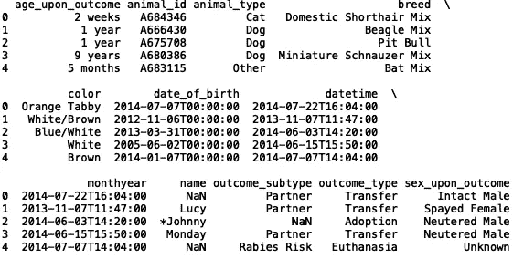

```
print(df.tail())
```

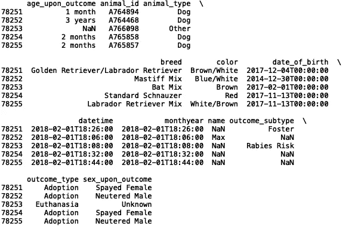

我们还可以查看列名:

```
print(df.columns)
```

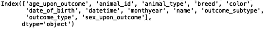

这对于包含大量列的数据集尤其有用。

2.**清理资料用。dropna()和。菲尔娜()**

在真实数据中，我们经常需要处理数据列中缺失的值。使用 pandas，我们可以通过执行以下操作快速了解数据有多稀疏:

```
print(df.isnull().sum())
```

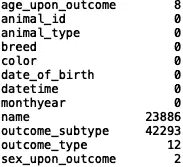

如果数据中有缺失值，我们可以使用。dropna()方法删除这些值。这可以就地完成，我们可以返回一个值，我们可以将它存储在一个新的变量中。要将缺少的值放到适当的位置:

```
df.dropna(inplace=True)
```

这里 df 变量已经被修改了。或者，我们可以:

```
df = df.dropna()
```

我们可以在删除丢失的值之前和之后检查数据帧的长度:

```
print("Length Before:", len(df))
df.dropna(inplace=True)
print("Length After:", len(df))
```

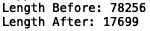

类似地，如果您想要填充数据帧中缺失的值，我们假设在适当的位置用零填充:

```
df.fillna(0, inplace=True)
```

或者:

```
df = df.fillna(0)
```

因为我们在这里输入缺失值，所以数据帧的长度不应改变:

```
print("Length Before:", len(df))
df.fillna(0, inplace=True)
print("Length After:", len(df))
```

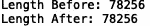

3.**过滤数据**

我们可以很容易地根据列值过滤数据帧。例如，如果我们想要阉割的雌性獒混种狗，我们可以写:

```
df = df[df['breed'== 'Mastiff Mix']]
df = df[df['sex_upon_outcome'] == 'Spayed Female']
print(df.head())
```

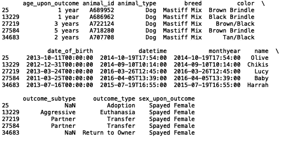

我们也可以很容易地处理时间戳。pandas 将大多数时间值处理为字符串，因此我们需要将感兴趣的日期转换为 datetime 对象:

```
df['date_of_birth'] = pd.to_datetime(df['date_of_birth']) 
```

我们还可以从日期时间值中提取周、月和年的值:

```
df['week_of_birth'] = df['date_of_birth'].dt.week
df['month_of_birth'] = df['date_of_birth'].dt.month
df['year_of_birth'] = df['date_of_birth'].dt.year
print(df.head())
```

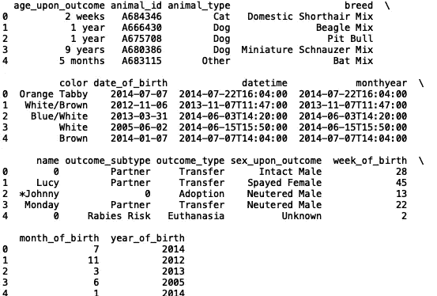

然后，我们可以根据周、月或年过滤数据框架。例如，我们可以提取第一个月的数据:

```
df = df[df['month_of_birth'] == 1]
print(df.head())
```

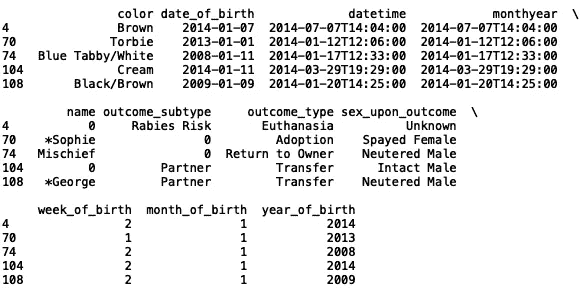

我们可以看到，由于我们删除了一些数据，指数也被修改。我们可以使用 reset_index 来解决这个问题:

```
df = df[df['month_of_birth'] == 1].reset_index()
print(df.head())
```

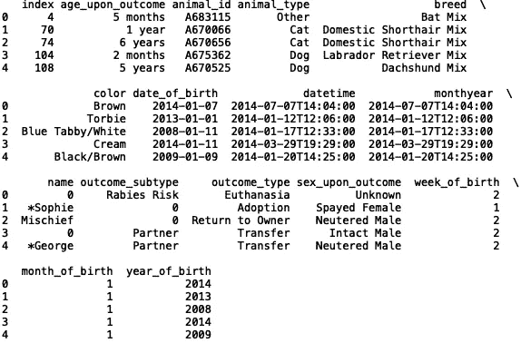

我们也可以重新定义指数:

```
df = df.set_index('month_of_birth')
print(df.head())
```

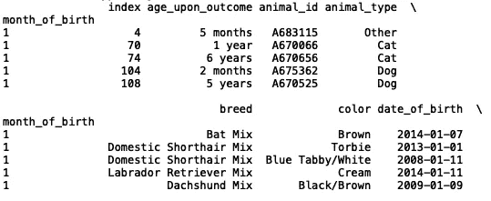

4.**选择行和列**

我们可以利用。iloc()来选择索引。要选择数据集中的第一个、第二个和最后一个索引:

```
print(df.head())
print("---------------------First---------------------")
print(df.iloc[0])
print("---------------------Second---------------------") 
print(df.iloc[1])
print("---------------------Last---------------------")
print(df.iloc[-1])
```

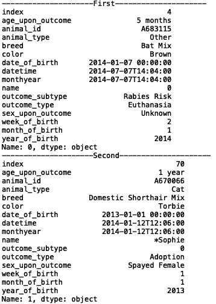

你可以用。特定列的 loc():

```
print("---------------------First---------------------")
print(df.loc[0, 'breed'])
print("---------------------Second---------------------") 
print(df.loc[1, 'breed'])
```

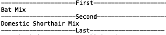

我们也可以在一列中选择多行:

```
print("---------------------First---------------------")
print(df.loc[0:3, 'breed'])
print("---------------------Second---------------------") 
print(df.loc[3:6, 'breed'])
```

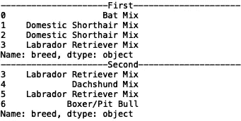

5.**汇总数据&生成统计数据**

另一个有用的方法是。可用于聚合数据的 groupby()方法。假设我们想知道数据集中某一年每种类型的品种的数量:

```
df  = df.groupby(['year_of_birth', 'breed'])['breed'].count()
print(df.head())
```

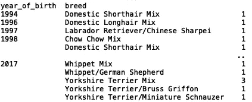

假设我们需要每个品种的平均出生周数:

```
df  = df.groupby('breed')['week_of_birth'].mean()
print(df.head())
```

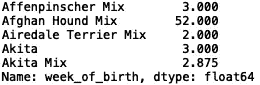

我们可以使用 sum()、std()、max()和 min()等方法进行类似的聚合。

6.**写入文件**

最后，如果我们对数据帧做了足够的修改，我们会想把它保存到一个单独的文件中。to_csv():

```
df.to_csv("new_name_of_file.csv")
```

我希望这有所帮助。这篇文章的代码可以在 [GitHub](https://github.com/spierre91/medium_code) 上找到。

祝你好运，享受你的熊猫之旅！