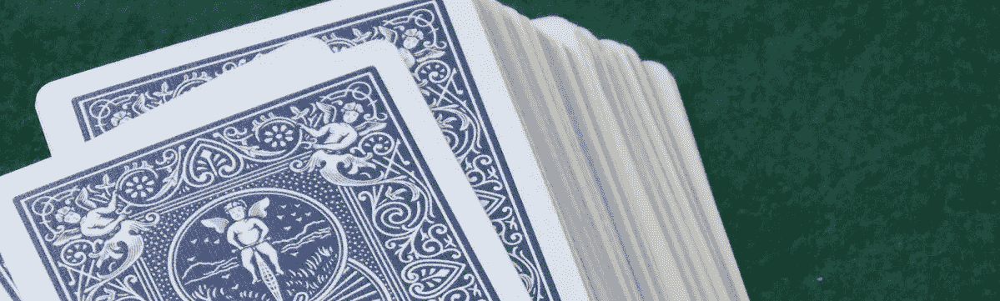
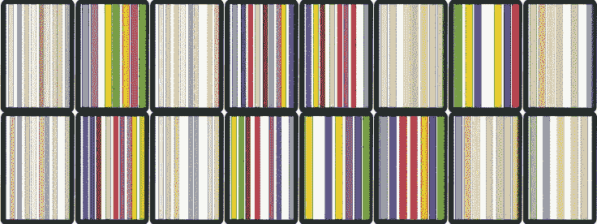

# 用于教授机器学习的纸牌游戏

> 原文：<https://towardsdatascience.com/a-card-game-for-teaching-machine-learning-547611fb69d9?source=collection_archive---------38----------------------->

## 解释监督学习、非监督学习和强化学习

Image www.pexels.com

由于人工智能和机器学习在我们的社会中越来越重要，关于它们的知识是一般知识的重要组成部分。这也给科学家和教育工作者提出了一个问题，如何教授这个主题和重要的基本概念。如下文所述，已经有向小学生教授这些内容的方法:

 [## 向小学生解释人工智能

### 最近，有人请我给五六年级的小学生(即年龄…

towardsdatascience.com](/explaining-ai-to-primary-school-kids-9d875d23ec1e) 

它背后的技术，尤其是数学基础，并不是每个人都喜欢的。因此，需要新的知识转移方法。

我为我的学生开发了一个纸牌游戏，帮助他们理解机器学习的重要原理。我想在本文中简单介绍一下。该游戏旨在展示“监督学习”、“非监督学习”和“强化学习”的原理。学生们以一种有趣的方式发现最重要的想法，并对机器学习程序的功能发展出一种感觉。

这套扑克牌由 32 张印有独立图案的牌组成。每张扑克牌代表一个数据集。

## **无监督学习**

学生被分成 4 人一组，每个游戏组收到以下 16 张扑克牌:

Cards without labels / Image by the author

任务是将卡片分成 4 组，学生们认为它们属于同一个组。然后他们必须描述哪些特征被用来区分。

可以根据以下特征来区分纸牌:
-线条的粗细
-线条颜色的不透明度

数据的所有其他特征，如颜色、行数、精确定位等。对区分没有贡献。

这些卡片组具有以下特征:
-A 组:4 毫米线宽，50%不透明度
-B 组:4 毫米线宽，100%不透明度
-C 组:6 毫米线宽，100%不透明度
-D 组:6 毫米线宽，50%不透明度

任务是教导机器学习算法学习特征的正确特征和特性是重要的。将数据表示为特征值是至关重要的。它还展示了无监督学习(聚类)是如何工作的。

## **监督学习**

第二个任务是解释卡片上能看到什么。然而，这需要额外的信息。这是以 16 张附加卡片的形式给出的，除了图案之外，还注明了卡片上可以看到的内容。有 4 个不同的“对象”可以查看:
“A”、“B”、“C”和“D”:

Cards with labels / Image by the author

因此，学生的任务是分配任务 1 的 4 组中的哪一组属于哪一类物体。额外的卡片代表一个带标签的数据集，这项任务阐明了监督学习的原理。

## **强化学习**

第三个任务是以不同的方式找出哪些对象属于比其他对象“更强”的特定类。没有“标签数据集”形式的数据显示与此类的关联。对象的这种特殊属性必须由学生纯粹从游戏行为中获得。

游戏的**规则**如下:
-一组 4 个玩家中的 2 个在不告知其他两个的情况下，将 4 个类别中的一个固定为特殊类别(“川普”)。
-任务的目标是其他两名玩家在游戏的下一阶段找出哪些牌属于“王牌类别”。
-打出带有标记的 16 张牌。这些牌被分成 4 张牌，每张牌有 4 张。
-4 名玩家每人在一轮中将一张牌放在桌上。拥有竖线数量最多的牌的玩家赢得这一轮，并获得所有 4 张牌。除非其中一张牌属于“王牌”类别，否则它赢。(这个可以由 2 位选手来判断。)
-如果回合中王牌类别的牌较多，则线条最多的王牌获胜。
-如果几个有相同线数的玩家赢了，则牌被分开。

从几轮比赛的结果来看，肯定是试图认清“川普”的属性。
基本思路来源于卡牌游戏"**Watten**"([https://en . Wikipedia . org/wiki/Watten _(card _ game))](https://en.wikipedia.org/wiki/Watten_(card_game)))

在这个游戏中练习的以卡片(物体)为王牌的学习形式，是一种强化学习的形式。在每一轮之后，给出一个玩家的理论，哪个类别是该轮结果的王牌或者被丢弃。

通过这 3 项任务，可以借助卡片展示机器学习的不同变体。通过有趣的方法和学生自己的实验，理解得到了促进，障碍被消除了。

## 卡的 PDF 文件可在此下载打印:

[http://www . stoeckl . ai/WP-content/uploads/2019/12/ml cards _ part 1 . pdf](http://www.stoeckl.ai/wp-content/uploads/2019/12/MLcards_part1.pdf)

[http://www . stoeckl . ai/WP-content/uploads/2019/12/ml cards _ part 2 . pdf](http://www.stoeckl.ai/wp-content/uploads/2019/12/MLcards_part2.pdf)