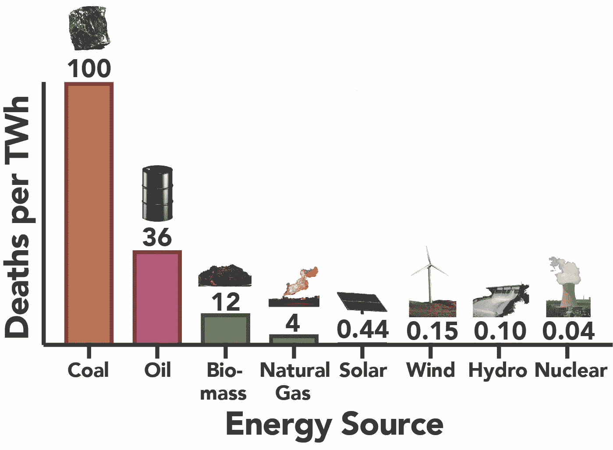

# 核能案例:用低碳能源架起通往可再生能源的桥梁

> 原文：<https://towardsdatascience.com/a-case-for-nuclear-bridging-the-route-to-renewables-with-low-carbon-energy-f0ad069a37ce?source=collection_archive---------5----------------------->

## 循证政策比你或你的感觉更重要——第三部分

他们说破解偏见比破解原子更难。如果所说的偏见是*关于*分裂原子，这句格言就更正确了。在全球范围内，[只有 38%](https://www.ipsos.com/ipsos-mori/en-uk/strong-global-opposition-towards-nuclear-power) 的人赞成核能，甚至低于出于某种原因支持煤炭发电的 48%。相比之下，可再生能源的支持率高达 97%(太阳能)和 93%(风能)。绿色很酷(至少作为一个概念)。尽管几乎所有国家的能源组合都与这些公开宣称的偏好相去甚远，但可再生能源得到了大量补贴，因此[正在崛起](https://www.greentechmedia.com/articles/read/2017-another-record-busting-year-for-global-renewable-energy-capacity)，与煤炭、石油或天然气等污染能源展开竞争，并逐渐取代它们。他们应该这样做。然而，由于某种原因，核能经常被包括在所述肮脏能源中。这不仅导致了低支持率，也为从能源组合中彻底去除核能铺平了道路。如果你关心环境，那是你现在最不应该做的事情。

**核能是一种高效&低碳能源**

分裂一个原子，如核反应堆中最常用的同位素铀-235，会释放出巨大的能量，这些能量可以以电能的形式加以利用。在美国，近 100 个剩余的核反应堆仍然提供了该国约 20%的电力输出。比这个数字更重要的是，与将核能与煤 T15 气混为一谈的企图相反，提供的能源是清洁低碳能源。事实上，核能仍然占美国所有低碳能源的一半以上，因为所采用的核链式反应本身不会导致二氧化碳排放。

A) 2017 US energy mix (consumption) in percent. B) Relative proportion of low-carbon energy sources for the 2017 US energy mix (consumption). [Source](https://www.eia.gov/energyexplained/?page=us_energy_home)

还有更多支持核能的理由。铀具有极高的能量密度，其需求量远低于煤或天然气。因此，铀的开采足迹与破坏和污染景观的巨大煤矿或者将石油泄漏到珍贵生态区的沉没油轮相比是微不足道的。核能发电厂需要的钢材和混凝土仅仅是太阳能或风能产生的相同能量的一小部分[。作为一个推论，核能占用的空间/土地也比可再生能源少得多(事实上比可再生能源少几百倍)。但这不是一场核能与可再生能源的战争。如果有什么不同的话，可再生能源和核能应该是团队成员，在一个仍然被碳基能源生产牢牢控制的世界里，这两个纯洁的典范。因为，至少在美国，](https://www.foreignaffairs.com/articles/2000-01-01/need-nuclear-power)[核能和可再生能源加在一起](https://www.eia.gov/energyexplained/?page=us_energy_home)还不到总发电量的三分之一，其余都来自煤炭、石油和天然气。

**由于大众观点&错误的意图，核能目前正在撤退**

因此，鉴于之前关于煤炭和天然气在我们的能源组合中占主导地位的说法，你可能会认为公民、活动家和政府的首要任务是以牺牲煤炭、石油和天然气为代价来扩大可再生能源。然而令人惊讶的是，环保主义者的愤怒至少在很大程度上也是针对核能的。尽管活动家们宣称气候变化是一种生存风险(我当然会认同)，但他们愿意牺牲核能形式的低碳能源生产。因为这是经常发生的事情。由于人们不会神奇地开始使用更少的能源，一旦核反应堆“退役”，它产生的能源现在必须以另一种方式产生。不幸的是，这种方式几乎总是发生在天然气[利用的增加，而不是可再生能源的增加，从而*增加了*二氧化碳的排放。](https://www.forbes.com/sites/jamesconca/2016/05/16/natural-gas-is-replacing-nuclear-power-not-renewables/#40cf1a8acdb6)

2012 年加州圣奥诺弗雷核电站关闭事件很好地证明了这一点。通常情况下，这种关闭增加了来自天然气的能源比例，据 T2 估计，这些额外的排放相当于 T4 增加了 200 万辆汽车。这种普遍影响是如此强烈，以至于在全球范围内，尽管可再生能源的发展势不可挡，但从 90 年代到 2014 年，低碳电力的份额下降了几个百分点。至少在很大程度上，这是由于在环保团体的要求下，许多国家关闭了核电站。别误会我的意思。我不赞成建造更多的核电站(至少不赞成目前的核电站形式)。我只是说，如果我们真的关心排放和环境，我们就不应该关闭现有的工厂。可再生能源替代的顺序应该是煤→天然气→核能。目前，我们基本上走的是相反的方向。

假设你不关心环境，只关心你的电费。有一些反对核能的经济论据，其中包括对核电厂所代表的巨大长期投资(每台几十亿美元)的抨击。一座发电厂的建设需要数年时间，并且经常受到延误的困扰。然后，一旦它最终运行，一个核反应堆基本上是永久发电。这对于提供高度可变能量的可再生能源来说不是很好(例如太阳能，它只在白天提供能量，或者水力发电，它受到干旱的影响)，并且需要一个灵活的对等物，可以在停机期间进行补偿。这是天然气取代核能的一个原因，因为它天生灵活，适应可再生能源的节奏。此外，由于新的压裂技术，不幸的是[真的很便宜](https://www.investopedia.com/articles/markets/080814/how-fracking-affects-natural-gas-prices.asp)。

我们可以很容易地绕过关于长期投资的第一个论点，重申这场辩论不是关于建设新的核电站，而是尽可能长时间地保留剩余的核电站。关于核能发电缺乏灵活性的第二个论点可以通过两点来解决。首先，像安装在瑞士 Goesgen 工厂的[这样的技术允许对核反应堆输出进行高达 50%的调节(每分钟 30 兆瓦)，从而大大增加了核电的灵活性。第二，开发高效电池](http://www.framatome.com/EN/businessnews-840/switzerland-areva-np-installs-a-system-allowing-flexible-electricity-generation-at-goesgen-nuclear-power-plant.html)来储存能量不仅有助于核能保持竞争力，还能缓解可再生能源的不确定性。最后，关于成本因素，我们必须记住[可再生能源获得的令人难以置信的补贴](http://fortune.com/2017/03/14/germany-renewable-clean-energy-solar/)，这是它们相对较低的电力成本的原因。因此，如果有真正的去碳化的政治意愿，人们可以设想对核能进行某种程度的补贴，以抑制煤和天然气的使用。

核能比你想象的要安全得多

当然，在讨论核能时，我们必须面对这个问题:安全。环保主义者经常引用安全问题作为论据，这也是为什么那些将气候变化视为生存危机的活动人士矛盾地将核电站视为生存威胁的原因之一。这里最根本的错误当然是将核能等同于核弹。虽然后者肯定能够夷平整个城市，并通过致命的辐射使周围的大片地区无法居住，但核电站不能也不会这样做。首先，让我们观察一下，在 30 多个国家的核反应堆累积的大约 17 000 个反应堆年中，总共发生了三起重大反应堆事故。

在其中的两起事故中，三里岛和福岛第一核电站，没有一个人死于直接辐射，而有一个人死于癌症。相反，想想最初导致福岛第一核电站反应堆熔毁的海啸在[造成的近 16 000 人死亡](https://www.npa.go.jp/news/other/earthquake2011/pdf/higaijokyo_e.pdf)。历史上最严重的反应堆事故，1986 年切尔诺贝利反应堆熔毁，[直接导致](https://www.who.int/ionizing_radiation/chernobyl/20110423_FAQs_Chernobyl.pdf) 31 人死亡，15 人(直到 2011 年)死于随后的癌症。最常见的辐射引发的癌症，甲状腺癌，幸运的是，如果早期诊断，是可以治疗的(当然，对已知辐射暴露的地区进行严格筛查)。相比之下，每年有多达 1 00 万人死于与煤炭相关的空气污染(加上每年死于煤矿的许多人)。事实上，每一种能源生产方式的每太瓦时死亡率都比核能高，除了水力发电(如果你好奇，人们在安装太阳能电池板时会从屋顶掉下来死去，从而推高了死亡率)。

Safety of energy sources in deaths per terawatt hour (globally, 2011). One terawatt hour is equivalent to one trillion watts. [Source](https://web.archive.org/web/20150724024259/http:/nextbigfuture.com/2011/03/deaths-per-twh-by-energy-source.html#more)

核反应堆熔化时不可能像炸弹一样爆炸。熔毁期间向外界释放的辐射也因剩余的反应堆结构而大幅降低。想想*福岛第一核电站的三重*熔毁，它未能对继续在现场工作以减轻损害的 200 多名助手造成致命影响。政府研究发现，目前的核反应堆设计可以承受一架加满燃料的[波音 767–400](http://www.world-nuclear.org/information-library/safety-and-security/safety-of-plants/safety-of-nuclear-power-reactors.aspx)迎面相撞，这不仅证明了核反应堆的坚固性，也摒弃了核反应堆是恐怖分子生存威胁或目标的陈腐观点。事实上，几乎没有任何民用建筑比核反应堆防护得更好。

最后，我愿意承认储存核废料是一个问题，尤其是考虑到它保持放射性的时间。然而，有办法解决这个问题。一个步骤是利用核弹头作为反应堆的燃料。除了令人满意的核武库的减少，这通过使用已经放射性的“军事废物”作为输入减少了放射性足迹。另一种在此过程中获得更多能源而不产生更多核废料的方法是[核回收](https://whatisnuclear.com/recycling.html)，其中你使用一种反应堆的核废料为另一种反应堆提供动力，从相同数量的材料中提取更多的能量。最后但同样重要的是，未来使用钍[而不是铀运行的反应堆也将改善这种情况。钍的含量比铀-235 多 500 倍，钍反应堆在运行中会更安全，其核废料的放射性只有传统核废料的千分之一。](https://en.wikipedia.org/wiki/Thorium-based_nuclear_power)

核能是一种低碳能源，但却像“肮脏”能源一样受到监管。核能是我们目前拥有的最安全的能源之一，然而它却受到监管，就好像它是最危险的能源之一。这里有一个共同的主题。围绕核能的争论主要是由意识形态而非证据推动的。然而，我们正在输掉这场战斗。越来越多的核电站关闭，不再建造新的反应堆。三里岛在 1979 年经受住了灾难，现在面临着被廉价天然气挤出市场。廉价的天然气将继续加剧气候变化对我们所有人和我们的孩子的可怕影响。如果你不喜欢核能，没关系。也许有一天，我们可以关闭最后一个反应堆，用可再生能源取而代之。但这次不是今天。如果你关心我们的气候环境，你应该关心核能以及替代它的东西。