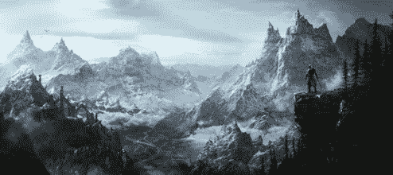
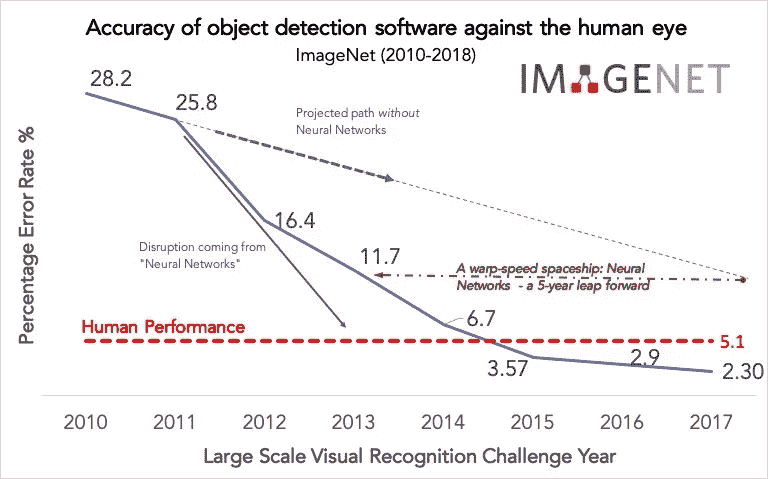
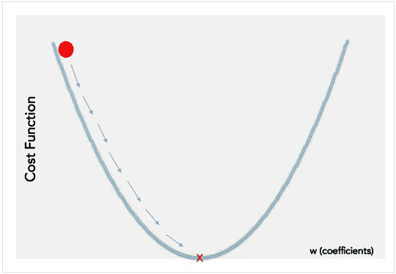
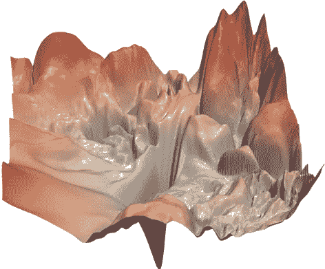
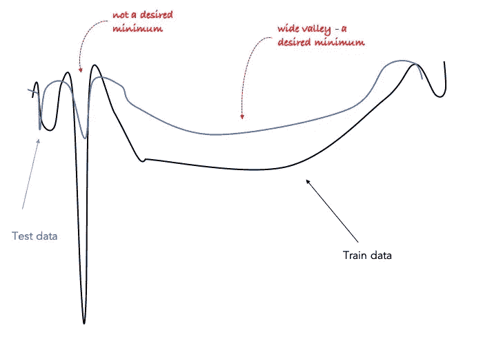
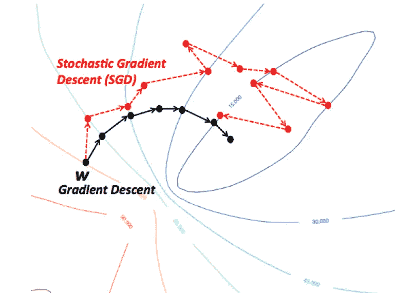

# 经典睡前故事:神经网络的灰姑娘

> 原文：<https://towardsdatascience.com/a-classic-bedtime-story-cinderella-of-neural-networks-fa9a3414286f?source=collection_archive---------31----------------------->

## “人工智能冬天”的最后阶段

## 一个竞赛，ImageNet，连同一个嘈杂的算法，随机梯度下降，是如何改变 AI 的命运的？

Picture from The Elders Scroll | Skyrim

20 世纪 80 年代初，人工智能(AI)的*冬天即将到来*，这是一段人工智能研究资金和兴趣减少的时期，后来被称为“AI 冬天”！

在这个持续到 2000 年代中期的寒冷时期，由于对该领域失去了兴趣，几乎没有关于神经网络的研究论文发表。原因很简单:没有针对传统算法的有效算法。

当 Geoffrey Hinton，你可以称他为深度学习的教父，和他的团队在 2012 年一个名为 ImageNet 的著名物体识别比赛中提交他们的研究时，AI 的悲惨遭遇发生了巨大的变化。*“ImageNet 2012 事件绝对是引发当今人工智能大爆炸的原因”*clari fai 首席执行官马修·泽勒(Matthew Schmidt)说道。

Picture Source: ImageNet

在 Geoffrey 的工作之前，算法下的物体识别研究的准确性非常差，分类错误率超过 25%，而人眼表现的错误率大约为 5%。但是，随着 Geoffrey 的团队完美地实现了神经网络，他们成功地将错误率大幅降低了 40%以上！！按照他的步骤，深度学习已经被如此强烈地使用，以至于仅两年后算法产生的错误率比人眼低得多！！目前，在对象和语音识别领域，几乎所有的研究都是由深度学习的子领域 AI 进行的。

我还应该提到，在从“人工智能冬天”时期进入辉煌的“伟大的人工智能觉醒”时期时，人工智能从 GPU(小心，而不是 CPU)计算的改进中获得了实质性的支持，这要感谢英伟达，以及海量数据集的可用性，这要感谢我们所有人每天创建超过 2.5 万亿(10 ⁸)字节的数据。

让我们把注意力转回深度学习的主干算法。众所周知，算法试图通过最小化误差函数(通常称为成本函数)来优化问题。高效的算法在纳秒内完成，而其他算法可能需要运行数小时。

机器学习算法需要有效的优化技术来解决凸问题或非凸问题。最小化误差在凸函数中表现得最好，因为无论你的起点在哪里，你总会找到全局极小点！这就是为什么我们喜欢 SVM(支持向量机)或其他线性函数，因为他们有凸损失函数，你保证找到全局最小值！！

但是，在现实生活中，优化函数通常是丑陋的。他们生活在非凸空间中，非凸空间由许多局部最小值(“谷”)和最大值(“山”)组成。神经网络也不例外，甚至更糟！

“Visualizing the Loss Landscape of Neural Nets”, Hao Li et al., 2018

神经网络有 1000 多个局部最小值，所以你肯定会陷入其中，永远找不到全局最小值！(告诉我你是否不同意左边的图表，它只显示了一个非凸函数的一小部分。)取决于您的“初始化”点在哪里，您将总是以不同的局部最小值结束(这个问题通常通过随机初始化来处理，或者可能添加一些高斯噪声)。没有人真正喜欢神经网络的原因是，在缺乏负担得起的算法的情况下，它的高度复杂性。

在寻求合理的局部最小值时，研究人员首先使用了*积极的*方法，如梯度下降或更快的*近似*牛顿或*近似*海森方法(随着数据大小和维度的增加，凸优化方法受到不利影响。例如，基于 Hessian 的方法可以最佳地处理凸优化问题，但不能扩大规模，因此需要近似法[Martens et al .，2012]。这些方法是如此完美的寻找最小值，以至于它们可以立即找到“最近的”洞。虽然这听起来很完美，但实际上并不是！-最近的洞不太可能有理想的最小值，您需要寻找更远的地方。

此外，即使你设法看得更远，你也需要寻找宽阔的山谷，而不是狭窄的深度。使用训练数据时发现的深孔在使用测试数据时可能没有那么深。然而，在训练和测试数据集下都可能存在宽谷。

哪种算法能够避开最近的洞并在宽广的山谷空间中停留？这正是 SGD 的实际能力！(尽管人们花了很长时间才发现这一点)。谁会想到，曾经被贴上低效和冗余标签的算法，最终会成为几乎所有深度学习模型的关键优化工具？太棒了。

picture source : [https://wikidocs.net/3413](https://wikidocs.net/3413)

这是怎么发生的？“随机”梯度下降(SGD)方法是如何作为一种非常有效的技术来训练深度神经网络的，在数据集大小上具有线性计算复杂性，给定其非常嘈杂和随机的性质？

与梯度下降法(GD)相比，SGD 的噪声很大，因为 GD 使用整个数据集来计算其路径(梯度)，而 SGD 仅使用一个示例，即每次迭代随机选择的批量大小为 1 的示例；因此，它遵循一条随机的路径，但最终是朝着正确的方向。随机性意味着它不会收敛到最近的洞，而只会停留在大的山谷中！这是很多其他算法不具备的素质！

嗯，在我们的童话故事中，在车轮弯曲之前，和故事结束之前，我应该告诉你，我们的主要人物，SGD，由于学习率(步长)有两个主要的限制:如果你选择它太大，那么学习轨迹导致可怕的情况；如果选得太小，它的收敛需要很长时间。所以，明智的选择合适的步长。您可以使用 SGD 的几种变体之一，如 Momentum、Averaging、隐式更新(ISGD)、AdaGrad、Adam 等。或者听听我的建议，开始时迈大步，当它开始来回跳跃时，开始降低你的学习速度，即迈小步。就是这样！

现在桥修好了，我的故事也结束了。