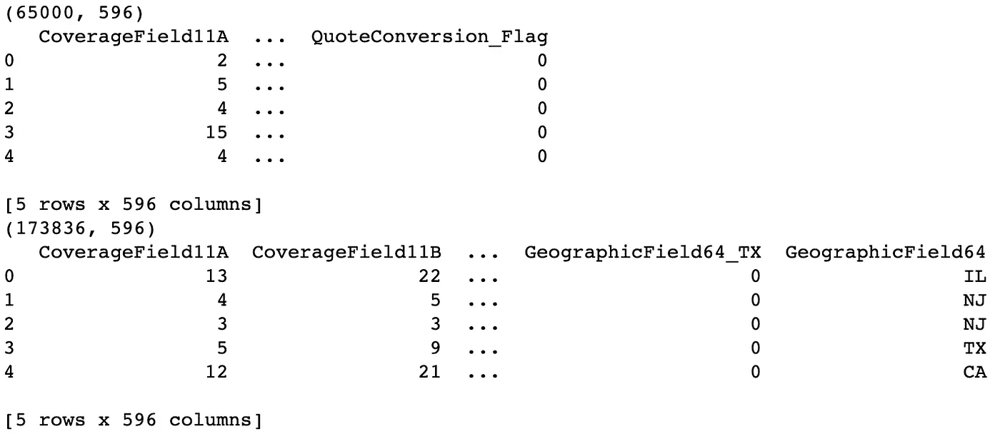
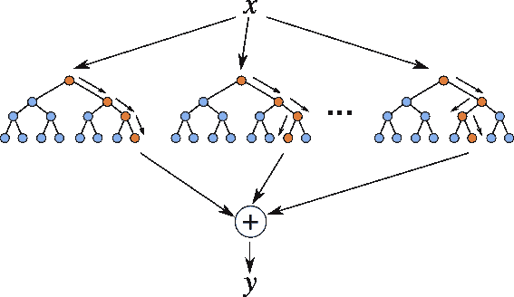
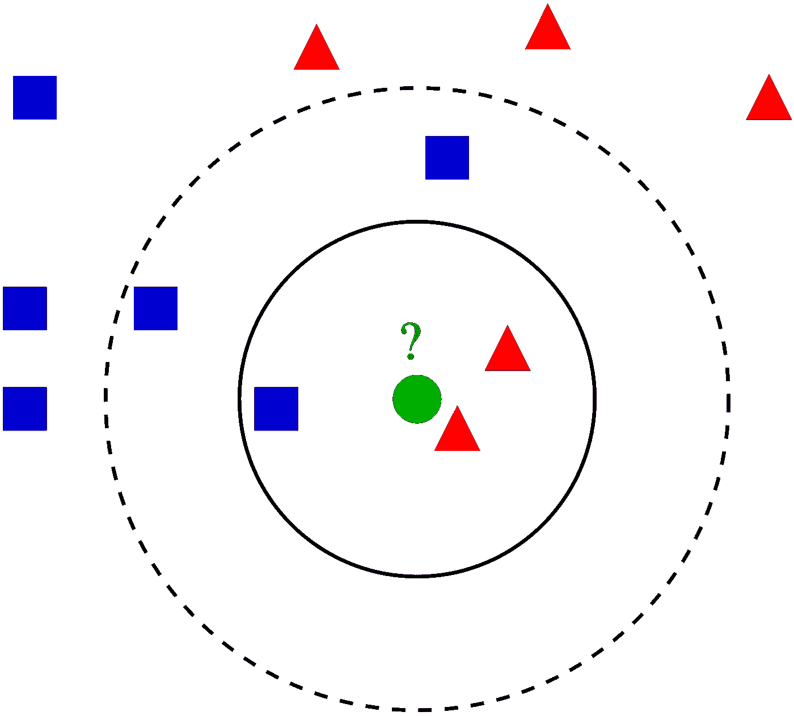
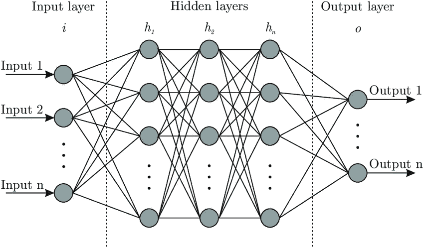

# Python 的分类问题——网站报价转换

> 原文：<https://towardsdatascience.com/a-classification-problem-with-python-homesite-quote-conversion-15174bca09b8?source=collection_archive---------26----------------------->

## 通过 Scikit-Learn 了解 Python 中的分类方法


领先的房屋保险提供商 Homesite 目前还没有一个动态转换率模型来让他们相信报价会导致购买。他们使用客户和销售活动信息的匿名数据库，包括财产和保险信息，要求我们预测哪些客户将购买给定的报价。准确预测转换率将有助于 Homesite 更好地了解提议的价格变化的影响，并保持理想的客户群组合。

# 数据描述

该数据集代表了对从 Homesite 购买保单感兴趣的大量客户的活动。每个 ***报价号*** 对应一个潜在客户， ***报价转换 _ 标志*** 表示该客户是否购买了保单。所提供的特征是匿名的，并且提供了潜在客户和策略的丰富表示。它们包括特定的覆盖范围信息、销售信息、个人信息、财产信息和地理信息。我们的任务是预测测试集中每个 QuoteNumber 的 QuoteConversion_Flag。

我们先看数据，看看这个数据。

> ***训练数据集*** *:* 训练一个模型的子集。
> 
> ***测试数据集*** *:* 测试已训练模型的子集。

```
trainfile = r'RevisedHomesiteTrain.csv'
train_data = pd.read_csv(trainfile)testfile = r'RevisedHomesiteTest.csv'
test_data = pd.read_csv(testfile)print(train_data.shape)
print(train_data.head())print(test_data.shape)
print(test_data.head())
```



Figure 1

我们复制不包括目标的训练数据，并将训练数据和测试数据分开。然后，我们只选择目标列。

```
trainData_Copy = train_data.drop('QuoteNumber', axis=1).iloc[:, :-1].copy()
testData_Copy = test_data.drop('QuoteNumber', axis=1).iloc[:, :-1].copy()X_train = trainData_Copy
X_test = testData_Copy
y_train = train_data["QuoteConversion_Flag"]y_train = train_data.iloc[:, -1]
y_test = test_data.iloc[:, -1]
```

# 从 ***训练数据集*** 创建验证数据集

```
from sklearn.model_selection import train_test_split
X_train1, X_val, y_train1, y_val = train_test_split(X_train, y_train, test_size = 0.2)
```

# 模型

## 决策图表

决策树是一种决策支持工具，它使用树状图形或决策模型及其可能的结果，包括偶然事件结果、资源成本和效用。这是显示只包含条件控制语句的算法的一种方式。决策树分类器通过基于不同的标准将数据集分解成越来越小的子集来工作。将使用不同的分类标准来划分数据集，每次划分的示例数量都会减少。

```
from sklearn.tree import DecisionTreeClassifierclf = DecisionTreeClassifier()
clf.fit(X_train1, y_train1)
clf_predict = clf.predict(X_val)
```

决策树分类器的 Kaggle 得分:0.94499

## 随机森林

随机森林是一种集成学习方法，它在数据子集上拟合多个决策树，并对结果进行平均。



Random Forest

```
from sklearn.ensemble import RandomForestClassifierrfc = RandomForestClassifier()
rfc.fit(X_train, y_train)
rfc_predict = rfc.predict(X_test)
```

随机森林分类器的 Kaggle 得分:0.91963

## k-最近邻

k-最近邻通过检查从某个测试示例到某个训练示例的已知值的距离来操作。给出训练点和测试点之间最小距离的数据点组/类是被选择的类。



K-Nearest Neighbors

```
from sklearn.neighbors import KNeighborsClassifierknc = KNeighborsClassifier()
knc.fit(X_train, y_train)
knc_predict = knc.predict(X_test)
```

K-最近邻分类器的 Kaggle 得分:0.60289

## 神经网络

神经网络是一种机器学习算法，涉及拟合许多用于表示与突触激活功能相连的神经元的隐藏层。这些基本上使用一个非常简化的大脑模型来建模和预测数据。



Neural Networks

```
from sklearn.neural_network import MLPClassifiermlp = MLPClassifier()
mlp.fit(X_train, y_train)
mlp_predict = mlp.predict(X_test)
```

神经网络分类器的 Kaggle 得分:0.86759

## 梯度推进

梯度提升分类器是一组机器学习算法，将许多弱学习模型结合在一起，创建一个强预测模型。决策树通常在做梯度提升时使用。

```
from sklearn.ensemble import GradientBoostingClassifierabc = GradientBoostingClassifier()
abc.fit(X_train, y_train)
abc_predict = abc.predict(X_test)
```

神经网络分类器的 Kaggle 得分:0.95882

# 比较

基于我创建的模型，首先我们可以认识到梯度提升分类器得到最高的 Kaggle 得分。此外，梯度推进模型因其在分类复杂数据集方面的有效性而变得越来越受欢迎，最近已被用于赢得许多 Kaggle 数据科学竞赛。

# 结论

总之，我们使用 Scikit Learn 的不同分类方法(决策树、随机森林、K-最近邻、神经网络和梯度推进)来预测客户购买报价保险计划的概率，并专注于预测准确性。目的是学习一个可以最大化预测精度的模型，比较不同的算法，选择性能最好的一个。

创建这篇文章的源代码可以在[这里](https://github.com/shirley0823/Machine-Learning-with-Python/blob/master/Homesite_Quote_Conversion.ipynb)找到。

# 关于我

非常感谢您阅读我的文章！大家好，我是雪莉，目前在亚利桑那州立大学攻读商业分析硕士学位。如果您有任何问题，请随时联系我！

```
Email me at ***kchen122@asu.edu***and feel free to connect me on [**LinkedIn**](https://www.linkedin.com/in/kuanyinchen-shirley/)!
```