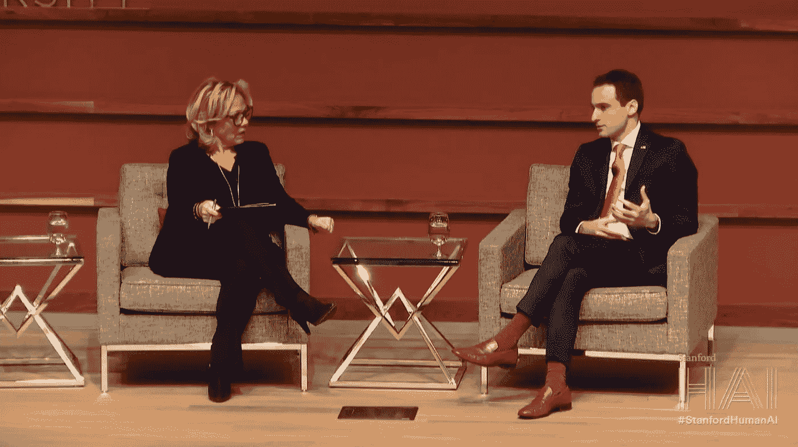

# 对人工智能更清洁的监管方法？

> 原文：<https://towardsdatascience.com/a-cleaner-regulatory-approach-to-ai-7bfa6ec3124d?source=collection_archive---------25----------------------->

Screenshot of Michael Kratsios at the HAI fall conference October 2019

## 美国首席技术官 Michael Kratsios 与人工智能监管

斯坦福大学以人为中心的人工智能研究所(Institute for Human-Centered Artificial Intelligence at Stanford University)提出了一项我认为非常棒而且必须受到称赞的倡议，那就是分享他们关于人工智能伦理、政策和治理的秋季会议的全部视频。这两个长视频，每个都持续几个小时，对于任何对这一领域感兴趣的人或地球上领先的人工智能研究机构之一正在进行的讨论来说，都是一个重要的贡献。与 Michael Kratsios 的讨论从会议的第二天开始。它来自第二天的早期录像，所以应该不难找到。然而，如果你想知道这两天还发生了什么，你可以浏览一下这个公开议程。

*值得注意的是，川普政府在填补其技术政策机构的职位方面动作缓慢。在* [*职位空缺两年多*](https://www.nextgov.com/cio-briefing/2019/03/white-house-nominate-michael-kratsios-us-cto/155764/) *后，Kratsios 于 8 月份被确认为 CTO。然而，他已经作为美国总统的副助理工作了一段时间。*

## 迈克尔·克拉特西奥斯是谁？

迈克尔在大会上的介绍如下，所以我再重复一遍:

> “美国首席技术官迈克尔·克拉特西奥斯。迈克尔于 2019 年 8 月被美国参议院一致确认担任 CTO。他只是美国第四个担任这个角色的人。作为美国首席技术官，迈克尔在非常广泛的技术挑战组合中担任总统的首席顾问，这些挑战包括量子计算、5G 和农村宽带、自动驾驶汽车、商用无人机、STEM 教育、先进制造以及人工智能。在成为首席技术官之前，Michael 在管理的早期阶段担任副首席技术官。在进入政府之前，他是泰尔资本公司的负责人，并担任企业家投资者彼得·泰尔的办公室主任。他毕业于普林斯顿大学，获得了政治学学位。”

他正在斯坦福网络政策中心参加由全球数字政策孵化器执行董事艾琳·多纳霍 主持的讨论。她专注于制定全球数字政策，以应对人权、安全和治理方面的挑战。在斯坦福之前，她是奥巴马政府时期美国驻联合国人权理事会的第一任大使。她还担任过人权观察组织的全球事务主任。她在许多组织的董事会任职，包括国家民主基金会和世界经济论坛人权理事会。

## 人工智能创新的自由市场方法

我们可以把迈克尔的观点总结如下。监管需要有针对性和部门针对性。他提到了美国保持领先地位的自由市场创新方法:

> “我对这个世界的看法是，有些技术是天生免费的，有些技术是天生被囚禁的。”—Michael Kratsios[2019 年 10 月 29 日 HAI 秋季大会](https://www.youtube.com/watch?v=qPx9P1Mybu8)。

降低与投资相关的监管风险。他在问如何创造一个特别适合军事技术的环境。迈克尔管理着一个庞大的投资组合，他通过召集人的角色制定高层次的战略和指令来确定投资的优先顺序。

迈克尔看到了“本质上是企业家”的机会，因此招聘需要时间来寻找个人投资组合经理。他们招募技术专家来推动政策。根据迈克尔的说法，他三分之一的时间花在政策上；第三是会见利益相关者；第三是对外宣传(他认为这是他与海合作的一部分)。

对他来说，从奥巴马政府到特朗普政府，政策制定一直在延续。潜在政策影响。R&D 基础研究人工智能战略计划。他们通过行政命令建立并启动了一项国家战略。

## 清洁法规

在某个时候，迈克尔提到了创建更清洁的法规的想法。我清楚地意识到，要制定对企业更有利的法规。他没有使用“放松管制”这个词，然而，这似乎是他在技术监管方法中暗指的。

***“放松管制*** *是减少或取消政府在特定行业的权力，通常是为了在行业内创造更多的竞争而颁布的。”*

因为没有所谓的干净监管。通过提及这一点，我认为他可能指的是公平和权宜的概念，能够在人工智能领域实施解决方案。

结合自由市场方法，他似乎代表着“让大型科技公司更容易”为美国经济或保卫国家等共同项目做出贡献。他提到亚马逊和苹果的无人机测试必须在国外完成，他一直想把它带回美国。

## 海、国家技术与美国价值观

迈克尔在谈到他与海的关系时说:“对我们来说，这是让像你们这样的聪明人与我们所有机构的监管者沟通，这样我们就可以制定一套聪明的规则。”

主持人:艾琳·多纳霍提出了数字威权主义的问题。迈克尔回答道:

> “如果美国能够继续成为人工智能领域的领导者，我们就能确保我们所珍视的价值观将成为全球发展的基础。”

因此，展示美中之间的对立关系对迈克尔来说很重要，也反映了当前的特朗普政府。他们希望通过一个充满活力的由私人和公共资金资助 R&D 的私营部门来推动科学发现。他提到，这与他们的*‘对手’*正在做的事情不同，而不是一个集中的计划。

## 美国首席技术官支持经合组织的人工智能原则

Michael Kratsios 谈了很多关于去 T2 经合组织的事情，并支持他们的原则。**这在我看来不可思议，因为它为更多关注以地球为中心的人工智能方法打开了大门**。《经合组织人工智能原则》中的第一条原则是:

> 人工智能应该通过推动包容性增长、可持续发展和福祉来造福人类和地球。

在当前的美国执行战略中，没有*与此原则*非常相似，这意味着这可能被用作推动新解决方案或改变美国重点的论据*(尽管我认为这将是一场艰苦的斗争)*。

# 向迈克尔提问

当然，我不能涵盖迈克尔演讲的每一点，这也是我做一个简短总结的部分原因。不过，他回答了几个问题，我记下了这些问题，并将尝试进行沟通。

## 公共数据云

HAI 的领导人之一 John Etchemendy 谈到了一种公共云，这种云向公共利益研究人员提供免费访问。约翰提到的这种可能性为许多可能的应用和可能的误解打开了大门，因为“公共利益”在美国是一种非常务实的方法。公私伙伴关系很好，但在美国，似乎很多时候公共利益几乎可以直接转化为私人利益。迈克尔主要来自彼得·泰尔的私人背景，帕兰蒂尔(彼得拥有的)已经获得了几份新的国防合同。

## 人工智能与移民政策

问:你与移民政策的关系？

答:美国创新的一大支柱是移民。我们相信 T2 的择优创新体系。政治上具有挑战性，需要国会的支持，需要努力达成共识。改进或走向基于成绩的制度。它需要两个独立的彩票，切换彩票的顺序。获得高等学位的人有更好的机会来这里学习。

*在回答这个问题时，迈克尔回避了关于移民和海关执法局(ICE)以及大型科技公司抗议活动的讨论。然而，他说这是与“山上的伙伴”的挑战，所以他的优先事项可能不同，尽管他必须完成一项任务。*

## 创新和价值观

问:美国在人工智能领域的领导地位会给社会带来一定的损失，为了保持美国在人工智能领域的领导地位，个人应该承担什么样的损失？

答:我们在美国是幸运的……其他选择太可怕了，我们需要对我们所有人都珍视的价值观进行互动，以便在未来实施。

## 投资高级人工智能和 R&D

[费-李非]:上游问题和管道问题，与 STEM 教育有关，无论我们在先进的 R&D 投资多少，我们都需要人才管道。本届政府在推动 STEM 教育方面做了哪些努力？最大的问题之一是在人才管道中缺乏代表性。我们对缺乏代表性做了精彩的介绍。本届政府如何与国会合作，考虑投资于多样性和包容性？

答:美国通过了一项关于 STEM 教育的五年计划。我们政府中的许多机构，将这些组织在一起推动干细胞研究。其中一个支柱正是我们正在谈论的事情，如何推动代表性不足的少数群体进入 STEM 领域。在此基础上，我们希望进行更多的合作，我们可以将您与人们联系起来。联邦政府可以在推动议程方面发挥作用，但大部分工作是在州和地方层面完成的。我们如何建立这些并提供帮助。

## 基础设施和数据管理基础

问:我们没有现代化的数字基础设施。有一个研究云提到(提到电子爱沙尼亚)，你如何提供数据集？

答:党派色彩最少的问题之一是政府技术基础设施的现代化。第一个统计数据是，每位员工每年的 it 服务总成本约为 40，000 英镑，而私人 IT 为 4，000 英镑。我们可以更好地使用这些钱。像美国数字服务这样的项目，从硅谷引进有才华的工程师；另一个项目是总统创新研究员项目。PIF 项目，人们能够进入政府，在那里他们能够努力工作。我们有 25 个以上的代理机构，没有理由一次又一次地重复做同样的事情。我们正处于在政府卓越中心推出人工智能的早期阶段。

## 保护民主选举

问:作为首席技术官，你个人在哪些具体举措上花费了时间和预算支持来保护民主选举？

答:那是 DHS，一个与州政府密切合作的人，州-地方的努力。在某种程度上，我可以帮你联系国家安全委员会。

迈克尔是首席技术官，但他并不负责保护选举或选举舞弊。可以说，在他们的科技战略中，美国更关心的是国防而不是内部民主。正如喜剧演员约翰·奥利弗在《上周今夜秀》的一集节目中所说，数字投票并非没有问题，而且往往已经过时。

## 更多跨部门和跨学科的工作

问:越来越多的人认识到，要在规范和创新方面取得成功，学术界和工业界必须合作。HAI 项目很好地反映了这一趋势。对技术挑战和规范的社会挑战有头脑。跨部门和跨专业的工作。

答:最大的反映之一是 R&D 人工智能战略计划，这是涵盖这些伦理问题的八大支柱之一，我们不应将其视为简单的技术问题，而是一个更大的社会科学问题。当我们每季度就人工智能、跨机构合作进行高层讨论时。最大的表现是监管指引备忘录。

## 分手建议

问:对于想参与人工智能技术政策的人，你有什么临别建议？

答:做公共服务很重要，我得到了一个机会，我们生活在迄今为止世界上最伟大的国家。自由和权力，很多人没有，我们有一个非常特别的国家。我们有令人惊叹的国家实验室，如果我们继续培养这种环境，我们就能推动这里的变化。我很乐意和你谈谈，让这成为现实。

## 美国科技政策的最新动向

除了会议，我们可以考虑迈克尔·克拉特西奥斯的招聘。根据 NextGov 在 2019 年 11 月 21 日写的文章，有两个变化需要考虑:

1.  Lynne Parker 博士和 Winter Casey 将在科学和技术政策办公室内晋升。在他们之前的角色中，帕克领导了政府的国家人工智能战略的发展，凯西与盟友一起在技术问题上建立共识。他们现在都是美国副首席技术官**。**
2.  埃里克·伯格将加入 OSTP，担任电信和网络安全助理总监。他负责电信和网络安全产品组合。执行与美国使用无线电频谱、通信网络和网络安全相关的联盟建设、协调和政策工作。

# 结论

似乎很明显，美国高层战略将继续支持技术领域的自由市场做法，这将严重依赖大型技术公司的意见。由于管理人员和政府官员来自私营部门，特别是来自投资、风险投资和“创业”型企业，因此不难看出他们在技术方面的现有关系将对美国的这些新合作努力产生何种影响。迈克尔正在采取措施加强美国技术相关政策的发展，我们将不得不看看这将把我们带到哪里，因为根据许多消息来源，美国目前是人工智能领域的领先国家。

*这里是#500daysofAI，您正在阅读的是第 188 条。500 天来，我每天都写一篇关于人工智能或与之相关的新文章。*