# 西班牙铁路客运定价研究

> 原文：<https://towardsdatascience.com/a-closer-look-into-the-spanish-railway-passenger-transportation-pricing-581c19fe67dc?source=collection_archive---------36----------------------->

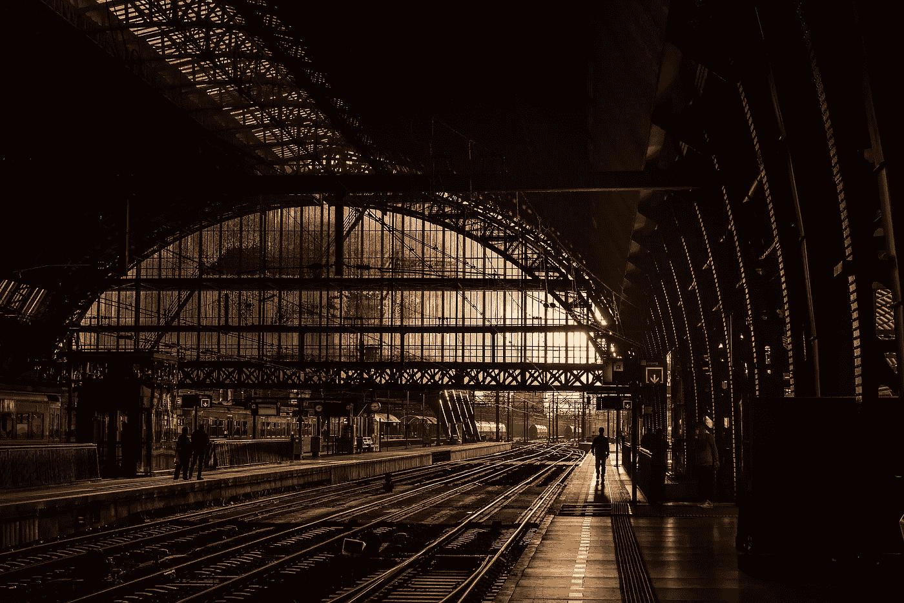

# 介绍

作为一个在离家 400 公里的西班牙城市生活和工作的人，我发现往返旅行最方便的方式是坐火车。作为一个经常使用的用户，我已经对购买门票时的定价模式感到困惑，有时会沿着相同的级别移动，而另一些则超出了最常见的级别。

所以这个疑问促使我提出了以下问题:

**“火车票价格真的会随时间变化吗”？**

如果是这样，

**“有没有购买它们的最佳时机？”**

# 数据

在这个项目中，只考虑了 Renfe 的长距离路线。

该数据集最初来源于由 thegurus.tech 提供的 Renfe scraping 程序，其中每天循环检查几次离开列车的采样路线的价格。

特别是价格被查的车次，时间跨度在 3 个月左右，从 2019 年 4 月 12 日到 2019 年 7 月 7 日。

数据来源:【https://thegurus.tech/posts/2019/05/renfe-idea/ 

# 数据争论

在花了一些时间了解数据之后，自然的下一步是清理原始数据，并以一种为分析做好准备的方式对其进行转换，从而为揭示主要问题做好准备。它的代码可以在我的这个项目的 [Github repo 中找到。](https://github.com/Salvinha-vlc/Renfe-project)

进一步说，清理和转换任务包括创建新的列，比如路线、出发日期、出发时间、在给定日期和给定时间出发的特定列车的标识符，或者出发前的天数；将格式更改为列，以便能够对其进行计算和进一步转换，方法是减少一些分类变量的类别，如火车类型或机票等级，删除不需要的列或决定如何处理无效行(具有空值)。

# 结果

本节介绍的所有图和结果的代码也可以在[这里](https://github.com/Salvinha-vlc/Renfe-project)找到。

## 所有路线一起

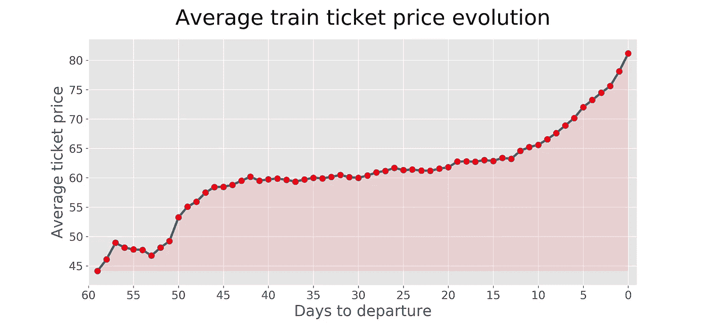

在这个图表上有一些有趣的东西可以评论。一方面，它回答了主要问题。

1)我们可以看到，价格确实会随着时间的推移而变化，不仅如此，我们还可以看到，随着离店日期的临近，价格明显呈上升趋势。

2)一旦我们承认确实存在相关的变化，是否存在购买门票的最佳时机？嗯，从汇总图中，我们可以看到，最佳购买时机是在机票开始销售时，无论如何，在 50 到 60 天之间。

另一方面，它允许我们确定 3 个主要阶段。首先，在出发前的 42 到 60 天之间，我们可以找到价格的较低范围，然后在出发前的 42 到 13 天期间，价格的变化非常低，总共在 6%-7%左右。最后，还有票价逐日上涨的阶段。

让我们按数据集路径来分解它。

## 高需求路线中的价格机票演变

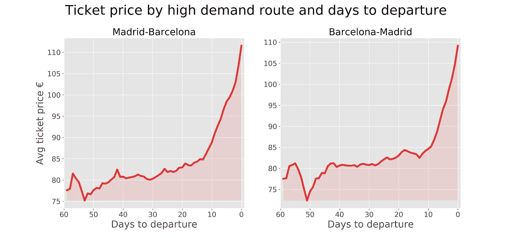

马德里-巴塞罗那往返路线被选为高要求路线的范例。它有一个类似的模式，我们观察到的考虑所有可用的路线在一起。我们看到，在机票发售后，接近出发前 50 天，价格会有所下降。同样，我们可以确定 3 个阶段，首先是出发前的 40 到 60 天，价格范围较低，然后是出发前的 40 到 12 天，价格变化非常低，约为 6%-7%。最后是票价逐日上涨的阶段。

## 非高需求路线中的票价演变

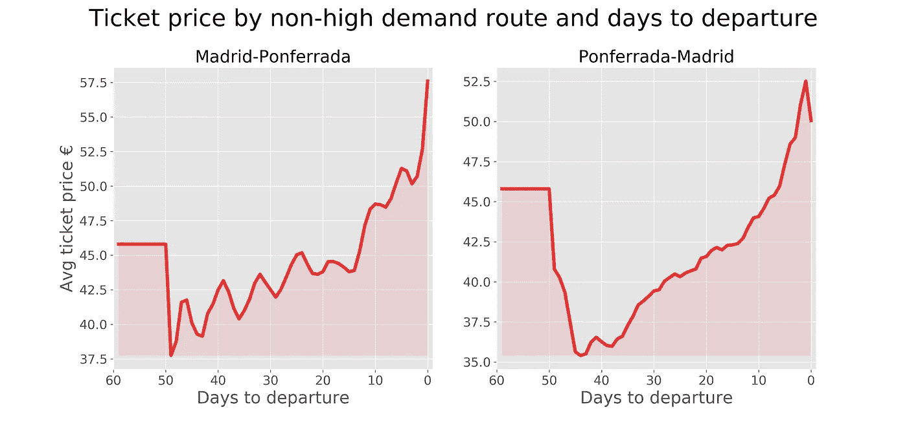

这一次，Renfe 设定了一个初始价格，但由于该价格没有满足需求，价格开始下跌，直到在离开前 40-50 天触及最低点。然后价格演变波动性大得多，随着出发日的临近，价格不断上涨和下跌，但始终遵循上涨趋势。

我们在之前的图中看到的中间阶段，价格几乎在近一个月内保持不变，这里没有重复。

我要强调的最后一点是，价格变化范围远低于高需求路线。

## 所有数据集路线价格演变的画布

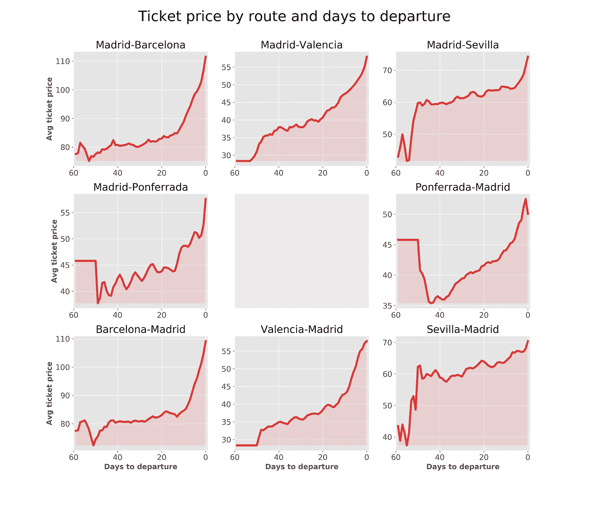

我们还可以根据出行/火车特征来分解价格演变。

## 星期效应

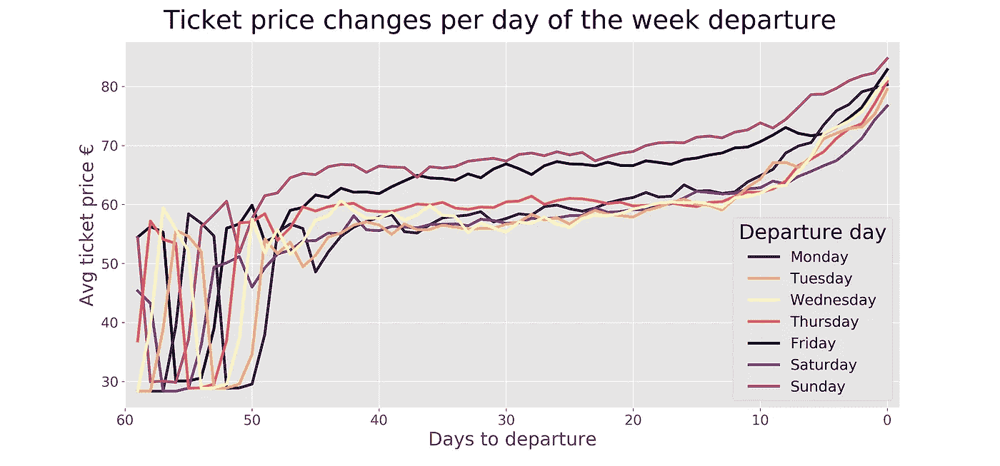

我们可以看到，无论火车在一周中的哪一天出发，价格演变模式都非常相似，但是，我们看到，星期五和星期天的车票平均比其余时间出发的火车更贵。周一火车票是火车接近发车阶段价格上涨最多的。周六则相反，价格上涨最不明显。

## 出发时间效应

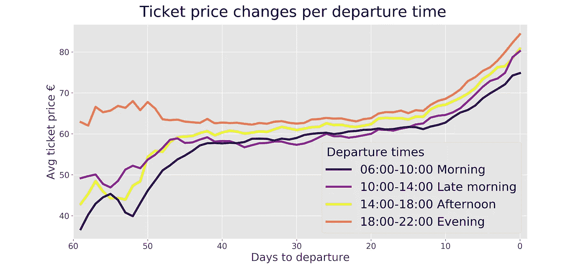

我们之前在箱线图中看到，在按发车时间窗口分解的价格中确实有轻微的差异，我们可以看到晚上发车的列车比其他发车时间窗口中的列车观察到的价格更便宜，我们还大胆地说，这可能是因为晚上发车的列车通常比其他列车有更多的需求，因此，从 Renfe 设定的更高的价格不会像其他列车一样，因较低的初始需求而下降。

上图支持了这一理论。事实上，晚班火车的最低价格恰好在出发前一个月左右，从而导致不同的最佳购买时刻。

## 票类效应

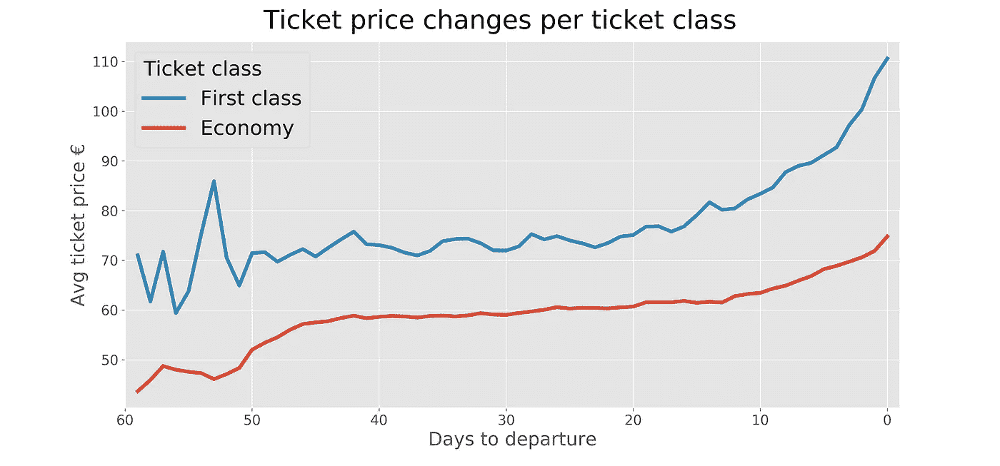

一般来说，这两种类型的机票都适用，所以我要强调的是，因为我们知道经济舱机票最先售完，这就解释了为什么当出发日期临近(“最后阶段”)时价格上涨如此平稳。相反，因此，头等舱在起飞前的最后几天更受欢迎，这就是为什么与经济舱机票相比，头等舱的价格上涨更为强劲。

## 检查是否有任何定价日内差异

一旦评估了日内价格模式，让我们把焦点放在日内价格演变模式上，看看它们是否也存在。

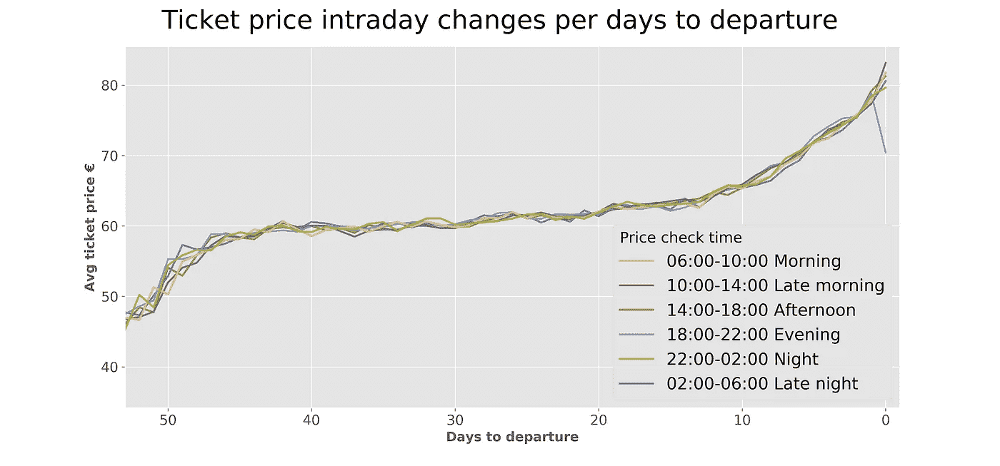

线不断交织和重叠，似乎在告诉我们，每窗口的日内价格乘以离出发的天数没有区别。特别是，唯一突出的一点是晚间价格向图表下限的下降(离出发还有几天甚至几天)。放大看，有可能看到滴滴属于同一天出发。

因此，为了检查我们是否需要考虑这种下降的相关性，我们首先需要知道一般进行的价格检查的次数，以及每个出发窗口时间进行的次数，以便排除潜在的依赖性影响。

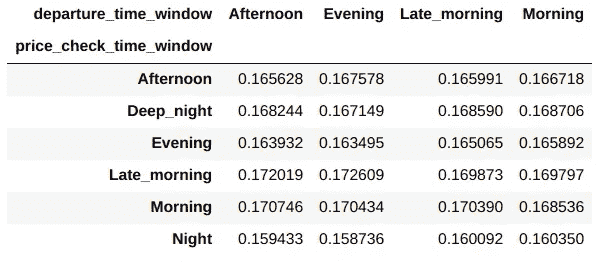

我们可以看到价格检查几乎以相同的比例昼夜不停地进行。让我们看看当放大到最后一天，也就是下降发生的时候，这是否成立。

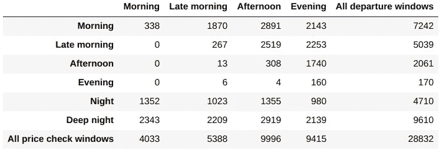

比例不再成立。这意味着，对于出发当天进行的价格检查，这些价格检查是以不平衡的方式进行的；特别是，我们可以看到，晚间价格检查的数量远远低于其他窗口时段。

因此，基本上，由于差价如此之大，在晚上和出发的同一天检查价格的少数火车，可能完全是平均来说更便宜的特定类型。简而言之，没有相关的日内价格差异。

# 结论

随着出发日期的临近，我们发现了相同组合的火车-日期-时间-路线的相关价格变动。

特别是，对于高需求航线，最佳购买时间是出发前 50-60 天。对于非高需求航线，最佳时刻可以在出发前 40 到 50 天之间找到。当火车在晚上出发时，最佳时刻是出发前 30 天。

在任何情况下，如果由于任何原因不能提前足够的时间购买机票，也不必担心，因为在出发前 12 天之前，价格几乎没有变化(平均只有 6-7%)。

但是，过了这个门槛，车票会一天比一天贵，因为离站日一直接近火车离站的那一天。

最后，我们没有在人民币汇率定价系统中发现任何日内模式。因此，按出发日期分组，人们不会在意在一天中的任何特定时刻购买。