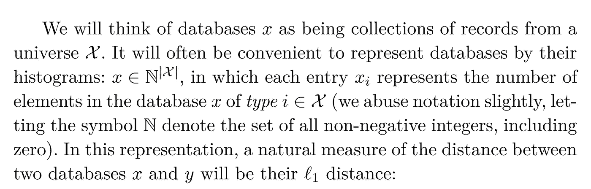
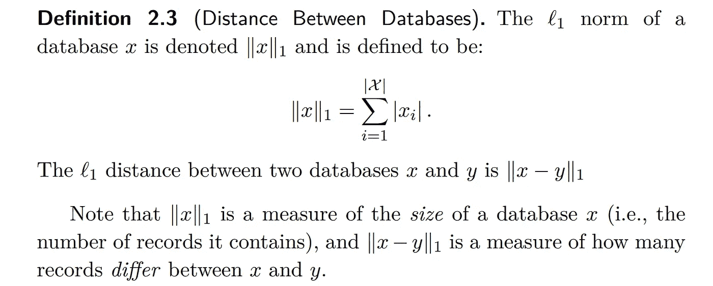
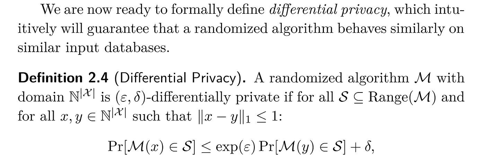

# 一枚硬币、一些吸烟者和数据分析中的隐私

> 原文：<https://towardsdatascience.com/a-coin-some-smokers-and-privacy-in-data-analysis-1339b83ede74?source=collection_archive---------30----------------------->

Photo by [Carlos Muza](https://unsplash.com/@kmuza?utm_source=medium&utm_medium=referral) on [Unsplash](https://unsplash.com?utm_source=medium&utm_medium=referral)

## 我们将继续探索学习隐私保护数据分析技术，这次将更深入地挖掘差异隐私的基础。

在上一篇文章中，我向您介绍了差分隐私的概念，以及它为什么会让您在数据匿名化方面占上风。

我强烈建议你在进一步阅读之前检查一下那篇文章，以便更好地理解我们的学习范围。

 [## X 先生，网飞，和数据分析中的隐私

### 世界各地的隐私监管机构都在关注数据隐私，这给像我们这样的分析师留下了什么空间…

towardsdatascience.com](/mr-x-netflix-and-privacy-in-data-analysis-f59227d50f45) 

所以我们现在知道，差分隐私有助于我们在数据库中保存个人的隐私信息，并防止数据泄露。在正式介绍它是如何做到这一点之前，让我们做一个真实世界的项目，以更好地理解潜在的想法。

Photo by [Helloquence](https://unsplash.com/@helloquence?utm_source=medium&utm_medium=referral) on [Unsplash](https://unsplash.com?utm_source=medium&utm_medium=referral)

> 假设你是一名数据分析师，你的任务是找出与吸烟习惯最相关的关键因素，因为你没有继续使用的数据集，所以你决定在你家附近的公园进行一次公开调查。你决定去问人们是否吸烟以及其他一些问题。然而，由于吸烟不是一个很好的习惯，在公共场合透露吸烟会给一个人带来问题，一些人不太愿意谈论它，或者我们可以说，这是一种人们希望**对自己保密的信息，这样它就不会泄露到其他地方**。但这肯定对你没有帮助，所以为了鼓励人们参与你的研究，你决定给他们一个正确回答的**选项。**

人们可以选择正确答案的想法起初听起来很琐碎，因为你是在故意告诉人们说谎。如果你想一想，你就会明白，你现在拥有的不是一个包含一大堆敏感信息的数据库，而是一个注入了一些噪声的数据库，这就是差分隐私的工作方式。

# 形式化差异隐私:

> **差分隐私通过进程提供隐私；特别是它会引入随机性。**

此时你应该想到的三个最重要的问题是-

*   噪声注入数据如何保持有用？
*   我们如何引入随机性？
*   还有，什么时候加随机性？

在这篇文章中，我们将学习一个重要的算法来添加噪声到我们的数据，我们将回答上述问题。

Photo by [Paul Wong](https://unsplash.com/@paul_wong?utm_source=medium&utm_medium=referral) on [Unsplash](https://unsplash.com?utm_source=medium&utm_medium=referral)

## 随机回答:

随机化回答可能是在数据中引入所需噪声的最简单方法。它为你的研究参与者提供了**故意撒谎**的便利。

研究参与者被告知报告他们是否拥有财产 P，如下所示:

1.  抛硬币。
2.  如果是反面，那就如实回答。
3.  如果是正面，抛第二枚硬币，正面回答“是”，反面回答“否”。

> “隐私”来自于对任何结果的似是而非的否认。这让参与者有机会自己给数据添加噪声。

Photo by [Icons8 team](https://unsplash.com/@icons8?utm_source=medium&utm_medium=referral) on [Unsplash](https://unsplash.com?utm_source=medium&utm_medium=referral)

“是”答案的预期数量是不具有属性 P 的参与者数量的 1/4 倍，加上具有属性 P 的参与者数量的 3/4。因此，如果 P 是具有属性 P 的参与者的真实分数，则“是”答案的预期数量是(1/4)(1p)+(3/4)P =(1/4)+P/2。因此，我们可以将 p 估计为回答“是”的分数的两倍减去 1/2，即 2((1/4)+p/2)-1/2。

因此，如果在调查结束时，你发现 60%的人吸烟，你实际上有 2(60%) - 50% = 70%的人吸烟。

*随机化在这里是必不可少的，最重要的是因为它非常符合差分隐私的定义，无论关于一个人的其他数据集是什么，没有对手能够知道一个人是否吸烟，即使在获得访问数据之后。*

但即使在这一切之后，如果我们有一个对我们数据库的查询，可能会泄漏其中的私人信息，我们会说我们的隐私受到了损害。因此，如果我们从数据库中删除一个人，并且查询的输出发生变化，我们可以说这个人的私人信息被泄露了。事实上，查询输出中的这种变化在数据隐私方面非常重要，因此它有一个特定的身份，即 **ℓ1-敏感性或简单敏感性。**

Formal definition of sensitivity

因此，基本上，敏感度是一个数据库和一个并行数据库的查询输出的变化，每个数据库都有一个人被删除。因此，如果我们的调查中有 10 个人，我们可以根据这些数据创建 10 个并行数据库，每个数据库中少一个人。我们也知道查询只是一个函数，因此数据库 x 和它的并行数据库 y 之间的ℓ1-敏感度本质上如下所示。

**ℓ1-灵敏度= max∨f(x)f(y)∨**

较大的敏感度值表示查询对数据库中的变化高度敏感，因此更有可能危及隐私。

现在我们准备介绍差分隐私的数学定义:

Formal definition of differential privacy

不要担心这乍一看很吓人，我们将在下面揭开它的神秘面纱。

## 展开差分隐私的正式定义；

差分隐私的定义表明，类似“硬币投掷算法”的随机化算法将在数据库及其并行数据库上生成相似的结果，这些数据库本质上是相似的数据库。因此，我们可以确立这样一个事实，即引入随机性可以保护我们数据中的隐私。

但是如果我在数据中引入了过多的随机性，比如说我完全翻转了数据库中的条目，这难道不会影响我的分析结果吗？因此，需要了解的一件重要事情是:**应该添加多少噪声。**如果你还记得上一篇文章，你应该知道，如果我们试图维护我们的隐私，我们会失去我们的准确性。

**ε(ε)**只不过是应该引入多少噪声的**度量，因此它是控制隐私和准确性之间权衡的**参数。**它是控制隐私保证强度的核心参数，因此也是可以私下回答的查询数量和可达到的准确性。(贾斯汀·许等。艾尔。)**

**δ (delta)** 是这里的另一个参数，它给出了ε不保持其值的概率的**度量。**

因此，该公式表明，对于任何随机化算法 **M** ，在数据库 **x** 上输出 s (s ∈ S)的概率至多是在任何并行数据库 **y** 上输出 s 的概率的 **exp^ε** 倍。如果该算法符合这个标准，我们可以称之为***ε-δ差分私有算法。***

这就是我们如何理解差别隐私背后的公式。

我们刚刚了解到的叫做**局部差分隐私**关于何时添加噪声，我们将在下一篇文章中了解更多。

# 总结:

因此，我们了解了如何对我们的数据执行差分隐私，并学习了基本的数学知识。然而，很多问题仍然没有答案，比如我们应该选择ε和δ的什么值，我们将在接下来的文章中尝试理解这些问题。这篇文章是我将要写的关于数据分析中的隐私的系列文章中的第二篇。

在下一篇文章中，我们将了解更多关于差分隐私的算法。

敬请关注。暂时快乐学习。

PS。这是我关于媒体的第二篇文章，所以欢迎任何反馈和建议。

**资源:**

1.  [https://www.cis.upenn.edu/~aaroth/Papers/privacybook.pdf](https://www.cis.upenn.edu/~aaroth/Papers/privacybook.pdf)
2.  [http://www.cis.upenn.edu/~ahae/papers/epsilon-csf2014.pdf](http://www.cis.upenn.edu/~ahae/papers/epsilon-csf2014.pdf)