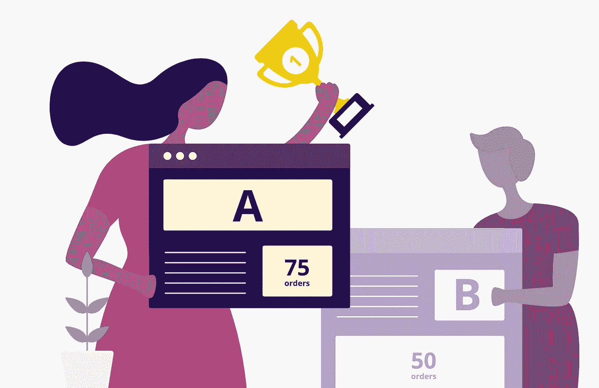
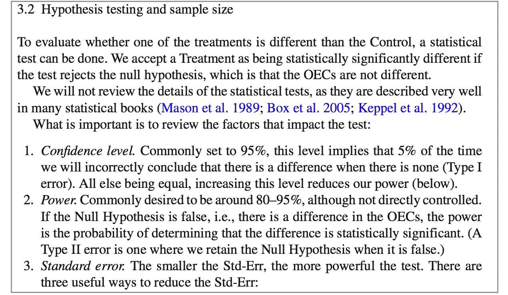

# A/B 测试学习资源集:新手到高手

> 原文：<https://towardsdatascience.com/a-collection-of-a-b-testing-learning-resources-newbie-to-master-6bab1e0d7845?source=collection_archive---------12----------------------->

Source: [https://vwo.com/ab-testing/](https://vwo.com/ab-testing/)

就像 20 世纪制药公司如何通过临床试验测试药物有效性一样，现代软件公司严重依赖测试和学习文化来构建成功的产品[1]。根据您作为分析师、数据科学家、产品经理、营销人员甚至设计师的角色，获取日常工作所需的相关 A/B 测试知识至关重要。

然而，尽管它在工业中有广泛的应用，*如何启动 A/B 测试*在学校里很少被教授，对于这个领域的大多数新人来说，他们不得不花大量的时间研究实验的细节。因此，为了使这一过程不那么耗时，本文编制了一个简短的在线学习资源、博客和最新研究论文列表，它们可以最好地帮助你达到所需的实验掌握水平。

本文分为 5 节，每节内的每个主题/子主题最多包含 1 至 2 个资源，这样你不会因为阅读过多而感到不知所措。此处将分别涵盖的所有不同部分和主题的快速总结:

*   第一部分:测试的价值和“为什么”
*   第二节:统计和基本的“如何”
*   第三部分:行业应用和高级“如何”
*   第四部分:高级统计:顺序测试
*   第五部分:端到端实验平台

*❤特别感谢* ***Iris、Joe 和 Jonas*** *的灵感、知识分享和对以下资源的贡献！❤*

还请注意，本文主要关注 A/B 测试材料，而不是 A/N 或 A/B/n 测试等。如果你想看到其他类型测试的类似资源共享，请留下评论！

## **第一部分:测试的价值和“原因”**

在我们谈论其他事情之前，为什么我们需要运行 A/B 测试？下面的两个资源解释了运行 A/B 测试需要什么，它的目标是什么，以及它如何帮助现代数字软件和产品开发。

作为一句话的总结，A/B 测试建立因果关系。

 [## A/B 测试:如何做好

### 简而言之，当需要建立网站和应用程序时，太多的公司做决定-从新…

hbr.org](https://hbr.org/2017/09/the-surprising-power-of-online-experiments)  [## A/B 测试

### A/B 测试(也称为桶测试或分割测试)是一个随机实验，有两个变量，A 和 B。它…

en.wikipedia.org](https://en.wikipedia.org/wiki/A/B_testing) 

## **第二部分:统计和基本“方法”**

既然我们已经清楚了价值和“为什么”,接下来的主题是关于支持每个测试背后的决策的统计数据，以及从头开始启用测试的过程。

这包括回答以下问题:

*   我们要测试什么，使用什么指标？
*   如何在测试前估计样本量并选择置信度和功效水平(*参考消息* [*这里是 Adobe Target 的样本量计算器*的链接](https://docs.adobe.com/content/target-microsite/testcalculator.html) *)？*
*   如何拆分测试受众？
*   使用什么统计检验来计算显著性水平(假设这里考虑的是传统的 t 检验)？
*   测试要进行多久？
*   如何解读结果并据此做出决策？

对于那些对典型的*测试是如何完成的感到好奇的初学者，我在这里强烈推荐两个资源。*

**Udacity 的 A/B 测试课程**是刚开始学习 A/B 测试的人必看的课程。它涵盖了假设、设计和分析测试的端到端过程，以及从业者应该注意的一些陷阱。推荐给任何直接使用 A/B 测试的人。

 [## A/B 测试| Udacity

### 本课程将涵盖 A/B 测试的设计和分析，也称为分裂测试，这是在线实验…

www.udacity.com](https://www.udacity.com/course/ab-testing--ud257) 

如果你没有时间看讲座，我发现这个课程总结很有参考价值&快速查找。

 [## Udacity A/B 测试课程总结

### 最近我在 Udacity 上完成了 Google 的 A/B 测试课程。该课程已被极力推荐给…

towardsdatascience.com](/a-summary-of-udacity-a-b-testing-course-9ecc32dedbb1) 

此外，著名的**[*网络受控实验:调查和实践指南*](http://www.robotics.stanford.edu/~ronnyk/2009controlledExperimentsOnTheWebSurvey.pdf) 论文[2]揭示了从微软运行的网络实验中获得的经验教训，微软是最早的在线实验平台之一。一个伟大的阅读来了解价值，潜在的统计数据，和实践的网络实验(特别是。与 A/B 测试相关的材料的第 3 部分—参见下面的截图)。**

****

**(Screenshot) *Controlled experiments on the web: survey and practical guide. Section 3.2.***

## ****第三部分:行业应用和高级“如何”****

**现在是时候学习如何在行业中严格应用测试概念，以及在实验设计讨论中经常出现的术语。**

*****新奇效果*****

**当引入测试体验时，有经验的用户在短期和长期会有什么不同的反应？这种差异如何给结果带来偏差？[【2】](http://www.robotics.stanford.edu/~ronnyk/2009controlledExperimentsOnTheWebSurvey.pdf)中的“首因效应和新奇效应”(3.6 限制，#3)一节总结了这个问题，并提供了一个通用的解决方案。**

*****网络效果*****

**对于在社交媒体网站上运行的测试，由于用户交互的性质，用户分配变得棘手。下面这篇由 OkCupid 发表的文章详细描述了这个问题和可行的解决方案。**

** [## 社交网络中 A/B 测试的陷阱

### 我经常被要求在 OkCupid 上帮助运行 A/B 测试，以衡量一个新功能或设计变更会产生什么样的影响…

tech.okcupid.com](https://tech.okcupid.com/the-pitfalls-of-a-b-testing-in-social-networks/) 

***多重比较问题***

 [## 你如何对许多变体，比如说 20 个或者更多的变体进行 A/B 测试？

### 回答(3 之 1):不应该。从 WiderFunnel 的这篇博客文章中摘录的答案变化越多，见解就越深刻…

www.quora.com](https://www.quora.com/How-would-you-run-an-A-B-test-for-many-variants-say-20-or-more) 

***测试审计(如 A/A 测试)***

在第一次设置新的启动界面或新的测试软件后，验证测试管道(数据收集、用户分配、行为跟踪)很重要；否则，如果没有彻底调查，无效的结果不仅浪费时间，而且容易导致错误的业务决策。 *"* [*在 Web 上运行受控实验时要避免的七个陷阱*](http://ai.stanford.edu/people/ronnyk/2009-ExPpitfalls.pdf) *"* 论文[3]中的第 8 节给出了验证测试管道的方法的综合列表，包括在线/离线 A/A 测试、仪器等。).

***与工程展示阶段相结合的 A/B 测试***

在实践中，产品展示通常会经历一个简化的工程过程，称为“分阶段展示”，其最后一步是正式的功能发布。*[*安全速度:使用受控展示*](https://exp-platform.com/Documents/2019%20TongXiaSumitBhardwajPavelDmitrievAleksanderFabijan_Safe-Velocity-ICSE-SEI.pdf)*大规模软件部署实用指南论文[4]介绍了一种将分阶段展示与 A/B 测试(受控展示(狗粮、内部、内部人员和生产)相集成的混合方法。**

## ****第四部分:高级统计:顺序测试****

**到目前为止，我们假设使用传统的 t 检验(也称为固定范围检验)进行假设检验。2015 年，Optimizely 发表了一篇博文，解释了他们为什么将底层统计引擎改为顺序测试(本质上是基于贝叶斯统计)。根据他们的测试数据，顺序测试“可以在不牺牲速度的情况下，将错误声明输赢变化的几率从 30%降低到 5%”。虽然没有像 t-test 那样在行业中广泛采用，但顺序测试提供了一种启动在线实验的新方法，它需要更少的输入(例如，没有最小可检测效应)，并且可能用更少的样本更快地得出结论。**

** [## 互联网时代的统计学:Optimizely 新统计引擎背后的故事

### 经典的统计技术，如 t 检验，是优化行业的基石，帮助公司作出…

blog.optimizely.com](https://blog.optimizely.com/2015/01/20/statistics-for-the-internet-age-the-story-behind-optimizelys-new-stats-engine/) 

鉴于顺序测试是一个新概念，我们还没有找到很多关于这个主题的学习资源。下面的 Udemy 讲座“Python 中的贝叶斯机器学习:A/B 测试”虽然技术含量很高，但却是为数不多的使用贝叶斯统计进行 A/B 测试的资源之一。推荐给铁杆数据科学家。

 [## Python 中的贝叶斯机器学习:A/B 测试

### 这个课程是关于 A/B 测试的。A/B 测试无处不在。营销、零售、新闻源、在线广告…

www.udemy.com](https://www.udemy.com/bayesian-machine-learning-in-python-ab-testing/) 

## 第五部分:端到端实验平台

对于同时运行大量实验(100 个，有时 1000 个测试)的公司来说，构建一个能够大规模规划、启动和分析 A/B 测试的实验平台至关重要。然而，这项工作通常超出了一个数据科学家的工作范围，需要工程投资和产品购买来证明其长期价值。如果你有类似的使用案例，下面是一些关于科技公司如何在内部建立自己的实验平台的快速阅读:

 [## 扩展 Airbnb 的实验平台

### 在 Airbnb，我们在用户体验和产品功能上不断迭代。这可能包括对…的更改

medium.com](https://medium.com/airbnb-engineering/https-medium-com-jonathan-parks-scaling-erf-23fd17c91166)  [## 用优步工程构建智能实验平台

### 由分阶段部署和智能分析工具组成，优步工程的实验平台能够…

eng.uber.com](https://eng.uber.com/experimentation-platform/)  [## facebook/Ax

### Ax 是一个可访问的通用平台，用于理解、管理、部署和自动化自适应…

github.com](https://github.com/facebook/Ax)  [## 这都是关于测试的

### 网飞实验平台

medium.com](https://medium.com/netflix-techblog/its-all-a-bout-testing-the-netflix-experimentation-platform-4e1ca458c15) 

感谢您的阅读！评论、反馈、问题、你想贡献的额外资源、异议等。这里欢迎大家:)

[*关注我*](https://medium.com/@eva.gong) *关于 Medium.com 科技&商业相关话题的定期博客，以及***👏🏻 👏 👏🏽非常感谢**

****论文参考文献****

*[1]关于 A/B 测试的复习[https://hbr.org/2017/06/a-refresher-on-ab-testing](https://hbr.org/2017/06/a-refresher-on-ab-testing)*

*[2] Ron Kohavi 等，“网络上的受控实验:调查和实践指南”。*

*[3] Thomas Crook 等人，“在网上进行受控实验时要避免的七个陷阱”。*

*[4]夏彤等人，“安全速度:使用受控展示的大规模软件部署实用指南”。*****