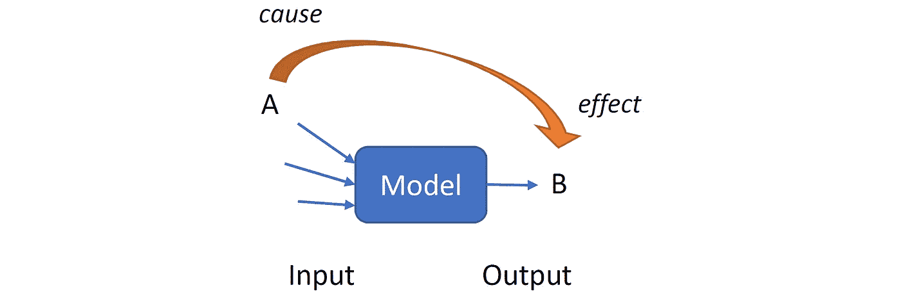
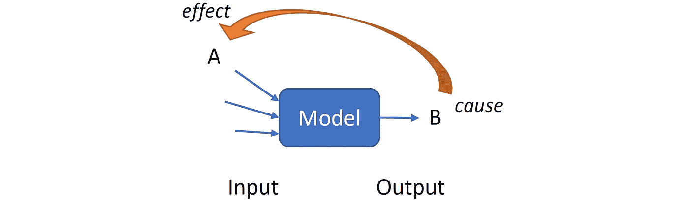
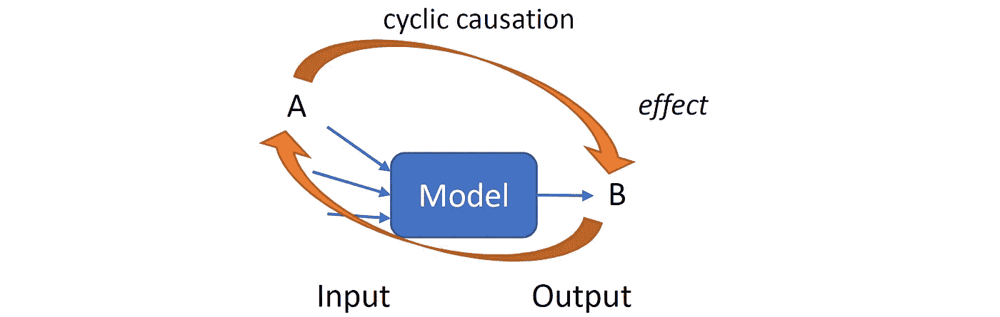
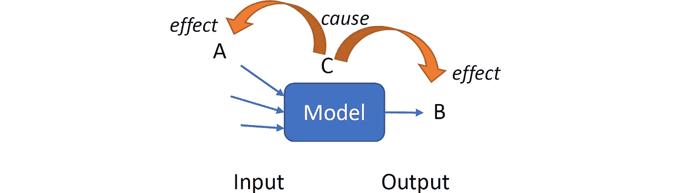

# 一个常见的数据科学错误:通过操纵模型输入进行预测/推荐

> 原文：<https://towardsdatascience.com/a-common-data-science-mistake-prediction-recommendation-by-manipulating-model-inputs-f7eac2d12a84?source=collection_archive---------16----------------------->

“我们训练了一个高性能的机器学习模型。然而，这并不奏效，在实践中也没有用。”这句话我听过好几次，每次都急于找出原因。一个模型在实践中失败可能有不同的原因。由于这些问题通常不会在数据科学课程中解决，因此在本文中，我将解决设计和部署机器学习模型时的一个常见错误。

在本文的其余部分，首先，我将讨论导致机器学习模型误用的相关性和因果性之间的混淆。我将用一个例子来说明这个讨论。之后，显示了模型的输入和输出之间的不同可能性。最后，我提供一些建议来避免这个错误。

# 相关性而非因果关系

将相关性误认为因果关系会导致错误的结果。混淆相关性和因果关系的一个例子是对魔鬼经济学的分析，伊利诺伊州给学生发了书，因为分析显示，家里有书与高分直接相关。然而，现实是，父母通常买书的房子有一个令人愉快的学习环境。进一步的分析显示，那些家里有几本书的学生在学业上表现更好，即使他们从未读过这些书。事实上，获得更高的分数并不是书本的结果，而是环境的结果。

回到我们的主题，在您开发一个模型之后，您不能操作输入参数(特征)来查看对输出的影响。原因是输入要素可能是输出的结果，而不一定是输出的原因。高性能机器学习模型告诉你的是，输入和输出之间存在相关性。您无法调整输入以获得所需的输出，然后根据调整后的输入提供建议。

# 例子

这里有一个例子，我们开发了一个回归模型，但该模型提供了一个错误的预测/建议。假设我们有室外温度和室内温度。我们可以开发一个线性回归模型，根据室内温度来估算室外温度。

*T(外)= C1*T(内)+C2*

其中 *C1* 和 *C2* 是从数据中导出的常系数。假设该模型具有非常高的性能(例如，超过 99%)。

通过使用该模型，我们发现如果室内温度增加 5C，室外温度将增加 10C。我们能为房间买一个加热器并提高室内温度来享受温暖的一天吗？？！！当然不是。原因是内部温度是结果，而不是原因。当数据科学家操纵模型的输入(例如内部温度)以获得期望的输出(例如外部温度)时，也会发生同样的事情。基于操纵输入的建议在实践中通常是无用的。

# 投入产出关系

现在，让我们看看当特征之一 *A* 和输出 *B* 之间存在相关性时的不同情况。下图显示了不同的情况。

*Case 1: A causes B. Manipulating A affects B in the real world.*

*Case 2: B causes A. Manipulating A does not affect B in the real world.*

*Case 3: A causes B and B causes A. Manipulating A affects B but it is not a direct effect.*

*Case 4: A and B are consequences of a common cause C. Manipulating A does not affect B.*

很明显，在情况 2、3 和 4 中，模型的输出对于 *A* 的操纵值与我们在现实世界中看到的不同。应该注意的是，即使在情况 1 中，输出也可能不同，因为 *A* 可能与模型的其他输入具有某种相关性。这意味着当 *A* 的值改变时，其他输入也会改变。因此，仅更改其中一个输入要素并研究其效果是不正确的。

# 如何避免？

首先，要意识到这个问题。你应该知道，通过操纵输入，你无法预测输出。记住这一点会影响你如何设计模型，如何选择未来。

第二，如果你想设计一个预测模型，你需要有历史数据来告诉你的模型改变输入的影响。通过快照，您无法预测如果输入发生变化会发生什么。在这种情况下，您可以根据历史数据来定型模型。在我们的示例中，当我们想要查看室内温度对室外温度的影响时，我们需要一些样本，包括室内温度的变化及其对室外温度的影响(例如，1 小时后)。在这种情况下，模型了解到室内温度对室外温度没有影响。

第三，利用你的领域知识或与专家交谈，看看你的预测/推荐结果是否有意义。这不仅可以避免这个错误，还可以避免其他逻辑错误。例如，您的编码中可能有一些您没有意识到的错误。感觉检查可以帮助您从总体上验证模型。

# 结论

设计机器学习模型是一项棘手的任务。尽管模型在训练数据上有很高的性能，但在实践中可能不起作用。在本文中，我讨论了机器学习模型的误用，它导致预测在现实世界中不起作用。其他原因可能是过度拟合、重复样本和无偏数据。利用你的领域知识或与一些专家交谈，看看你的预测/推荐结果是否有意义，这总是好的。

如果您有任何问题或意见，请在下面留下您的反馈，或者您可以随时通过 [LinkedIn](https://www.linkedin.com/in/aminsadri/) 联系我。