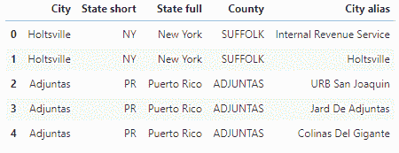
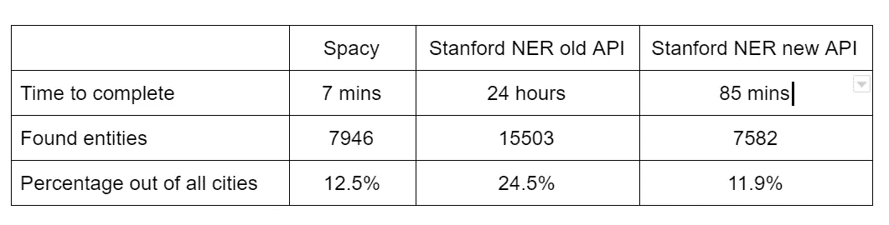

# NER 大学和 NER 大学使用美国所有城市名的比较

> 原文：<https://towardsdatascience.com/a-comparison-between-spacy-ner-stanford-ner-using-all-us-city-names-c4b6a547290?source=collection_archive---------13----------------------->

Sugarloaf Mountain, Rio De Janeiro, Brazil, using Kodak Ektar film.

最近，我不得不使用命名实体进行概念验证，直接选项显然是 NLTK、斯坦福 NER & Spacy。我记得读过几篇比较[和](https://medium.com/@dudsdu/named-entity-recognition-for-unstructured-documents-c325d47c7e3a)的文章，前者给了[空间](/a-review-of-named-entity-recognition-ner-using-automatic-summarization-of-resumes-5248a75de175)优势，后者给了[斯坦福](https://www.analyticsvidhya.com/blog/2017/04/natural-language-processing-made-easy-using-spacy-%E2%80%8Bin-python/)优势。看到没有一个明确的案例，我决定做自己的测试。在 [Zencity.io](https://zencity.io) ，我们的域名是 govtech，我们的 POC 用例是识别尽可能多的美国城市名称。这个想法很简单，加载所有美国城市名称，看看哪个算法可以识别更多的“位置”。显然，我们可以在其他类别中识别姓名，如个人或组织，但这不是重点。请记住，这些分类器是用于完整的句子，而不是单独的实体，但是，这是一个很好的方式来测试，在一个干净和可控的方式，有多少被识别。一个包含所有相关文件的官方项目可以在下面的 [Github 库](https://github.com/orico/SpacyVsStanfordNER)中找到。

# 美国城市名称

我找到了一个带有美国城市名的 [CSV 文件，里面有 63211 个城市，城镇等。](https://github.com/orico/SpacyVsStanfordNER/blob/master/data/us_cities_states_counties.csv)

Several US cities, taken out of the CSV file.

# 空间

下一步是加载 spacy 并检查 Spacy 是否将每个城市别名识别为地理政治实体(GPE)。GPE 是西班牙人说它是一个已知的国家、城市或州的方式。下面的代码显示了如何做到这一点。其他命名实体可在[文档中找到。](https://spacy.io/api/annotation#named-entities)

# 斯坦福的 NER

下一步是使用 NLTK 对斯坦福的 NER (SNER)的实现。我们从加载相关的库开始，指向[斯坦福 NER 代码和模型文件](https://github.com/orico/SpacyVsStanfordNER/tree/master/data)，我们系统地检查 NER 标记者是否能识别所有的城市名称作为“位置”。对于第一个测试，使用旧的 API，我决定使用基本的 3 类模型，包括位置、人员和组织。为此，您可以使用下面的代码。

对于第二个测试，我使用了新的 API，正如[克里斯多佛·曼宁](https://medium.com/@christopherdmanning)所建议的。但是，我不知道算法中使用的默认模型是什么。

# 结果

A comparison of Spacy & Stanford’s NER

# 结论

令人惊讶的是，大多数评论都声称这两种观点各有一点优势。在我们的领域中，优势显然很大，我们可以使用旧 API 识别近两倍数量的实体，使用新 API 识别类似数量的实体，但是，我没有检查结果是否是两个相同的城市名称集。使用旧 API 的测试花费了 24 小时，使用新 API 的测试花费了 85 分钟，这是通过将预测发送到本地服务器而不是使用命令行运行预测所实现的运行时间的巨大差异。然而，似乎 Spacy 仍然胜过 NLTK 的斯坦福 NER。执行 63K 分类需要 Spacy～7 分钟，而 NLTK 大约需要 85 分钟。

Spacy 很有趣，使用起来很快，如果你不介意性能上的巨大差距，那么我会推荐将它用于生产目的，而不是 NLTK 对斯坦福大学 NER 的实现。

感谢[塞缪尔·杰弗罗金](https://www.linkedin.com/in/samueljefroykin/)、[约夫·塔尔米](https://www.linkedin.com/in/yoav-talmi-27787446/)、[纳塔内尔·大卫多维茨](https://medium.com/@ndor123)的校对和评论。

Ori Cohen 拥有计算机科学博士学位，专注于机器学习。他领导着 Zencity.io 的数据科学团队，试图积极影响市民的生活。