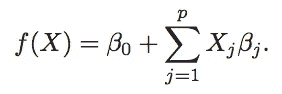
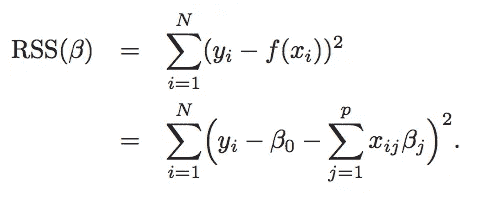
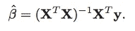
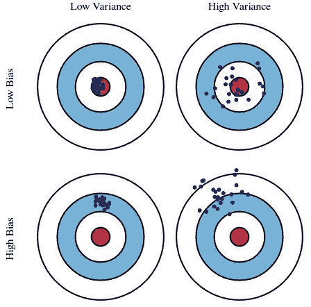
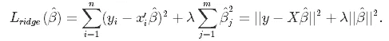
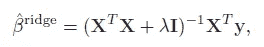
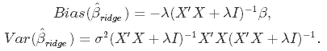

# 线性回归中收缩法和选择法的比较

> 原文：<https://towardsdatascience.com/a-comparison-of-shrinkage-and-selection-methods-for-linear-regression-ee4dd3a71f16?source=collection_archive---------8----------------------->

## 详细介绍 7 种流行的收缩和选择方法。

在本文中，我们将研究线性回归中子集选择和收缩的七种流行方法。在介绍了证明需要这种方法的主题之后，我们将逐一查看每种方法，包括数学属性和 Python 应用程序。

本文基于优秀的 Hastie，t .，Tibshirani，r .，& Friedman，J. H. (2009)的一章。统计学习的要素:数据挖掘、推理和预测。第二版。纽约:斯普林格。一些技术细节可能会被直接转述或引用。

# 为什么收缩或子集，这意味着什么？

在线性回归上下文中，子集化意味着从可用变量中选择一个子集包含在模型中，从而降低其维数。另一方面，收缩意味着减小系数估计值的大小(将它们向零收缩)。注意，如果一个系数收缩到零，相应的变量就会从模型中消失。因此，这种情况也可以被视为一种子集化。

收缩和选择旨在改进简单的线性回归。它需要改进有两个主要原因:

*   **预测精度**:线性回归估计往往偏差小，方差大。降低模型的复杂性(需要估计的参数的数量)可以减少方差，但代价是引入更多的偏差。如果我们能找到总误差最小的最佳点，那么由偏差加上方差产生的误差最小，我们就能改进模型的预测。
*   **模型的可解释性**:预测因素太多，人类很难掌握变量之间的所有关系。在某些情况下，我们愿意确定影响最大的变量的一个小子集，从而牺牲一些细节以获得全局。

# 设置和数据加载

在直接跳到方法本身之前，让我们先看看我们将要分析的数据集。它来自 Stamey 等人(1989)的一项研究，该研究调查了不同临床测量对前列腺特异性抗原(PSA)水平的影响。任务是基于一组临床和人口统计学变量来识别前列腺癌的风险因素。这些数据，连同一些变量的描述，可以在哈斯蒂等人的网站“统计学习的要素”教科书的数据部分找到[。](http://web.stanford.edu/~hastie/ElemStatLearn/)

我们将从导入本文中使用的模块开始，加载数据，并将其分成训练集和测试集，分别保存目标和特性。然后，我们将讨论每种收缩和选择方法，使其适合训练数据，并使用测试集来检查它在新数据上预测 PSA 水平的能力。

# 线性回归

让我们从简单的线性回归开始，这将构成我们的基准。它将目标变量 *y* 建模为 *p* 预测值或特征 *X* 的线性组合:

该模型具有 *p* + 2 个参数，这些参数必须从训练数据中估计:

*   *p* 以β系数为特征，每个变量一个，表示它们对目标的影响；
*   一个截距参数，在上面表示为β0，这是在所有 x 都为零的情况下的预测。没有必要将它包含在模型中，事实上在某些情况下，它应该被删除(例如，如果一个人想要包含表示分类变量级别的全套虚拟变量)，但一般来说，它给了模型更多的灵活性，正如您将在下一段中看到的；
*   高斯误差项的一个方差参数。

这些参数通常使用普通最小二乘法(OLS)来估计。OLS 最小化残差平方和，由下式给出

图形化地思考这个最小化标准是有帮助的。由于只有一个预测器 *X* ，我们处于由该预测器和目标形成的 2D 空间中。在此设置中，模型符合在 *X-Y* 空间中最接近所有数据点的直线，其接近度为所有数据点垂直距离的平方之和——见下面的左图。如果有两个预测值，X1 和 X2，空间增长到 3D，现在模型适合最接近 3D 空间中所有点的平面-参见下面的右面板。有了两个以上的特征，平面就变成了有点抽象的超平面，但思想还是一样的。这些可视化还有助于了解截距如何为模型提供更大的灵活性:如果包含截距，它允许直线或平面不穿过空间的原点。

Source: adapted from The Elements of Statistical Learning by Hastie et al. [1].

上述最小化问题有一个解析解，β参数可计算如下

在 *X* 矩阵中包含一列 1 允许我们在上面的公式中表示β-hat 向量的截距部分。“β”上方的“帽子”表示它是基于训练数据的估计值。

## 偏差-方差权衡

在统计学中，要考虑估计量的两个关键特征:偏差和方差。偏差是真实总体参数和预期估计量之间的差异。它测量估计的不准确性。另一方面，方差衡量的是它们之间的差异。

Source: kdnuggets.com

显然，如果偏差和方差过大，它们都会损害模型的预测性能。然而，线性回归倾向于遭受方差，同时具有较低的偏差。如果模型中有许多预测特征，或者如果它们彼此高度相关，情况尤其如此。这就是子集化和规范化的作用。它们允许以引入一些偏差为代价减少方差，最终减少模型的总误差。

在详细讨论这些方法之前，让我们对前列腺数据进行线性回归，并检查其样本外平均预测误差(MAE)。

# 最佳子集回归

为线性回归选择变量子集的一个简单方法是尝试所有可能的组合，并选择一个最小化某个标准的组合。这就是最佳子集回归的目标。对于每个 *k* ∈ {1，2，…，p}，其中 *p* 是可用特征的总数，它挑选大小为 *k* 的子集，该子集给出最小的残差平方和。然而，平方和不能用作确定 *k* 本身的标准，因为它必然随着 *k* 而减少:模型中包含的变量越多，其残差就越小。但这并不能保证更好的预测性能。这就是为什么应该使用另一个标准来选择最终的模型。对于侧重于预测的模型，测试数据上的错误(可能是交叉验证的)是常见的选择。

由于最佳子集回归没有在任何 Python 包中实现，我们必须手动循环遍历 *k* 和所有大小为 *k* 的子集。下面的代码块完成了这项工作。

# 里脊回归

最佳子集回归的一个缺点是，它不能告诉我们从模型中排除的变量对响应变量的影响。岭回归为变量的硬选择提供了一种替代方法，将变量分为包含在模型中的变量和排除在模型外的变量。相反，它惩罚系数，使它们向零收缩。不完全是零，因为这将意味着从模型中排除，而是在零的方向上，这可以被视为以连续的方式降低模型的复杂性，同时保持模型中的所有变量。

在岭回归中，线性回归损失函数以这样的方式增加，不仅最小化残差平方和，而且惩罚参数估计的大小:

解决这个最小化问题得到βs 的解析公式:

其中 *I* 表示单位矩阵。罚项λ是要选择的超参数:其值越大，系数越向零收缩。从上面的公式中可以看出，当λ变为零时，加性罚消失，并且β-岭变得与来自线性回归的β-OLS 相同。另一方面，当λ增长到无穷大时，β-ridge 接近于零:通过足够高的惩罚，系数可以任意收缩到接近于零。

但是，这种收缩真的会像承诺的那样以引入一些偏差为代价来减少模型的方差吗？是的，从岭回归估计的偏差和方差的公式中可以清楚地看出:随着λ增加，偏差也增加，而方差下降！

现在，如何选择λ的最佳值？运行交叉验证，尝试一组不同的值，并选择一个最小化测试数据交叉验证错误的值。幸运的是，Python 的 scikit-learn 可以为我们做到这一点。

# 套索

Lasso，或最小绝对收缩和选择运算符，在精神上与岭回归非常相似。它还为损失函数添加了非零系数的惩罚，但与脊回归惩罚系数的平方和(所谓的 L2 惩罚)不同，LASSO 惩罚系数的绝对值之和(L1 惩罚)。因此，对于λ的高值，许多系数在 LASSO 下精确归零，这在岭回归中是从来没有的。

它们之间的另一个重要区别是它们如何处理要素之间的多重共线性问题。在岭回归中，相关变量的系数往往是相似的，而在 LASSO 中，其中一个变量通常为零，另一个变量被赋予整个影响。因此，**如果有许多大约相同值的大参数，即当大多数预测因子真正影响反应时，岭回归预计会更好地工作。另一方面，当有少量重要参数且其他参数接近于零时，即只有少数几个预测值实际影响响应时，LASSO 预计会出现在顶部**。

然而，实际上，人们并不知道这些参数的真实值。因此，岭回归和 LASSO 之间的选择可以基于样本外预测误差。另一种选择是将这两种方法结合起来——参见下一节！

LASSO 的损失函数如下所示:

与岭回归不同，这种最小化问题无法解析求解。幸运的是，有数值算法能够处理它。

# 弹性网

弹性网最早出现是由于对 LASSO 的批评，其变量选择可能过于依赖数据，因此不稳定。它的解决方案是结合岭回归和套索的惩罚，以获得两全其美。弹性网旨在最小化包含 L1 和 L2 惩罚的损失函数:

其中α是岭回归(当它为零时)和套索(当它为一时)之间的混合参数。最好的α可以通过 scikit-learn 基于交叉验证的超参数调整来选择。

# 最小角度回归

到目前为止，我们已经讨论了一个子集方法，最佳子集回归，和三个收缩方法:岭回归，套索，以及它们的组合，弹性网。本节专门介绍一种介于子集化和收缩之间的方法:最小角度回归(LAR)。该算法从零模型开始，所有系数等于零，然后迭代工作，在每一步将一个变量的系数移向其最小二乘值。

更具体地说，LAR 从识别与响应最相关的变量开始。然后，它将该变量的系数不断向其最小二乘值移动，从而降低其与演变残差的相关性。一旦另一个变量在与残差的相关性方面“赶上”，这个过程就暂停了。然后，第二个变量加入活动集，即具有非零系数的变量集，并且它们的系数以保持它们的相关性捆绑和递减的方式一起移动。这个过程一直持续到所有变量都在模型中，并在完全最小二乘拟合时结束。“最小角度回归”这个名称来自于该算法的几何解释，在该算法中，给定步骤的新拟合方向与已经具有非零系数的每个要素形成最小角度。

下面的代码块将 LAR 应用于前列腺数据。

# 主成分回归

我们已经讨论了选择变量(子集)和降低它们的系数(收缩)的方法。本文中介绍的最后两种方法采用了稍微不同的方法:它们将原始要素的输入空间压缩到一个更低维的空间中。主要是，他们使用 *X* 来创建一小组新特征 *Z* ，它们是 *X* 的线性组合，然后在回归模型中使用它们。

这两种方法中的第一种是主成分回归。它应用主成分分析，这是一种允许获得一组新特征的方法，这些新特征彼此不相关，并且具有高方差(以便它们可以解释目标的方差)，然后在简单的线性回归中使用它们作为特征。这使得它类似于岭回归，因为两者都在原始特征的主成分空间上操作(对于岭回归的基于 PCA 的推导，参见本文底部来源中的[1])。不同之处在于，PCR 丢弃了信息量最少的成分，而岭回归只是将它们收缩得更强。

要保留的组件数量可以视为一个超参数，并通过交叉验证进行调整，如下面的代码块所示。

# 偏最小二乘法

本文讨论的最后一种方法是偏最小二乘法(PLS)。与主成分回归相似，它也使用原始特征的一小组线性组合。区别在于这些组合是如何构造的。主成分回归仅使用 *X* 自身来创建衍生特征 *Z* ，而偏最小二乘法额外使用目标 *y* 。因此，在构建 *Z* 时，PLS 寻找具有高方差(因为这些可以解释目标中的方差)和与目标高度相关的方向。这与仅关注高方差的主成分方法形成对比。

在该算法的保护下，第一个新特征 *z1* 被创建为所有特征 *X* 的线性组合，其中每个 *X* 被其与目标 *y* 的内积加权。然后， *y* 在 *z1* 上回归，给出 PLS β系数。最后，所有的 *X* 相对于 *z1* 正交化。然后，对于 *z2* 该过程重新开始，并且继续进行，直到在 *Z* 中获得期望数量的组件。像往常一样，这个数字可以通过交叉验证来选择。

可以看出，尽管 PLS 根据需要缩小了 *Z* 中的低方差分量，但它有时会放大高方差分量，这在某些情况下可能会导致更高的预测误差。这似乎是我们前列腺数据的情况:PLS 在所有讨论的方法中表现最差。

# 总结和结论

由于许多可能相关的要素，线性模型在预测准确性和模型的可解释性方面会因模型参数的巨大差异而失败。这可以通过减小方差来缓解，但这只能以引入一些偏差为代价。然而，找到最佳偏差-方差权衡可以优化模型的性能。

允许实现这一点的两大类方法是子集化和收缩。前者选择变量的子集，而后者将模型的系数向零收缩。这两种方法都降低了模型的复杂性，从而降低了参数方差。

本文讨论了几种子集化和收缩方法:

*   **最佳子集回归**迭代所有可能的特征组合，以选择最佳组合；
*   **岭回归**惩罚系数的平方值(L2 惩罚),迫使它们变小；
*   **套索**惩罚系数的绝对值(L1 惩罚),可以强制其中一些正好为零；
*   **弹力网**结合了 L1 和 L2 的点球，独享山脊和套索的精华；
*   **最小角度回归**介于子集化和收缩之间:它迭代工作，在每一步添加一个特征的“某个部分”;
*   **主成分回归**执行 PCA 以将原始特征压缩成新特征的小子集，然后使用那些作为预测器；
*   **偏最小二乘法**也将原始特征总结为新特征的一个更小的子集，但与 PCR 不同，它也利用目标来构建它们。

如果您运行上面的代码块，您将从前列腺数据的应用中看到，这些方法中的大多数在预测准确性方面表现相似。前 5 种方法的误差范围在 0.467 和 0.517 之间，优于最小二乘法的误差 0.523。最后两个，PCR 和 PLS，表现更差，可能是因为数据中没有那么多特征，因此降维的收益有限。

感谢阅读！我希望你已经学到了对你的项目有益的东西🚀

如果你喜欢这篇文章，试试我的另一篇文章。不能选择？从这些中选择一个:

 [## 增强你对助推的把握

### 揭秘著名的竞赛获奖算法。

towardsdatascience.com](/boost-your-grasp-on-boosting-acf239694b1)  [## 线性分类器:综述

### 本文讨论了四个流行的线性函数的数学性质和 Python 的实际应用

towardsdatascience.com](/linear-classifiers-an-overview-e121135bd3bb)  [## 插补的不确定性

### 你在预测中考虑到它了吗？

towardsdatascience.com](/uncertainty-from-imputation-8dbb34a19612) 

# 来源

1.  Hastie，Tibshirani，r .，，j . h . Friedman(2009 年)。统计学习的要素:数据挖掘、推理和预测。第二版。纽约:斯普林格。
2.  [https://www . data camp . com/community/tutorials/tutorial-ridge-lasso-elastic-net](https://www.datacamp.com/community/tutorials/tutorial-ridge-lasso-elastic-net)