# 文本数据的完整探索性数据分析和可视化

> 原文：<https://towardsdatascience.com/a-complete-exploratory-data-analysis-and-visualization-for-text-data-29fb1b96fb6a?source=collection_archive---------3----------------------->


Photo credit: Pixabay

## 如何将可视化和自然语言处理结合起来，以一种直观的方式产生洞察力

可视化表示文本文档的内容是[文本挖掘](https://en.wikipedia.org/wiki/Text_mining)领域最重要的任务之一。作为一名数据科学家或 [NLP](https://plot.ly/python/) 专家，我们不仅从不同的方面和不同的细节层次探索文档的内容，而且我们还总结单个文档，显示单词和主题，检测事件，并创建故事情节。

然而，在可视化非结构化(文本)数据和结构化数据之间存在一些差距。例如，许多文本可视化不直接表示文本，它们表示语言模型的输出(字数、字符长度、单词序列等)。).

在本帖中，我们将使用[女装电子商务评论数据集](https://www.kaggle.com/nicapotato/womens-ecommerce-clothing-reviews)，并使用 [Plotly 的 Python 绘图库](https://plot.ly/python/)和[散景可视化库](https://bokeh.pydata.org/en/latest/)，尽可能多地探索和可视化。我们不仅要探索文本数据，还要可视化数字和分类特征。我们开始吧！

# 数据

```
df = pd.read_csv('Womens Clothing E-Commerce Reviews.csv')
```

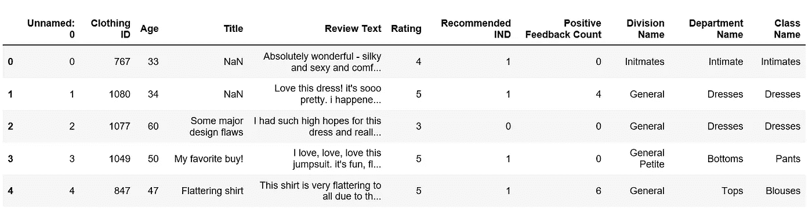

table 1

在对数据进行简单检查后，我们发现需要进行一系列的数据预处理。

*   删除“标题”功能。
*   删除缺少“审查文本”的行。
*   清理“审阅文本”列。
*   使用 [**TextBlob**](https://textblob.readthedocs.io/en/dev/) 计算情绪极性，该极性位于[-1，1]范围内，其中 1 表示积极情绪，-1 表示消极情绪。
*   为评论的长度创建新的特征。
*   为评论的字数创建新功能。

text_preprocessing.py

为了预览情感极性得分是否有效，我们随机选择了 5 条情感极性得分最高的评论(1):

```
print('5 random reviews with the highest positive sentiment polarity: \n')
cl = df.loc[df.polarity == 1, ['Review Text']].sample(5).values
for c in cl:
    print(c[0])
```

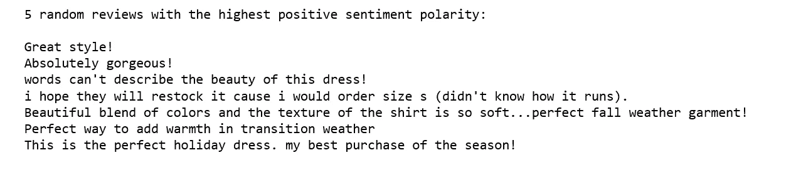

Figure 1

然后随机选择 5 条最中性情感极性得分(零)的评论:

```
print('5 random reviews with the most neutral sentiment(zero) polarity: \n')
cl = df.loc[df.polarity == 0, ['Review Text']].sample(5).values
for c in cl:
    print(c[0])
```

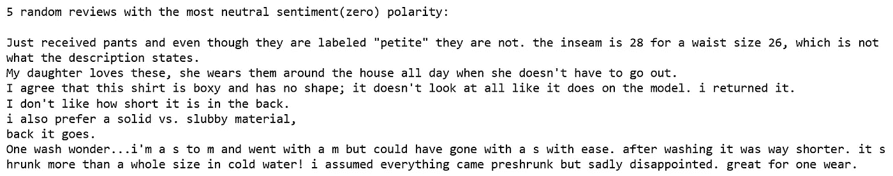

Figure 2

只有 2 篇评论的负面情绪极性得分最高:

```
print('2 reviews with the most negative polarity: \n')
cl = df.loc[df.polarity == -0.97500000000000009, ['Review Text']].sample(2).values
for c in cl:
    print(c[0])
```

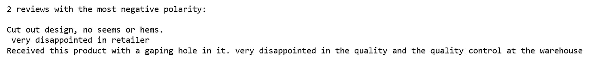

Figure 3

成功了！

# Plotly 单变量可视化

单变量或单变量可视化是最简单的可视化类型，它仅由对单个特征或属性的观察组成。单变量可视化包括直方图、条形图和折线图。

## **评论情绪极性得分分布**

```
df['polarity'].iplot(
    kind='hist',
    bins=50,
    xTitle='polarity',
    linecolor='black',
    yTitle='count',
    title='Sentiment Polarity Distribution')
```

Figure 4

绝大多数情感极性得分都大于零，这意味着它们中的大多数都非常积极。

## 评论等级的分布

```
df['Rating'].iplot(
    kind='hist',
    xTitle='rating',
    linecolor='black',
    yTitle='count',
    title='Review Rating Distribution')
```

Figure 5

评级与极性得分一致，也就是说，大多数评级在 4 或 5 的范围内相当高。

## 审稿人年龄分布

```
df['Age'].iplot(
    kind='hist',
    bins=50,
    xTitle='age',
    linecolor='black',
    yTitle='count',
    title='Reviewers Age Distribution')
```

Figure 6

大多数评论者年龄在 30 到 40 岁之间。

## 分发检查文本长度

```
df['review_len'].iplot(
    kind='hist',
    bins=100,
    xTitle='review length',
    linecolor='black',
    yTitle='count',
    title='Review Text Length Distribution')
```

Figure 7

## 评论字数的分布

```
df['word_count'].iplot(
    kind='hist',
    bins=100,
    xTitle='word count',
    linecolor='black',
    yTitle='count',
    title='Review Text Word Count Distribution')
```

Figure 8

有相当多的人喜欢留下长篇评论。

对于分类特征，我们简单地使用条形图来表示频率。

## 分裂的分布

```
df.groupby('Division Name').count()['Clothing ID'].iplot(kind='bar', yTitle='Count', linecolor='black', opacity=0.8,
                                                           title='Bar chart of Division Name', xTitle='Division Name')
```

Figure 9

一般分部的评论数最多，Initmates 分部的评论数最少。

## 部门分布

```
df.groupby('Department Name').count()['Clothing ID'].sort_values(ascending=False).iplot(kind='bar', yTitle='Count', linecolor='black', opacity=0.8,
                                                           title='Bar chart of Department Name', xTitle='Department Name')
```

Figure 10

说到部门，Tops 部门的评论最多，Trend 部门的评论最少。

## 阶级的分布

```
df.groupby('Class Name').count()['Clothing ID'].sort_values(ascending=False).iplot(kind='bar', yTitle='Count', linecolor='black', opacity=0.8,
                                                           title='Bar chart of Class Name', xTitle='Class Name')
```

Figure 11

现在我们来看“评论文本”特征，在探索这个特征之前，我们需要提取 [N-Gram](https://en.wikipedia.org/wiki/N-gram) 特征。[N-gram](https://en.wikipedia.org/wiki/N-gram)用于描述作为观察点的词的数量，例如，unigram 表示单词，bigram 表示双词短语，trigram 表示三词短语。为了做到这一点，我们使用了 [scikit-learn 的](https://scikit-learn.org/stable/modules/generated/sklearn.feature_extraction.text.CountVectorizer.html) `[CountVectorizer](https://scikit-learn.org/stable/modules/generated/sklearn.feature_extraction.text.CountVectorizer.html)` [函数](https://scikit-learn.org/stable/modules/generated/sklearn.feature_extraction.text.CountVectorizer.html)。

首先，比较去掉停用词前后的 unigrams 会很有趣。

## **移除停用词前的顶级单字分布**

top_unigram.py

Figure 12

## 去除停用词后的顶级单字分布

top_unigram_no_stopwords.py

Figure 13

第二，我们想比较去除停用词前后的二元模型。

## **去除停用词前的顶级二元模型分布**

top_bigram.py

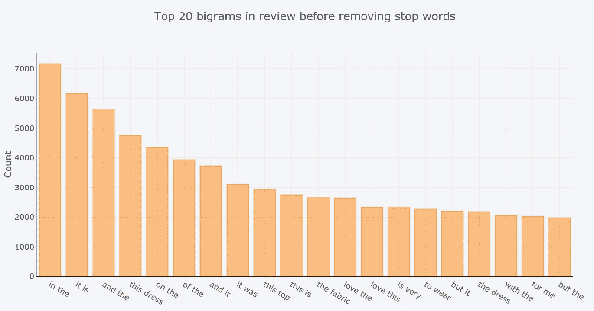

Figure 14

## 去除停用词后的顶级二元模型分布

top_bigram_no_stopwords.py

Figure 15

最后，我们比较去除停用词前后的三元模型。

## **去除停用词前的顶级三元组分布**

top_trigram.py

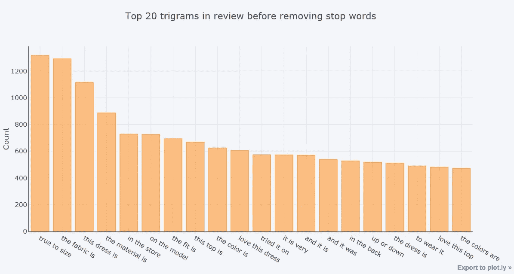

Figure 16

## 去除停用词后的顶三元模型分布

top_trigram_no_stopwords.py

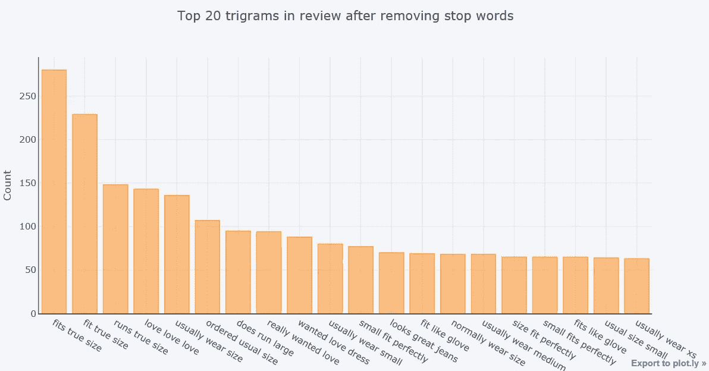

Figure 17

[***【词性标注】***](https://en.wikipedia.org/wiki/Part-of-speech_tagging)*是给每个词分配词性的过程，如名词、动词、形容词等*

*我们使用一个简单的[***Text blob***](https://textblob.readthedocs.io/en/dev/)API 来深入到我们的数据集中的“查看文本”特征的位置，并可视化这些标签。*

## ***评论语料库顶级词性标签分布***

*POS.py*

*Figure 18*

*箱线图用于比较电子商务商店的每个部门或分部的情感极性得分、评级、评论文本长度。*

## *这些部门对情绪极性有什么看法*

*department_polarity.py*

*Figure 19*

*除了趋势部门之外，所有六个部门都获得了最高的情绪极性得分，而 Tops 部门收集了最低的情绪极性得分。而趋势部极性得分中值最低。如果你记得的话，潮流系的评论数量最少。这解释了为什么它不像其他部门那样有各种各样的分数分布。*

## *各部门对评级有什么看法*

*rating_division.py*

*Figure 20*

*除了趋势部，其他部门的中值都是 5 分。总的来说，在这个评论数据集中，评分很高，情绪也很积极。*

## *按部门审查长度*

*length_department.py*

*Figure 21*

*Tops 和 immune 部门的审查长度中位数相对低于其他部门。*

# *用 Plotly 实现二元可视化*

*二元可视化是一种一次包含两个特征的可视化。它描述了两个特征之间的关联或关系。*

## ***推荐的情感极性得分分布***

*polarity_recommendation.py*

*Figure 22*

*显然，具有较高极性分数的评论更有可能被推荐。*

## *按建议的评级分布*

*rating_recommendation.py*

*Figure 23*

*推荐的评论比不推荐的评论有更高的评级。*

## ***按建议分配审查长度***

*review_length_recommend.py*

*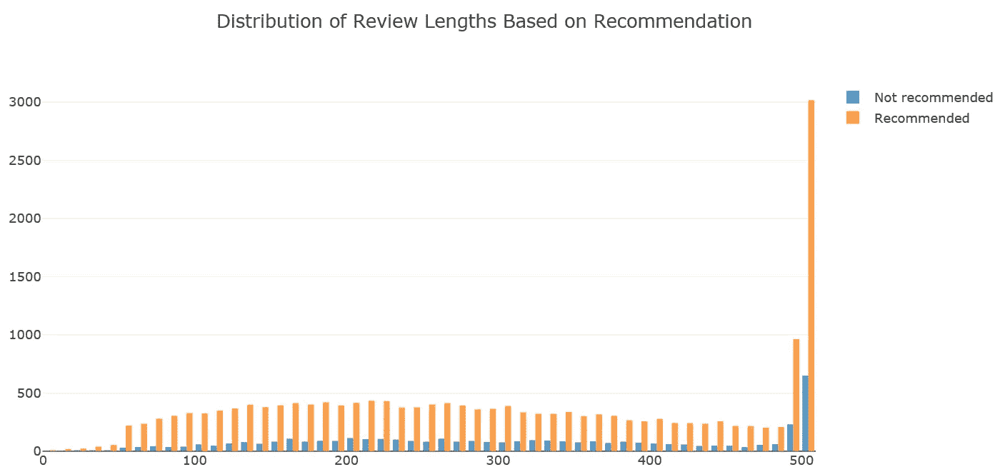*

*Figure 24*

*推荐评论往往比非推荐评论更长。*

## ***情感极性与评分的 2D 密度联合图***

*sentiment_polarity_rating.py*

*Figure 24*

## ***2D 密度年龄与情感极性交汇图***

*age_polarity.py*

*Figure 25*

*很少有人非常积极或非常消极。给予中性到正面评价的人更有可能是 30 多岁。这些年龄的人可能更活跃。*

# *寻找特征术语及其关联*

*有时，我们希望分析不同类别使用的单词，并输出一些显著的术语关联。我们将使用[分散文本](https://github.com/JasonKessler/scattertext#using-scattertext-as-a-text-analysis-library-finding-characteristic-terms-and-their-associations)和[空间](https://github.com/explosion/spaCy)库来完成这些。*

*首先，我们需要将数据框架转换成一个分散文本语料库。要查找部门名称的差异，请将`category_col`参数设置为`'Department Names'`，并使用`Review Text`列中的查看，通过设置`text`列参数进行分析。最后，向`nlp`参数传递一个空间模型，并调用`build()`来构建语料库。*

*以下是区别评论文本和一般英语语料库的术语。*

```
*corpus = st.CorpusFromPandas(df, category_col='Department Name', text_col='Review Text', nlp=nlp).build()
print(list(corpus.get_scaled_f_scores_vs_background().index[:10]))*
```

*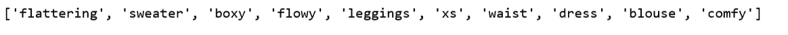*

*Figure 26*

*以下是审查文本中与 Tops 部门最相关的术语:*

```
*term_freq_df = corpus.get_term_freq_df()
term_freq_df['Tops Score'] = corpus.get_scaled_f_scores('Tops')
pprint(list(term_freq_df.sort_values(by='Tops Score', ascending=False).index[:10]))*
```

*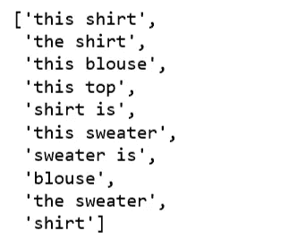*

*Figure 27*

*以下是与服装部门联系最紧密的术语:*

```
*term_freq_df['Dresses Score'] = corpus.get_scaled_f_scores('Dresses')
pprint(list(term_freq_df.sort_values(by='Dresses Score', ascending=False).index[:10]))*
```

*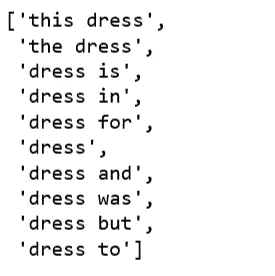*

*Figure 28*

# *主题建模评论文本*

*最后，我们希望探索这个数据集的主题建模算法，看看它是否会提供任何好处，以及是否适合我们正在为我们的评论文本功能所做的工作。*

*我们将在主题建模中试验潜在语义分析(LSA)技术。*

*   *将我们的文档术语矩阵从评论文本生成为一个包含 [TF-IDF 特性](https://scikit-learn.org/stable/modules/generated/sklearn.feature_extraction.text.TfidfVectorizer.html)的矩阵。*
*   *LSA 模型用 TF-IDF 得分替换文档术语矩阵中的原始计数。*
*   *使用[截断奇异值分解](https://scikit-learn.org/stable/modules/generated/sklearn.decomposition.TruncatedSVD.html)对文档术语矩阵进行降维。*
*   *因为部门的数量是 6，所以我们设置`n_topics=6`。*
*   *取该主题矩阵中每个评论文本的`argmax`，将给出数据中每个评论文本的预测主题。然后我们可以将这些分类成每个主题的数量。*
*   *为了更好的理解每个题目，我们会找到每个题目中出现频率最高的三个词。*

*topic_model_LSA.py*

*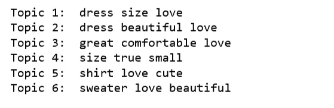*

*Figure 29*

```
*top_3_words = get_top_n_words(3, lsa_keys, document_term_matrix, tfidf_vectorizer)
labels = ['Topic {}: \n'.format(i) + top_3_words[i] for i in lsa_categories]fig, ax = plt.subplots(figsize=(16,8))
ax.bar(lsa_categories, lsa_counts);
ax.set_xticks(lsa_categories);
ax.set_xticklabels(labels);
ax.set_ylabel('Number of review text');
ax.set_title('LSA topic counts');
plt.show();*
```

*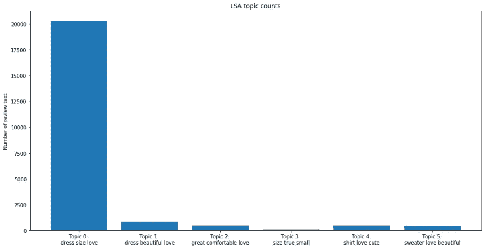*

*Figure 30*

*通过查看每个主题中最常用的词，我们有一种感觉，我们可能无法在主题类别之间达到任何程度的分离。换句话说，我们不能使用主题建模技术按部门分离评论文本。*

*主题建模技术有许多重要的局限性。首先,“主题”这个术语有些模糊，到目前为止，很明显主题模型不会为我们的数据产生高度细微的文本分类。*

*此外，我们可以观察到绝大多数的复习文本都被归类到第一个主题(主题 0)。LSA 主题建模的 t-SNE 可视化效果不会很好。*

*所有的代码都可以在 [Jupyter 笔记本](https://github.com/susanli2016/NLP-with-Python/blob/master/EDA%20and%20visualization%20for%20Text%20Data.ipynb)上找到。代码和交互式可视化可以在[的 NBC viewer](https://nbviewer.jupyter.org/github/susanli2016/NLP-with-Python/blob/master/EDA%20and%20visualization%20for%20Text%20Data.ipynb)上查看。*

*周一快乐！*