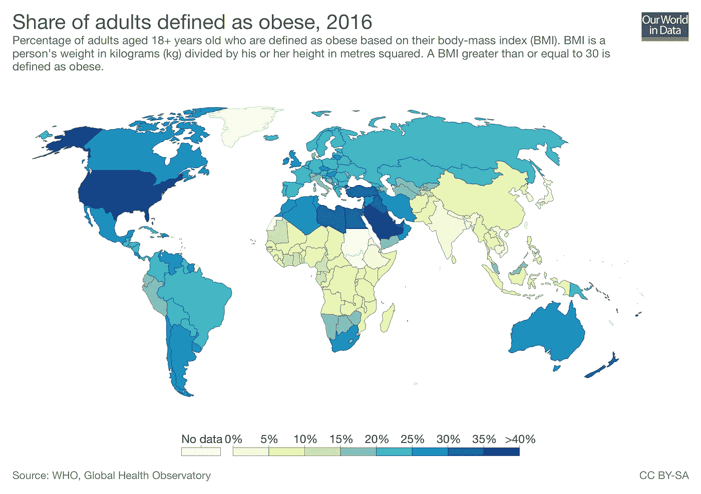
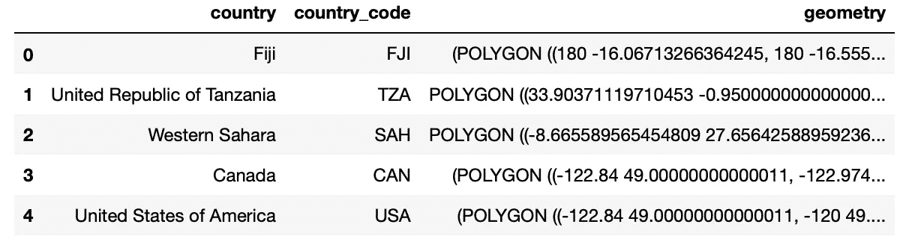
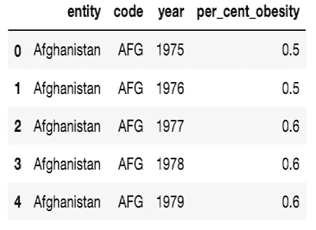
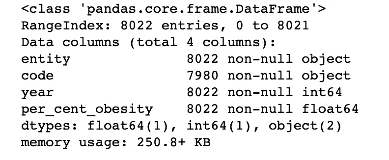
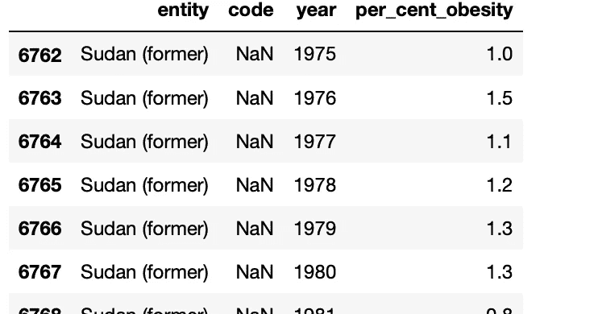
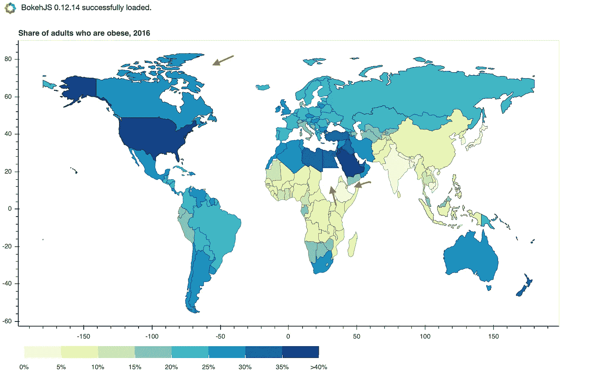
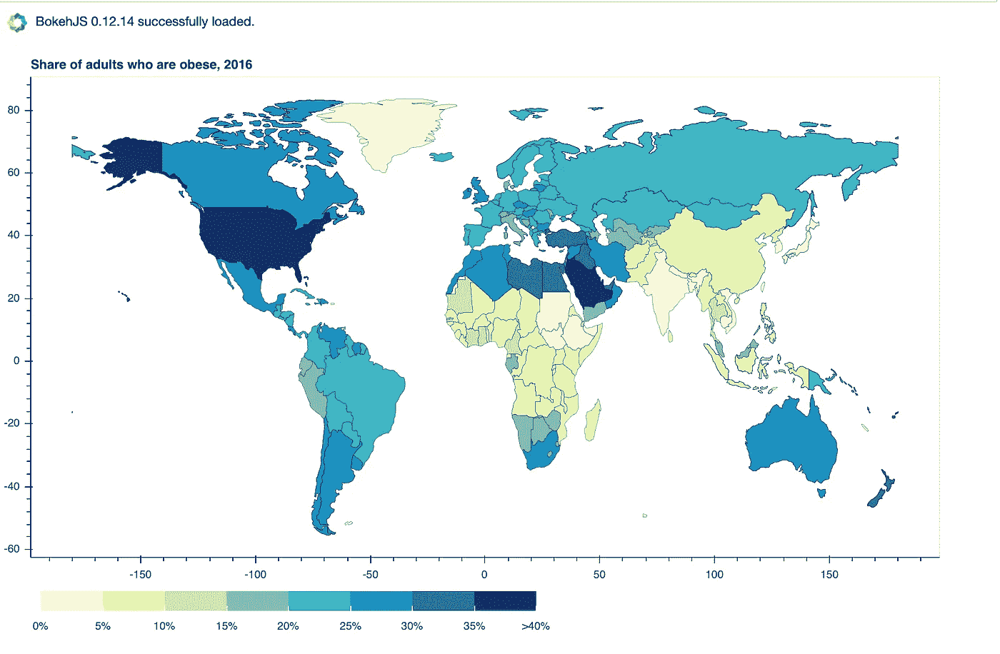
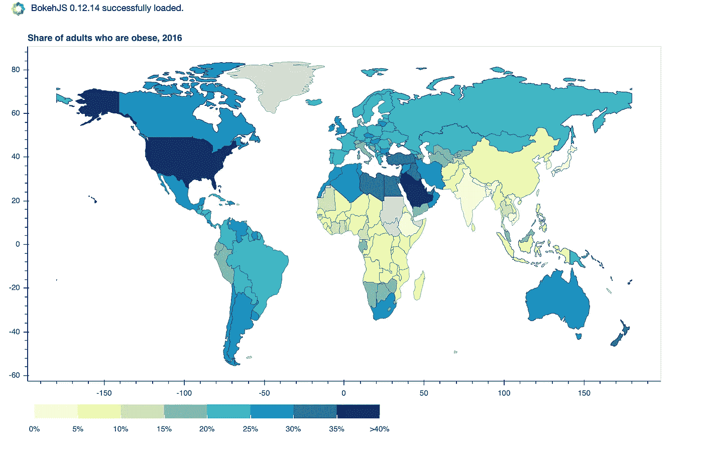

# 使用 Python 的交互式地理地图完整指南

> 原文：<https://towardsdatascience.com/a-complete-guide-to-an-interactive-geographical-map-using-python-f4c5197e23e0?source=collection_archive---------2----------------------->



有没有想过这些美丽的地理地图是如何制作的？[我们的数据世界](https://ourworldindata.org)收集了大量关于健康、人口增长、教育、文化、暴力、政治权力、技术和我们关心的几个方面的交互式数据可视化。这些可视化帮助我们理解过去几十年世界是如何以及为什么发生变化的。我对这些丰富的信息很感兴趣，并激发了我更深入的探索。

一次快速的谷歌搜索让我找到了 choropleth 地图。地图显示与数据变量相关的彩色、阴影或图案化的划分的地理区域。地理区域可能覆盖整个世界，或者一个国家，州，甚至一个县。有许多工具和软件包可以使用 Python 制作独立的或静态的地图。然而，创建一个动态地图有点棘手，这正是我们将在这个博客中学习的内容。在这个循序渐进的指南中，我们将使用 Python 库和包在 ***肥胖成人的比例(1975-2016 年)*** 上重新创建一个交互式全球合唱团地图-熊猫、[地球熊猫](http://geopandas.org)和 [Bokeh](https://bokeh.pydata.org/en/latest/) 。

在第一部分，我们将创建一个静态地图，然后在代码的基础上引入交互性。

## 把密码给我

整个代码也可以在我的[github.com](https://github.com/CrazyDaffodils/Interactive-Choropleth-Map-Using-Python)找到。

## 下载和安装

要渲染世界地图，我们需要一个带有世界坐标的 shapefile。 [Natural Earth](https://www.naturalearthdata.com) 是一个公共领域地图数据集，提供各种分辨率的地理空间数据。对于我们的目的来说，[1–110m 小规模数据](https://www.naturalearthdata.com/downloads/110m-cultural-vectors/)已经足够好了。点击绿色按钮 ***下载国家 4.1.0 版*** 下载 shape 文件夹。接下来，进入[我们的数据世界](https://ourworldindata.org/obesity)，点击图表上的数据选项卡，下载定义为肥胖的成年人份额. csv。或者，也可以从我的 [github](https://github.com/CrazyDaffodils/Interactive-Choropleth-Map-Using-Python) 库下载文件。安装 Geopandas 和 Bokeh。

## 探索熊猫和地理熊猫数据框

导入 geopandas。Geopandas 可以使用返回地理数据框架对象的`read_file`命令读取几乎任何基于矢量的空间数据格式，包括 ESRI shapefile。shapefile 由许多列组成，其中只有 3 列是我们感兴趣的。为了便于参考，对列进行了重命名。

```
import geopandas as gpdshapefile = 'data/countries_110m/ne_110m_admin_0_countries.shp'*#Read shapefile using Geopandas* gdf = gpd.read_file(shapefile)[['ADMIN', 'ADM0_A3', 'geometry']]*#Rename columns.*
gdf.columns = ['country', 'country_code', 'geometry']
gdf.head()
```



Geopandas GeoDataFrame

我们可以删除“南极洲”这一行，因为它在我们的地图上不必要地占据了很大的空间，在我们当前的分析中也不需要。

```
print(gdf[gdf['country'] == 'Antarctica'])#*Drop row corresponding to 'Antarctica'* gdf = gdf.drop(gdf.index[159])
```

接下来，我们进口熊猫并阅读。csv 文件。

```
import pandas as pddatafile = 'data/obesity.csv'*#Read csv file using pandas*
df = pd.read_csv(datafile, names = ['entity', 'code', 'year', 'per_cent_obesity'], skiprows = 1)df.head()
```



Pandas DataFrame

```
df.info()
df[df['code'].isnull()
```



Investigating missing values in df

调查熊猫数据框架显示苏丹缺失值。我们的数据跨度从 1975 年到 2016 年；而苏丹在 2011 年 7 月分裂成两个国家。这导致了新分裂国家的 3 个字母的 ISO 代码的变化。为了简单起见，让我们忽略苏丹缺失的数据。

## 2016 年静态 choropleth 地图

让我们首先创建一个表示 2016 年成人肥胖比例的静态地图。这需要从 df 中过滤 2016 年的数据。然后，可以将生成的数据框架 df_2016 合并到地理数据框架 gdf 中。

```
*#Filter data for year 2016.*
df_2016 = df[df['year'] == 2016]*#Merge dataframes gdf and df_2016.*
merged = gdf.merge(df_2016, left_on = 'country_code', right_on = 'code')
```

合并后的文件是一个 GeoDataframe 对象，可以使用 geopandas 模块进行渲染。然而，由于我们想加入数据可视化的交互性，我们将使用散景库。散景使用 GeoJSON 格式，用 JSON 表示地理要素。GeoJSON 将点、线和多边形(在散景中称为面片)描述为要素的集合。因此，我们将合并后的文件转换为 GeoJSON 格式。

```
import json#*Read data to json.*
merged_json = json.loads(merged.to_json())#*Convert to String like object.*
json_data = json.dumps(merged_json)
```

我们现在准备使用散景渲染我们的 choropleth 地图。导入所需的模块。代码是内联描述的。

```
from bokeh.io import output_notebook, show, output_file
from bokeh.plotting import figure
from bokeh.models import GeoJSONDataSource, LinearColorMapper, ColorBar
from bokeh.palettes import brewer*#Input GeoJSON source that contains features for plotting.*
geosource = GeoJSONDataSource(geojson = json_data)*#Define a sequential multi-hue color palette.*
palette = brewer['YlGnBu'][8]*#Reverse color order so that dark blue is highest obesity.*
palette = palette[::-1]*#Instantiate LinearColorMapper that linearly maps numbers in a range, into a sequence of colors.*
color_mapper = LinearColorMapper(palette = palette, low = 0, high = 40)*#Define custom tick labels for color bar.*
tick_labels = {'0': '0%', '5': '5%', '10':'10%', '15':'15%', '20':'20%', '25':'25%', '30':'30%','35':'35%', '40': '>40%'}*#Create color bar.* 
color_bar = ColorBar(color_mapper=color_mapper, label_standoff=8,width = 500, height = 20,
border_line_color=None,location = (0,0), orientation = 'horizontal', major_label_overrides = tick_labels)*#Create figure object.*
p = figure(title = 'Share of adults who are obese, 2016', plot_height = 600 , plot_width = 950, toolbar_location = None)
p.xgrid.grid_line_color = None
p.ygrid.grid_line_color = None*#Add patch renderer to figure.* 
p.patches('xs','ys', source = geosource,fill_color = {'field' :'per_cent_obesity', 'transform' : color_mapper},
          line_color = 'black', line_width = 0.25, fill_alpha = 1)*#Specify figure layout.*
p.add_layout(color_bar, 'below')*#Display figure inline in Jupyter Notebook.*
output_notebook()*#Display figure.*
show(p)
```



酷！我们的 choropleth 地图已经生成。你可能在这张地图上发现了一个问题。非洲大陆看起来支离破碎；那是因为苏丹、南苏丹、索马里兰不见了。还有，格陵兰在世界地图上不见了。没有画出这些国家的原因是我们的中缺少一个或多个对应于这些国家的值。csv 文件，因此，数据帧 df。让我们解决这个问题，因为它会让一些人反感，这是理所当然的！

## 更正缺失的国家

我们可以确保缺失的国家被绘制在地图上，并用浅灰色填充，表示缺失的数据。这需要在我们之前的代码中进行一些编辑。

为了保留合并数据框中缺失的国家，我们执行了左合并/左外连接。因此，地理数据框架 gdf 中的每个国家都会保留在合并的数据框架中，即使熊猫数据框架 df 中缺少相应的行。

```
df_2016 = df[df['year'] == 2016]*#Perform left merge to preserve every row in gdf.*
merged = gdf.merge(df_yr, left_on = 'country_code', right_on = 'code', how = 'left')
```

这导致了下图。



Choropleth map for year 2016 (after left merge)

所以现在我们在地图上看到了之前缺失的国家，但是还有一个问题。新添加的国家按照我们的颜色映射器中的定义进行颜色编码，表示肥胖率在 0–5%的范围内。这具有误导性，因为实际上这些数据是缺失的。理想情况下，我们希望这些国家以中性色显示，如浅灰色，表示缺少数据。我们如何才能做到这一点？

左合并导致在合并的数据帧中为右数据帧中相应的缺失值添加 NaN 值(df_2016)。当我们将这个合并的数据帧转换成 GeoJSON 格式时，问题就出现了，因为 NaN 不是一个有效的 JSON 对象。为了避免这种情况，我们将把合并数据帧中的所有 NaN 值替换为字符串“No data”。

```
df_2016 = df[df['year'] == 2016]*#Perform left merge to preserve every row in gdf.*
merged = gdf.merge(df_2016, left_on = 'country_code', right_on = 'code', how = 'left')*#Replace NaN values to string 'No data'.*
merged.fillna('No data', inplace = True)
```

我们还将十六进制代码输入到带有“无数据”的颜色代码国家，作为颜色映射器的参数。

```
*#Instantiate LinearColorMapper that maps numbers in a range linearly into a sequence of colors. Input nan_color.*color_mapper = LinearColorMapper(palette = palette, low = 0, high = 40, nan_color = '#d9d9d9')
```



Choropleth map for year 2016 (after left merge and replacing NaNs)

太好了！我对我们 2016 年的 choropleth 地图很满意。是时候增加一些互动性了。

在我们的可视化中增加交互性使用户能够提取他们感兴趣的信息。我们的目标是创建一个动态地图，根据 1975-2016 年间选择的年份更新数据。我们还将添加一个悬停工具，允许用户只需将鼠标悬停在特定国家/地区上方即可查看详细信息。

Bokeh 提供了大量的小部件和工具，使得创建丰富的交互式可视化变得非常简单。我们将定义一些函数，并重用为创建静态地图而编写的大部分代码。代码是内联描述的。

```
from bokeh.io import curdoc, output_notebook
from bokeh.models import Slider, HoverTool
from bokeh.layouts import widgetbox, row, column*#Define function that returns json_data for year selected by user.*

def json_data(selectedYear):
    yr = selectedYear
    df_yr = df[df['year'] == yr]
    merged = gdf.merge(df_yr, left_on = 'country_code', right_on =     'code', how = 'left')
    merged.fillna('No data', inplace = True)
    merged_json = json.loads(merged.to_json())
    json_data = json.dumps(merged_json)
    return json_data*#Input GeoJSON source that contains features for plotting.*
geosource = GeoJSONDataSource(geojson = json_data(2016))*#Define a sequential multi-hue color palette.*
palette = brewer['YlGnBu'][8]*#Reverse color order so that dark blue is highest obesity.*
palette = palette[::-1]*#Instantiate LinearColorMapper that linearly maps numbers in a range, into a sequence of colors. Input nan_color.*
color_mapper = LinearColorMapper(palette = palette, low = 0, high = 40, nan_color = '#d9d9d9')*#Define custom tick labels for color bar.*
tick_labels = {'0': '0%', '5': '5%', '10':'10%', '15':'15%', '20':'20%', '25':'25%', '30':'30%','35':'35%', '40': '>40%'}*#Add hover tool*
hover = HoverTool(tooltips = [ ('Country/region','[@country](http://twitter.com/country)'),('% obesity', '@per_cent_obesity')])*#Create color bar.* 
color_bar = ColorBar(color_mapper=color_mapper, label_standoff=8,width = 500, height = 20,
                     border_line_color=None,location = (0,0), orientation = 'horizontal', major_label_overrides = tick_labels)*#Create figure object.*
p = figure(title = 'Share of adults who are obese, 2016', plot_height = 600 , plot_width = 950, toolbar_location = None, tools = [hover])
p.xgrid.grid_line_color = None
p.ygrid.grid_line_color = None*#Add patch renderer to figure.* 
p.patches('xs','ys', source = geosource,fill_color = {'field' :'per_cent_obesity', 'transform' : color_mapper},
          line_color = 'black', line_width = 0.25, fill_alpha = 1)*#Specify layout*
p.add_layout(color_bar, 'below')*# Define the callback function: update_plot*def update_plot(attr, old, new):
    yr = slider.value
    new_data = json_data(yr)
    geosource.geojson = new_data
    p.title.text = 'Share of adults who are obese, %d' %yr

*# Make a slider object: slider* 
slider = Slider(title = 'Year',start = 1975, end = 2016, step = 1, value = 2016)
slider.on_change('value', update_plot)*# Make a column layout of widgetbox(slider) and plot, and add it to the current document*
layout = column(p,widgetbox(slider))
curdoc().add_root(layout)*#Display plot inline in Jupyter notebook*
output_notebook()*#Display plot*
show(layout)
```

厉害！我们已经成功地为肥胖的成年人重新创建了交互式 choropleth 地图。请注意，当您更改 Jupyter 笔记本中的滑块值时，图不会更新。要以交互模式查看此应用程序，您需要设置一个本地散景服务器。在当前目录下打开命令行窗口，执行`bokeh serve --show filename.ipynb`命令。


Setting up local Bokeh server

单击提示的链接，在浏览器中打开应用程序。我已经插入了一个简短的剪辑，显示了互动模式的应用程序。

World obesity Interactive Choropleth map

在数据中的[我们的世界的原始地图上有一些很酷的特征，我无法合并；就像悬停时高亮显示一个国家，悬停在颜色栏上的某个部分时高亮显示所有国家一样。我也搞不清楚与颜色条并列的“无数据”的“浅灰色”段的显示。如果您对我们如何进一步增强应用程序的交互性有任何意见或建议，我很乐意倾听！](https://ourworldindata.org/obesity)