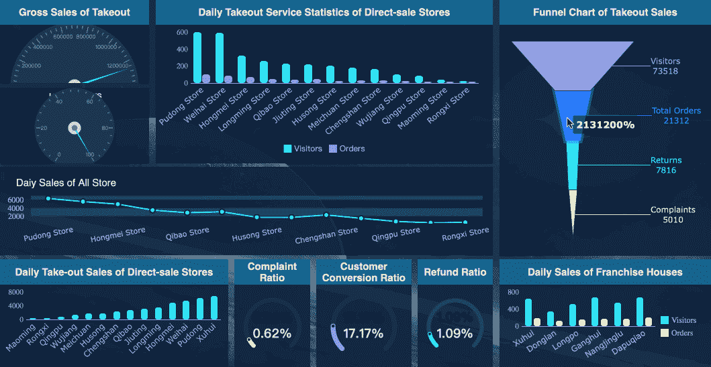
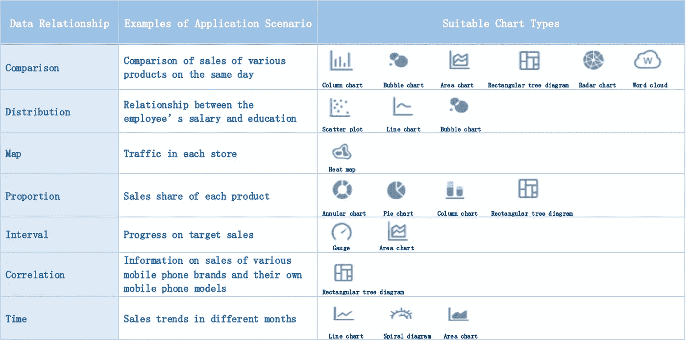

# KPI 仪表板完整指南

> 原文：<https://towardsdatascience.com/a-complete-guide-to-kpi-dashboard-1cf22484a6eb?source=collection_archive---------21----------------------->

# 1.为什么我们需要 KPI 仪表板？

你有没有开车时不看仪表盘，不检查油位、温度、速度表或任何指示器的经历？对一些人来说，他们甚至检查他们的轮胎、侧镜和危险灯。仅仅开车而不检查仪表板意味着你将自己暴露在更高的风险水平中。如果您的业务不使用 KPI 仪表板，情况也是如此。

就像驾驶汽车一样，管理企业也需要企业所有者了解他/她的关键数据，以便做出更好的商业决策。在不知道数据的情况下，仅仅根据情绪或他/她的直觉做出决定。

今天，让我们从简单的 KPI 仪表板开始，以便更好地了解您的业务。我相信您能够看到了解您的业务关键成果领域中的关键数据的好处。

# 2.KPI 仪表板的类型

KPI 仪表板有多种类型。一个公司几乎所有的岗位都有 KPI 要求。但是不同岗位的 KPI 规则不一样，无法统一管理。此时，KPI 仪表盘可以轻松解决管理困境，查看不同岗位的 KPI 完成情况。

以下是一些简单的例子:

**#营销:**

特定销售线索来源的销售线索数量

渠道合作伙伴数量

营销活动的数量

Marketing dashboard made with FineReport

**#销售:**

转化率

商业交易的价值

已登记销售额

Sales dashboard made with [FineReport](https://www.finereport.com/en/?utm_source=medium&utm_medium=media&utm_campaign=blog&utm_term=A%20Complete%20Guide%20to%20KPI%20Dashboard)

**#操作:**

交付的产品数量

交付产品的价值

退回/拒绝的产品数量

收到的投诉数量

KPI dashboard made with [Tableau](https://www.tableau.com/)

**#财经:**

每月开具的发票数量

每月开具发票的平均值

每月收到的付款额

每月支付的金额

Finance dashboard made with FineReport

**#HR:**

培训天数

休年假的次数

接受的 MC 数

HR dashboard made with FineReport

因此，在扩展到更详细、更大的业务范围之前，先从一个简单的 KPI 仪表板开始。它将帮助您更好地了解关键业务的运营。

# 3.制作 KPI 仪表板的技巧

为了制作 KPI 仪表板，您需要选择一个易于使用的数据可视化工具。每种工具都有其优点和缺点。你可以阅读这篇文章[***2019 年你不能错过的 9 款数据可视化工具***](/9-data-visualization-tools-that-you-cannot-miss-in-2019-3ff23222a927) 了解一下哪些工具适合你。

这里我以可视化工具 [**FineReport**](https://www.finereport.com/en/?utm_source=medium&utm_medium=media&utm_campaign=blog&utm_term=A%20Complete%20Guide%20to%20KPI%20Dashboard) 为例，向大家展示制作 KPI 仪表盘的基本步骤。FineReport 对没有技术基础的人比较友好。您可以通过简单的拖放操作创建各种图表。

*   首先，我们准备 KPI 的数据，并将其导入到 FineReport Designer 中。FineReport 可以连接各种数据库。

*   设计布局。布局的目的是合理呈现关键绩效指标和数据。有主次指标。一级指标反映的是核心业务，二级指标用于进一步细化，所以在设计布局时赋予了不同的权重。以下是常见布局的示例。

Made with [FineReport](https://www.finereport.com/en/?utm_source=medium&utm_medium=media&utm_campaign=blog&utm_term=A%20Complete%20Guide%20to%20KPI%20Dashboard)

*   使用条件格式和公式显示图标。FineReport 支持自定义公式来确定数据是否符合标准。例如，我们可以通过 KPI 公式计算每个员工的 KPI 值。大于规定值为优秀，否则为不合格。
*   选择[图表类型](https://www.finereport.com/en/data-visualization/top-16-types-of-chart-in-data-visualization.html?utm_source=medium&utm_medium=media&utm_campaign=blog&utm_term=A%20Complete%20Guide%20to%20KPI%20Dashboard)。关键指标确定后，我们需要确定指标的分析维度。我们常见的分析方法有类比、趋势、分布、构成等。不同的分析方法有不同的图表类型。

*   添加动态效果。动态效果使 KPI 仪表板更具吸引力。但是我们需要注意动态设计的比例，避免过多的动态。KPI 仪表板的常见动态效果如下。

Made with [FineReport](https://www.finereport.com/en/?utm_source=medium&utm_medium=media&utm_campaign=blog&utm_term=A%20Complete%20Guide%20to%20KPI%20Dashboard)

Made with FineReport

关于制作 KPI 仪表盘更详细的教程，可以参考本文 [*制作销售仪表盘的一步一步指南*](/a-step-by-step-guide-to-making-sales-dashboards-34c999cfc28b) 。

# **结论**

KPI dashboard 可以通过各种指标的可视化展示，帮助业务人员做出更好的决策。无论是流程管理还是指标查询，KPI 仪表盘都会大大提高效率，减少不必要的沟通时间。

# 您可能也会对…感兴趣

[*新手如何打造一个很棒的仪表盘？*](/how-can-beginners-create-a-great-dashboard-cf48c0f68cd5)

[*KPI 仪表板的前 7 种图表类型*](/top-7-chart-types-for-kpi-dashboards-287fb84a8874)

[*让你的数据报告脱颖而出的指南*](/a-guide-to-making-your-data-reporting-stand-out-cccd3b99e293)

[*2019 年 6 大数据分析工具*](/top-6-data-analytics-tools-in-2019-4df815ebf82c)

[*初学者财务报表分析指南*](/guide-to-financial-statement-analysis-for-beginners-835d551b8e29)