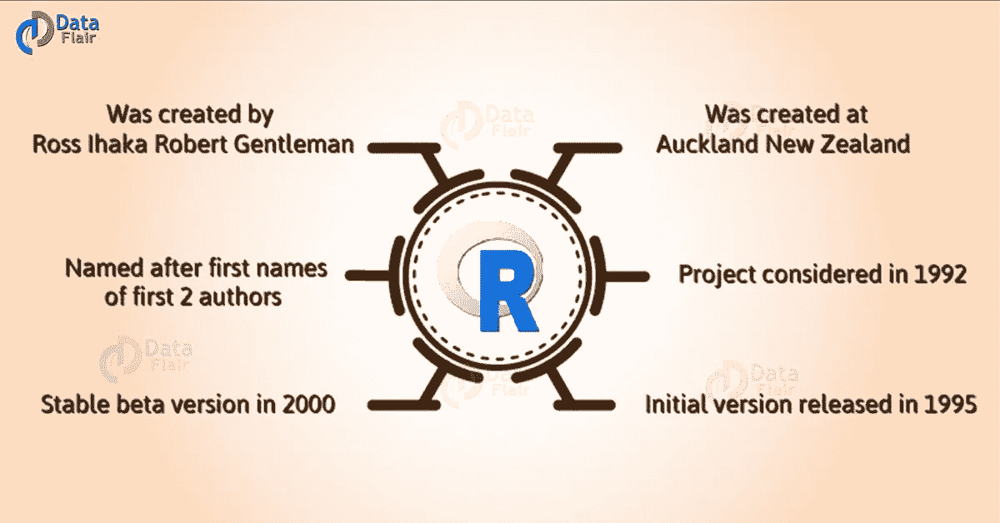
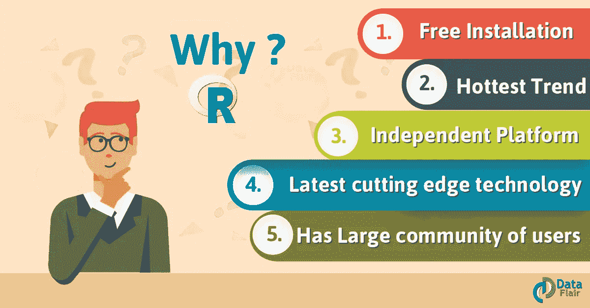
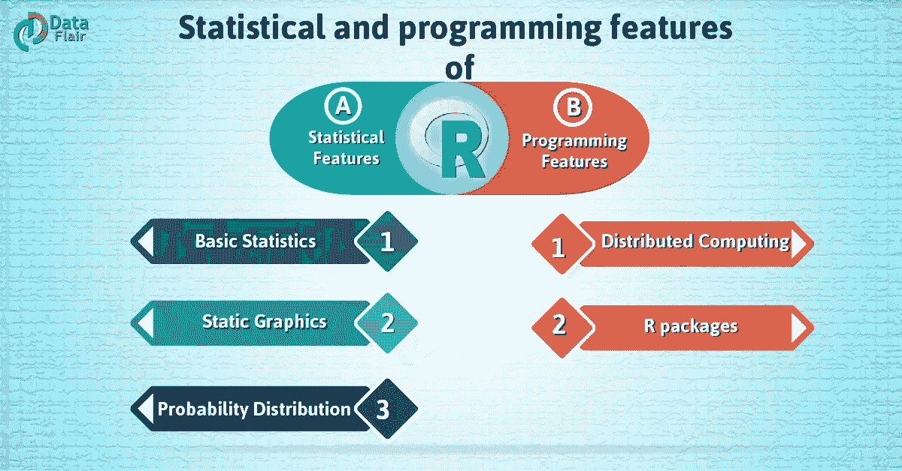
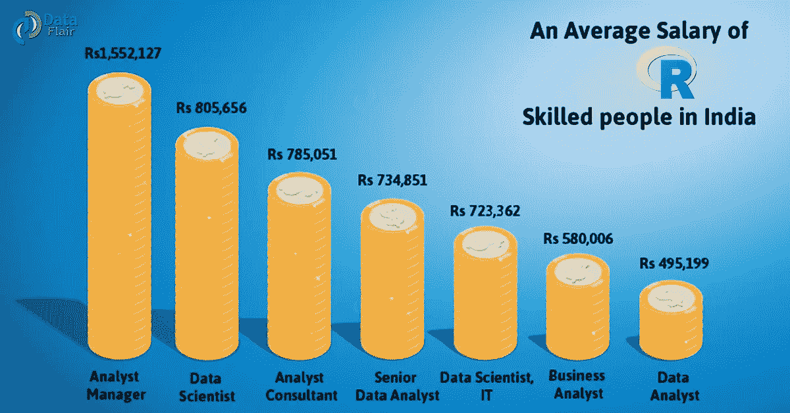
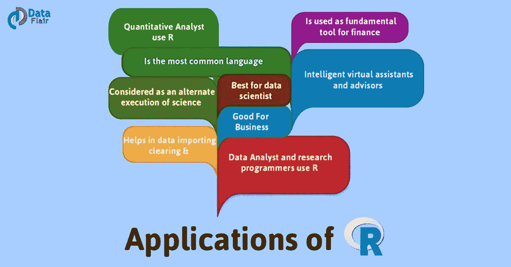
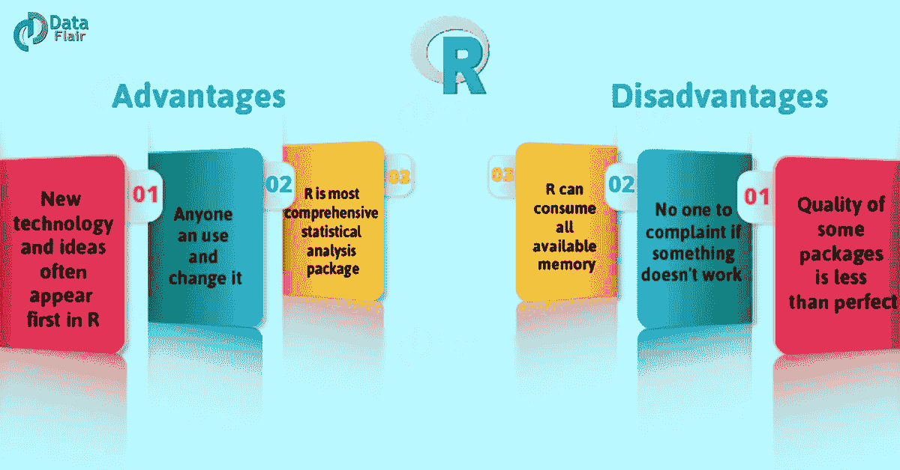

# 学习 R 的完全指南

> 原文：<https://towardsdatascience.com/a-complete-guide-to-learn-r-29e691c61d1?source=collection_archive---------6----------------------->

r 编程技术是一种开源编程语言。还有，R 编程语言是最新的尖端工具。r 基础是最热的趋势。此外，R 命令行界面(C.L.I)由一个提示符组成，通常是>字符。

# R 的历史

约翰·钱伯斯和他的同事在贝尔实验室开发了 R。基本上，R 编程语言是 S 编程语言的实现。还结合了受 Scheme 启发的词法范围语义。虽然，R 部分是以两位 R 编程语言作者的名字命名的。此外，该项目始于 1992 年，1995 年发布了初始版本，2000 年发布了稳定的测试版本。

# 安装 R 编程语言& R Studio

在本 R 教程中，我们将介绍 R 编程和 R Studio 的安装:

为了在你的系统上运行 R 编程语言和 R Studio，我们必须按照同样的顺序遵循三个基本步骤。

*   r 安装
*   R Studio 的安装
*   安装 R 包。

## a.如何安装 R 编程语言？

对于我们使用的操作系统，我们必须遵循以下步骤:

*   对于 Mac

首先，我们必须下载适当版本的。pkg 文件形成以下链接。

进一步，打开下载的。pkg 文件并安装 r。

*   对于 Linux

对于安装了 Apt-get 的 Ubuntu，在终端中执行 sudo apt-get install r-base。

*   对于 Windows

从下面的链接下载 R 的二进制安装文件。

打开下载的。exe 文件并安装 r。

## b.如何安装 R Studio？

为您的操作系统选择合适的安装程序文件。然后，下载并运行它来安装 R-studio。

## c.如何安装 R 包？

如果我们需要使用 R studio，我们需要安装一个特定的包。此外，请遵循以下说明:

润 R 工作室

然后，我们需要单击右下部分的 packages 选项卡。完成后，点击安装。因此，对话框将会出现。

在安装包对话框中，写下你要安装包的包名字段。然后单击安装。这将安装您搜索的软件包。要么根据您的包文本给出匹配包的列表。

这样，R Studio 的安装过程。

# 为什么要用 R 编程语言？

在这篇 R 教程中，以下几点描述了学习 R 编程的原因。

*   我们使用 R 编程作为[机器学习](https://data-flair.training/blogs/machine-learning-tutorial/)，统计和数据分析的主要工具。对象、函数和包很容易由 r .创建，因为它在任何地方都可以使用。此外，它是独立于平台和免费的。因此，任何人都可以在任何组织中安装它，而无需购买许可证。此外，它可以应用于所有操作系统。

*   r 编程语言不仅仅是一个统计包。另外，R 允许我们与其他语言(C，C++)集成。因此，您可以轻松地与许多数据源和统计包进行交互。因此，R 编程语言拥有一个庞大且不断增长的用户群体。

# r 代表商业

r 最适合商业，因为它是开源的。此外，它对[可视化](https://data-flair.training/blogs/data-visualization-in-r/)也很有帮助。此外，与早期的工具相比，R 编程语言有更多的功能。还有，公司正在使用 R 编程作为他们的平台，并招募训练有素的 R 用户。

# R 编程语言的特点

以下是一些 R 特性:

a.R 程序设计语言的统计特征

*   基本统计学:均值，方差，中位数。
*   静态图形:基本绘图，图形地图。
*   概率分布:贝塔，二项式。

b.R 的编程特点

*   分布式程序设计
*   r 包

# R 为什么受欢迎？

*   如今，R 编程语言被认为是世界上流行的分析工具。此外，一些用户的估计范围从 25 万到超过 200 万。
*   基本上，R 编程语言再次成为大多数调查的首选。因为 R 拥有比任何其他工具都多的博客、讨论组和电子邮件列表，包括 [SAS 编程](https://data-flair.training/blogs/sas-tutorial/)。

# R 编程语言中的工作角色

基本上，R 工作不仅仅是由 IT 公司提供的。尽管所有类型的公司都在高薪招聘 R 候选人，包括-

*   金融公司
*   零售组织
*   银行
*   医疗保健组织等。

基本上，正如我们所知，初创企业对研发工作有巨大的需求。此外，公司有几个不同职位的 R 职位空缺，如:

*   r 数据科学家
*   数据科学家(IT)
*   分析师经理
*   高级数据分析师
*   商业分析员
*   分析顾问

# 使用 R 编程语言的公司

r 已经成为全世界数据科学家和统计学家的首选工具。此外，为了预测产品的价格等，公司正在使用分析。下面列出了一些使用 R 的公司:

1.  TechCrunch
2.  谷歌
3.  脸谱网
4.  Genpact
5.  堆
6.  Orbitz
7.  ANZ
8.  《纽约时报》
9.  托马斯·库克
10.  埃森哲
11.  Wipro
12.  浏览器名
13.  诺华公司
14.  默克公司

***“R 慢慢赢得了很多大企业的心”。*** [顶级公司为什么用 R](https://data-flair.training/blogs/r-applications/)

# R 统计语言的工作机会

基本上，被行业重视的技能表现出缺乏理解。r 编程语言是一种工具，人可以在工具中训练。然而，在统计学、数据挖掘和数据分析等方面培训人才是困难的。所以印度的研发专家有非常好的工作机会。

# r 职业

很明显！r 是最好的选择，因为它的趋势如此之大。此外，R 编程语言正被各地的大公司和小公司所使用。它也用于非 It 领域、政府和非政府公司。

# R 编程的未来范围

未来的范围是非常光明的。因为 R 编程语言是当今的趋势。此外，对于那些不熟悉 R 编程语言的人来说，学习起来也很简单。

而且 R 编程最近的平均工资是最好的所以你可以想想以后会达到多高。

# R 工作的来源

您可以在以下工作门户网站查看各种 R 技术工作:

1.  naukri.com
2.  indeed.com
3.  商务化人际关系网

# r 应用

*   基本上，R 是最流行的语言。因此，许多数据分析师和研究程序员使用它。因此，R 被用作金融的基本工具。
*   基本上，R 被许多定量分析师用作其编程工具。因此，R 有助于数据导入和清理。
*   我们用 R 代表[数据科学](https://data-flair.training/blogs/future-of-data-science/)。它给了我们各种各样的统计数据。此外，R 提供了统计计算和设计的环境。R 认为这是 s 的另一种执行方式。

# R 的优点和缺点

# a.R 编程语言的优势

*   基本上，R 是最全面的统计分析包。因为新技术和新想法往往首先出现在研发领域。
*   基本上，R 编程语言是开源软件。因此任何人都可以使用和改变它。
*   因为 R 编程语言是开源的。因此，我们可以在任何地方、任何时间运行 R，甚至在许可的条件下出售它。
*   基本上 R 编程语言对于 GNU/Linux 和微软 Windows 都是不错的。另外，R 编程是跨平台的，可以在许多操作系统上运行。
*   在 R 中，任何人都可以提供错误修复、代码增强和新的包。

# b.R 编程语言的缺点

*   在 R 编程语言中，一些包的质量并不完美。
*   在 R 基本上，没有人抱怨如果一些东西不工作。
*   基本上，R 是许多人投入自己的时间开发的软件应用程序。
*   虽然，R 命令很少考虑内存管理。所以 R 编程语言会消耗所有可用内存。

# 最佳 R 书

以下是学习 R 编程语言的最佳书籍。

**a .加勒特·格罗勒蒙德的 R 编程手册**

一般来说，如果你是 R 的新手，那么这是最适合你的书。因为这本书的语言非常简单易懂，例子也很容易复制。

诺曼·马特洛夫的《R 编程的艺术》

基本上，这本书讲述了如何做软件开发。从基本类型和数据结构到高级主题。也不需要统计学知识。此外，你的编程技能可以从业余爱好者到专业人士。

**c . Trevor Hastie 和 Rob Tibshirani 编写的《统计学习及其在 R 中的应用》一书**

即使你没有 R 的知识，这本书也是最好的。因为它有助于从理论和实践上理解许多重要的课题。

比如——机器学习和统计技术。

**d . Mark P . j . van der Loo 为 R 统计计算学习 R studio**

基本上，这本书是为 R 开发人员和分析师设计的。此外，仅适用于那些希望使用 RStudio 功能进行 R 统计开发的人。因此，人们可以创建和管理统计分析项目，生成报告和图形。

妮娜·祖梅尔著《实用数据科学》

基本上，在本书中，作者只关注数据科学方法及其在现实世界中的应用。

哈德利·威克姆的《高级 R》

基本上，这本书是关于 R 语言是如何在三大分析工具之间创造差异的——R vs SAS vs SPSS。

**哈雷·威克姆的通用汽车包装**

基本上，这本书是为寻求编写自己的 R 包的高级 R 程序员而写的。因为作者已经写了关于 R 包的文档。此外，还解释了 R 包的组件，包括单元测试和简介。

希望你喜欢我们的解释。

# 结论

我希望这个博客能帮助你以一种非常先进的方式学习。此外，如果你对 R 教程有任何疑问，欢迎在评论区提问。