# 主成分分析完全指南—机器学习中的 PCA

> 原文：<https://towardsdatascience.com/a-complete-guide-to-principal-component-analysis-pca-in-machine-learning-664f34fc3e5a?source=collection_archive---------1----------------------->

## 使用 python 和示例逐步解释 PCA

主成分分析(PCA)是一种广泛用于大型数据集降维的技术。减少组件或特征的数量会损失一些准确性，另一方面，它会使大型数据集更简单，更容易探索和可视化。此外，它降低了模型的计算复杂度，使得机器学习算法运行更快。为了获得不太复杂和降维的数据集，牺牲了多少精度，这一直是一个问题，也是有争议的。我们对此没有固定的答案，但是在选择最终的组件时，我们会尽量保持最大的差异。

在本文中，我们将讨论使用 PCA 实现降维的一步一步的方法，然后我还将展示我们如何使用 python 库来实现这一切。

# PCA 中涉及的步骤

1.  将数据标准化。(均值=0，方差= 1)
2.  计算维度的协方差矩阵。
3.  从协方差矩阵中获得特征向量和特征值(我们也可以使用相关矩阵或者甚至单值分解，然而在这篇文章中我们将关注协方差矩阵)。
4.  对特征值进行降序排序，选择 k 个最大特征值对应的前 k 个特征向量(k 将成为新特征子空间的维数 k≤d，d 为原维数)。
5.  从选择的 k 个特征向量中构造投影矩阵 W。
6.  通过 W 变换原始数据集 X，得到新的 k 维特征子空间 y。

让我们导入一些需要的库和 Iris 数据集，我将用它们来详细解释每一点。

```
import pandas as pd 
import numpy as np 
import matplotlib.pyplot as plt 
from sklearn.decomposition import PCA 
from sklearn.preprocessing import standardScaler 
%matplotlib inlinedf = pd.read_csv( filepath_or_buffer='https://archive.ics.uci.edu/ml/machine-learning-databases/iris/iris.data', header=None, sep=',') df.columns=['sepal_len', 'sepal_wid', 'petal_len', 'petal_wid', 'class'] print(df.isnull().values.any()) df.dropna(how="all", inplace=True) # drops the empty line at file-end #if inplace = False then we have to assign back to dataframe as it is a copy #df = df.some_operation(inplace=False) #No need to assign back to dataframe when inplace = True #df.some_operation(inplace=True) #Print Last five rows. df.tail()
```

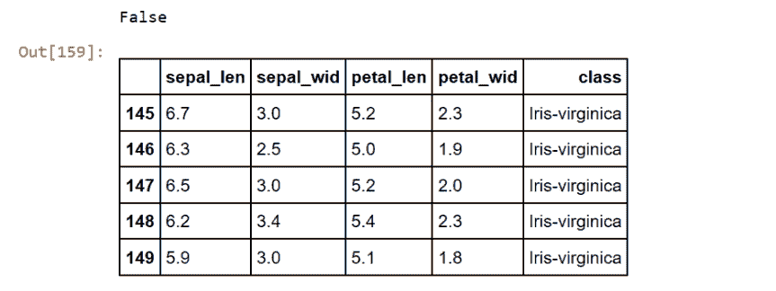

将 y 数组中的类列值和 X 数组变量中的独立特征的其余值分开，如下所示。

```
X = df.iloc[:,0:4].values 
y = df.iloc[:,4].values
```

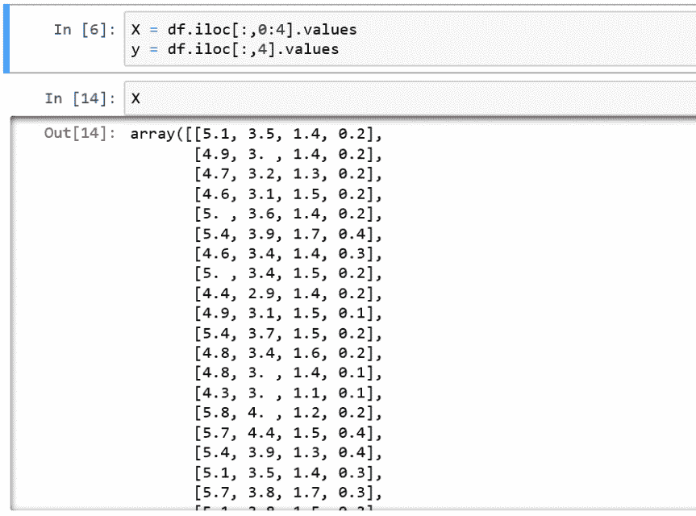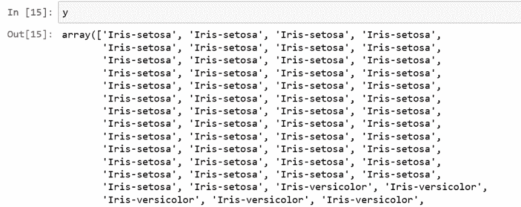

Iris 数据集现在以 150×4 矩阵的形式存储，其中列是不同的特征，每行代表一个单独的花样本。每个样本行 x 可以被描绘成一个四维向量，正如我们在上面 x 输出值的屏幕截图中看到的那样。

现在让我们详细了解每一点。

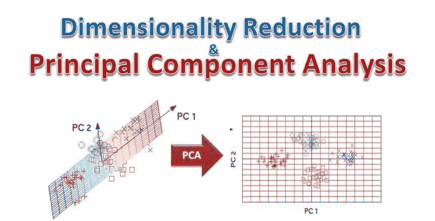

# 1.标准化

当有不同的尺度用于特征值的测量时，建议进行标准化，以使所有特征空间的均值= 0，方差= 1。

在执行 PCA 之前非常需要标准化的原因是 PCA 对方差非常敏感。也就是说，如果要素的等级(范围)之间存在较大差异，那么等级较大的要素将优于等级较小的要素。

例如，范围在 0 到 100 之间的特征将优先于范围在 0 到 1 之间的特征，这将导致有偏差的结果。因此，将数据转换到相同的比例可以避免这个问题。这就是我们使用标准化来获得平均值为 0、方差为 1 的特征的地方。

下面是计算要素标准化值的公式:

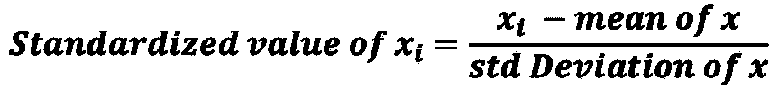

在本文中，我使用的是 Iris 数据集。尽管 Iris 数据集中的所有特征都是以厘米为单位进行测量的，但我仍然会继续将数据转换到单位尺度上(均值=0，方差=1)，这是许多机器学习算法实现最佳性能的一个要求。此外，它将帮助我们理解这个过程是如何工作的。

```
from sklearn.preprocessing import StandardScaler 
X_std = StandardScaler().fit_transform(X)
```

在下面的输出截图中，您可以看到所有的 X_std 值都在-1 到+1 的范围内进行了标准化。

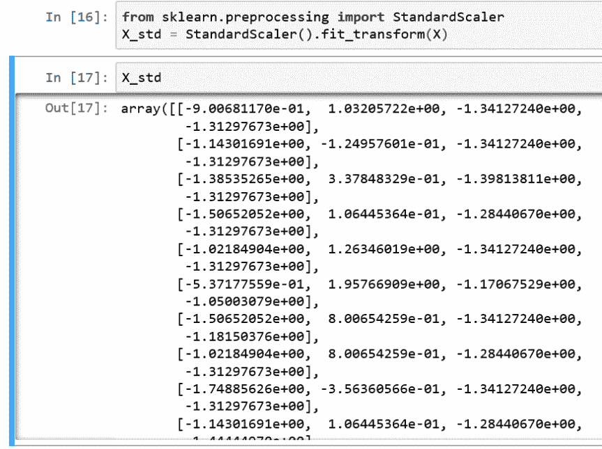

# 2.特征分解—计算特征向量和特征值

协方差(或相关)矩阵的特征向量和特征值代表 PCA 的“核心”:

*   特征向量(主分量)决定了新特征空间的方向，特征值决定了它们的大小。
*   换句话说，特征值解释了数据沿新特征轴的变化。这意味着相应的特征值告诉我们，新的变换特征中包含了多少方差。
*   为了得到特征值和特征向量，我们需要计算协方差矩阵。所以下一步我们来计算一下。

# 2.1 协方差矩阵

PCA 的经典方法是对协方差矩阵σ执行特征分解，它是一个 d×d 矩阵，其中每个元素表示两个特征之间的协方差。注意，d 是数据集的原始维数。在 Iris 数据集中，我们有 4 个特征，因此协方差矩阵的数量级为 4×4。

```
#mean_vec = np.mean(X_std, axis=0) 
#cov_mat = (X_std - mean_vec).T.dot((X_std - mean_vec)) / (X_std.shape[0]-1) 
#print('Covariance matrix \n%s' %cov_mat) 
print('Covariance matrix \n') 
cov_mat= np.cov(X_std, rowvar=False) 
cov_mat
```

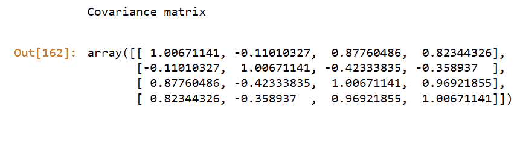

# 2.2 从协方差矩阵计算特征向量和特征值

在这里，如果我们知道线性代数的概念，以及如何计算矩阵的特征向量和特征值，那么这将对理解下面的概念非常有帮助。因此，通读线性代数的一些基本概念，以便更深入地理解一切是如何工作的，这是明智的。

这里，我使用 numpy 数组来计算标准化特征空间值的特征向量和特征值，如下所示:

```
cov_mat = np.cov(X_std.T) 
eig_vals, eig_vecs = np.linalg.eig(cov_mat) 
print('Eigenvectors \n%s' %eig_vecs) 
print('\nEigenvalues \n%s' %eig_vals)
```

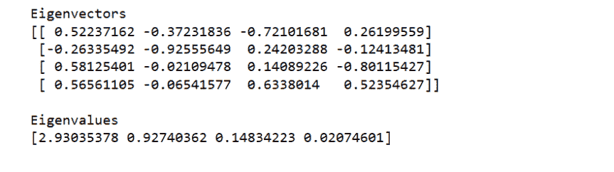

# 2.3 特征向量验证

我们知道，特征向量中每个值的平方和是 1。让我们看看它是否成立，这意味着我们已经正确计算了特征向量。

```
sq_eig=[] for i in eig_vecs: sq_eig.append(i**2) 
    print(sq_eig) 
sum(sq_eig) 
print("sum of squares of each values in an eigen vector is \n", 0.27287211+ 0.13862096+0.51986524+ 0.06864169) 
for ev in eig_vecs: np.testing.assert_array_almost_equal(1.0, np.linalg.norm(ev))
```

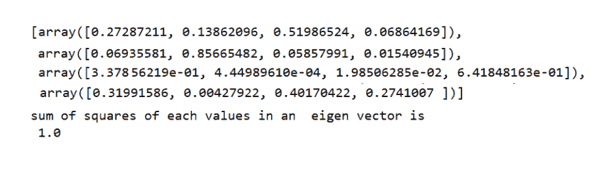

# 3.选择主成分

*   PCA 的典型目标是通过将原始特征空间投影到更小的子空间来降低原始特征空间的维数，其中特征向量将形成轴。
*   然而，特征向量仅定义新轴的方向，因为它们都具有相同的单位长度 1。

那么现在问题来了，如何选择新的一组主成分。背后的规则是，我们按降序对特征值进行排序，然后选择关于前 k 个特征值的前 k 个特征。

这里的想法是，通过选择前 k 个，我们决定对应于这 k 个特征空间的方差足以描述数据集。通过丢失那些未被选择的特征的剩余方差，不会损失太多的精度，或者我们可以因为忽略方差而损失太多的精度。

所以这是我们必须根据给定的问题集和商业案例做出的决定。没有完美的规则来决定它。

现在，让我们通过以下步骤找出主要组件:

# 3.1 特征值排序

为了决定在不丢失太多信息的情况下可以丢弃哪个(哪些)特征向量来构建低维子空间，我们需要检查相应的特征值:

*   具有最低特征值的特征向量承载关于数据分布的最少信息；那些是可以放弃的。
*   为此，通常的方法是从最高到最低排列特征值，以选择顶部的 k 个特征向量。

```
#Make a list of (eigenvalue, eigenvector) tuples 
eig_pairs = [(np.abs(eig_vals[i]), eig_vecs[:,i]) 
for i in range(len(eig_vals))] 
    print(type(eig_pairs)) 
#Sort the (eigenvalue, eigenvector) tuples from high to low eig_pairs.sort() 
eig_pairs.reverse() 
print("\n",eig_pairs) 
#Visually confirm that the list is correctly sorted by decreasing eigenvalues 
print('\n\n\nEigenvalues in descending order:') 
for i in eig_pairs: 
    print(i[0])
```

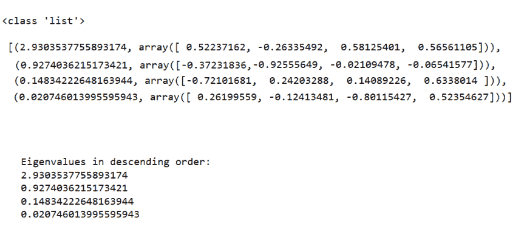

# 3.2 解释差异

*   对特征对排序后，下一个问题是“我们要为新的特征子空间选择多少个主成分？”
*   一个有用的度量是所谓的“解释方差”，它可以从特征值计算出来。
*   解释方差告诉我们有多少信息(方差)可以归因于每个主成分。

```
tot = sum(eig_vals) 
print("\n",tot) 
var_exp = [(i / tot)*100 for i in sorted(eig_vals, reverse=True)] print("\n\n1\. Variance Explained\n",var_exp) 
cum_var_exp = np.cumsum(var_exp) 
print("\n\n2\. Cumulative Variance Explained\n",cum_var_exp) print("\n\n3\. Percentage of variance the first two principal components each contain\n ",var_exp[0:2]) 
print("\n\n4\. Percentage of variance the first two principal components together contain\n",sum(var_exp[0:2]))
```

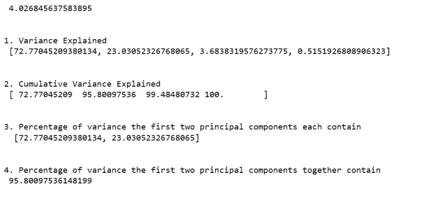

# 4.从选择的 k 个特征向量中构造投影矩阵 W

*   投影矩阵将被用于将虹膜数据变换到新的特征子空间上，或者我们说新变换的数据集具有降低的维度。
*   它是我们连接的前 k 个特征向量的矩阵。

这里，我们通过选择具有最高特征值的“前 2 个”特征向量来构造我们的 d×k 维特征向量矩阵 w，将 4 维特征空间减少到 2 维特征子空间

```
print(eig_pairs[0][1]) 
print(eig_pairs[1][1]) 
matrix_w = np.hstack((eig_pairs[0][1].reshape(4,1), eig_pairs[1][1].reshape(4,1))) 
#hstack: Stacks arrays in sequence horizontally (column wise). print('Matrix W:\n', matrix_w)
```

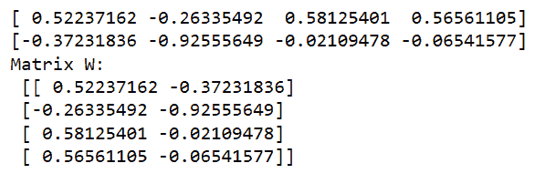

# 5.投影到新的特征空间

在最后一步中，我们将使用 4×2 维投影矩阵 W，通过公式 Y=X×W 将样本变换到新的子空间上，其中输出矩阵 Y 将是变换后样本的 150×2 矩阵。

```
Y = X_std.dot(matrix_w) 
principalDf = pd.DataFrame(data = Y , columns = ['principal component 1', 'principal component 2']) 
principalDf.head()
```

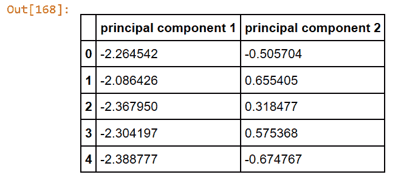

现在，让我们结合我们在文章开始时分离的目标类变量。

```
finalDf = pd.concat([principalDf,pd.DataFrame(y,columns = ['species'])], axis = 1) 
finalDf.head()
```

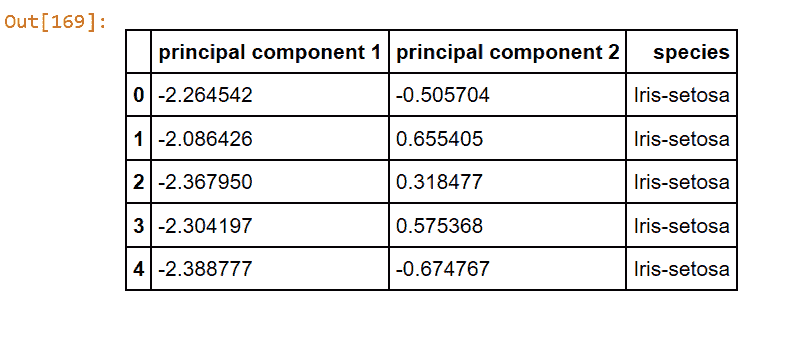

# 可视化 2D 投影

使用 PCA 投影到 2d 来可视化整个数据集。你应该用不同的颜色或形状画出不同的班级。班级之间应该很好地分开。

```
fig = plt.figure(figsize = (8,5)) 
ax = fig.add_subplot(1,1,1) 
ax.set_xlabel('Principal Component 1', fontsize = 15) ax.set_ylabel('Principal Component 2', fontsize = 15) ax.set_title('2 Component PCA', fontsize = 20) 
targets = ['Iris-setosa', 'Iris-versicolor', 'Iris-virginica'] colors = ['r', 'g', 'b'] 
for target, color in zip(targets,colors): 
    indicesToKeep = finalDf['species'] == target  ax.scatter(finalDf.loc[indicesToKeep, 'principal component 1'] , finalDf.loc[indicesToKeep, 'principal component 2'] , c = color , s = 50) ax.legend(targets) ax.grid()
```

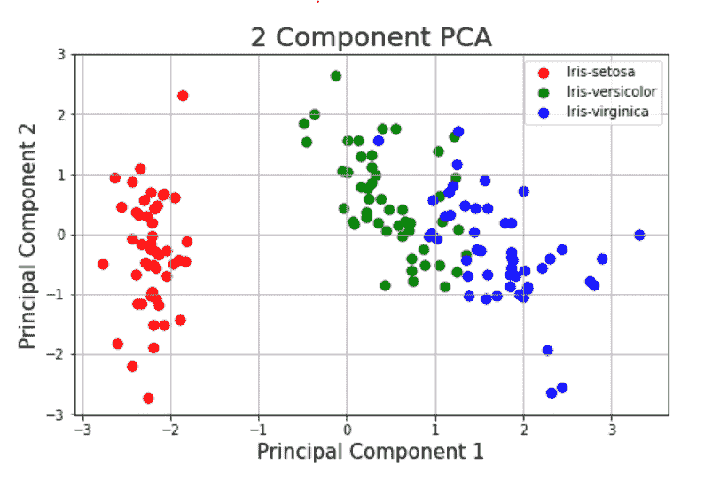

# 使用 Python 库直接计算主成分

或者，python 中有直接库，可以直接计算主成分，而不需要进行上述所有计算。上述步骤是为了让您了解一切是如何工作的。

```
pca = PCA(n_components=2) 
# Here we can also give the percentage as a paramter to the PCA function as pca = PCA(.95). .95 means that we want to include 95% of the variance. Hence PCA will return the no of components which describe 95% of the variance. However we know from above computation that 2 components are enough so we have passed the 2 components.principalComponents = pca.fit_transform(X_std) 
principalDf = pd.DataFrame(data = principalComponents , columns = ['principal component 1', 'principal component 2'])principalDf.head(5) # prints the top 5 rows
```

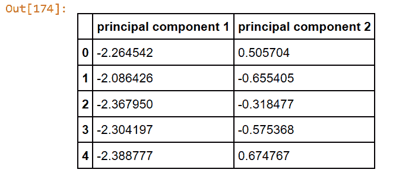

```
finalDf = pd.concat([principalDf, finalDf[['species']]], axis = 1) finalDf.head(5)
```

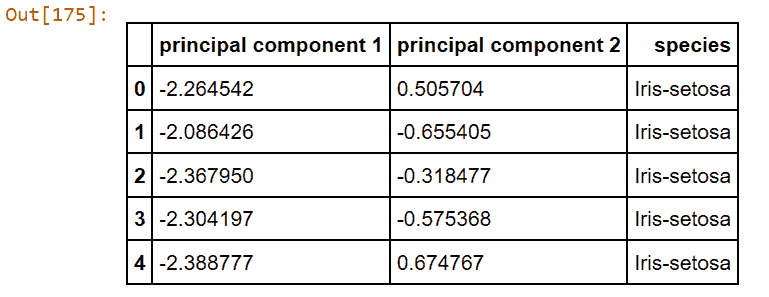

前两个主成分总共包含 95.80%的信息。第一主成分包含方差的 72.77%，第二主成分包含方差的 23.03%。第三和第四个主成分包含数据集方差的其余部分。

这就是主成分分析的全部内容。在我的下一篇帖子中，我将写 PCA 如何加速机器学习算法，并在有和没有 PCA 的情况下进行比较分析。

希望它已经让您很好地理解了 PCA 背后的概念。请在下面的评论区分享你的想法。您也可以使用[联系人](https://ashutoshtripathi.com/contact/)链接联系我。

*原载于 2019 年 7 月 11 日*[*【http://ashutoshtripathi.com】*](https://ashutoshtripathi.com/2019/07/11/a-complete-guide-to-principal-component-analysis-pca-in-machine-learning/)*。*