# 机器学习中决策树和 SVM 的完整视图

> 原文：<https://towardsdatascience.com/a-complete-view-of-decision-trees-and-svm-in-machine-learning-f9f3d19a337b?source=collection_archive---------8----------------------->

在机器学习中，基于树的技术和支持向量机(SVM)是建立预测模型的常用工具。给定它们的理论，决策树和 SVM 可以直观地理解为对不同的组(标签)进行分类。然而，它们肯定是解决回归问题的强大工具，然而许多人忽略了这一事实。因此，在这篇博文中，我试图解释这些概念，并通过回归问题的例子展示这些算法如何用于分类和回归问题。

# **基于树的方法**

基于树的方法已经成为许多行业中最受欢迎的技术，并有成功的预测案例。这些方法被认为是非参数化的，**对数据的分布和真实模型的结构不做任何假设**。它们需要较少的数据清理，并且在一定程度上不受离群值和多重共线性的影响。

最简单的方法是决策树，它可以用于**回归和分类问题**，并提供一个有用和简单的解释工具。

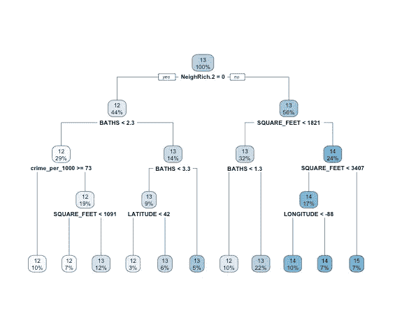

A simple decision tree to predict house prices in Chicago, IL

**分类树和回归树的根本区别在于目标变量的数据类型**。当我们的目标变量是一组离散的值时，我们有一个分类树。同时，回归树的目标变量是连续值。在分类问题中，我们的叶子是类别标签，而在回归问题中，我们的叶子是目标变量的连续值的箱。落入相同条柱的所有观测值具有相同的预测值。所以有人可能会想:这似乎不对，因为我们对每个观察值都有不同的值。这绝对没问题。即使使用线性回归方法，您也是在估计响应变量的预期平均值。您也可以将这种方法想象为 kNN 回归，将您的域划分为不同的区域，并拟合常数函数来逼近这些区域。理论上，你可以让你的树增长到有 *N* 个预测值箱(对于 *N* 个观察值)，但是你的模型会过度拟合数据(偏差-方差权衡)。因此，没有人会这样做。

在 R 中，函数会自动识别回归或分类问题。同时，您需要在流行的 Python sklearn 包中选择分类器或回归器。

**那么，我们如何种植一棵树呢？**假设我们的数据有 *p* 个输入和一个对每个 *N* 个观察值的响应。

**构建回归树:**

1.  考虑所有数据点，然后选择分裂变量 *j* 和分裂点 *s* 。
2.  根据 *j* 和 *s* 定义 R₁和 R₂两个地区。

3.求求解的分裂变量 *j* 和分裂点 *s*

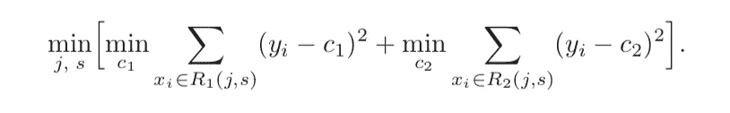

对于任何选择 *j* 和 *s* ，我们可以通过找到

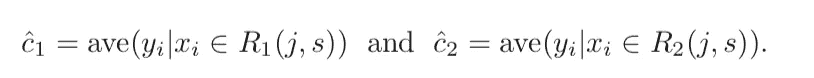

对于每一个分裂变量，都有可能找到最佳的一对( *j* ， *s* )。

4.找到最佳分割后，将数据分割成 2 个区域，并在这 2 个区域中的每个区域上重复分割过程。

5.对所有结果区域重复此过程。

显然，我们需要调整树的大小，以便使用我们的数据来控制模型的复杂性。一种简单的方法是仅当由于分裂而导致的平方和的减少超过某些阈值时才分裂树节点。然而，更好的策略是生长一棵大树，并在达到某个最小节点大小时停止分裂过程。使用*成本复杂度修剪*来修剪这棵大树。成本复杂性标准定义如下，其中 T ⊂ T₀是通过修剪大树 T₀.获得的任何树节点 *m* 表示区域 Rm，并且|T|是 T 中的终端节点的数量

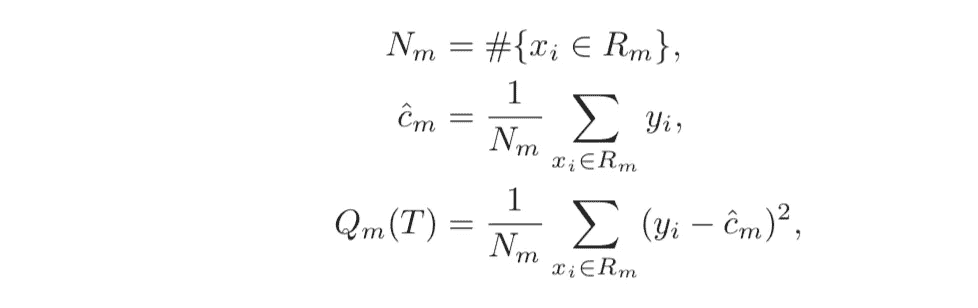

cost complexity criterion

**思路**:为每个α寻找子树 T，使成本复杂度最小化。α的大值→较小的树 t。

**构建分类树:**唯一不同的是分裂节点和修剪树的标准。这里，我们将节点 *m* 中的类别 *k* 观测值的比例定义如下。

然后我们可以将节点 *m* 中的观测值归类到类 *k* 中，这是节点 *m* 中的多数类(相当于 *𝝆mk* 的最大值)。可以使用不同的节点杂质度量 Qm(T ):

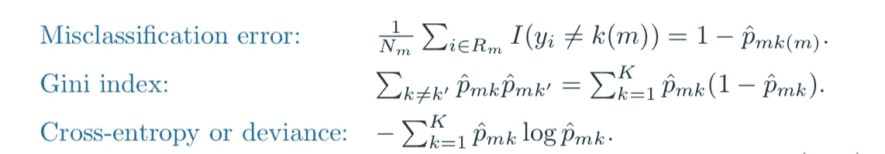

虽然所有三个衡量标准是相似的，交叉熵和基尼指数是可区分的，因此更容易进行数值优化。此外，这两种方法对节点概率的变化比误分类误差更敏感。因此，它们往往被用来种树。为了指导成本复杂性修剪，错误分类率是优选的。

然而，像决策树这样简单的模型往往没有很好的预测能力。更复杂的方法，如随机森林和 boosting，通常会产生更好的结果，尽管在可解释性和预测准确性之间存在权衡。

随机森林包括在自举训练集上建立许多决策树。构建决策树时，在每个考虑的分裂中，从全套 *p* 个预测值中随机选择 *m* 个预测值。分割只能使用那些 *m* 选择的预测器中的一个。这种打包方法很好地克服了在拆分中只选择几个强有力的候选人的问题。它消除了树的相关性，使平均树的结果更加稳定。

**XGBoost 代表极端梯度增强，实施梯度增强技术，但针对速度和性能进行了优化。**boosting 思想涉及到按顺序生长树，这意味着每棵树都是基于先前生长的树的信息构建的。然而，与传统的 boosting 方法相比，XGBoost 在更新树和残差时会在 boosting 方程中应用更多的惩罚，同时利用硬件结构来加快计算时间。因此，它被认为是所有基于树的模型中最好的模型。然而，这种解读更难捕捉。

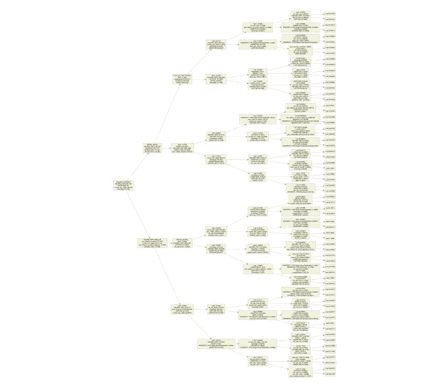

Project multiple trees of XGBoost model into one tree

# 支持向量机(SVM)

> SVM 的思想是通过在特征空间的大的变换版本中构造线性边界来找到非线性边界。

简单来说，你在一个 x-y 平面上有 2 个类别，它们的点相互重叠，你找不到一条直线可以完美地将它们分开。然而，当你旋转包含我们的数据的平面从不同的角度看时，你可能会发现一个可以将它们分开的超平面。例如，您可以在特征空间中再添加一个维度。

**建设 SVM 的关键:**

1.  我们定义我们的超平面为 Xβ = 0。
2.  我们可能需要转换我们的数据(例如基本展开)，并且转换通常使用**核函数。**我们可以用线性核、多项式核、径向基核或神经网络核来转化我们的问题。
3.  选择一个使平面和分类组之间的**余量**(距离) *M* 最大化的超平面。直观上，我们对远离分割线平面的点比对靠近分割线平面的点更有把握。通过最大化距离，我们还可以捕捉当在整个数据集中有接近平面的点而在训练集中没有时的情况。因此，我们最大化了正确分类的机会。
4.  由于完全分离的机会很低，我们需要一些“松弛”的边缘，允许一些点在边缘的错误一侧。我们将松弛变量定义为 **ξ**

5.然后修改约束条件:

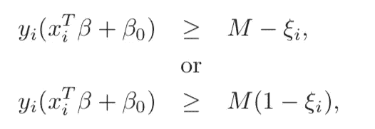

第一个选项以距边距的实际距离度量重叠，而第二个选项以相对距离度量重叠。第一个选择导致非凸优化问题，但第二个选择是凸优化问题。因此，我们倾向于使用第二种选择。第二个约束中的值ξ表示 Xβ的预测位于其边缘错误一侧的比例量。这个误分类容限的调整参数称为**“成本”参数 *C*** *。*较大的 C 值给出了较低的余量，显示了原始特征空间中过拟合的摆动边界。相反，C 的小值导致原始特征空间中更大的余量或更平滑的边界。

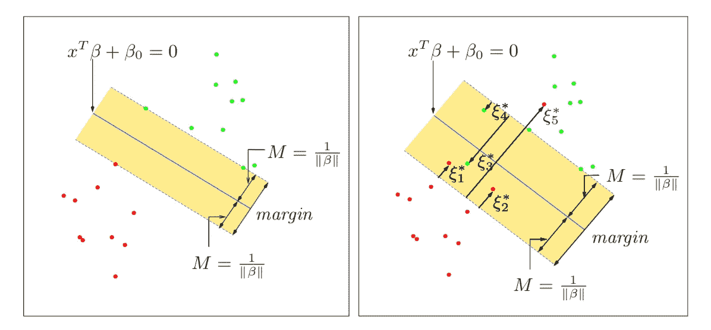

6.在 SVM 算法(R 或 Python)中需要指定的另一个参数是 **Gamma** 。它定义了单个训练示例可以在多大程度上影响分隔线的计算。低 Gamma 值意味着也可以考虑远处的点，而高 Gamma 值意味着只考虑可能分隔线附近的点。

SVM 还可以用于回归问题，称为**支持向量回归**。这种方法与 SVM 分类法非常相似，只是有一些细微的差别。在支持向量回归中，我们引入了一个新的术语，即“ **ϵ-insensitive** ”误差测度。定义如下，其中 *r* 为剩余值。

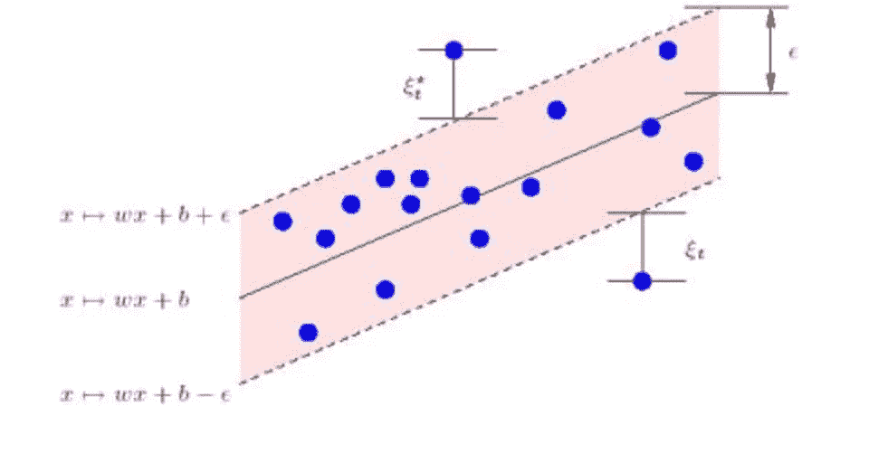

**我们在这里尝试做的是找到一个函数 f(x，ω),使得我们的大多数训练点都落在ϵ-insensitive 区域内。我们不在乎误差，只要它们小于ϵ.ϵ的值会影响用于构建回归函数的支持向量的数量。我们还有松弛变量ξ来衡量训练样本在ϵ-insensitive 区域之外的偏差，称为软边际。然后，问题被公式化为最小化函数:**

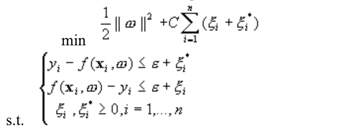

**那么哪个更好呢？**这是使用我的团队的[芝加哥房屋数据集](https://github.com/mathewjamesa/HousingPrice)运行不同模型的结果。

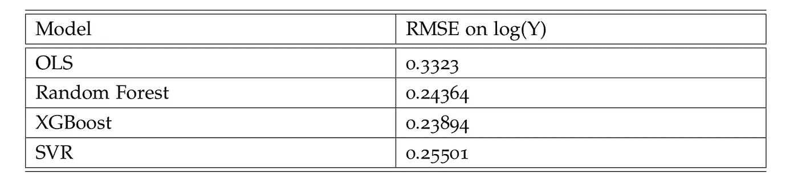

参考:

Hastie，Tibshirani，r .，& j . h . Friedman(2017 年)。统计学习的要素:数据挖掘、推理和预测。美国纽约州纽约市:斯普林格。

支持向量机回归。[http://kernelsvm.tripod.com/](http://kernelsvm.tripod.com/)