# 使用 Python 进行图像处理和计算机视觉的综合实用指南:第 1 部分(简介)

> 原文：<https://towardsdatascience.com/a-comprehensive-and-practical-guide-to-image-processing-and-computer-vision-using-python-part-1-4d8283c6d6eb?source=collection_archive---------7----------------------->

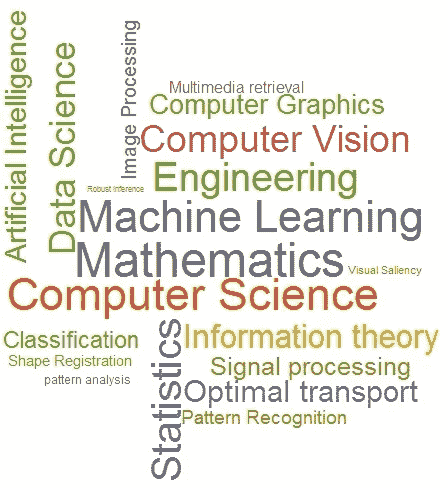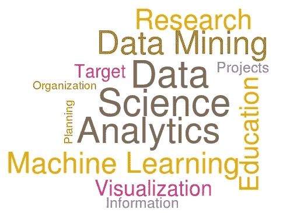

# 介绍

当今的世界是数据驱动的世界，图像是其中的重要组成部分。

> 每天都有超过 2.5 万亿字节的数据被创建，而且这个数字还会继续增长。据估计，到 2020 年，地球上每个人每秒将产生 170 万字节的数据。
> 
> ——【https://www.domo.com/solution/data-never-sleeps-6 

这些数据中大约 55–60%是图像/视频数据。但是，生成的数据是原始数据。这些数据必须经过预处理。根据需要，这些图像必须经过分析、处理和操作才能投入使用。所以来了，图片中的图像处理和计算机视觉。

完成本指南后，您将能够:-

*   基本的图像处理。
*   处理后的 I/O 图像和视频。
*   执行仿射、形态学、分段、霍夫变换等技术。
*   一些人脸检测和物体检测(Yayyyy！！\ (•◡•) / )
*   还有更多…

# 先决条件

T 他的这篇文章是我的一点微薄之力，希望通过一种实用的或动手的方法让人们对这些领域感兴趣。我们所需要的是 Python 和 OpenCV 安装(进一步讨论)在您的本地台式机/笔记本电脑或您在云上运行的 VM 实例上！！

*   如果你是 Linux 或 Mac 用户，不要担心你的 machine(Hushhhhh(~˘▾˘)~).上已经有 Python 了但是如果你是 Windows 用户，在这里从[下载 Python。在安装过程中，不要忘记在$PATH 中添加 Python。](http://python.org/downloads/release/python-380/)

*这篇文章是针对那些已经很好地掌握了 Python，但可能仍然从图像处理和 OpenCV* 开始的人。

## 关于 OpenCV 的一点信息

penCV(开源计算机视觉)是一个广泛用于计算机视觉和机器学习任务的库。OpenCV 最初的实现是在 C++中。与 C/C++相比，Python 速度较慢，但另一方面，它可以很容易地用这些语言进行扩展。这个特性允许我们用 C++创建计算密集型代码，但用 Python 创建包装器，这样它们就可以作为 Python 模块使用。 [OpenCV-Python](https://opencv-python-tutroals.readthedocs.io/en/latest/py_tutorials/py_setup/py_intro/py_intro.html#opencv-python) 是 OpenCV 的 Python 实现。这个库是[跨平台的](https://en.wikipedia.org/wiki/Cross-platform_software)，可以在开源 [BSD 许可](https://en.wikipedia.org/wiki/BSD_licenses)下使用。OpenCV 支持多种编程语言、操作系统和硬件。Python，Java，MATLAB/Octave 都有绑定。从 3.4 版本开始， [OpenCV.js](https://docs.opencv.org/3.4/d5/d10/tutorial_js_root.html) 就是 OpenCV 库的 JavaScript 绑定。

另外，OpenCV 需要一些先决条件，如 [NumPy](https://numpy.org/) 和 [Matplotlib](https://matplotlib.org/) ，通过使用以下命令安装它们:

```
python -m pip install --user numpy scipy matplotlib ipython jupyter pandas sympy nose
```

对于 Linux 用户来说，这肯定是可行的:

```
sudo pip3 install opencv-python
```

更多说明[此处](https://pypi.org/project/opencv-python/)。

抱歉，我没有 Mac(⌣̩̩́_⌣̩̩̀)并且讨厌在 Windows(︶︿︶).使用 Python

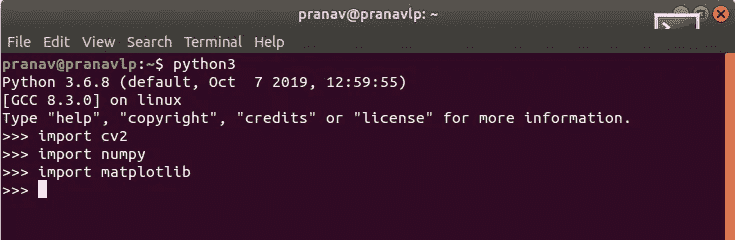

如果导入时没有错误，那么就可以开始了。准备好了吗？让我们从深水区潜水吧！

# 什么是图像处理或计算机视觉，它做什么？

图像处理(通常称为数字图像处理)和计算机视觉是计算机科学中有大量算法处理图像或视频以获取某种信息的领域。图像处理处理图像到图像的转换，即处理的输入和输出都是图像，而计算机视觉是一个跨学科领域，处理如何使计算机理解或从数字图像或视频中获得高层次的见解或信息。下面的地图可以直观地理解上面所说的内容！

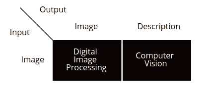

图像处理算法接收图像或视频作为输入，对其进行处理，处理的结果仍然是图像或视频。但是，计算机视觉算法接收图像或视频，对其进行处理，并从中构建明确而有意义的描述。

# 什么是图像？

> 图像可以定义为二维函数， *f(x，y)* ，其中 *x* 和 *y* 为空间(平面)坐标，任意一对坐标 *(x，y)* 处的 *f* 的幅值称为图像在该点的亮度或灰度。当(x，y)和 f 的振幅都是有限的离散值时，我们称该图像为数字图像。

> 拉斐尔·冈萨雷斯和理查德·伍兹

# 什么是视频？

视频的基本定义就是沿着时间轴堆叠的图像。视频可以通过纵横比、帧速率、隔行扫描与逐行扫描、颜色模型、压缩方法等来表征。

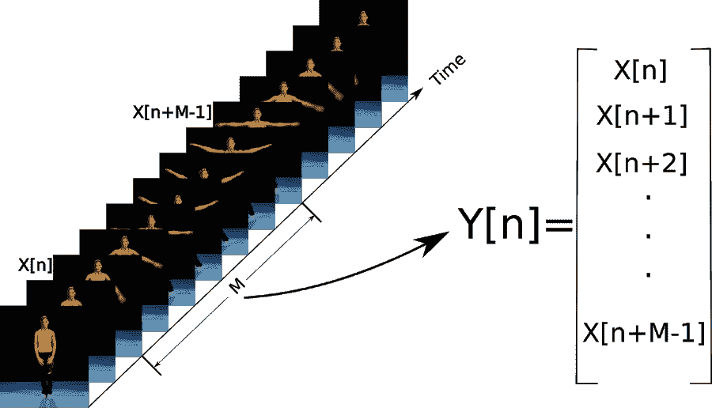

Courtesy of [http://www.ctralie.com/Research/SlidingWindowVideo-SOCG2016/slidingvideo.html](http://www.ctralie.com/Research/SlidingWindowVideo-SOCG2016/slidingvideo.html)

考虑到视频 M 的切片，X[n]是第一帧，X[n+M-1]是最后一帧，Y[n]是将所有这些叠加起来形成整个视频的切片(部分)的向量。

# 图像处理和输入输出

O penCV 支持很多图像和视频格式的 I/O，首先让我们了解一下视频分析的几个范例。就像今天的相机记录一样，记录(视频)归结为以 30-60 FPS(每秒帧数)显示的帧，其中帧是图像。因此，图像处理和视频分析在很大程度上使用相同的方法

对于`cv2.imread()`，支持以下格式:

*   Windows 位图— *。bmp，*。将饵在水面轻轻地上下拉动
*   JPEG 文件— *。jpeg，*。jpg，*。jpe
*   JPEG 2000 文件— *.jp2
*   便携式网络显卡— *。png
*   便携式图像格式-*。pbm，*。pgm，*。百万分率
*   太阳栅格— *。高级，*。肾素血管紧张素系统
*   TIFF 文件— *。tiff，*。标签图像文件格式。

对于`cv2.VideoCapture()`，AVI 文件——*。avi 格式得到了全面的支持，因为 AVI 似乎是唯一一种具有良好的跨平台支持的格式。更多信息请参见此处的。

以下是 OpenCV 中图像和视频 I/O 的一些示例:

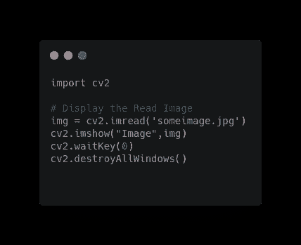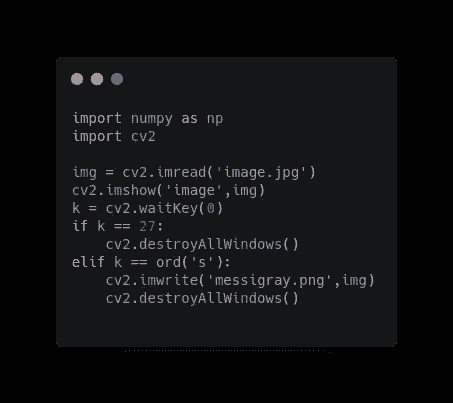

(Left)Code for reading & displaying the read image. (Right) Close the displayed image on a keypress

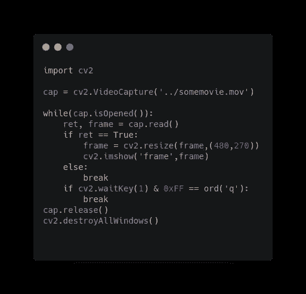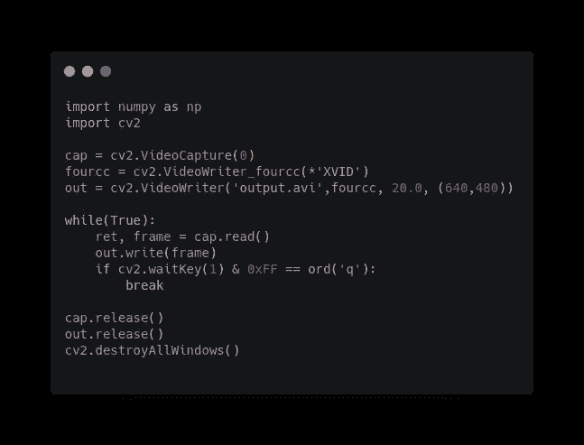

(Left) Load an existing video and play it. (Right) Record a video from your webcam and save to the disk after you press ‘q’

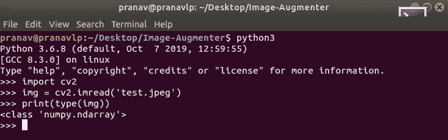

上面可以看到，图像的类型是 Numpy 的' [ndarray](https://docs.scipy.org/doc/numpy/reference/generated/numpy.ndarray.html) '(n 维数组)，下面我们来看看一些图像操作(数组操作)和一些没有使用 OpenCV 的核心模块。

## 1.获取基本的图像属性

```
import cv2img = cv2.imread('test1.jpeg')print("The properties of the image are:")
print("Shape:" + str(img.shape))
print("Total no. of pixels:" + str(img.size))
print("Data type of image:" + str(img.dtype))
```

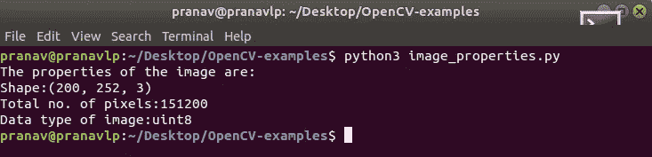

Output for the code above.

## 2.访问和修改图像像素

访问单个像素的灰度/强度:

```
import cv2
import numpy as npm =  cv2.imread("test1.jpeg")height,width,depth = np.shape(m)y = 1 # y coordinate(across height)
x = 1 # x coordinate(across width)print("Value at (1, 1, 0) = " + str(m[y][x][0])) # This will print the pixel value at given coordinates at depth zero(blue)print("Value at (1, 1, 1) = " + str(m[y][x][1])) # This will print the pixel value at given coordinates at depth one(green)print("Value at (1, 1, 2) = " + str(m[y][x][2])) # This will print the pixel value at given coordinates at depth two(red)
```

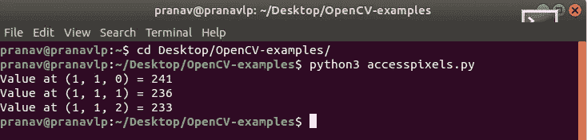

Output for the above code

要简单地迭代图像中的所有像素，我们可以使用:

```
import cv2
import numpy as npm =  cv2.imread("test1.jpeg")height, width, depth= np.shape(m)# iterate over the entire image.
for y in range(0, height):
    for x in range(0, width):
        print(m[y][x])
```

看，这会在你的终端里打印出很多数字！！

要修改像素值:

```
import cv2
import numpy as npm =  cv2.imread("test1.jpeg")height, width ,depth = np.shape(m)for py in range(0, height):
    for px in range(0, width):
        m[py][px][0] = 0cv2.imshow('matrix', m)
cv2.imwrite('output2.png', m)
cv2.waitKey(0)
cv2.destroyAllWindows()
```


(Left) Original image. Others are manipulated by making all pixels of certain channels = 0.

## 3.分割图像通道

通常， **RGB** 图像有一个 **24 位**‘色深’数据，即三个 **8 位**通道的 **RGB** 数据。这些通道只不过是蓝色、绿色和红色，强度等级从 0 到 255。可以使用`cv2.split()`在 OpenCV 中分割图像，但是这种方法计算量很大，因此我们选择使用 Numpy 索引，因为它更有效，如果可能的话应该使用。

使用`cv2.split()`方法进行分割非常简单:

```
b,g,r = cv2.split(img) 
```

> 在 OpenCV 中，通道**的**顺序**是** **BGR** 而**不是** **RGB** 。

使用索引拆分:

```
import cv2
import numpy as npm =  cv2.imread("test1.jpeg")blue = m[:, :, 0]
green = m[:, :, 1]
red = m[:, :, 2]
```

要了解更多的索引和拼接，请参考[本](https://stackoverflow.com/questions/509211/understanding-slice-notation)。

在本文的下一部分，我们将在 OpenCV 中用相关的代码介绍图像处理技术。

本教程中使用的所有代码都可以在下面的资源库中找到。

[](https://github.com/pranav6670/OpenCV-examples/tree/master/Part%201) [## pranav 6670/OpenCV-示例

### 中等物品的 OpenCV 代码。

github.com](https://github.com/pranav6670/OpenCV-examples/tree/master/Part%201)