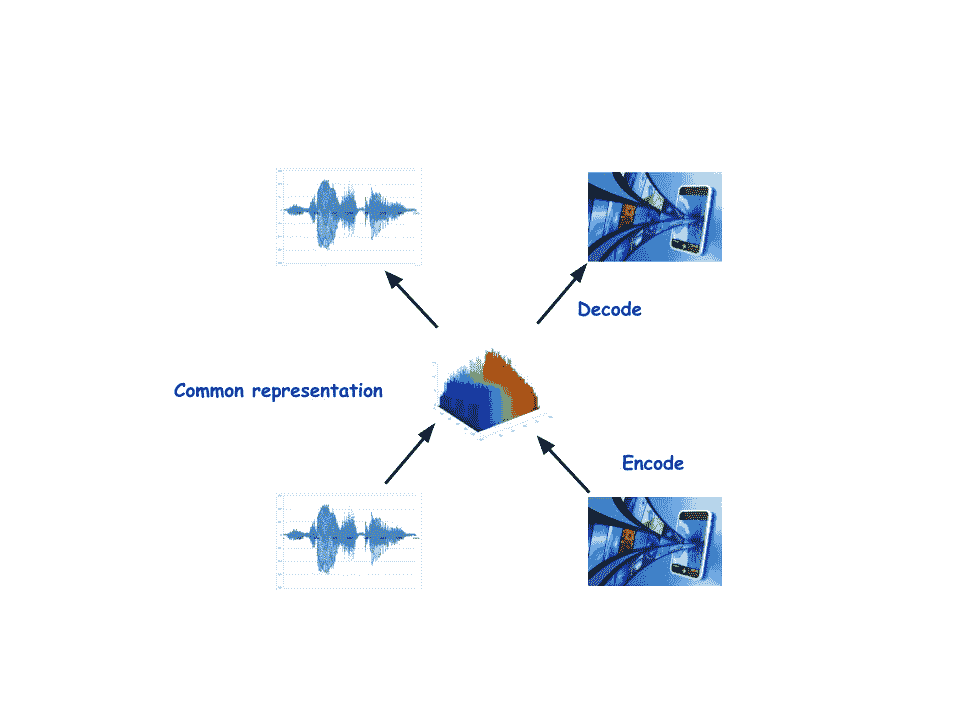
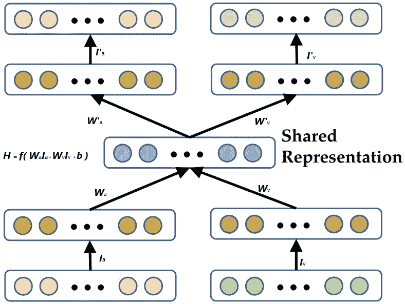
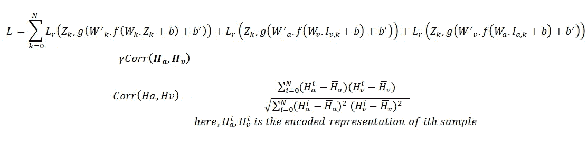

# Keras 相关神经网络综合指南

> 原文：<https://towardsdatascience.com/a-comprehensive-guide-to-correlational-neural-network-with-keras-3f7886028e4a?source=collection_archive---------13----------------------->

## 从理论到实施

(本博客的改进在 [**这里**](https://theaiacademy.blogspot.com/2020/05/a-comprehensive-guide-to-correlational.html) **)**

人类和许多其他动物一样有五种基本感觉:*视觉、听觉、味觉、嗅觉和触觉*。我们还有额外的感觉，比如平衡感和加速度感，时间感等等。人类大脑每时每刻都在处理来自所有这些来源的信息，每一种感官都影响着我们的决策过程。在任何交谈中，嘴唇的运动、面部表情以及声带发出的声音都有助于我们完全理解说话者所说的话的含义。我们甚至可以只通过看嘴唇的运动而不发出任何声音来理解单词。这种视觉信息不仅是补充性的，而且是必要的。这首先在**麦克古克效应**(麦古克&麦克唐纳，1976)中得到例证，其中带有有声 **/ba/** 的视觉 **/ga/** 被大多数受试者感知为 **/da/** 。由于我们希望我们的机器学习模型达到人类水平的性能，因此也有必要使它们能够使用来自各种来源的数据。

在机器学习中，来自不同异构源的这些类型的数据被称为多模态数据。例如用于语音识别的音频和视频信息。很难在训练中直接使用这些多模态数据，因为它们可能具有不同的维度和数据类型。如此多的注意力放在学习这些多模态数据的通用表示上。学习这种多视图数据的通用表示将有助于一些下游应用程序。例如，学习视频及其音频的通用表示可以帮助为该视频生成比仅使用音频生成更准确的字幕。但是你如何学习这种常见的表示法呢？



**An abstract view of CorrNet. It tires to learn a common representation of both views of data and tries to reconstruct both the view from that encoded representation.**

相关神经网络是学习常见表示的方法之一。其架构几乎与传统的单视图深度自动编码器相同。但是它为每种数据形式包含一个编码器-解码器对。

让我们考虑一个两视图输入，**Z =【Ia，Iv】**，其中 **Ia** 和 **Iv** 是音频和视频等数据的两个不同视图。在下图中，显示了一个包含这些数据的 CorrNet 的简单架构。



Example of CorrNet with bimodal data **Z = [Ia, Iv]** where Ia and Iv are two different views of data like (audio and video )

其中编码器和解码器都是单层的。 ***H*** 是编码表示。***H***a***= f(W***a***)。I***a***+b)***是编码表示 Ia。 ***f()*** 是任意非线性(sigmoid，tanh 等。).同样的情况还有***Hv***=***f(W***a***。I*** a ***+b)。****双峰数据的常见表示法 **Z** 给出为:*

***H =*f(**W*a*。I* a + *Wv。Iv + b)。****

*在解码器部分，模型试图通过***I ' a***=***g(*W ' a . H+b’*)***和***I ' v = g(*W ' VH+b’*)*从普通表示 **H** 中重构输入***

*在训练期间，基于三个损失计算梯度:*

*I)最小化自重构误差，即最小化从***Ia* ***Iv*** 从 ***Iv*** 重构***Ia***Ia*Ia***和*Iv*的误差。*

*ii)最小化交叉重建误差，即最小化从**Ia**到 **Iv** 和从 **Ia** 到 **Iv** 的重建误差。*

*iii)最大化两个视图的隐藏表示之间的相关性，即最大化 **Ha** 和 **Hv** 之间的相关性。*

*总损耗可以写成*

**

*这里， **Lr()** 表示重建损失，可以是“**均方误差”**或“**平均绝对误差”。我们的目标是尽量减少这种损失。当我们想要增加相关性时，从损耗中减去相关性，即相关性越高，损耗越低。***

## *履行*

*整个实现可以分为三个部分:模型建立、设置损失函数和训练。*

*在模型构建阶段，我们必须创建自动编码架构。首先，我们必须包含所有必需的包。*

```
*from **keras** import  **Model**
from **keras.layers import  Input,Dense,concatenate,Add**
from **keras** import backend as **K,activationsfrom tensorflow** 
import **Tensor** as Tfrom **keras.engine.topology** 
import **Layer**
import numpy as **np*** 
```

*然后我们必须创建 CorrNet 架构。为简单起见，它有一个单层的编码器和解码器。*

```
*class **ZeroPadding**(Layer):
     def **__init__**(self, **kwargs):
          super(ZeroPadding, self).__init__(**kwargs) def **call**(self, x, mask=None):
          return K.zeros_like(x) 

     def **get_output_shape_for**(self, input_shape):
          return input_shape#inputDimx,inputDimy are the dimentions two input modalities. And #hdim_deep is the dimentions of shared representation( *kept as #global veriable*) inpx = **Input**(**shape**=(inputDimx,))               
inpy = **Input**(**shape**=(inputDimx,)) 
***#Encoder***                
hl = **Dense**(hdim_deep,**activation**='relu')(inpx)                              hr = **Dense**(hdim_deep,**activation**='relu')(inpy)                             h =  Add()([hl,hr]) ***#Common representation/Encoded representation******#decoder***recx = **Dense**(inputDimx,activation='relu')(h)                                         recy = **Dense**(inputDimy,activation='relu')(h)**CorrNet** = **Model**( [inpx,inpy],[recx,recy,h])

**CorrNet**.summary()'''we have to create a separate model for training this **CorrNet**
As during training we have to take gradient from 3 different loss function and which can not be obtained from signle input.If you look closely to the loss function, we will see it has different input parameter'''[recx0,recy0,h1] = **CorrNet**( [inpx, inpy])
[recx1,recy1,h1] = **CorrNet**( [inpx, ZeroPadding()(inpy)])[recx2,recy2,h2] = **CorrNet**( [ZeroPadding()(inpx), inpy ])                
H= **concatenate**([h1,h2]) 
**model** = Model( [inpx,inpy],[recx0,recx1,recx2,recy0,recy1,recy2,H])*
```

*现在我们必须为我们的模型写出相关损失函数。*

```
***Lambda** = 0.01
#by convention error function need to have two argument, but in #correlation loss we do not need any argument. Loss is computed #competely based on correlation of two hidden representation. For #this a '**fake**' argument is used.def ***correlationLoss***(*fake*,H):
  y1 = H[:,:hdim_deep]
  y2 = H[:,hdim_deep:]
  y1_mean = K.mean(y1, axis=0)
  y1_centered = y1 - y1_mean
  y2_mean = K.mean(y2, axis=0)
  y2_centered = y2 - y2_mean
  corr_nr = K.sum(y1_centered * y2_centered, axis=0) 
  corr_dr1 = K.sqrt(K.sum(y1_centered * y1_centered, axis=0) + 1e-8)
  corr_dr2 = K.sqrt(K.sum(y2_centered * y2_centered, axis=0) + 1e-8)
  corr_dr = corr_dr1 * corr_dr2
  corr = corr_nr / corr_dr 
  **return** K.sum(corr) * Lambda
def ***square_loss***(y_true, y_pred):
  error = ls.mean_squared_error(y_true,y_pred)
  **return** error*
```

*现在我们必须编译模型并进行训练*

```
*model.**compile**(**loss**=[*square_loss,square_loss,square_loss,  square_loss,square_loss,square_loss,correlationLoss*],**optimizer**="adam")
model.**summary**()
'''
Suppose you have already prepared your data and kept one moadlity data in Ia(e.g. Audio) and another in Iv( e.g. Video).To be used by this model Audios and videos must be converted into 1D tensor.
'''model.**fit**([Ia,Iv],[Ia,Ia,Ia,Iv,Iv,Iv,*np.ones((Ia.shape[0],Ia.shape[1]))*],nb_epoch=100)'''
***np.ones((Ia.shape[0],Ia.shape[1]))*** is fake tensor that will be   passed to ***correlationLoss*** function but will have no use
'''
using this model we can generate Ia to Iv.For example, from video Iv we can generate corresponding audio Ia
np.zeros(Ia.shape) gives tensors of 0 of dimestions same as output tensor ***audio***  ''' 
**audio**,_,_ = **CorrNet.**predict([np.zeros(Ia.shape),Iv])*
```

*经过训练后，该模型学习到的公共表示可以用于不同的预测任务。例如，使用 CorrNet 学习的常见表示可以用于:跨语言文档分类或音译等价检测。各种研究发现，使用公共表示可以提高性能。它也可以用于数据生成。例如，在某个数据集中，您有 10000 个音频剪辑和相应的视频，5000 个音频剪辑和 5000 个视频。在这种情况下，我们可以用 10000 个音频和视频训练一个 CorrNet，并可以用来为音频生成缺失的视频，反之亦然。*