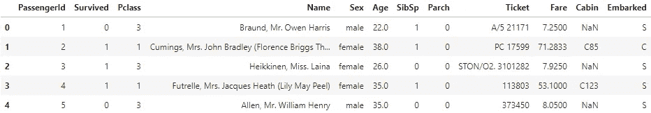
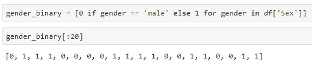
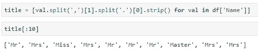
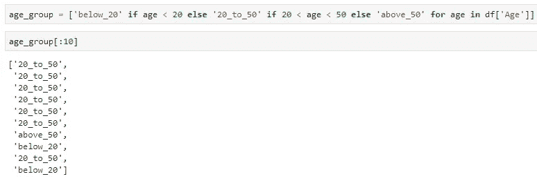

# 列表理解综合指南

> 原文：<https://towardsdatascience.com/a-comprehensive-guide-to-list-comprehensions-f15bae4fd0c3?source=collection_archive---------22----------------------->

老实说，你的特征工程技能可能没有达到你想要的水平，你不知道该怎么办。很长一段时间(*比我愿意承认的时间*长)以来，我一直在使用分散在多行上的各种**熊猫**操作，只是为了执行简单的操作——比如将一列的一部分提取到另一列中——而实际上大多数事情可以在一行代码中完成。

Photo by [Marius Niveri](https://unsplash.com/@m4r1vs?utm_source=medium&utm_medium=referral) on [Unsplash](https://unsplash.com?utm_source=medium&utm_medium=referral)

**列举理解**就是这样做的一种方式。如果我想卖给你一些东西，现在是时候告诉你它们是如何简单和直观，它们是(*在花了几天时间与它们晃来晃去*)但对于初学者来说，它们可能看起来令人生畏。

本文将尝试用尽可能简单的语言解释列表理解，并展示它们在数据科学中的用例。现在我废话连篇也没什么意思了，让我们直入主题吧。

# 介绍泰坦尼克号数据集

我敢肯定，你知道著名的**泰坦尼克号**数据集，并可能使用它之前的某个时候。即使你还没有，也没什么好担心的，只要从[这个 URL](https://raw.githubusercontent.com/datasciencedojo/datasets/master/titanic.csv) 下载，然后用 Python 导入就可以了。这是你应该有的:

***牛逼。***

先说简单的。

# 用例 1:将“性别”转换为 0 和 1

这可能是列表理解的最简单的用例。这个想法就是你要做如下的转换:

*   *公* - > 0
*   *女* - > 1

现在尝试在没有列表理解的情况下这样做。我知道这并不困难，但是看看这个漂亮的一行程序:

现在干净了。但是这很可能不是你阅读这篇文章的原因——你想看更高级的东西。

# 用例 2:从“名称”列提取标题

现在，这个稍微高级一点。你看到 ***名称*** 栏了吗？注意它是如何在第一个逗号后加上这个标题(*像先生、小姐等*)并在点号后结束的？

提取起来很简单。首先，你在逗号处分开字符串，并抓取右边的所有内容，然后在点处分开，并抓取左边的所有内容:

***爽。我知道，但是你可以更进一步。让我们看看怎么做。***

# 用例 3:将“年龄”分成 3 组

直到最近我才知道在一个列表理解中可以使用多个 *if* 语句。你可以这样做，但是你越深入，你的代码最终看起来就越乱。

想法是将 ***年龄*** 列分成 3 组:

*下面 _20* - >年龄< 20

*20 _ 到 _50* - > 20 <年龄< 50

*以上 _50* - >年龄> 50

这可以在一行代码中完成。让我们看看如何:

首先你在做两组(*低于 _20 和 20 _ 到 _50* )，然后再把第二组进一步分成两组(*20 _ 到 _50 和高于 _50* )。这个特殊的例子并不复杂，但是如果您试图在这个列表理解中添加另一个 if 语句，就会变得混乱。

# 在你离开之前

列表理解很棒，这是毋庸置疑的。作为数据科学家，您应该尽可能地利用它们，用更少的代码行完成更多的工作。

获取一些数据集，并尝试在清理和准备过程中加以利用。你永远不会回头。

我想听听你的看法，你是如何在一行代码中实现复杂的逻辑的？让我知道。

*喜欢这篇文章吗？成为* [*中等会员*](https://medium.com/@radecicdario/membership) *继续无限制学习。如果你使用下面的链接，我会收到你的一部分会员费，不需要你额外付费。*

 [## 通过我的推荐链接加入 Medium-Dario rade ci

### 作为一个媒体会员，你的会员费的一部分会给你阅读的作家，你可以完全接触到每一个故事…

medium.com](https://medium.com/@radecicdario/membership)