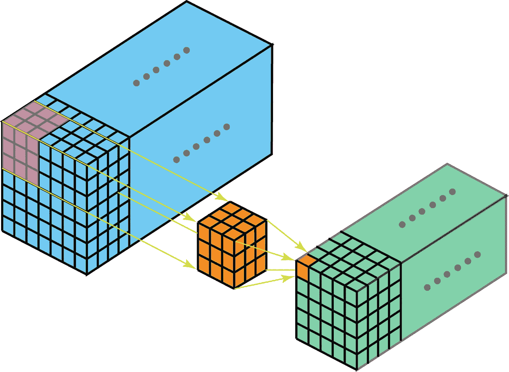
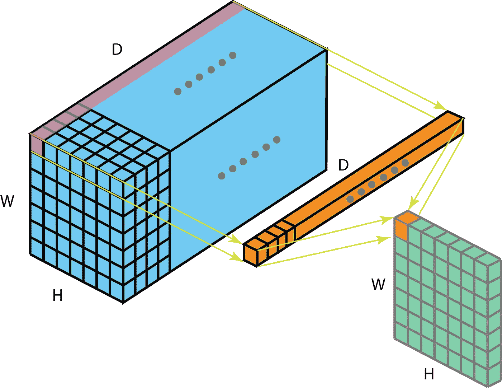
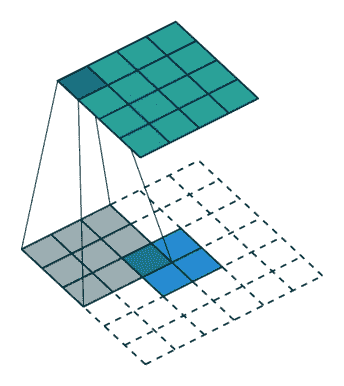
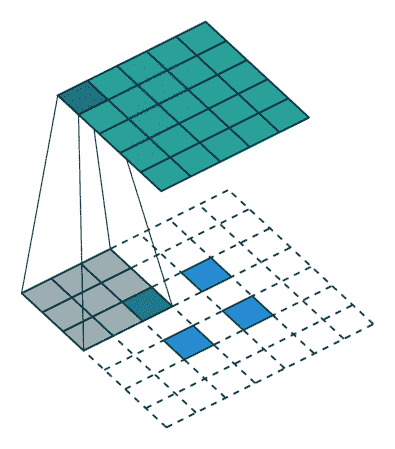
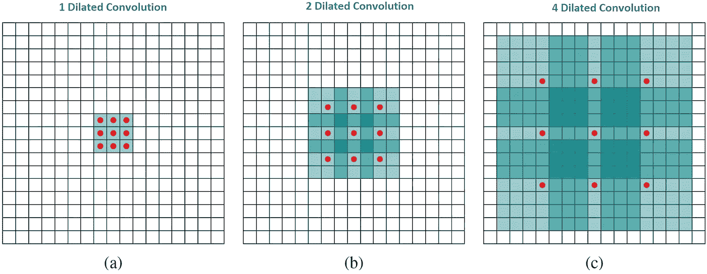
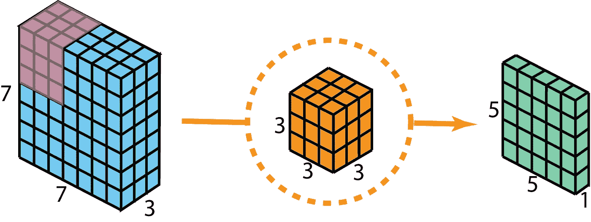
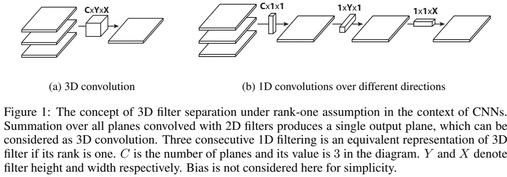

# 深度学习中不同类型卷积的综合介绍

> 原文：<https://towardsdatascience.com/a-comprehensive-introduction-to-different-types-of-convolutions-in-deep-learning-669281e58215?source=collection_archive---------2----------------------->

## 通过可视化实现对卷积的直观理解

如果你听说过深度学习中不同类型的卷积(例如，2D / 3D / 1x1 /转置/扩张(阿特鲁)/空间可分/深度可分/展平/分组/洗牌分组卷积)，并对它们的实际含义感到困惑，本文旨在帮助你理解它们实际上是如何工作的。

在这篇文章中，我总结了深度学习中常用的几种卷积类型，并尝试以每个人都可以理解的方式解释它们。除了这篇文章，还有其他人关于这个主题的几篇好文章。请检查它们(在参考中列出)。

希望这篇文章能帮助你建立直觉，并为你的学习/研究提供有用的参考。请随时留下评论和建议。谢谢，请享用！:)

这篇文章的内容包括:

1.  卷积与互相关
2.  深度学习中的卷积(单通道版本，多通道版本)
3.  3D 卷积
4.  1 x 1 卷积
5.  卷积运算
6.  转置卷积(去卷积、棋盘伪影)
7.  扩张卷积(阿特鲁卷积)
8.  可分离卷积(空间可分离卷积，深度方向卷积)
9.  平坦卷积
10.  分组卷积
11.  混洗分组卷积
12.  逐点分组卷积

# **1。卷积与互相关**

卷积是信号处理、图像处理和其他工程/科学领域中广泛使用的技术。在深度学习中，一种模型架构——卷积神经网络(CNN)就是以这种技术命名的。但是深度学习中的卷积本质上是信号/图像处理中的互相关。这两种操作有细微的区别。

无需深究细节，区别就在这里。在信号/图像处理中，卷积被定义为:

它被定义为两个函数的乘积在一个被反转和移位后的积分。下面的可视化演示了这个想法。

Convolution in signal processing. The filter g is reversed, and then slides along the horizontal axis. For every position, we calculate the area of the intersection between f and reversed g. The intersection area is the convolution value at that specific position. Image is adopted and edited from this [link](http://fourier.eng.hmc.edu/e161/lectures/convolution/index.html).

这里，函数 g 是滤波器。它是反过来的，然后沿着横轴滑动。对于每一个位置，我们计算 *f* 和反转的 *g* 之间的相交面积。该相交面积就是该特定位置的卷积值。

另一方面，互相关被称为两个函数的滑动点积或滑动内积。互相关中的滤波器不反转。直接滑过函数 f， *f* 和 *g* 的交集面积就是互相关。下图展示了相关性和互相关性之间的差异。

Difference between convolution and cross-correlation in signal processing. Image is adopted and edited from [Wikipedia](https://en.wikipedia.org/wiki/Convolution).

在深度学习中，卷积中的过滤器是不可逆的。严格来说是互相关。我们本质上执行元素级的乘法和加法。但在深度学习中只称之为卷积是约定俗成的。这很好，因为滤波器的权重是在训练期间学习的。如果上例中的反函数 g 是正确的函数，则在训练后，学习到的滤波器将看起来像反函数 g。因此，不需要像在真实卷积中那样在训练前首先反转滤波器。

# 2.深度学习中的卷积

做卷积的目的是从输入中提取有用的特征。在图像处理中，有很多种不同的滤波器可供卷积选择。每种类型的滤波器都有助于从输入图像中提取不同的方面或特征，例如水平/垂直/对角边缘。类似地，在卷积神经网络中，*使用滤波器通过卷积提取不同的特征，滤波器的权重在训练期间自动学习*。所有这些提取的特征然后被“组合”以做出决定。

做卷积有几个优点，比如权重共享和平移不变性。卷积还考虑了像素的空间关系。这些可能非常有帮助，尤其是在许多计算机视觉任务中，因为这些任务通常涉及识别某些组件与其他组件具有特定空间关系的对象(例如，狗的身体通常链接到头部、四条腿和尾巴)。

## 2.1.卷积:单通道版本

**Convolution for a single channel. Image is adopted from this** [**link**](/intuitively-understanding-convolutions-for-deep-learning-1f6f42faee1)**.**

在深度学习中，卷积是元素级的乘法和加法。对于只有一个通道的图像，卷积如下图所示。这里的滤波器是一个 3 x 3 矩阵，元素为[[0，1，2]，[2，2，0]，[0，1，2]]。滤波器滑过输入端。在每一个位置，它都在做元素级的乘法和加法。每个滑动位置以一个数字结束。最终输出是一个 3×3 的矩阵。(请注意，在此示例中，步幅= 1，填充= 0。这些概念将在下面的算术一节中描述。

## 2.2.卷积:多通道版本

在许多应用中，我们处理的是多通道图像。一个典型的例子是 RGB 图像。每个 RGB 通道强调原始图像的不同方面，如下图所示。

Different channels emphasize different aspects of the raw image. The image was taken at Yuanyang, Yunnan, China.

多通道数据的另一个例子是卷积神经网络中的层。卷积网络层通常由多个信道组成(通常有数百个信道)。每个通道描述前一层的不同方面。我们如何在不同深度的层之间进行过渡？我们如何将一个深度为 *n* 的图层转换为下一个深度为 *m* 的图层？

在描述这个过程之前，我们想澄清几个术语:层、通道、特征图、过滤器和内核。从层次的角度来看，层和过滤器的概念在同一层次，通道和内核在下面一个层次。频道和功能图是一回事。一个图层可以有多个通道(或要素地图):如果输入是 RGB 图像，则输入图层有 3 个通道。“通道”通常用于描述“层”的结构。类似地，“内核”用于描述“过滤器”的结构。

Difference between “layer” (“filter”) and “channel” (“kernel”).

过滤器和内核之间的区别有点棘手。有时，它们可以互换使用，这可能会造成混淆。从本质上讲，这两个术语有微妙的区别。“内核”指的是权重的 2D 阵列。术语“过滤器”是指堆叠在一起的多个内核的 3D 结构。对于 2D 滤波器，滤波器与内核相同。但是对于 3D 过滤器和深度学习中的大多数卷积来说，过滤器是内核的集合。每个内核都是独一无二的，强调输入通道的不同方面。

有了这些概念，多声道卷积如下。每个核被应用到前一层的输入通道上，以生成一个输出通道。这是一个基于内核的过程。我们对所有内核重复这样的过程，以生成多个通道。然后，这些通道相加在一起，形成一个单一的输出通道。下面的插图将使这个过程更加清晰。

这里的输入层是一个 5×5×3 的矩阵，有 3 个通道。该滤波器是一个 3×3×3 的矩阵。首先，滤波器中的每个内核分别应用于输入层的三个通道。执行三次卷积，得到大小为 3×3 的 3 个通道。

The first step of 2D convolution for multi-channels: each of the kernels in the filter are applied to three channels in the input layer, separately. The image is adopted from this [link](/intuitively-understanding-convolutions-for-deep-learning-1f6f42faee1).

然后将这三个通道相加(逐元素相加)形成一个单通道(3×3×1)。该通道是使用过滤器(3 x 3 x 3 矩阵)对输入层(5 x 5 x 3 矩阵)进行卷积的结果。

The second step of 2D convolution for multi-channels: then these three channels are summed together (element-wise addition) to form one single channel. The image is adopted from this [link](/intuitively-understanding-convolutions-for-deep-learning-1f6f42faee1).

等效地，我们可以认为这个过程是通过输入层滑动 3D 过滤器矩阵。请注意，输入层和过滤器具有相同的深度(通道号=内核号)。*3D 过滤器仅在图像的两个方向上移动，高度&宽度(这就是为什么这种操作被称为 2D 卷积，尽管 3D 过滤器被用于处理 3D 体积数据)。*在每个滑动位置，我们执行逐元素的乘法和加法，得到一个数字。在下面所示的示例中，在水平方向的 5 个位置和垂直方向的 5 个位置执行滑动。总的来说，我们得到一个单一的输出通道。

Another way to think about 2D convolution: thinking of the process as sliding a 3D filter matrix through the input layer. Notice that the input layer and the filter have the same depth (channel number = kernel number). *The 3D filter moves only in 2-direction, height & width of the image (That’s why such operation is called as 2D convolution although a 3D filter is used to process 3D volumetric data). The output is a one-layer matrix.*

现在我们可以看到如何在不同深度的层之间进行过渡。假设输入层有 *Din* 通道，我们希望输出层有 *Dout* 通道。我们需要做的只是将 *Dout* 滤镜应用到输入层。每个过滤器都有 *Din* 内核。每个滤波器提供一个输出通道。应用 *Dout* 滤波器后，我们有了 *Dout* 通道，然后它们可以堆叠在一起形成输出层。

Standard 2D convolution. Mapping one layer with depth *Din* to another layer with depth *Dout, by using Dout filters*.

# 3.3D 卷积

在上一节的最后一幅图中，我们看到我们实际上是在对 3D 体积执行卷积。但通常情况下，我们仍然把这种操作称为深度学习中的 2D 卷积。*这是对 3D 体积数据的 2D 卷积。过滤器深度与输入层深度相同。3D 滤镜仅在 2 个方向上移动(图像的高度&宽度)。这种操作的输出是 2D 图像(只有一个通道)。*

自然有 3D 卷积。它们是 2D 卷积的推广。*在 3D 卷积中，滤波器深度小于输入层深度(内核尺寸<通道尺寸)。因此，3D 滤镜可以在所有 3 个方向(图像的高度、宽度和通道)上移动*。在每个位置，逐元素的乘法和加法提供一个数。由于过滤器在 3D 空间中滑动，*输出数字也在 3D 空间中排列。然后，输出是 3D 数据。*

*In 3D convolution, a 3D filter can move in all 3-direction (height, width, channel of the image)*. At each position, the element-wise multiplication and addition provide one number. Since the filter slides through a 3D space, the *output numbers are arranged in a 3D space as well. The output is then a 3D data.*

类似于编码 2D 域中对象的空间关系的 2D 卷积，3D 卷积可以描述 3D 空间中对象的空间关系。这种 3D 关系对于一些应用是重要的，例如在生物医学成像的 3D 分割/重建中，例如 CT 和 MRI，其中诸如血管的对象在 3D 空间中蜿蜒。

# 4.1 x 1 卷积

由于我们在前面的 3D 卷积部分讨论了深度操作，让我们看看另一个有趣的操作，1 x 1 卷积。

你可能想知道为什么这很有帮助。我们是否只是将一个数乘以输入层中的每个数？是也不是。对于只有一个通道的层来说，这个操作很简单。在那里，我们将每个元素乘以一个数。

如果输入层有多个通道，事情就变得有趣了。下图说明了 1 x 1 卷积如何适用于尺寸为 H x W x D 的输入图层。使用 1 x 1 x D 的过滤器进行 1 x 1 卷积后，输出通道的尺寸为 H x W x 1。如果我们应用 N 个这样的 1×1 卷积，然后将结果连接在一起，我们可以得到一个尺寸为 H×W×N 的输出层。

1 x 1 convolution, where the filter size is 1 x 1 x D.

最初，1×1 卷积是在网络中的网络[论文](https://arxiv.org/abs/1312.4400)中提出的。随后，它们在谷歌盗梦空间[的论文](https://arxiv.org/abs/1409.4842) [中被大量使用。](https://arxiv.org/abs/1409.4842).)1 x 1 卷积的几个优点是:

*   有效计算的降维
*   高效的低维嵌入或特征池
*   卷积后再次应用非线性

上图中可以观察到前两个优势。在 1×1 卷积之后，我们显著地减少了深度方向的维度。假设原始输入有 200 个通道，1×1 卷积会将这些通道(特征)嵌入到单个通道中。第三个优点是在 1×1 卷积之后，可以添加诸如 ReLU 的非线性激活。非线性允许网络学习更复杂的函数。

这些优势在谷歌的初始[文件](https://arxiv.org/abs/1409.4842)中被描述为:

> “上述模块的一个大问题是，至少在这种天真的形式中，在具有大量滤波器的卷积层上，即使是适度数量的 5×5 卷积也可能非常昂贵。
> 
> 这导致了所提出的架构的第二个想法:在计算需求增加太多的地方明智地应用维度缩减和投影。这是基于嵌入的成功:即使低维嵌入也可能包含大量关于相对大的图像块的信息…也就是说，在昂贵的 3×3 和 5×5 卷积之前，使用 1×1 卷积来计算缩减。除了用作还原，它们还包括整流线性激活的使用，这使它们具有双重用途。"

关于 1 x 1 卷积的一个有趣的观点来自 Yann LeCun,“在卷积网中，没有“全连接层”这样的东西。只有具有 1x1 卷积核和完整连接表的卷积层。”

# 5.卷积运算

我们现在知道如何处理卷积中的深度。让我们继续讨论如何处理其他两个方向(高度和宽度)的卷积，以及重要的卷积运算。

以下是一些术语:

*   内核大小:上一节讨论了内核。内核大小定义了卷积的视场。
*   Stride:它定义了在图像中滑动时内核的步长。Stride 为 1 意味着内核逐个像素地滑过图像。步幅为 2 意味着内核通过每步移动 2 个像素(即跳过 1 个像素)来滑过图像。我们可以使用步幅(> = 2)对图像进行下采样。
*   填充:填充定义了如何处理图像的边框。填充卷积(Tensorflow 中的“相同”填充)将通过在输入边界周围填充 0(如有必要)来保持空间输出维度等于输入图像。另一方面，无填充卷积(Tensorflow 中的“有效”填充)只对输入图像的像素执行卷积，而不在输入边界周围添加 0。输出尺寸小于输入尺寸。

下图描述了一个 2D 卷积，使用的核大小为 3，步长为 1，填充为 1。

有一篇关于详细算术的优秀文章([深度学习卷积算术指南](https://arxiv.org/abs/1603.07285))[。](https://arxiv.org/abs/1603.07285).)关于内核大小、步幅和填充的不同组合的详细描述和示例，可以参考它。这里我只是总结了最一般情况下的结果。

对于大小为 I、内核大小为 k、填充为 p、跨距为 s 的输入图像，卷积的输出图像大小为 o:

# 6.转置卷积(去卷积)

对于许多应用和网络架构，我们通常希望进行与正常卷积方向相反的变换，即我们希望执行上采样。一些例子包括生成高分辨率图像和将低维特征映射到高维空间，例如在自动编码器或语义分割中。(在后面的例子中，语义分割首先在编码器中提取特征图，然后在解码器中恢复原始图像大小，以便它可以对原始图像中的每个像素进行分类。)

传统上，可以通过应用插值方案或手动创建规则来实现上采样。另一方面，诸如神经网络之类的现代架构倾向于让网络本身自动学习适当的转换，而无需人工干预。为此，我们可以使用转置卷积。

在文献中，转置卷积也称为反卷积，或分数步长卷积。然而，值得注意的是，“反卷积”这个名称不太合适，因为转置卷积不是信号/图像处理中定义的真正的反卷积。从技术上讲，信号处理中的反卷积是卷积运算的逆运算。这里的情况并非如此。正因为如此，一些作者强烈反对将转置卷积称为反卷积。人们称之为反卷积主要是因为简单。稍后，我们将看到为什么称这样的运算为转置卷积是自然的和更恰当的。

用直接卷积实现转置卷积总是可能的。对于下图中的示例，我们使用单位步长对填充有 2 x 2 零边界的 2 x 2 输入应用了 3 x 3 内核的转置卷积。上采样输出的大小为 4×4。

Up-sampling a 2 x 2 input to a 4 x 4 output. Image is adopted from this [link](https://github.com/vdumoulin/conv_arithmetic).

有趣的是，通过应用花哨的填充和步幅，可以将相同的 2 x 2 输入图像映射到不同的图像大小。下面，转置卷积应用于相同的 2×2 输入(在输入之间插入 1 个零)，使用单位步长用 2×2 零边界填充。现在输出的大小是 5 x 5。

Up-sampling a 2 x 2 input to a 5 x 5 output. Image is adopted from this [link](https://github.com/vdumoulin/conv_arithmetic).

在上面的例子中观察转置卷积可以帮助我们建立一些直觉。但是要推广它的应用，看看它是如何在计算机中通过矩阵乘法实现的是有益的。从那里，我们也可以看到为什么“转置卷积”是一个合适的名称。

在卷积中，让我们定义 *C* 为我们的内核，*大*为输入图像，*小*为卷积的输出图像。在卷积(矩阵乘法)之后，我们将大图像下采样成小输出图像。矩阵乘法中卷积的实现如下 *C* x *大=小*。

下面的例子说明了这种操作是如何工作的。它将输入展平为 16 x 1 矩阵，并将内核转换为稀疏矩阵(4 x 16)。然后在稀疏矩阵和展平的输入之间应用矩阵乘法。之后，生成的矩阵(4 x 1)被转换回 2 x 2 输出。

Matrix multiplication for convolution: from a Large input image (4 x 4) to a Small output image (2 x 2).

现在，如果我们将方程两边的矩阵 *CT* 的转置相乘，利用矩阵与其转置矩阵相乘得到一个单位矩阵的性质，那么我们有如下公式 *CT* x Small = Large，如下图所示。

Matrix multiplication for convolution: from a Small input image (2 x 2) to a Large output image (4 x 4).

正如您在这里看到的，我们从小图像到大图像执行上采样。这是我们想要实现的目标。而现在，你也可以看到“转置卷积”这个名字的由来了。

转置卷积的一般算法可以从这篇优秀的[文章](https://arxiv.org/abs/1603.07285)(《深度学习卷积算法指南》)中的关系 13 和关系 14 中找到。

## 6.1.棋盘文物。

人们在使用转置卷积时观察到的一个令人不快的行为是所谓的棋盘伪影。

A few examples of checkerboard artifacts. Images are adopted from this [paper](https://distill.pub/2016/deconv-checkerboard/).

[论文](https://distill.pub/2016/deconv-checkerboard)“去卷积和棋盘状伪像”对这种行为有很好的描述。请查看这篇文章了解更多细节。在这里，我只是总结几个重点。

棋盘状伪像是转置卷积的“不均匀重叠”造成的。这种重叠在某些地方比其他地方更具隐喻性。

下图中，最上面的层是输入层，最下面的层是转置卷积后的输出层。在转置卷积期间，小尺寸的层被映射到大尺寸的层。

在示例(a)中，跨距为 1，文件大小为 2。如红色轮廓所示，输入上的第一个像素映射到输出上的第一个和第二个像素。如绿色轮廓所示，输入中的第二个像素映射到输出中的第二个和第三个像素。输出端的第二像素接收来自输入端的第一和第二像素的信息。总的来说，输出中间部分的像素从输入接收相同数量的信息。这里存在一个内核重叠区域。在示例(b)中，随着滤波器大小增加到 3，接收最多信息的中心部分缩小。但这可能没什么大不了的，因为重叠仍然是均匀的。输出的中心部分的像素从输入接收相同数量的信息。

The image is adopted and modified from the paper ([link](https://distill.pub/2016/deconv-checkerboard/)).

现在对于下面的例子，我们改变步幅= 2。在示例(a)中，滤波器大小= 2，输出上的所有像素从输入接收相同数量的信息。它们都从输入端的单个像素接收信息。这里没有转置卷积的重叠。

The image is adopted and modified from the paper ([link](https://distill.pub/2016/deconv-checkerboard/)).

如果我们将示例(b)中的滤波器大小更改为 4，均匀重叠的区域会缩小。但是，仍然可以使用输出的中心部分作为有效输出，其中每个像素从输入接收相同数量的信息。

然而，如果我们将示例(c)和(d)中的过滤器大小更改为 3 和 5，事情就变得有趣了。对于这两种情况，输出中的每个像素与其相邻像素相比接收的信息量不同。人们无法在输出上找到连续且均匀重叠的区域。

*当滤波器大小不能被步幅整除时，转置卷积有不均匀的重叠。这种“不均匀的重叠”使一些地方的颜料比其他地方多，因此产生了棋盘效果。事实上，不均匀重叠的区域在二维上更为极端。在那里，两个图案相乘，不均匀性得到平方。*

应用转置卷积时，有两种方法可以减少这种伪像。首先，确保使用除以步幅的文件管理器大小，避免重叠问题。其次，可以使用跨距= 1 的转置卷积，这有助于减少棋盘效应。然而，正如在许多最近的模型中所看到的，工件仍然会泄漏。

[论文](https://distill.pub/2016/deconv-checkerboard/)进一步提出了一个更好的上采样方法:首先调整图像大小(使用最近邻插值或双线性插值)，然后做一个卷积层。通过这样做，作者避免了棋盘效应。您可能想在您的应用程序中尝试一下。

# 7.扩张卷积(阿特鲁卷积)

在[的论文](https://arxiv.org/abs/1412.7062) ( [链接](https://arxiv.org/abs/1412.7062))和论文《利用扩张卷积进行多尺度上下文聚合》([链接](https://arxiv.org/abs/1511.07122))中介绍了扩张卷积。

这是标准的离散卷积:

The standard convolution.

扩张卷积如下:

当 *l = 1* 时，扩展卷积成为标准卷积。

The dilated convolution.

直观地说，膨胀卷积通过在内核元素之间插入空格来“膨胀”内核。这个额外的参数 l(膨胀率)表示我们想要将内核加宽多少。实现可能会有所不同，但是通常会在内核元素之间插入 *l-1* 个空格。下图显示了当 *l = 1，2，*和 *4* 时的内核大小。

Receptive field for the dilated convolution. We essentially observe a large receptive field without adding additional costs.

在图像中，3 x 3 红点表示卷积后，输出图像为 3 x 3 像素。尽管所有三个扩张的卷积提供了具有相同维度的输出，但是由模型观察到的感受野是显著不同的。*l = 1*的感受野为 3×3。对于 *l =2* 是 7 x 7。对于 *l = 3* ，感受野增加到 15 x 15。有趣的是，与这些操作相关的参数数量基本相同。我们在不增加额外成本的情况下“观察”了一大片感受野。正因为如此，在不增加内核大小的情况下，使用扩展卷积来廉价地增加输出单元的感受野，这在多个扩展卷积一个接一个堆叠时尤其有效。

作者在论文“通过膨胀卷积进行多尺度上下文聚合”中建立了一个由多层膨胀卷积组成的网络，其中膨胀速率 *l* 在每层都呈指数级增加。结果，有效感受野呈指数增长，而参数的数量仅随层数线性增长！

本文中的扩展卷积用于在不损失分辨率的情况下系统地聚合多尺度上下文信息。该论文表明，所提出的模块增加了当时(2016 年)最先进的语义分割系统的准确性。请查看报纸以获取更多信息。

# 8.可分卷积

可分离卷积用于一些神经网络架构，例如 MobileNet ( [Link](https://arxiv.org/abs/1704.04861) )。可以在空间上(空间上可分离的卷积)或深度上(深度上可分离的卷积)执行可分离的卷积。

## 8.1.空间可分卷积

空间可分离卷积对图像的 2D 空间维度，即高度和宽度进行操作。从概念上讲，空间可分离卷积将一个卷积分解成两个独立的运算。对于下面所示的例子，Sobel 核(其为 3×3 核)被分成 3×1 和 1×3 核。

A Sobel kernel can be divided into a 3 x 1 and a 1 x 3 kernel.

在卷积中，3x3 核直接与图像进行卷积。在空间可分离卷积中，3×1 核首先与图像卷积。然后应用 1×3 内核。在进行相同的操作时，这将需要 6 个而不是 9 个参数。

此外，在空间可分离卷积中比卷积需要更少的矩阵乘法。对于一个具体的例子，在具有 3×3 内核(步幅=1，填充=0)的 5×5 图像上的卷积需要在水平方向的 3 个位置(以及垂直方向的 3 个位置)扫描内核。总共有 9 个位置，如下图中的点所示。在每个位置，应用 9 个逐元素乘法。总的来说，那是 *9 x 9 = 81* 次乘法。

Standard convolution with 1 channel.

另一方面，对于空间可分离卷积，我们首先在 5×5 图像上应用 3×1 滤波器。我们在水平方向的 5 个位置和垂直方向的 3 个位置扫描这样的内核。总共有 *5 x 3=15 个*位置，在下图中用圆点表示。在每个位置，应用 3 个元素式乘法。也就是*15×3 = 45*次乘法。我们现在得到了一个 3 x 5 的矩阵。这个矩阵现在与 1×3 核进行卷积，该核在 3 个水平位置和 3 个垂直位置扫描矩阵。对于这 9 个位置中的每一个，应用 3 个元素式乘法。这一步需要 *9 x 3=27* 次乘法。因此，总的来说，空间可分离卷积需要 *45 + 27 = 72* 次乘法，这比卷积少。

Spatially separable convolution with 1 channel.

让我们稍微概括一下上面的例子。假设我们现在对一个具有 m×m 内核的 N×N 图像应用卷积，跨距=1，填充=0。传统卷积需要 *(N-2) x (N-2) x m x m* 次乘法。空间可分离卷积需要*N×x(N-2)x m+(N-2)x(N-2)x m =(2N-2)x(N-2)x m*乘法。空间可分离卷积和标准卷积之间的计算成本比是

对于图像大小 N 大于过滤器大小(N >> m)的层，该比率变为 2 / m。这意味着在这种渐近情况下(N >> m)，空间可分离卷积的计算成本是 3×3 过滤器的标准卷积的 2/3。对于 5 x 5 的滤镜，它是 2/5；对于 7 x 7 的滤镜，它是 2 / 7，依此类推。

虽然空间可分离卷积节省了成本，但它很少用于深度学习。一个主要原因是，不是所有的内核都可以分成两个更小的内核。如果我们用空间上可分离的卷积代替所有传统的卷积，我们就限制了自己在训练期间搜索所有可能的核。训练结果可能不是最佳的。

## 8.2.深度可分卷积

现在，让我们继续讨论深度可分卷积，这在深度学习中更常用(例如在 [MobileNet](https://arxiv.org/abs/1704.04861) 和[exception](https://arxiv.org/abs/1610.02357))。深度方向可分离卷积由两个步骤组成:深度方向卷积和 1×1 卷积。

在描述这些步骤之前，有必要回顾一下我们在前面章节中讨论过的 2D 卷积和 1 x 1 卷积。让我们快速回顾一下标准 2D 卷积。举个具体的例子，假设输入层的大小是 7 x 7 x 3(高 x 宽 x 通道)，滤镜的大小是 3 x 3 x 3。在用一个滤波器进行 2D 卷积之后，输出层的大小是 5×5×1(只有一个通道)。

Standard 2D convolution to create output with 1 layer, using 1 filter.

通常，在两个神经网络层之间应用多个滤波器。假设我们这里有 128 个过滤器。在应用这 128 个 2D 卷积后，我们有 128 个 5×5×1 的输出图。然后，我们将这些地图堆叠成 5 x 5 x 128 大小的单一图层。通过这样做，我们将输入层(7 x 7 x 3)转换为输出层(5 x 5 x 128)。空间维度，即高度和宽度缩小，而深度扩大。

Standard 2D convolution to create output with 128 layer, using 128 filters.

现在用深度方向可分的卷积，让我们看看我们如何实现同样的变换。

首先，我们将深度方向卷积应用于输入层。在 2D 卷积中，我们不是使用 3×3×3 大小的单个滤波器，而是分别使用 3 个内核。每个过滤器的尺寸为 3 x 3 x 1。每个内核与输入层的 1 个通道进行卷积(仅 1 个通道，不是所有通道！).每个这样卷积提供一个大小为 5×5×1 的图。然后，我们将这些地图堆叠在一起，创建一个 5 x 5 x 3 的图像。在此之后，我们得到大小为 5 x 5 x 3 的输出。我们现在缩小了空间维度，但是深度还是和以前一样。

Depthwise separable convolution — first step: Instead of using a single filter of size 3 x 3 x 3 in 2D convolution, we used 3 kernels, separately. Each filter has size 3 x 3 x 1\. Each kernel convolves with 1 channel of the input layer (1 channel only, not all channels!). Each of such convolution provides a map of size 5 x 5 x 1\. We then stack these maps together to create a 5 x 5 x 3 image. After this, we have the output with size 5 x 5 x 3.

作为深度方向可分离卷积的第二步，为了扩展深度，我们应用核大小为 1x1x3 的 1x1 卷积。将 5×5×3 的输入图像与每个 1×1×3 的内核进行卷积提供了大小为 5×5×1 的地图。

因此，在应用 128 个 1x1 卷积后，我们可以得到一个大小为 5×5×128 的层。

Depthwise separable convolution — second step: apply multiple 1 x 1 convolutions to modify depth.

通过这两个步骤，深度方向可分离卷积也将输入层(7×7×3)变换成输出层(5×5×128)。

深度方向可分离卷积的整个过程如下图所示。

The overall process of depthwise separable convolution.

那么，做深度可分卷积有什么好处呢？效率！与 2D 卷积相比，深度方向可分卷积需要更少的运算。

让我们回忆一下 2D 卷积例子的计算成本。有 128 个 3x3x3 内核移动 5x5 次。也就是 128 x 3 x 3 x 3 x 5 x 5 = 86，400 次乘法。

可分卷积怎么样？在第一个深度方向卷积步骤中，有 3 个 3x3x1 内核移动 5x5 次。即 3x3x3x1x5x5 = 675 次乘法。在 1×1 卷积的第二步中，有 128 个 1×1×3 核移动 5×5 次。也就是 128 x 1 x 1 x 3 x 5 x 5 = 9，600 次乘法。因此，总的来说，深度方向可分离卷积需要 675 + 9600 = 10，275 次乘法。这只是 2D 卷积成本的 12%!

那么，对于任意大小的图像，如果我们应用深度方向可分离卷积，可以节省多少时间呢？让我们稍微概括一下上面的例子。现在，对于大小为 H x W x D 的输入图像，我们想对大小为 h x h x D 的 Nc 个核进行 2D 卷积(步幅=1，填充=0)，其中 H 是偶数。这将输入层(H x W x D)转换为输出层(H-h+1 x W-h+1 x Nc)。所需的总乘法是

Nc x h x h x D x (H-h+1) x (W-h+1)

另一方面，对于相同的变换，深度方向可分离卷积所需的乘法为

D x H x H x 1 x(H-H+1)x(W-H+1)+Nc x 1 x 1 x D x(H-H+1)x(W-H+1)=(H x H+Nc)x D x(H-H+1)x(W-H+1)

深度方向可分离卷积和 2D 卷积之间的乘法比现在是:

对于大多数现代架构来说，输出层具有许多通道是很常见的，例如，即使没有几千个通道，也有几百个通道。对于这样的层(Nc >> h ),上述表达式减少到 1 / h / h。这意味着对于这个渐近表达式，如果使用 3×3 滤波器，2D 卷积比深度方向可分离卷积花费 9 倍多的乘法。对于 5×5 滤波器，2D 卷积花费 25 倍以上的乘法。

使用深度方向可分卷积有什么缺点吗？当然有。深度方向可分离卷积减少了卷积中的参数数量。因此，对于小模型，如果 2D 卷积被深度方向可分离的卷积代替，则模型容量会显著降低。结果，该模型可能变得次优。但是，如果使用得当，深度方向可分卷积可以在不显著损害模型性能的情况下提高效率。

# 9.扁平盘旋

平坦卷积在[论文](https://arxiv.org/abs/1412.5474)[前馈加速的平坦卷积神经网络](https://arxiv.org/abs/1412.5474)中介绍。直观地说，这个想法是应用过滤器分离。我们不是应用一个标准卷积滤波器将输入层映射到输出层，而是将这个标准滤波器分成 3 个 1D 滤波器。这种想法类似于上述空间可分离卷积中的想法，其中空间滤波器由两个秩 1 滤波器近似。

The image is adopted from the [paper](https://arxiv.org/abs/1412.5474).

应该注意到，如果标准卷积滤波器是秩 1 滤波器，这种滤波器总是可以被分成三个 1D 滤波器的叉积。但是这是一个强条件，并且标准滤波器的固有秩在实践中高于 1。正如在[的论文](https://arxiv.org/abs/1412.5474)中指出的，“随着分类问题难度的增加，需要更多数量的主导组件来解决问题……深度网络中的学习过滤器具有分布的特征值，将分离直接应用于过滤器会导致显著的信息丢失。”

为了缓解这种问题，[论文](https://arxiv.org/abs/1412.5474)限制感受野中的连接，以便模型可以在训练时学习 1D 分离滤波器。该论文声称，通过用由在 3D 空间中所有方向上的连续 1D 滤波器序列组成的扁平网络进行训练，提供了与标准卷积网络相当的性能，并且由于学习参数的显著减少而具有少得多的计算成本。

# 10.分组卷积

2012 年 AlexNet 论文([链接](https://papers.nips.cc/paper/4824-imagenet-classification-with-deep-convolutional-neural-networks.pdf))中介绍了分组卷积。实现它的主要原因是允许在两个具有有限内存(每个 GPU 1.5 GB 内存)的 GPU 上进行网络训练。下面的 AlexNet 显示了在大多数层的两个单独的卷积路径。它在两个 GPU 之间进行模型并行化(当然，如果有更多的 GPU 可用，也可以进行多 GPU 并行化)。

This image is adopted from the AlexNet [paper](https://papers.nips.cc/paper/4824-imagenet-classification-with-deep-convolutional-neural-networks.pdf).

这里我们描述分组卷积是如何工作的。首先，传统的 2D 卷积遵循以下步骤。在此示例中，通过应用 128 个滤镜(每个滤镜的大小为 3 x 3 x 3)，大小为(7 x 7 x 3)的输入图层被转换为大小为(5 x 5 x 128)的输出图层。或者在一般情况下，大小为(Hin x Win x Din)的输入层通过应用 Dout 内核(每个都是大小为 h x w x Din)转换为大小为(Hout x Wout x Dout)的输出层。

Standard 2D convolution.

在分组卷积中，滤波器被分成不同的组。每组负责一定深度的常规 2D 卷积。下面的例子可以更清楚地说明这一点。

Grouped convolution with 2 filter groups.

以上是具有两个滤波器组的分组卷积的图示。在每个滤波器组中，每个滤波器的深度只有名义 2D 卷积的一半。它们的深度是 Din / 2。每个滤波器组包含 Dout /2 滤波器。第一个滤波器组(红色)与输入层的前半部分([:，:，0:Din/2])卷积，而第二个滤波器组(蓝色)与输入层的后半部分([:，:，Din/2:Din])卷积。因此，每个滤波器组都会创建 Dout/2 通道。总体而言，两组创建 2 个 Dout/2 = Dout 通道。然后，我们将这些通道与 Dout 通道堆叠在输出层。

## 10.1.分组卷积与深度卷积

你可能已经观察到分组卷积和深度方向可分离卷积中使用的深度方向卷积之间的一些联系和区别。如果滤波器组的数量与输入层通道的数量相同，则每个滤波器的深度为 Din / Din = 1。这与深度方向卷积中的滤波器深度相同。

另一方面，每个滤波器组现在都包含 Dout / Din 滤波器。总的来说，输出层的深度为 Dout。这与深度方向卷积不同，深度方向卷积不改变层深度。在深度方向可分离卷积中，层深度随后被扩展 1×1 卷积。

做分组卷积有几个好处。

**第一个优势**是高效的培训。由于卷积分为几个路径，每个路径可以由不同的 GPU 单独处理。该过程允许以并行方式在多个 GPU 上进行模型训练。与用一个 GPU 训练所有东西相比，多 GPU 上的这种模型并行化允许每步将更多的图像送入网络。模型并行化被认为比数据并行化更好。后者将数据集分成几批，然后我们对每一批进行训练。然而，当批量变得太小时，我们本质上是在做随机而不是批量梯度下降。这将导致收敛速度变慢，有时收敛效果更差。

分组卷积对于训练非常深的神经网络变得很重要，如下所示的结果

The image is adopted from the ResNeXt [paper](https://arxiv.org/abs/1611.05431).

**第二个优点**是模型更高效，即模型参数随着滤波器组数量的增加而减少。在前面的示例中，滤波器在标称 2D 卷积中具有 h x w x Din x Dout 参数。具有两个滤波器组的分组卷积中的滤波器有(h x w x Din/2 x Dout/2) x 2 个参数。参数的数量减少了一半。

**第三个优势**有点让人惊讶。分组卷积可以提供比标称 2D 卷积更好的模型。这是另一个奇妙的博客([链接](https://blog.yani.io/filter-group-tutorial/))解释了这一点。这里简单总结一下。

原因链接到稀疏过滤器关系。下图是相邻图层滤镜之间的相关性。关系稀疏。

The correlation matrix between filters of adjacent layers in a Network-in-Network model trained on CIFAR10\. Pairs of highly correlated filters are brighter, while lower correlated filters are darker. The image is adopted from this [article](https://blog.yani.io/filter-group-tutorial/).

分组卷积的相关图怎么样？

The correlations between filters of adjacent layers in a Network-in-Network model trained on CIFAR10, when trained with 1, 2, 4, 8 and 16 filter groups. The image is adopted from this [article](https://blog.yani.io/filter-group-tutorial/).

上图是使用 1、2、4、8 和 16 个过滤器组训练模型时，相邻图层过滤器之间的相关性。文章提出了一个推理([链接](https://blog.yani.io/filter-group-tutorial/)):“滤波器组的作用是在信道维度上用块对角结构化稀疏性来学习……在具有滤波器组的网络中，以更结构化的方式学习具有高相关性的滤波器。实际上，不必学习的过滤器关系是长参数化的。以这种显著的方式减少网络中的参数数量，不容易过度拟合，因此类似正则化的效果允许优化器学习更准确、更有效的深度网络。”

AlexNet conv1 filter separation: as noted by the authors, filter groups appear to structure learned filters into two distinct groups, black-and-white and color filters. The image is adopted from the AlexNet [paper](https://papers.nips.cc/paper/4824-imagenet-classification-with-deep-convolutional-neural-networks.pdf).

此外，每个过滤器组学习数据的唯一表示。正如 AlexNet 的作者所注意到的，滤镜组似乎将习得的滤镜分为两个不同的组，黑白滤镜和彩色滤镜。

# 11.混洗分组卷积

混洗分组卷积是在 Magvii Inc (Face++)的 [ShuffleNet](https://arxiv.org/abs/1707.01083) 中引入的。ShuffleNet 是一种计算高效的卷积架构，专门为计算能力非常有限(例如 10–150m flops)的移动设备而设计。

混洗分组卷积背后的思想与分组卷积(用于 [MobileNet](https://arxiv.org/abs/1704.04861) 和 [ResNeXt](https://arxiv.org/abs/1611.05431) 中)和深度方向可分离卷积(用于[exception](https://arxiv.org/abs/1610.02357)中)背后的思想相联系。

总的来说，混洗分组卷积包括分组卷积和信道混洗。

在分组卷积部分，我们知道滤波器被分成不同的组。每组负责一定深度的常规 2D 卷积。总操作量显著减少。例如，在下图中，我们有 3 个过滤器组。第一个滤波器组与输入层中的红色部分卷积。类似地，第二和第三滤波器组与输入中的绿色和蓝色部分卷积。每个滤波器组中的内核深度仅为输入层中总通道数的 1/3。在该示例中，在第一分组卷积 GConv1 之后，输入层被映射到中间特征图。然后，通过第二个分组卷积 GConv2 将该特征图映射到输出层。

分组卷积在计算上是高效的。但问题是每个滤波器组只处理从前一层的固定部分传下来的信息。例如，在上图中，第一个滤波器组(红色)仅处理从输入通道的前 1/3 向下传递的信息。蓝色滤镜组(蓝色)仅处理从输入通道的最后 1/3 传递下来的信息。因此，每个过滤器组只限于学习几个特定的特征。这种特性阻碍了通道组之间的信息流，并在训练期间削弱了表示。为了克服这个问题，我们应用了信道混洗。

信道混洗的想法是我们想要混合来自不同滤波器组的信息。在下图中，我们使用 3 个滤波器组应用第一个分组卷积 GConv1 后得到了特征图。在将该特征图馈入第二分组卷积之前，我们首先将每个组中的通道分成几个子组。我们把这些小组混合起来。

Channel shuffle.

在这样的混洗之后，我们照常继续执行第二分组卷积 GConv2。但现在，由于混洗层中的信息已经混合，我们实际上是用特征地图层(或输入层)中的不同子组来填充 GConv2 中的每个组。因此，我们允许渠道组之间的信息流动，并加强了代表性。

# 12.逐点分组卷积

ShuffleNet 论文( [link](https://arxiv.org/abs/1707.01083) )也介绍了逐点分组卷积。通常对于分组卷积，例如在 MobileNet ( [链接](https://arxiv.org/abs/1704.04861)或 ResNeXt ( [链接](https://arxiv.org/abs/1611.05431))中，分组运算在 3×3 空间卷积上执行，而不是在 1×1 卷积上执行。

shuffleNet 的论文认为 1×1 卷积在计算上也是昂贵的。它还建议对 1×1 卷积应用群卷积。逐点分组卷积，顾名思义，执行 1 x 1 卷积的分组运算。操作与分组卷积相同，只有一处修改，即在 1x1 滤波器而不是 NxN 滤波器(N>1)上执行。

在 ShuffleNet 论文中，作者利用了我们所学的三种卷积:(1)混洗分组卷积；(2)逐点分组卷积；以及(3)深度方向可分离卷积。这种架构设计在保持精度的同时显著降低了计算成本。例如，ShuffleNet 和 AlexNet 的分类误差在实际移动设备上是相当的。然而，计算成本已经从 AlexNet 的 720 MFLOPs 大幅降低到 ShuffleNet 的 40–140m flops。凭借相对较小的计算成本和良好的模型性能，ShuffleNet 在移动设备的卷积神经网络领域获得了广泛应用。

感谢您阅读文章。请随时在下面留下问题和评论。

# 参考

## 博客和文章

*   “深度学习中不同类型卷积的介绍”([链接](/types-of-convolutions-in-deep-learning-717013397f4d))
*   “回顾:膨胀网络—膨胀卷积(语义分割)”([链接](/review-dilated-convolution-semantic-segmentation-9d5a5bd768f5))
*   “ShuffleNet:用于移动设备的极其高效的卷积神经网络”( [Link](https://medium.com/syncedreview/shufflenet-an-extremely-efficient-convolutional-neural-network-for-mobile-devices-72c6f5b01651) )
*   “可分离卷积”可分离卷积的基本介绍
*   盗梦空间网络“盗梦空间网络版本简单指南”([链接](/a-simple-guide-to-the-versions-of-the-inception-network-7fc52b863202))
*   《滤波器组教程(分组卷积)》([链接](https://blog.yani.io/filter-group-tutorial/))
*   “卷积算术动画”([链接](https://github.com/vdumoulin/conv_arithmetic))
*   “转置卷积上采样”([链接](/up-sampling-with-transposed-convolution-9ae4f2df52d0))
*   “直观理解用于深度学习的卷积”([链接](/intuitively-understanding-convolutions-for-deep-learning-1f6f42faee1))

## 报纸

*   网络中的网络([链接](https://arxiv.org/abs/1312.4400)
*   通过扩张卷积进行多尺度上下文聚合([链接](https://arxiv.org/abs/1511.07122)
*   具有深度卷积网络和全连接 CRF([链接](https://arxiv.org/abs/1412.7062))的语义图像分割
*   ShuffleNet:一个用于移动设备的极其高效的卷积神经网络( [Link](https://arxiv.org/abs/1707.01083) )
*   深度学习卷积算法指南([链接](https://arxiv.org/abs/1603.07285))
*   用回旋更深入([链接](https://arxiv.org/abs/1409.4842))
*   重新思考计算机视觉的初始架构
*   前馈加速的扁平卷积神经网络([链接](https://arxiv.org/abs/1412.5474)
*   例外:具有深度可分卷积的深度学习([链接](https://arxiv.org/abs/1610.02357))
*   MobileNets:用于移动视觉应用的高效卷积神经网络( [Link](https://arxiv.org/abs/1704.04861) )
*   反卷积和棋盘格工件([链接](https://distill.pub/2016/deconv-checkerboard/))
*   ResNeXt:深度神经网络的聚合残差变换( [Link](https://arxiv.org/abs/1611.05431)