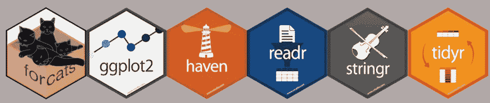

# 方便的 R 包的完整列表

> 原文：<https://towardsdatascience.com/a-comprehensive-list-of-handy-r-packages-e85dad294b3d?source=collection_archive---------9----------------------->

## 我发现对工作和生活非常有用的东西

对于数据科学/机器学习，Python 和 R 哪个更优越，这是一个公开的争论。尽管它古怪，不太真实，但普遍认为缓慢，R 在探索性数据分析(EDA)方面真的很出色，在数据争论，可视化，仪表板，统计包的无数选择(和错误)方面——所以我总是发现它有助于双重运用 R 和 Python，特别是使用 [reticulate](https://rstudio.github.io/reticulate/) 和 [rpy](https://rpy2.readthedocs.io/en/version_2.8.x/introduction.html) 提高互操作性。在过去几个月的大部分时间里，我都在使用 R，而我的 python、Java 和 javascript 技能则处于休眠状态。 [CRAN taskviews](https://cran.r-project.org/web/views/) 是一个搜索 R 包的很棒的起点，但是我猜我在过去几年中使用的包的列表可能对社区有益。这也是我记录过去学习的一个很好的动机。这就是我要说的——我会试着做些更新。它相当长，所以在强行安装所有东西之前，最好先尝试那些与你的主题相关的东西。然而，有一个观察表明，买了很多书的人几乎不读任何一本书。

所以事不宜迟:

## 数据争论

*   [**tidyverse**](https://cran.r-project.org/web/packages/tidyverse/index.html) :我相信这个现在应该和 R 捆绑在一起了。实际上，如果你不是用它来争论数据，你可能做错了什么(或者你是超级老派)。它附带了一堆丰富的工具，如 dplyr (transform，filter，aggregate)，tidyr(长/宽表转换)， [purrr](https://cran.r-project.org/web/packages/purrr/index.html) (函数式编程包)，tibble(增压数据帧)等。
*   [**看门人**](https://cran.r-project.org/web/packages/janitor/index.html) :一个伟大的数据清理工具，与 tidyverse 配合得很好。
*   [**sep lyr**](https://cran.r-project.org/web/packages/seplyr/index.html):dplyr 的一个好用的配套包，增加了一些快捷方式比如分组汇总功能。你可能总是实现自己，但这里是懒人的选择。
*   数据结构:R 中缺少的是现成的数据结构，比如 hashset 和 hashmap。放心，总有一包适合它。

## 形象化

*   [**ggplot2**](https://ggplot2.tidyverse.org/) :您应该使用的绘图包，句号。Python 也有一个 [plotnine](https://github.com/has2k1/plotnine) 绑定。有时，您可能会问自己，为什么需要 10 行代码来生成线图，而您可能只需在 excel 中打开文件并生成一个线图，其他时候，您会感激您可以编写任何内容，而无需将头撞向屏幕。如果你是新手，学习曲线肯定是陡峭的，但非常值得投资。
*   [**DataExplorer**](https://cran.r-project.org/web/packages/DataExplorer/index.html) :一个易于使用的包，用于生成数据诊断的 ggplot-verse 图，如缺失数据/特征等。我使用一些快捷函数来快速验证数据。
*   [**ggrepel**](https://cran.r-project.org/web/packages/ggrepel/index.html) :这是 geom_text 的替代物，如果你有大量的标签并且不希望所有的文本重叠。运行大型数据集可能需要很长时间，但结果在视觉上会更令人愉快。
*   [**ggfortify**](https://cran.r-project.org/web/packages/ggfortify/index.html) :各种统计模型的诊断/可视化图。
*   [**sjPlot**](https://cran.r-project.org/web/packages/sjPlot/index.html) :附带一系列用于统计建模的简洁诊断图。我特别喜欢它建立在 ggplot 之上，这样你可以很容易地调整外观和感觉，以与其他 ggplot-verse 情节保持一致。jtools / [interplot](https://cran.r-project.org/web/packages/interplot/index.html) 包含了一些很好的绘制交互效果的函数。 [ggdistribute](https://cran.r-project.org/web/packages/ggdistribute/index.html) 包含绘制后验分布的函数。
*   [**coefplot**](https://cran.r-project.org/web/packages/coefplot/index.html) :自动绘制模型系数的置信区间。
*   **:又一个带 ggplot2 的牛逼系数绘图包。**
*   **[**gghighlight**](https://cran.r-project.org/web/packages/gghighlight/index.html) :如果您有多个时间序列，并且希望突出显示其中几个，而将其余的保留在背景中，这将非常有用。**

*   **[**stargazer**](https://cran.r-project.org/web/packages/stargazer/index.html) :从可以插入文稿的数据框生成 html / latex 表格。每当我希望表格风格更加经典时，我就用它来为谷歌文档生成表格。否则我就用 sjPlot。还有****。******
*   ****[**ggthemes**](https://cran.r-project.org/web/packages/ggthemes/index.html) ， [**ggsci**](https://cran.r-project.org/web/packages/ggsci/vignettes/ggsci.html) **，**[**gg pubr**](https://cran.r-project.org/web/packages/ggpubr/index.html)**，**[**gg alt**](https://github.com/hrbrmstr/ggalt)**，**[**hrbr themes**](https://github.com/hrbrmstr/hrbrthemes):各种期刊的出版主题和颜色模板。你甚至可以得到 [xkcd](https://cran.r-project.org/web/packages/xkcd/index.html) 风格的剧情。[**extra font**](https://cran.r-project.org/web/packages/extrafont/index.html)**允许你在绘图中使用自定义字体。******
*   ********:信息图并不总是数据展示的最佳选择，但可能对不太懂数据/技术的受众有所帮助。这里是[的一篇博客文章](https://www.r-bloggers.com/infographic-style-charts-using-the-r-waffle-package/)和一些例子。********
*   ******[**corrplot**](https://cran.r-project.org/web/packages/corrplot/vignettes/corrplot-intro.html) :一站式绘制各种表示中的各种相关性。******
*   ****[**冲积**](https://cran.r-project.org/web/packages/alluvial/index.html) ，[**gg 冲积**](https://cran.r-project.org/web/packages/ggalluvial/index.html) **，** [**河流地块**](https://cran.r-project.org/web/packages/riverplot/index.html) : ggplot 包生成 Sankey 流程图。假设你的流不会像面条一样缠绕在一起，它们有时对可视化复杂的流很有用。****
*   ****[**pheatmap**](https://cran.r-project.org/web/packages/pheatmap/index.html)**，**[**gg dendro**](https://cran.r-project.org/web/packages/ggdendro/index.html)**:**包来绘制热图。****
*   ****[**点阵**](https://cran.r-project.org/web/packages/lattice/index.html) ， [**plotrix**](https://cran.r-project.org/web/packages/plotrix/index.html) **，**[**gp lots**](https://cran.r-project.org/web/packages/gplots/index.html)**，**[**plottly**](https://cran.r-project.org/web/packages/plotly/index.html):各种不在 ggplot 宇宙中的绘图函数。****
*   ****[**ggmap**](https://cran.r-project.org/web/packages/ggmap/index.html) **，** [**mapview**](https://cran.r-project.org/web/packages/mapview/index.html) ， [**传单**](https://cran.r-project.org/web/packages/leaflet/index.html) **，** [**sp**](https://cran.r-project.org/web/packages/sp/index.html) :打包生成地理空间可视化功能。****
*   ******， [**gridExtra**](https://cran.r-project.org/web/packages/gridExtra/index.html) :这些包很好地将多个 ggplots 拼接在一起。我个人更喜欢拼凑，因为语法更自然，更 gg-ish。******
*   ****[**分类器图**](https://cran.r-project.org/web/packages/classifierplots/classifierplots.pdf) :包含分类器的各种整洁诊断图。****
*   ****[**ggstatsplot**](https://github.com/IndrajeetPatil/ggstatsplot) :自动统计绘图的新软件包。****
*   ****[**inspectdf**](https://github.com/alastairrushworth/inspectdf) :一个非常好的探索分类变量的函数。****
*   ****[**效果**](https://cran.r-project.org/web/packages/effects/index.html) :一个非常好的演示模型效果的包。****

*   ******:更漂亮的基本绘图包，可直接更换******
*   ******[**ggPMX**](https://cran.r-project.org/web/packages/ggPMX/index.html) :基于“ggplot”的工具，便于 NLME 模型的诊断绘图******
*   ****[**ggchicklet**](https://github.com/hrbrmstr/ggchicklet) :有趣又实用的水平堆叠条包****
*   ****[**点密度**](https://cran.r-project.org/web/packages/ggpointdensity/index.html) :密度图+散点图****
*   ****[**WVPlots**](https://github.com/WinVector/WVPlots) :一些常用的 ggplots****

## ****自然语言处理****

*   ****[**formattable**](https://cran.r-project.org/web/packages/formattable/index.html) :提供一套很好的函数的包，便于格式化，如数字、百分比等。****
*   ****[**比例**](https://cran.r-project.org/web/packages/scales/index.html) :一个新的 R 包来辅助/美化 ggplot 比例，这是一个相当烦人和乏味的调整。我依靠这个库来生成对数刻度线([示例链接](http://www.sthda.com/english/wiki/ggplot2-axis-scales-and-transformations))。****
*   ****[**stringr**](https://cran.r-project.org/web/packages/stringr/vignettes/stringr.html) **，** [**stringi**](https://cran.r-project.org/web/packages/stringi/index.html) :一套不错的字符串操作函数。R 中的字符串处理一般不太愉快，这些都是好救的。****
*   ******:KEA(关键短语提取)的一个 R 接口，这是其他更全面的 NLP 包如 topicmodels 的好伙伴库。******
*   ******[**udpipe**](https://github.com/ufal/udpipe) :可训练的标记化管道。******
*   ****[**string ist**](https://cran.r-project.org/web/packages/stringdist/index.html)**，**[**fuzzywuzzyR**](https://cran.r-project.org/web/packages/fuzzywuzzyR/index.html):模糊/近似字符串匹配和字符串距离函数。****
*   ****[**fuzzyjoin**](https://github.com/dgrtwo/fuzzyjoin) **:一个** n 有趣的概念——这是对 dply join 方法的扩展，为表添加了模糊连接函数。可能很方便，但要小心使用，因为行为可能是不可预测的。****
*   ****[**topicmodels**](https://cran.r-project.org/web/packages/topicmodels/index.html) :一个高性能的主题建模包。****
*   ****[**formatR**](https://cran.r-project.org/web/packages/formatR/index.html) :如果没有使用内置自动格式化功能的 IDE，可以批量格式化多个 R 源代码。****
*   ****[**lintr**](https://github.com/jimhester/lintr)**:**代码林挺为 R 源。****
*   ****[**感知分析**](https://cran.r-project.org/web/packages/SentimentAnalysis/index.html) :这是一个类似于 python 的 Vader 的包，如果你想用多种方法进行快速的情感分析。****

## ****统计学习****

*   ****[**modelr**](https://cran.r-project.org/web/packages/modelr/index.html) :精简的建模接口，将几种常用的建模框架规范化。****
*   ****[**broom**](https://cran.r-project.org/web/packages/broom/index.html) :非常方便的包，可以将建模对象转换成更易消费的数据帧，用于批量报告、持久化或可视化。****
*   ****[**【fmsb】**](https://cran.r-project.org/web/packages/fmsb/index.html)**[**【Mcomp】**](https://cran.r-project.org/web/packages/Mcomp/index.html):这是一本书的配套包*医疗卫生数据分析使用 R* 的做法。这本书大约有 10 年的历史了，但是一些数据对于尝试各种统计/ ML 方法是有用的。Mcomp 包含了一些时间序列数据。******
*   ****[**Hmisc**](https://cran.r-project.org/web/packages/Hmisc/index.html) **，**[**rcompanion**](https://cran.r-project.org/web/packages/rcompanion/index.html)**，**[**e 1071**](https://cran.r-project.org/web/packages/e1071/index.html)**:**优秀的各种统计分析的实用程序包，如样本大小/幂计算、计算伪 R、各种统计检验等。****
*   ******素食主义者:生态学家的统计方法。******
*   ******[**fit.models**](https://cran.r-project.org/web/packages/fit.models/index.html) :这个包类似于 *caret* ，它规范了各种参数/非参数模型拟合和比较的接口。******
*   ****[**OEM**](https://arxiv.org/abs/1801.09661):apakage 开发出来专门处理大高数据(小 p，很大 N，一个例子就是 [kaggle Talking Data](https://www.kaggle.com/c/talkingdata-adtracking-fraud-detection) )回归问题。****
*   ****[**BeSS**](https://cran.r-project.org/web/packages/BeSS/BeSS.pdf) : Abest 子集选择算法，可与标准的基于 AIC / BIC 的模型选择程序一起使用。****
*   ****[**quantreg**](https://cran.r-project.org/web/packages/quantreg/index.html) :打包分位数回归函数。****
*   ****[**lavaan**](https://cran.r-project.org/web/packages/lavaan/index.html)**:**潜变量分析与结构方程建模[链接](http://lavaan.ugent.be/)。****
*   ****[**lme4**](https://cran.r-project.org/web/packages/lme4/index.html) :这个软件包非常适合线性和广义混合效果模型。****
*   ****[**提升**](https://cran.r-project.org/web/packages/uplift/index.html) :提升建模以优化特定治疗的 ROI，但识别目标的最佳子集[ [链接](https://en.wikipedia.org/wiki/Uplift_modelling) ]。****
*   ****[**arm**](https://cran.r-project.org/web/packages/arm/index.html) :使用回归和多级/层次模型的数据分析一书的配套。包含分层建模的简便方法。****
*   ****[**平滑**](https://cran.r-project.org/web/packages/smooth/index.html) :曲线平滑和时间序列预测。****
*   ******:极值/长尾值统计包，**:极值模型的对数似然调整********
*   ******[**MixtureInf**](https://cran.r-project.org/web/packages/MixtureInf/index.html) :最大似然估计(MLE)方法。******
*   ****[**SGB**](https://cran.r-project.org/web/packages/SGB/index.html) :单纯广义贝塔回归****
*   ****[**pln 模型**](https://cran.r-project.org/web/packages/PLNmodels/index.html) **:** 泊松对数正态模型****
*   ******:带不等式约束的多项式模型的贝叶斯推断******
*   ******[**rms**](https://cran.r-project.org/web/packages/rms/index.html) :这是回归建模策略书的配套包，提供了一系列回归分析的方法。******
*   ****[**emmeans**](https://cran.r-project.org/web/packages/emmeans/index.html) :最小平方边际均值。****
*   ****[**共图**](https://cran.r-project.org/web/packages/cotram/index.html) :计数变形型号****
*   ****[**【easy stats】**](https://github.com/easystats):库使统计分析变得容易****
*   ****[**参数**](https://github.com/easystats/parameters) :提取参数超级简单的包****

## ****偶然推理****

*   ****[**MatchIt**](https://cran.r-project.org/web/packages/MatchIt/index.html) :一个很棒的倾向评分匹配包。它有一些怪癖，从结果中提取数据可能不是很直观。****
*   ****[**causal impact**](https://google.github.io/CausalImpact/):Google 用于快速估算的包，通常这是我第一次尝试分析任何因果推断分析。****
*   ****[**因果关系**](https://cran.r-project.org/web/packages/causaleffect/index.html) :偶然的推论。我还没有详细检查这个包，它看起来很有希望。****
*   ****[**比较因果网络**](https://cran.r-project.org/web/packages/CompareCausalNetworks/index.html) **: T** his 是因果网络的*脱字符号*，一个接入许多因果网络框架的统一接口。****
*   ****[**rdd**](https://cran.r-project.org/web/packages/rdd/index.html) :这个包包含了[回归不连续分析](https://en.wikipedia.org/wiki/Regression_discontinuity_design)所需要的一切。****
*   ****[**中介**](https://cran.r-project.org/web/packages/mediation/index.html) :为[因果中介分析](https://www.mailman.columbia.edu/research/population-health-methods/causal-mediation)开发的 Apackage。优步有一个关于此类分析的精彩博客。这个框架可以估计在没有提出的介体存在的情况下的平均治疗效果 w &。****

## ****元分析****

*   ****[**meta**](https://cran.r-project.org/web/packages/meta/index.html) ， [**metafor**](https://cran.r-project.org/web/packages/metafor/index.html) :基本 meta 分析的启动包，如拟合二元/连续结果的固定/随机效应模型。****
*   ****[**forest model**](https://cran.r-project.org/web/packages/forestmodel/index.html)**，**[**meta viz**](https://cran.rstudio.com/web/packages/metaviz/index.html):meta/metafor 内置的森林绘图函数还没有升级到 ggplot universe。这些包做了改头换面，生成的图可以用 ggplot 函数更新，如改变标题，与其他图缝合等。我写了一个更好的森林绘图函数，我将在另一篇博文中分享。****
*   ****[**vcov**](https://cran.r-project.org/web/packages/vcov/index.html) :提取方差-协方差矩阵的快速方法。这可以在许多情况下使用，但对于多变量荟萃分析来说却很方便。****
*   ****[**bayesmeta**](https://cran.r-project.org/web/packages/bayesmeta/index.html) ， [**CPBayes**](https://cran.r-project.org/web/packages/CPBayes/index.html) **，** [**bmeta**](https://cran.r-project.org/web/packages/bmeta/index.html) :当然会有 Bayes 的同行进行 meta 分析。我还没有详细检查这些，但随着我对贝叶斯推理的深入研究，我可能会做更多的工作。****
*   ****[**netmeta**](https://cran.r-project.org/web/packages/netmeta/netmeta.pdf) :网络元分析的一个包。网络荟萃分析是一种结合多项研究并推断从未直接比较过的各组间治疗效果的方法。****

## ****假设检验****

*   ****[**diptest**](https://cran.r-project.org/web/packages/diptest/index.html) :多模态/混合分布的 dip 测试。****
*   ****[**normtest**](https://cran.r-project.org/web/packages/normtest/index.html) :包含许多方便的正态性、偏度、峰度等测试，使用蒙特卡罗模拟，是对[**base::Shapiro . test**](https://stat.ethz.ch/R-manual/R-devel/library/stats/html/shapiro.test.html):Shapiro-维尔克正态性测试的一个很好的补充。****
*   ****[**seqtest**](https://cran.r-project.org/web/packages/seqtest/index.html) **，**[**SPRT**](https://cran.r-project.org/web/packages/SPRT/index.html)**，**[**LD bounds**](https://cran.r-project.org/web/packages/ldbounds/index.html)**，**[**GS design**](https://cran.r-project.org/web/packages/gsDesign/index.html)**:**这些是用于顺序测试的包——使用各种方法计算界限。我计划写一个关于这个主题领域的综合性博客。****
*   ****[**lmtest**](https://cran.r-project.org/web/packages/lmtest/index.html) :线性回归模型的假设检验。****
*   ****[**mhtboot**](https://cran.r-project.org/web/packages/mhtboot/index.html) :多重假设检验修正。****
*   ****[**wBoot**](https://cran.r-project.org/web/packages/wBoot/index.html) :作为假设检验替代方案的 Bootstrap 方法。****
*   ****[**币**](https://cran.r-project.org/web/packages/coin/index.html) :排列测试框架。****
*   ****[**重采样**](https://cran.r-project.org/web/packages/resample/index.html) **:** 重采样方法，可以和很多假设检验框架一起使用。****
*   ****[**二项式**](https://cran.r-project.org/web/packages/binom/index.html) :提供额外的二项式置信区间，因为标准估计可能不适用于罕见事件、异质 p 等。****
*   ****[**DescTools**](https://cran.r-project.org/web/packages/DescTools/index.html) :懒人进行描述性统计的工具。****
*   ****[**容差**](https://cran.r-project.org/web/packages/tolerance/index.html) **:** 换一种方式思考假设检验——给定 alpha 和恢复百分比，我们可以从特定概率分布中恢复的数据的下限和上限是什么？这个包对所有的普通发行版都有效。****

*   ****[**WRS2**](https://cran.r-project.org/web/packages/WRS2/index.html) :稳健统计建模/测试方法集合；****
*   ****[**bayesAB**](https://cran.r-project.org/web/packages/bayesAB/index.html) :你要用的贝叶斯假设检验包。这是由弗兰克·波特曼开发的一个很棒的软件包。****
*   ****[**rstanarm**](https://cran.r-project.org/web/packages/rstanarm/index.html)**:**贝叶斯应用回归建模——可用于建模框架中的贝叶斯假设检验。****
*   ****[**霍特林**](https://cran.r-project.org/web/packages/Hotelling/index.html) :霍特林 T 检验的一个包。****
*   ****[**BayesFactor**](https://cran.r-project.org/web/packages/BayesFactor/index.html) :计算常见实验设计的 Bayes 因子。****
*   ****[**推断**](https://cran.r-project.org/web/packages/infer/index.html) :反向推断包方式。****
*   ****[**pvaluefunctions**](https://cran.r-project.org/web/packages/pvaluefunctions/index.html) :创建置信分布和 p 值函数****
*   ****[**蒙特。Carlo.se**](https://cran.r-project.org/web/packages/Monte.Carlo.se/index.html) :蒙特卡洛标准误差****
*   ****[**bamlss**](https://cran.r-project.org/web/packages/bamlss/index.html) :贝叶斯可加模型或位置、比例、形状****
*   ****[**BayesPostEst**](https://github.com/ShanaScogin/BayesPostEst) :用 MCMC 估计贝叶斯回归模型后的贝叶斯后估计量****

## ****功率分析****

*   ******:功率分析的基本功能。从其他 3 个参数中计算出*样本大小*、*功率*、*效果大小*、*α*中的任意一个。******
*   ******[**样本大小**](https://cran.r-project.org/web/packages/samplesize/index.html) :类似于 *pwr* ，但也可以计算非参数 Wilcoxon 检验的样本大小。******
*   ****[**power analysis**](https://cran.r-project.org/web/packages/powerAnalysis/powerAnalysis.pdf):一个更老的软件包也可以做到这一点。****
*   ****[**simr**](https://cran.r-project.org/web/packages/simr/index.html) :使用基于仿真的方法进行功率分析****
*   ****[**effsize**](https://cran.r-project.org/web/packages/effsize/index.html) **，**[**compute . es**](https://cran.r-project.org/web/packages/compute.es/index.html):非常方便的计算各种效果大小度量的包(Cohen d 等。).****

## ****因素/调查分析****

*   ****[**调查**](https://cran.r-project.org/web/packages/survey/index.html) :名字很不言自明。****
*   ****[**SDaA**](https://cran.r-project.org/web/packages/SDaA/index.html) :取样、设计、分析****
*   ****[**因子分析**](https://cran.r-project.org/web/packages/FactoMineR/index.html) **:** 多变量因子分析，用多重对应分析(MCA)****
*   ****[**ade4**](https://cran.r-project.org/web/packages/ade4/index.html) :生态数据分析/环境科学/调查方法。****
*   ****[**Ca**](https://cran.r-project.org/web/packages/ca/index.html) **，** [**homals**](https://cran.r-project.org/web/packages/homals/index.html) :各种对应分析方法。****

## ****时间序列分析****

*   ****[**seewave**](https://cran.r-project.org/web/packages/seewave/index.html) :声音分析包，也提供 SAX 转换****
*   ****[**先知**](https://cran.r-project.org/web/packages/prophet/index.html) :脸书的时间序列分析包，包括预测和变点检测。也有 Python 版本。****
*   ****[**插补**](https://cran.r-project.org/web/packages/imputeTS/index.html) **:** 专门为时间序列数据设计的插补方法。****
*   ****[**anytime**](https://cran.r-project.org/web/packages/anytime/index.html) **，**[**time date**](https://cran.r-project.org/web/packages/timeDate/index.html)**，**[**lubridate**](https://cran.r-project.org/web/packages/lubridate/index.html)**，** [**hms**](https://cran.r-project.org/web/packages/hms/index.html) :我们都知道时间格式转换是一种普遍的痛苦。这些包裹是用来营救的。****
*   ****[**fma**](https://cran.r-project.org/web/packages/fma/index.html) :你可以玩的时间序列数据集。****
*   ******:生存/时间序列数据的回归模型******
*   ******[**预测**](https://cran.r-project.org/web/packages/forecast/index.html):ts/线性模型的预测函数。******
*   ****[**TSA**](https://cran.r-project.org/web/packages/TSA/index.html) :通用时间序列分析随书*时间序列分析在 R* 中的应用****
*   ****[**astsa**](https://cran.r-project.org/web/packages/astsa/index.html) :应用统计时间序列分析。****
*   ******光谱**。 [**方法**](https://cran.r-project.org/web/packages/spectral.methods/index.html) :时间序列数据的频谱分解****
*   ****[**pracma**](https://cran.r-project.org/web/packages/pracma/index.html) :实用的数字数学函数。****
*   ****[**变点**](https://cran.r-project.org/web/packages/changepoint/index.html) **，** [**cpm**](https://cran.r-project.org/web/packages/cpm/index.html) :变点/异常检测方法。****
*   ****[**bcp**](https://cran.r-project.org/web/packages/bcp/index.html) **，** [**ecp**](https://cran.r-project.org/web/packages/ecp/index.html) :变化点检测的贝叶斯/非参数方法。****
*   ****[**TSClust**](https://cran.r-project.org/web/packages/TSclust/index.html) **，**[**dtwclust**](https://cran.r-project.org/web/packages/dtwclust/index.html):为时间序列数据聚类开发的具体方法。****
*   ****[**异常化**](https://github.com/business-science/anomalize) :自动检测时间序列数据中的异常****

## ****生存分析****

*   ****[**生存**](https://cran.r-project.org/web/packages/survival/index.html) :生存分析工具包。包含一切你需要开始，如考克斯风险模型。****

## ****稳健统计****

*   ****[**robust**](https://cran.r-project.org/web/packages/robust/index.html) ， [**robustbase**](https://cran.r-project.org/web/packages/robustbase/index.html) :克服单变量/多维异常值并生成更稳定的模型/估计的稳健方法。****

## ****异常检测****

*   ****[**Twitter/anomaly detection**](https://github.com/twitter/AnomalyDetection):这个包已经很多年没有更新了，但是看起来还在工作。我将欢迎关于异常检测方法的建议。****

## ****特征工程/选择****

*   ****[**预测**](https://cran.r-project.org/web/packages/forcats/index.html) :分类变量转换工具。****
*   ****[**Boruta**](https://cran.r-project.org/web/packages/Boruta/index.html) :基于重要性度量排列的特征选择方法。****
*   ****[**MXM**](https://cran.r-project.org/web/packages/MXM/index.html) :贝叶斯网络的特征选择方法。****
*   ****[**fscaret**](https://cran.r-project.org/web/packages/fscaret/index.html) :从插入符号中自动选择特征。****
*   ******:使用集成方法的特征选择。******
*   ******[**one_hot**](https://www.rdocumentation.org/packages/mltools/versions/0.3.5/topics/one_hot) ， [**onehot**](https://cran.r-project.org/web/packages/onehot/onehot.pdf) :分类变量 onehot 编码的便捷快捷方式。******
*   ****[**选择增强**](https://cran.r-project.org/web/packages/SelectBoost/SelectBoost.pdf) :选择增强进行特性选择。****
*   ****[**手电筒**](https://cran.r-project.org/web/packages/flashlight/index.html) :探索黑体算法特性包****

## ****距离度量****

*   ****[**proxy**](https://cran.r-project.org/web/packages/proxy/index.html) :距离函数可以分散在许多具有各种函数签名的 R 包中，这使得它很难热插拔。这个软件包标准化了距离定义，使得定义任何自定义距离函数变得很方便。****
*   ****[**parallelDist**](https://cran.r-project.org/web/packages/parallelDist/index.html) :在非常大的数据集(> 5000 行)上计算距离矩阵在本地机器上非常耗时；该软件包允许并行计算距离，这可以大大减少计算时间，测试速度提升高达 20 倍。****
*   ****[**philentropy**](https://cran.r-project.org/web/packages/philentropy/index.html) :概率函数之间的相似距离。****
*   ****[**【wCorr】**](https://cran.r-project.org/web/packages/wCorr/wCorr.pdf)**[**权重**](https://cran.r-project.org/web/packages/weights/index.html) :相关性等加权统计。******
*   ****[**距离**](https://cran.r-project.org/web/packages/distances/index.html) :可用于 ML / stat 建模的各种距离度量。****
*   ****[**高尔**](https://cran.r-project.org/web/packages/gower/index.html) :高尔记录间的距离，常用于混合数字/分类回答的调查分析。****

## ****降维****

*   ****[**Rtsne**](https://cran.r-project.org/web/packages/Rtsne/index.html) **，**[**tsne**](https://cran.r-project.org/web/packages/tsne/index.html):T-SNE 实现在 r****
*   ****[**g models**](https://cran.r-project.org/web/packages/gmodels/index.html):fast . pr comp:PCA 的快速版本。****
*   ****[**umap**](https://cran.r-project.org/web/packages/umap/index.html) :带教程[此处](https://cran.r-project.org/web/packages/umap/vignettes/umap.html)，降维方法论。****
*   ****[**smacof**](https://cran.r-project.org/web/packages/smacof/index.html) :多维缩放的综合包，是对 [**MASS::isoMDS**](https://stat.ethz.ch/R-manual/R-devel/library/MASS/html/isoMDS.html) 的一个很好的补充****
*   ****[**largeViz**](https://github.com/elbamos/largeVis) :降维的大数据可视化。****
*   ****[**【RDRToolbox】**](https://bioconductor.org/packages/release/bioc/html/RDRToolbox.html):降维 w/ isomap 和 LLE，框架统一。****

## ****无监督学习/聚类****

*   ****[**麦克卢斯特**](https://cran.r-project.org/web/packages/mclust/index.html) :使用高斯混合的基于模型的聚类方法。它会根据最大似然自动决定最佳的聚类数。这里有一个[入门教程](https://cran.r-project.org/web/packages/mclust/vignettes/mclust.html)。****
*   ****[**fastcluster**](https://cran.r-project.org/web/packages/fastcluster/index.html) :一种用大规模性能提升取代内置层次集群的方法。对数千个数据点进行聚类只需不到几秒钟的时间。****
*   ****[**flash cluster**](https://cran.r-project.org/web/packages/flashClust/index.html):快速层次聚类的另一种实现。****
*   ******:包非负矩阵分解。这是一种非常有用的技术，可以找到较小矩阵的压缩版本，这些矩阵可以相乘以逼近源矩阵，同时保持所有值为正(可加)。常用于聚类/图像处理。[ [自然论文](https://www.nature.com/articles/44565) ]******
*   ******[**聚类**](https://cran.r-project.org/web/packages/cluster/index.html) **，**[**FPC**](https://cran.r-project.org/web/packages/fpc/index.html)**，** [**线索**](https://cran.r-project.org/web/packages/clue/index.html) :一套聚类分析和验证的方法。******
*   ****[**pvclust**](https://cran.r-project.org/web/packages/pvclust/index.html) :使用 bootstrap 估计层次聚类中的不确定性，搜索最优割。****
*   ****[**fastICA**](https://cran.r-project.org/web/packages/fastICA/index.html) :独立成分分析(ICA)的快速方法。一篇好的 Quora 帖子解释了 PCA 和 ICA 的区别。****
*   ****[**EMCluster**](https://cran.r-project.org/web/packages/EMCluster/index.html) :基于模型的聚类 w/有限混合高斯分布。简而言之，它假设数据是从多元高斯分布生成的，并尝试使用 EM 算法来估计最佳聚类数和聚类成员数。****
*   ****[**线索**](https://cran.r-project.org/web/packages/clues/index.html) **，**[**clusterSim**](https://cran.r-project.org/web/packages/clusterSim/index.html):自动聚类方法，识别聚类数，用诊断图。****
*   ******:针对稀疏数据的稳健 K 均值聚类算法。******
*   ******[**树形扩展**](https://cran.r-project.org/web/packages/dendextend/vignettes/introduction.html) :高级树状图绘制方法。******
*   ****factoextra****
*   ****[**【NbClust**](https://cran.r-project.org/web/packages/NbClust/index.html):一个非常好的包，可以确定集群的最佳数量——可以同时提供大约 30 个指标。****
*   ****[**clValid**](https://www.rdocumentation.org/packages/clValid/versions/0.6-6) :计算各种集群质量指标，如 [Dunn index](https://en.wikipedia.org/wiki/Dunn_index) 。****
*   ****[**聚类倾向**](https://cran.r-project.org/web/packages/clustertend/index.html) :霍普金聚类倾向——你可以对任何数据集应用聚类算法，但这并不意味着结果有意义。具体来说，数据需要包含某种聚类结构，霍普金指数是一个很好的测量置换测试。****
*   ****[**dbscan**](https://cran.r-project.org/web/packages/dbscan/index.html) :基于密度的聚类方法[ [wiki](https://en.wikipedia.org/wiki/DBSCAN) ]，也许能够解决传统的基于距离的方法失效的问题。****
*   ****[**cluMix**](https://cran.r-project.org/web/packages/CluMix/index.html)**:**对混合数据类型的主题进行聚类，可以使用高尔距离计算距离。或者，您可以使用 [gower](https://cran.r-project.org/web/packages/gower/vignettes/intro.html) 来计算距离，然后提供给首选的聚类算法。****
*   ****[**apcluster**](https://cran.r-project.org/web/packages/apcluster/index.html) :相似传播聚类——与标签传播类似，通过相似度网络传递亲近度。****
*   ******:均值分割、不确定性评估和聚类验证******
*   ******[**频谱**](https://cran.r-project.org/web/packages/Spectrum/index.html) :快速频谱聚类算法******

## ****半监督学习****

*   ****[**SSL**](https://cran.r-project.org/web/packages/SSL/index.html) **，** [**RSSL**](https://arxiv.org/abs/1612.07993) :这些包提供了使用部分标记数据的半监督学习方法。****

## ****监督学习(通用机器学习)/深度学习****

*   ****[**caret**](https://cran.r-project.org/web/packages/caret/index.html) :相当于 scikit learn 的 R:特征处理、训练/测试分割、交叉验证、模型性能度量……你说得出的。****
*   ****[**mlbench**](https://cran.r-project.org/web/packages/mlbench/index.html) : ML 基准数据集和函数。****
*   ****[**xgboost**](https://cran.r-project.org/web/packages/xgboost/index.html) :众所周知的 Kaggle 获胜算法。事实上，这几乎是高性能生产级别车型的普遍选择。快速、易于使用、易于部署。****
*   ****modelr****
*   ****[**配方**](https://cran.r-project.org/web/packages/recipes/index.html) :设计矩阵辅助包。****
*   ****[**mlr**](https://cran.r-project.org/web/packages/mlr/index.html) :类似于 caret，这是一个通用的模型训练框架。****
*   ****[**h2o**](https://cran.r-project.org/web/packages/h2o/index.html) **，** [**mltools**](https://cran.r-project.org/web/packages/mltools/index.html) :分布式机器学习框架，有社区版和包含 AutoML 实现的商业版。****
*   ****[**R studio/Keras**](https://keras.rstudio.com/):Keras 在 R 中的实现，go 深度学习！****
*   ******[**speedglm**](https://cran.r-project.org/web/packages/speedglm/speedglm.pdf):GLM 库的更快版本。******
*   ****[**iml**](https://cran.r-project.org/web/packages/iml/index.html) :可解释的机器学习:[书](https://christophm.github.io/interpretable-ml-book/agnostic.html)****
*   ****[**tidy models**](https://github.com/tidymodels/tidymodels):tidy models:tidy verse 风格的机器学习/统计建模包的集合。****
*   ****[**SHAPforxgboost**](https://cran.r-project.org/web/packages/SHAPforxgboost/index.html):shap 值诊断 xgboost****

## ****阶级不平衡****

*   ****[**smote family**](https://cran.r-project.org/web/packages/smotefamily/index.html)**:**类不平衡问题的综合过采样方法。****

*   ****[**upclass**](https://cran.r-project.org/web/packages/upclass/index.html) :最近由 CRAN 存档，这是另一个合成少数样本的包。****

## ****图形分析****

*   ****[**I graph**](https://cran.r-project.org/web/packages/igraph/index.html):R 最全面的图形库——汇总统计、距离、社区结构、聚类、可视化布局算法——应有尽有！一定有。****
*   ****[**qgraph**](https://cran.r-project.org/web/packages/qgraph/index.html) :包含图形数据的各种方法，即。****
*   ******网络**:igraph 的配套包****
*   ****一个基于 tidyverse 的可视化包****
*   ******图形**:基于网络的图形即****
*   ****可视化网络的一些方法****
*   ******网络 D3:** 基于 D3 的网络****

## ****最佳化****

*   ****[**BB**](https://cran.r-project.org/web/packages/BB/index.html) :求解大型线性和非线性方程组。非常快捷方便。****

## ****归罪****

*   ****[**VIM**](https://cran.r-project.org/web/packages/VIM/VIM.pdf) :缺失值的可视化和插补。瑞士刀包装。****
*   ****[**小鼠**](https://cran.r-project.org/web/packages/mice/mice.pdf) **，** [**阿米莉亚**](https://cran.r-project.org/web/packages/Amelia/Amelia.pdf) :多变量插补方法。这个想法是借用尽可能多的*邻居*数据来提高插补精度。****
*   ****[**missForest**](https://stat.ethz.ch/education/semesters/ss2012/ams/paper/missForest_1.2.pdf) :基于模型的方法之一——我们可以使用缺失值作为响应变量，并用其余变量拟合模型，从而进行插补。****
*   ****[**mi**](https://github.com/cran/mi) **，** [**mitools**](https://github.com/cran/mitools) :一些较老的包，用于缺失值插补。****

## ****模拟****

*   ****[**随机化器**](https://cran.r-project.org/web/packages/randomizeR/index.html) :临床试验的随机化。****
*   ****[**蒙特卡洛**](https://www.r-bloggers.com/introducing-the-montecarlo-package/) :名字解释了一下，蒙特卡洛模拟的一个包。****

## ****生物信息学****

*   ****[**paircompviz**](http://bioconductor.org/packages/release/bioc/html/paircompviz.html)**:**一个用于可视化多重测试比较的生物导体包。****
*   ****[**MSA**](https://bioconductor.org/packages/release/bioc/html/msa.html):DNA/RNA/蛋白质序列比对的多重序列比对程序。可以为定制序列类型的数据重新定义转移矩阵。****
*   ****[**生物字符串**](http://bioconductor.org/packages/release/bioc/html/Biostrings.html) **:** 生物字符串的高效库，可扩展为自定义字符集。****

## ****数据集****

*   ****[**性别**](https://cran.r-project.org/web/packages/gender/index.html) :根据*英文名*猜测性别，产生概率****
*   ****[**婴儿姓名**](https://cran.r-project.org/web/packages/babynames/index.html) :美国历年人口普查数据中的婴儿姓名。当我试图给我的女儿取名时，我用这个包来理解随时间变化的名字流行度****
*   ****[**gcookbook**](https://cran.r-project.org/web/packages/gcookbook/index.html) :这个包包含了本书 [*R 图形 Cookbook*](http://shop.oreilly.com/product/0636920023135.do) *的数据；我发现它对测试可视化工具很有用，而且它有一些现成的实用功能。*****
*   ******wbstats:该软件包提供了对世界银行数据的程序化访问，如国内生产总值、收入、犯罪率、教育、人口统计等不同地理粒度的数据******
*   ******[**【wdi】**](https://www.r-project.org/nosvn/pandoc/WDI.html):易于使用的世界银行数据******

## ****开发者工具****

*   ******:这个包可以用来调试管道 **(% > %)** 功能******
*   ****[**validate**](https://cran.r-project.org/web/packages/validate/index.html) :这个包自带了一套丰富的函数来验证函数参数，可以用在 [*plumber*](https://www.rplumber.io/) 等 web 服务的后端****

## ****仪表板/互动界面****

*   ****[**R/Shiny**](https://cran.r-project.org/web/packages/shiny/index.html) :我不是 Shiny 的忠实粉丝，但它是 Tableu 的一个方便的替代品，用于创建快速交互式数据可视化仪表板。****
*   ****[**html widgets**](https://cran.r-project.org/web/packages/htmlwidgets/index.html):shiny 的好伙伴，提供许多交互式工具来可视化表格/时间序列/地理空间数据****
*   ****[**dygraphs**](https://www.htmlwidgets.org/showcase_dygraphs.html) :最好的时序数据交互可视化软件包之一；您可以同时绘制多个系列并修饰各种注释****
*   ****[**【DataTables(DT)**](https://www.htmlwidgets.org/showcase_datatables.html):一个简单的包装器，用于将 R 数据帧转换成具有排序和过滤功能的交互式数据表****
*   ****[**传单**](https://www.htmlwidgets.org/showcase_leaflet.html) :可视化地理空间数据的最佳软件包，尽管我发现集成到 Jupyter 笔记本中可能相当笨拙****
*   ****[**golem**](https://cran.r-project.org/web/packages/golem/index.html) :健壮闪亮的应用框架****

## ****并行计算****

*   ****[**foreach**](https://cran.r-project.org/web/packages/foreach/index.html) :可以说是 for 循环的健壮得多的版本，用( ***%dopar%)*** 语法支持几个并行处理框架。我发现它的性能不如来自 parallel 的[MC apply，但我喜欢它的错误处理和灵活性。](https://stat.ethz.ch/R-manual/R-devel/library/parallel/html/mclapply.html)****
*   ******mclapply** :如果输出可以压缩到列表/数组中，现在我的 Go-to 函数用于单框并行化。****
*   ******parallel，snow** :在 MC apply/foreach 中可以使用各种并行后端。****

## ****超正析象管(Image Orthicon)****

*   ****[**readr**](https://cran.r-project.org/web/packages/readr/index.html) :如果你还在用内置的 read.csv …不要。这个软件包是如此优越，易于使用。不能没有。****
*   ****[**readxl**](https://readxl.tidyverse.org/) :即使我不记得上一次处理 Excel 文件的情形(现在所有的东西都是 Google Sheets)，知道有某种方法可以直接从 Excel 中读取也很棒，尤其是当那个文件包含多个工作表时。****
*   ****[**jsonlite**](https://cran.r-project.org/web/packages/jsonlite/index.html) :不需要解释，你需要某种方法来解析 JSON****
*   ****[**xml2**](https://cran.r-project.org/web/packages/xml2/index.html) :虽然 xml 已经成为过去，但知道它仍然受到支持让我安心。****
*   ****[**rDrop**](https://github.com/karthik/rDrop) :直接从 Dropbox 中方便地读取文件。****

## ****实用程序/Web 服务****

*   ****[**pryr**](https://github.com/hadley/pryr) :窥探 R 对象和函数的方法。****
*   ****[**devtools**](https://cran.r-project.org/web/packages/devtools/index.html) :开发者工具如果你是 R 开发的话。****
*   ****[**水管工**](https://cran.r-project.org/web/packages/plumber/index.html) ， [**httr**](https://cran.r-project.org/web/packages/httr/index.html) :设置 http 服务和发送 http 请求的包。****
*   ****[**glue**](https://cran.r-project.org/web/packages/glue/index.html) :一个非常方便的工具，可以格式化带有多个变量的字符串(相当于 python 的 string.format)，我发现它对于生成 SQL 或调试消息非常方便****
*   ****[**备忘录**](https://cran.r-project.org/web/packages/memo/index.html):LRU 缓存的一个很棒的实现，与 http 服务(比如水管工)一起工作很棒****
*   ****[**网状**](https://cran.r-project.org/web/packages/reticulate/index.html) :允许 R 直接访问 python 库和对象，如果你是双持！****
*   ****[**【roxy gen 2】**](https://cran.r-project.org/web/packages/roxygen2/index.html):从内嵌注释生成 R 文档。****
*   ******test that**:R 的单元测试包****
*   ****[**编织者**](https://yihui.name/knitr/) **，** [**记账**](https://bookdown.org/yihui/bookdown/) :从 R 降价创建 HTML 报表。****
*   ******:应收账款管理系统。******
*   ******[**IRdisplay**](https://cran.r-project.org/web/packages/IRdisplay/IRdisplay.pdf) :用于显示 R 内核 Jupyter 中的图像/文本******

## ****其他资源****

*   ****自动化探索性数据分析:这个 [github repo](https://github.com/mstaniak/autoEDA-resources) 列出了许多加快数据探索过程的工具。****