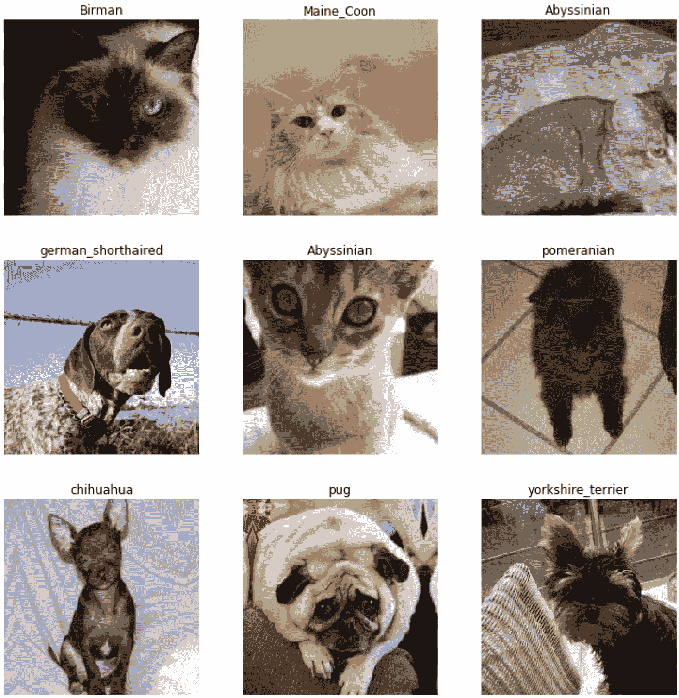
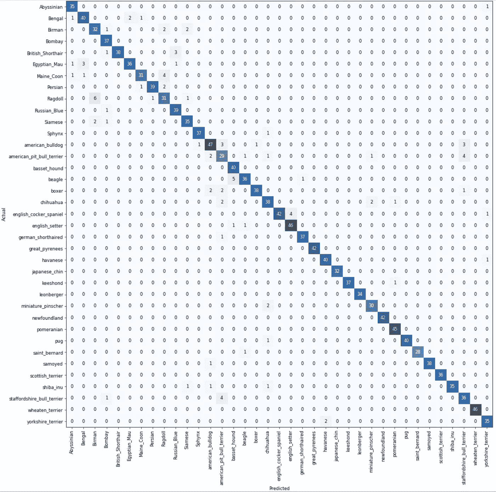

# 一个全面的最先进的图像识别教程

> 原文：<https://towardsdatascience.com/a-comprehensive-state-of-the-art-image-recognition-tutorial-c34c544d0b4?source=collection_archive---------17----------------------->

## 从基础开始，使用 fastai 和 PyTorch 的快速多类图像识别


Photo by [Matt Noble](https://unsplash.com/@mcnoble?utm_source=medium&utm_medium=referral) on [Unsplash](https://unsplash.com?utm_source=medium&utm_medium=referral)

本教程改编自 [Fastai DL 2019 课程](https://github.com/fastai/course-v3/blob/master/nbs/dl1/lesson1-pets.ipynb)，有我的许多补充和澄清。希望对你有帮助。

通过本教程，您将能够在您选择的任何图像数据集上构建和训练图像识别器，并对底层模型架构和训练过程有很好的理解。

本教程涵盖:
1。数据提取
2。数据可视化
3。模型训练:CNN，ResNets，迁移学习
4。结果解读
5。冻结&解冻模型层
6。微调:Learning rate finder，One Cycle Policy

本教程对于任何新的深度学习实践者，任何想简单地使用 CNN 和 ResNets 刷新图像分类基础知识的人，或者任何没有使用过 fastai 库并想尝试一下的人都是一个很好的介绍。

本教程的笔记本也可以在[这里](https://github.com/SalChem/Fastai-iNotes-iTutorials/blob/master/Image_Recognition_Basics.ipynb)找到。

**要运行笔记本，只需用 Google Colab** [**这里**](https://colab.research.google.com/github/SalChem/Fastai-iNotes-iTutorials/blob/master/Image_Recognition_Basics.ipynb) **打开即可。这个笔记本是独立的，没有错误，所以你可以直接运行它。**

一旦进入 Colab，**确保更改以下内容以启用 GPU 后端，**

*运行时- >更改运行时类型- >硬件加速器- > GPU*

本教程中的代码得到了简明的解释。任何类、方法等的进一步文档。可在 [fastai docs](https://docs.fast.ai/) 找到。

## 让我们开始吧…

# 设置 IPython 内核和初始化

导入必要的库，


让我们做一些初始化，


`bs`是我们的批量，也就是一次要喂给模型的训练图像的数量。模型参数在每次批量迭代后更新。

例如，如果我们有 640 个图像，我们的批量大小是 64；参数将在一个时期内更新 10 次。

如果您碰巧在教程中的某个时间用完了内存，较小的批处理大小会有所帮助。批量大小通常是 2s 的倍数。

用特定值初始化上面的伪随机数发生器使系统稳定，产生可重复的结果。

# 1.数据析取

我们将使用的数据集是牛津-IIIT Pet 数据集，可以使用 fastai 数据集模块检索。


`URLs.PETS`是数据集的 url。它有 12 种猫和 25 种狗。`untar_data`将数据文件解压缩并下载到我们的`path`中。


`get_image_files`获取*图像*目录下所有文件的*路径*并存储到`fnames`中。来自`fnames`的一个实例将如下所示，

```
PosixPath('/home/jupyter/.fastai/data/oxford-iiit-pet/images/scottish_terrier_119.jpg')
```

由于每个图像的标签都包含在图像文件名中，我们将使用[正则表达式](https://en.wikipedia.org/wiki/Regular_expression)来提取它。正则表达式，通常缩写为 *regex* ，是描述一定数量文本的模式。我们提取图像标签的模式如下:


最后一步是特定于这个数据集的。例如，如果属于同一个类的图像在同一个文件夹中，我们就不必担心这个问题。

现在让我们创建我们的训练和验证数据集，


`ImageDataBunch`从路径`path_img`中的图像创建训练数据集 *train_ds* 和验证数据集 *valid_ds* 。

`from_name_re`使用编译表达式模式`pat`后获得的正则表达式从文件名列表`fnames`中获取标签。

`df_tfms`是动态应用于图像的变换。在这里，图像将被调整到 224x224，居中，裁剪和缩放。这种转换是数据扩充的例子，在计算机视觉中已经被证明是有前途的。这种变换不会改变图像内部的内容，但会改变其像素值以获得更好的模型泛化。

`normalize`使用 ImageNet 图像的标准偏差和平均值对数据进行标准化。

# 2.数据可视化

训练数据样本表示为

```
(Image (3, 224, 224), Category scottish_terrier)
```

其中第一个元素表示图像的 3 个 RGB 通道、行和列。第二个元素是图像标签。

该实例的对应图像是，


`len(data.train_ds)`和`len(data.valid_ds)`输出训练和验证样本数，分别为 5912 和 1478。

`data.c`和`data.classes`分别输出类的数量和它们的标签。共有 37 个类别，标签如下:

```
['Abyssinian', 'Bengal', 'Birman', 'Bombay', 'British_Shorthair', 'Egyptian_Mau', 'Maine_Coon', 'Persian', 'Ragdoll', 'Russian_Blue', 'Siamese', 'Sphynx', 'american_bulldog', 'american_pit_bull_terrier', 'basset_hound', 'beagle','boxer', 'chihuahua', 'english_cocker_spaniel', 'english_setter', 'german_shorthaired', 'great_pyrenees', 'havanese', 'japanese_chin', 'keeshond', 'leonberger', 'miniature_pinscher', 'newfoundland', 'pomeranian', 'pug', 'saint_bernard', 'samoyed', 'scottish_terrier', 'shiba_inu', 'staffordshire_bull_terrier', 'wheaten_terrier', 'yorkshire_terrier']
```


`show_batch`显示一批中的几幅图像。



# 3.模特培训


`cnn_learner`使用来自给定架构的**预训练模型**构建 CNN 学习器。来自预训练模型的学习参数用于初始化我们的模型，允许以高精度更快地收敛。

这里使用的 CNN 架构是 [ResNet34](https://arxiv.org/pdf/1512.03385.pdf) ，它在过去几年中取得了巨大的成功，至今仍被认为是最先进的。

讨论 CNN 和 ResNets 有很大的价值，因为这将有助于我们更好地了解我们在这里的培训过程。我们走吧。:)

**CNN 一言以蔽之:**

那么首先，什么是卷积神经网络(CNN 或 convNet)？我们可以将 ConvNet 视为将图像体转换为输出体的层列表，输出体可以是类分数，就像本教程中的情况一样。这些层由连接到前几层的其他神经元的神经元组成。为了深入阅读，我强烈推荐斯坦福大学 CS231 班的[卷积神经网络](http://cs231n.github.io/convolutional-networks/)。


A typical CNN architecture [[Source](https://en.wikipedia.org/wiki/Convolutional_neural_network)]

该图展示了典型的 convNet 架构。我们可以将所有 CNN 架构视为不同可微函数(卷积、下采样和仿射变换)的各种组合。上图只有几层，但深网有几十层到几百层。

**结果简单来说:**

深度网络中一个非常常见的问题是*退化问题*，其中模型精度达到饱和，然后迅速退化。这是违反直觉的，因为我们期望额外的层应该支持更详细和抽象的表示。这个问题正是 ResNets 要解决的，因为它们可以安全地优化训练更深层次的网络，而不用担心退化问题。

ResNets 解决退化问题的方法是通过引入*“身份快捷连接”*，通常称为“跳过连接”，跳过一层或多层。跳过连接的输出被添加到堆叠图层的输出中，如下图所示。跳过连接有效地跳过了某些层上的学习过程，使得深层网络在某种程度上也充当浅层网络。


A residual block [[Source](https://arxiv.org/abs/1512.03385)]

skip 函数创建了所谓的残差块，即图中的 F(x ),这就是残差网(ResNets)名称的由来。传统网络旨在直接学习输出 H(x ),而 ResNets 旨在学习残差 F(x)。使 F(x) = 0 允许网络跳过该子网，因为 H(x) = x。

已经表明，添加这些身份映射允许模型更深入而不降低性能，并且这种网络比简单的堆叠层更容易优化。ResNet 有几种变体，如 ResNet50、ResNet101、ResNet152ResNet 数字表示 ResNet 网络的层数(深度)。

在本教程中，我们使用 ResNet34，它看起来如下:


Architecture and convolutional kernels of ResNet34 [[Source](https://arxiv.org/abs/1512.03385)]

在该图中，底部的数字表示输入或特征图的大小(高 x 宽)，上面的数字表示通道的数量(过滤器的数量)。例如，第一个左边的块代表输入图像(224 x 224 x 3)。图中的每个*层*包含很少的残差块，这些残差块又包含具有不同可微函数的堆叠层，导致 34 个端到端的层。下面是 ResNet34 架构与类似的简单架构相比的完整底层布局；侧箭头表示身份连接。


A plain 34-layer CNN (left) and a 34-layer ResNet (right) [[Source](https://arxiv.org/abs/1512.03385)]

只需将`models.resnet34`替换为`models.resnet50`或任何其他所需的架构，就可以随意尝试任何其他的 ResNets。请记住，增加层数将需要更多的 GPU 内存。

我们上面描述的使用预训练模型并使其适应我们的数据集的方法被称为*迁移学习。*但是为什么要用迁移学习呢？

**转移学习:**

深度神经网络有大量的参数，通常在数百万的范围内。在小数据集(小于参数数量的数据集)上训练这样的网络会极大地影响网络的泛化能力，通常会导致过度拟合。所以在实践中，很少用随机权重初始化从零开始训练网络。

预训练模型通常在非常大的数据集上训练，例如包含 120 万个图像和 1000 个类别的 ImageNet。因此，预训练模型将已经学会在其早期层中捕捉通用特征，如曲线、颜色梯度和边缘，这对于大多数其他计算机视觉分类问题可能是相关的和有用的。迁移学习在其他领域也同样有效，比如自然语言处理和语音识别。

现在，通过迁移学习，我们的模型已经在 ImageNet 上进行了预训练，我们只需要使它更具体地针对我们手头数据集的细节。我们有两个选择来做到这一点，我们可以只更新最后层的参数，或者我们可以更新模型的所有层。第一种选择通常被称为特征提取，而第二种被称为微调。在这两种方法中，由于 ImageNet 预训练模型在输出图层中的大小为 1000，因此首先重塑最终图层以使其在我们的数据集中具有相同数量的类是很重要的。

太好了！到目前为止，我们已经讨论了许多核心概念。

## 让我们继续…

现在让我们在数据集上训练模型，


`fit_one_cycle`根据所提供的时期数训练模型，即此处为 4。

时期数表示模型查看整组图像的次数。然而，在每一个时代，同样的图像在我们的数据扩充后会有些许不同。

通常，度量误差会随着每个历元而下降。只要验证集的准确性不断提高，增加历元的数量是一个好主意。然而，大量的历元会导致学习特定的图像而不是一般的类，这是我们想要避免的。

我们刚刚在这里进行的训练就是我们所说的特征提取，因此只有模型头部(最后一层)的参数被更新。接下来我们将尝试微调所有图层。

**祝贺你！！！该模型已被成功训练识别狗和猫的品种。**

我们以上达到的准确度约为 93.5%

我们能做得更好吗？微调之后再说。

让我们保存当前的模型参数，以防以后需要重新加载。


# 4.结果解释

现在让我们看看如何正确解释当前的模型结果。


`ClassificationInterpretation`提供错误分类图像的可视化。


`plot_top_losses`显示最高损失的图像及其:
*预测标签/实际标签/损失/实际图像类别的概率*

高损失意味着对错误答案的高度信任。绘制顶部损失是可视化和解释分类结果的好方法。


Misclassified images with the highest losses



Classification confusion matrix

在**混淆矩阵**中，对角线元素表示预测标签等于真实标签的图像的数量，而非对角线元素是被分类器错误标记的图像。


`most_confused`简单抓取预测和实际类别最混淆的组合；换句话说，就是那些最容易出错的。我们可以看到它经常把*斯塔福德郡斗牛梗*误认为*美国斗牛梗*，它们看起来确实非常相似:)

```
[('Siamese', 'Birman', 6),
 ('american_pit_bull_terrier', 'staffordshire_bull_terrier', 5),
 ('staffordshire_bull_terrier', 'american_pit_bull_terrier', 5),
 ('Maine_Coon', 'Ragdoll', 4),
 ('beagle', 'basset_hound', 4),
 ('chihuahua', 'miniature_pinscher', 3),
 ('staffordshire_bull_terrier', 'american_bulldog', 3),
 ('Birman', 'Ragdoll', 2),
 ('British_Shorthair', 'Russian_Blue', 2),
 ('Egyptian_Mau', 'Abyssinian', 2),
 ('Ragdoll', 'Birman', 2),
 ('american_bulldog', 'staffordshire_bull_terrier', 2),
 ('boxer', 'american_pit_bull_terrier', 2),
 ('chihuahua', 'shiba_inu', 2),
 ('miniature_pinscher', 'american_pit_bull_terrier', 2),
 ('yorkshire_terrier', 'havanese', 2)]
```

# 5.冻结和解冻

默认情况下，在 fastai 中，使用预先训练的模型**会冻结**前面的层，因此网络只能对最后一层的参数进行更改，正如我们上面所做的那样。冻结第一层并仅训练更深的层可以显著减少大量计算。

我们总是可以通过调用`unfreeze`函数，然后调用`fit`或`fit_one_cycle`来训练网络的所有层。这就是我们所说的微调，因为我们正在调整整个网络的参数。我们开始吧，


*现在的精度比以前差了一点。* *为什么会这样？*

这是因为我们以相同的速度更新所有层的参数，这不是我们所希望的，因为第一层不需要像最后一层那样做太多的改变。控制权重更新量的超参数称为*学习率*，也称为*步长*。它根据损失的梯度调整权重，目的是减少损失。例如，在最常见的梯度下降优化器中，权重和学习速率之间的关系如下，


翻译过来就是`new_weight = old_weight — lr * gradient`

顺便说一下，梯度只是一个向量，它是导数 ***的多变量推广。***

因此，对模型进行微调的更好方法是对较低层和较高层使用不同的学习速率，通常称为差异或区别学习速率。

顺便说一下，我在本教程中交替使用参数和权重。更准确地说，参数是权重和偏差，但我们不要担心这里的微妙之处。但是，注意超参数和参数是不同的；超参数不能在训练中估计。

# 6.微调

为了找到用于微调模型的最合适的学习率，我们使用了一个*学习率查找器*，其中学习率逐渐增加，并且在每批之后记录相应的损失。fastai 图书馆在`[lr_find](https://docs.fast.ai/callbacks.lr_finder.html#lr_find)`实现了这一点。关于这方面的进一步阅读，请查看由 [@GuggerSylvain](https://twitter.com/GuggerSylvain) 撰写的[如何找到好的学习率](https://sgugger.github.io/how-do-you-find-a-good-learning-rate.html)。

让我们加载之前保存的模型并运行`lr_find`，


`recorder.plot`方法可用于绘制损失与学习率的关系图。当亏损开始发散时，这个图就停止了。


从结果图中，我们一致认为，在损失开始增加并失去控制之前一点，适当的学习率应该是 1e-4 左右或更低。我们将 1e-4 分配给最后一层，1e-6 分配给前面的层。同样，这是因为早期图层已经训练有素，可以捕捉通用要素，不需要太多更新。

如果您对我们之前实验中使用的学习率感到疑惑，因为我们没有明确声明它，它是 0.003，这是库中默认设置的。

在我们用这些有区别的学习率训练我们的模型之前，让我们揭开`fit_one_cycle`和`fit`方法之间的区别，因为两者都是训练模型的合理选择。这种讨论对于理解培训过程非常有价值，但是请随意跳到微调[结果](https://medium.com/p/c34c544d0b4#1ba5)。

## `fit_one_cycle` vs `fit :`

简而言之，不同之处在于`fit_one_cycle`实现了 Leslie Smith 1cycle 策略，该策略不是使用固定或递减的学习速率来更新网络参数，而是在两个合理的学习速率下限和上限之间振荡。让我们再深入了解一下这对我们的训练有什么帮助。

➯ **训练中的学习率超参数**

当调整我们的深度神经网络时，一个好的学习率超参数是至关重要的。高学习率允许网络更快地学习，但是过高的学习率会使模型无法收敛。另一方面，小的学习率会让训练进度非常慢。


Effect of various learning rate on convergence [[Source](http://cs231n.github.io/neural-networks-3/) ]

在我们的例子中，我们通过查看不同学习率下记录的损失来估计适当的学习率( *lr* )。在更新网络参数时，可以使用这个学习率作为固定值；换句话说，相同的学习率将应用于所有的训练迭代。这就是`learn.fit(lr)`所做的。一个更好的方法是随着训练的进展改变学习速度。有两种方法可以做到这一点，学习率时间表(基于时间的衰减，步进衰减，指数衰减等)。)或自适应学习率方法(Adagrad、RMSprop、Adam 等)。).有关这方面的更多信息，请查看 CS230 斯坦福课堂笔记[参数更新](http://cs231n.github.io/neural-networks-3/#update)。另一个好资源是@ [Sebastian Ruder](https://twitter.com/seb_ruder) 的[梯度下降优化算法概述](http://ruder.io/optimizing-gradient-descent/index.html)。

➯ **一言以蔽之一个周期政策**

单周期策略是学习率调度器的一种类型，它允许学习率在合理的最小和最大界限之间振荡。这两个界限的值是什么？上限是我们从学习率查找器中得到的，而下限可以小 10 倍。这种方法的优点是它可以克服局部最小值和鞍点，鞍点是平坦表面上通常具有小梯度的点。1cycle 策略已被证明比其他调度或自适应学习方法更快、更准确。Fastai 在`fit_one_cycle`中实现 1cycle 策略，它在内部调用`fit`方法和`OneCycleScheduler`回调。fastai 1cycle 政策实施的文档可在[这里](https://docs.fast.ai/callbacks.one_cycle.html)找到。


One cycle length of 1cycle policy [[Source](https://sgugger.github.io/the-1cycle-policy.html)]

fastai 实现中 1 周期策略的一个微小修改是在从`lr_max`到`0.`的第二阶段中包含余弦退火

➯**1 周期策略发现**

[Leslie Smith](https://arxiv.org/search/cs?searchtype=author&query=Smith%2C+L+N) 首先发现了一种他称之为 [*循环学习率*](https://arxiv.org/abs/1506.01186) (CLR)的方法，在该方法中，他表明 CLR 在计算上并不昂贵，并且它们消除了寻找最佳学习率值的需要，因为最佳学习率将落在最小和最大界限之间。然后，他在那篇论文之后又写了另一篇 [*《神经网络超参数的训练方法:第 1 部分——学习速率、批量大小、动量和权重衰减*](https://arxiv.org/abs/1803.09820) ，其中他强调了各种评论和建议，以加快网络训练，产生最佳结果。其中一个提议是使用只有一个周期的 CLR 来获得最佳和快速的结果，他在另一篇论文[超级收敛](https://arxiv.org/pdf/1708.07120.pdf)中详细阐述了这一点。作者将这种方法命名为 1 周期策略。

下图说明了对于 Cifar-10，超收敛方法如何在更少的迭代中达到比典型(分段常数)训练机制更高的精度，两者都使用 56 层残差网络架构。


Super-convergence accuracy test vs a typical training regime with the same architecture on Cifar-10 [[Source](https://arxiv.org/abs/1708.07120)]

如果你选择不读莱斯利·史密斯的论文，我还是会推荐你读读这篇文章[由](https://sgugger.github.io/the-1cycle-policy.html#the-1cycle-policy) [@GuggerSylvain](https://twitter.com/GuggerSylvain) 撰写的1 周期政策。

## 斗牛中的最后一剑

既然我们已经为我们的层选择了区别学习率，我们可以解冻模型并相应地进行训练。


slice 函数将 1e-4 分配给最后一层，将 1e-6 分配给第一层；在这个范围内，中间的层以相等的增量获得学习率。

我们看到精度有所提高，但并不多，所以我们想知道我们是否需要微调模型？

在微调任何模型之前，需要始终考虑两个关键因素:数据集的大小及其与预训练模型的数据集的相似性。查看斯坦福 CS231 笔记关于[何时以及如何微调？](http://cs231n.github.io/transfer-learning/)。在我们的例子中，我们的 Pet 数据集类似于 ImageNet 中的图像，并且相对较小，这就是为什么我们从一开始就实现了高分类精度，而没有微调整个网络。

尽管如此，我们仍然能够提高我们的成绩，学到了很多东西，做得很好:)

下图说明了使用和微调预训练模型的三种可行方法。在本教程中，我们尝试了第一种和第三种策略。在数据集很小但与预训练模型的数据集不同的情况下，或者数据集很大但与预训练模型的数据集相似的情况下，策略 2 也很常见。


Fine-tuning strategies on a pre-trained model

**祝贺您，我们已经使用最先进的 CNN 成功地报道了图像分类，并为底层结构和训练过程打下了坚实的基础**👌

您已经准备好在自己的数据集上构建图像识别器。如果你还没有，你可以从谷歌图片中抓取图片，组成一个数据集。我做了一个非常短的教程，只为⬇检查一下。

[](/https-medium-com-drchemlal-deep-learning-tutorial-1-f94156d79802) [## 在不到 10 分钟的时间内对数据集进行最先进的图像分类

### 使用 fastai 和 PyTorch 库进行快速多类图像分类，代码准备就绪

towardsdatascience.com](/https-medium-com-drchemlal-deep-learning-tutorial-1-f94156d79802) 

**鸣谢:**感谢[杰瑞米·霍华德](https://twitter.com/jeremyphoward)和[瑞秋托马斯](https://twitter.com/math_rachel)为创作所有 [fastai](https://www.fast.ai/) 内容所做的努力。

我希望这篇简短的教程对你有所帮助。请给它一个分享和一些掌声，这样它也可以到达其他人😀欢迎留下任何评论，并通过 Twitter @ [SalimChemlal](https://twitter.com/SalimChemlal) 或 [Medium](https://medium.com/@drchemlal) 与我联系，了解更多信息！

> "一个被新的经历拉伸的头脑永远不会回到它原来的维度."——小奥利弗·温德尔·霍姆斯