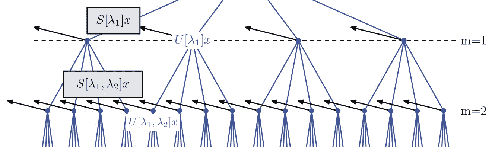
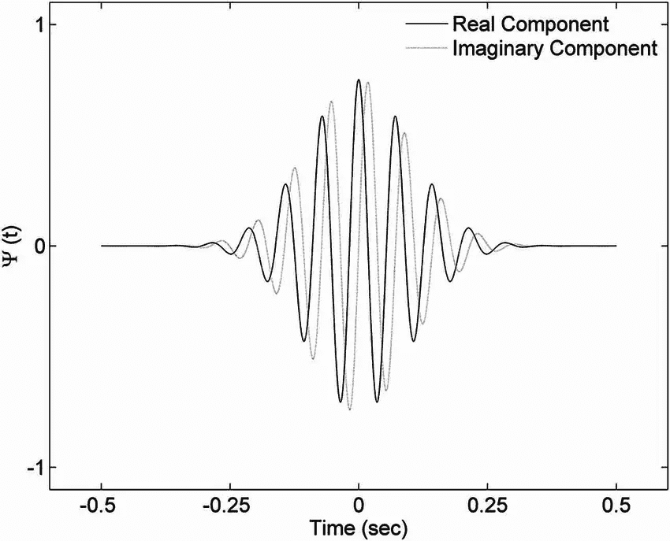
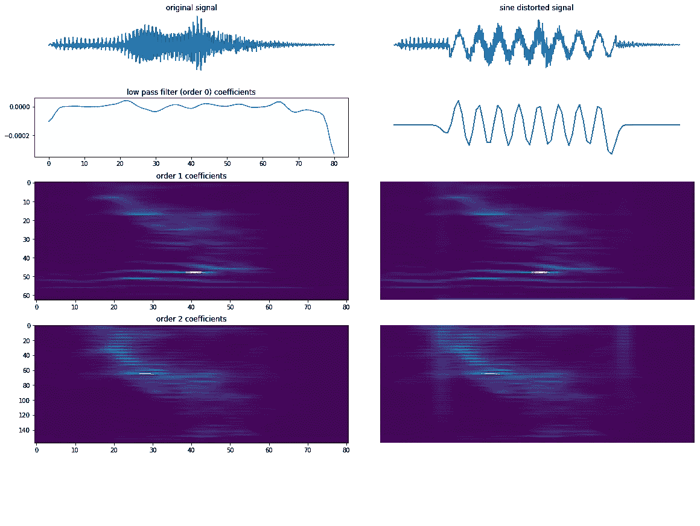
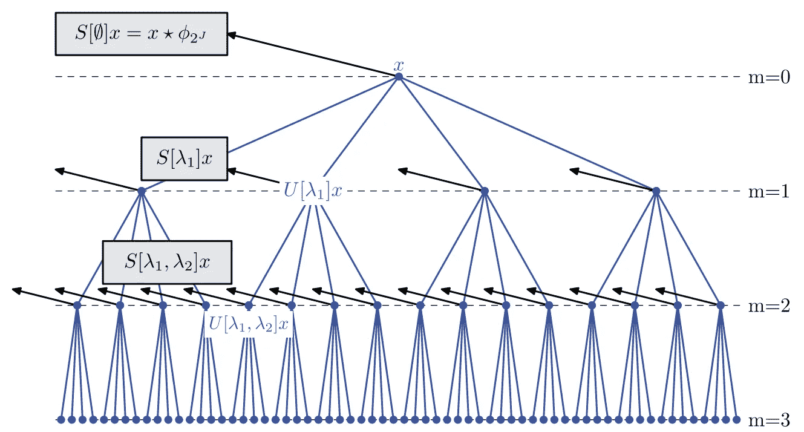
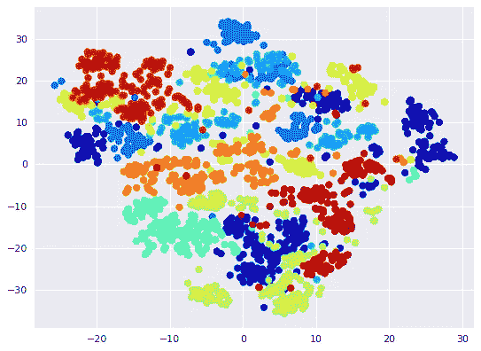

# 适用于 20 个样本的 ConvNet:小波散射

> 原文：<https://towardsdatascience.com/a-convnet-that-works-on-like-20-samples-scatter-wavelets-b2e858f8a385?source=collection_archive---------6----------------------->

Scatter Transform architecture, from J. Bruna and S. Mallat, [Invariant Scattering Convolution Networks](https://arxiv.org/abs/1203.1513) (2012)

通常在数据受限的情况下，场景理解必须在很少的时间序列观察下进行——无论是音频、视频还是雷达。我们使用一种令人惊讶的被低估的叫做小波散射的技术来做到这一点。

小波散射(或散射变换)生成一个对数据旋转/平移不变且对数据变形稳定的表示。数据中无意义的变化会被丢弃，例如，音频样本会时移不同的量。像分类这样的下游任务的信息被保留。小波散射无需训练，适用于低数据。

它的主要计算是卷积，使其快速并适用于图像和 1D 信号。在本文中，我们主要关注信号。我们将追溯信号处理社区的发现，并将其与现代机器学习概念联系起来。我证明，是的，我们可以在没有 *学习、*使用 20 个样本的情况下做得很好*。使用链接中的 colab 笔记本重新创建本文中的实验和插图。*

# 小波

小波可以像滤波器一样与信号进行卷积。我认为**卷积**是内积的连续模拟，其中大的激活(通常用 ML 表示)或小波系数是由连续对象之间的相似性引起的。通过将字典中的元素卷积到被检测的信号中，我们获得了局部的空间相关性。

卷积是深度学习出现过程中的一个关键计算——它速度极快。本文使用的小波散射实现只为高效卷积调用深度学习后端！Kymatio 是一个伟大的 Python 包，由热情的研究人员构建，利用 PyTorch 框架实现小波散射。

Real and imaginary components of the Morlet Wavelet from M. Adamczyk et al., [Automatic Sleep Spindle Detection and Genetic Influence Estimation Using Continuous Wavelet Transform](https://www.ncbi.nlm.nih.gov/pmc/articles/PMC4652604/) (2015)

小波散射的基本构件是**小波**小波**小波**。这是一个高斯窗口正弦曲线，与哺乳动物的听觉和视觉有很深的联系。通过对由不同频率位置 *v* 索引的小波 *ψᵥ* 进行卷积， *x* 的小波变换就是散射系数的集合

*{ x*∫*ψᵥ}ᵥ*

当小波的正弦分量有扩展空间(正弦波“减缓”其振荡)时，它以去相关的尺度分解信号。这有利于揭示信号的频率结构，但要在更长的时间范围内进行。结果是更宽的高斯窗口用时间分辨率换取更高的频率分辨率(这本身就是海森堡测不准原理的结果)。在实践中，使正弦波逐渐变细的高斯窗口的宽度是一个重要参数[【m . Cohen 2018】](https://www.biorxiv.org/content/biorxiv/early/2018/08/21/397182.full.pdf?source=post_page---------------------------)。

# 小波散射

小波散射的历史背景始于傅立叶变换，即典型的信号处理技术。傅立叶表示的缺点包括它对高频信号变形的不稳定性。对于被高频变形为 *x* ̃而轻微扰动的信号 *x* ，它们的频谱图表示看起来不同(large‖*FFT(x)-FFT(x*̃*)*‖*)，即使它们对于人眼来说仍然是相似的信号。这种不稳定性是由于正弦波不能定位频率信息，因为正弦本身具有非定位支持。*

**

*November, Golden Gardens credit: [u/purebredcrab](https://www.reddit.com/user/purebredcrab/) at [reddit.com/r/analog](https://www.reddit.com/r/analog/comments/a672in/november_golden_gardens_mamiya_rb67_75mm_kodak/)*

***小波变换**通过用一族小波分解信号来解决这一问题，小波具有各种伸缩，其中每个小波都有局部支持(最终变平，就像 Morlet 小波一样)。得到的小波表示定位了信号的高频分量。**然而，因为小波算子与平移互换，所以产生的表示变成平移协变——平移信号也会平移其小波系数。**这使得翻译信号之间的比较变得困难，而翻译不变性是分类等任务的关键。我们如何实现信号表示φ(*x*)是平移不变的，在变形下是稳定的，并且在所有频率下提供良好的结构信息？*

*小波散射用一个冗余的 Morlet 小波字典建立一个信号**表示**φ(*x*)。虽然信号空间 *X* 可以是真正的高维空间，但是该变换在信号空间上形成了一个核度量，导致了一个较低维的流形。观看 [Stéphane Mallat 讨论可视化的流形解释](https://www.youtube.com/watch?v=4eyUReyIPXg&source=post_page---------------------------)。*

*读者可能已经训练了一个神经卷积网络，将图像编码成潜在流形 *Z* ，其代码/潜在表示用于分类或结构发现——这就是类比中发生的事情。**小波散射对数据集 *X* 进行编码，其中 *X* 中的无信息可变性:平移、旋转和缩放——*组*的动作——在该过程中被丢弃。***

*φ[【j .布鲁纳和 s .马拉特，2013】](https://www.di.ens.fr/~mallat/papiers/Bruna-Mallat-Pami-Scat.pdf)转换信号的主要好处是*

> **φ*对信号平移不变。*

*用 *xₜ* 表示一个与 *x* 相同的信号，除了在时间上被转换，则φ(*x*)=φ(*xₜ*)。*

> **φ*在信号变形下稳定。*

*即，φ是对变形连续的 Lipschitz 信号与其变形版本的散射表示之间的差异是线性的*。一个变形可以是一些局部的位移/扭曲(或者一个*可笑的*量的扭曲，如后面的例子所示)。对于 Lipschitz 常数 C > 0 和引起变形以产生 *x* ̃的位移场τ( *u* ),**

*‖(*x*)-φ(*x*̃)‖*≤*c*‖*x*‖*supᵤ*|*∇τ(*u*)*|****

*其中‖*x*‖=∫*x*(*u*)*杜*、 *|* 、 *u* ) *|* 为全局变形幅度。*

> **φ*不需要学习。*

*小波散射引入的先验足够好，以至于它的性能经常使得学习变得多余；此外，它还带有可解释的特性和输出。**在数据受限的情况下，如果可比较的数据是公开可用的，一个很好的计划是通过一个预训练的模型来传输你的小数据集。但是，在数据集较小且唯一的困难情况下，可以考虑将小波散射作为 ConvNets 和其他模型的初始化。我怀疑“数据约束学习”的未来将是协同预定义过滤器和学习过滤器。***

*下图说明了变形下的稳定性。 **Left** 我们对说话者说‘零’的声音应用了散射变换。散射表示由从平均/低通滤波器、1 阶小波和 2 阶小波导出的系数组成。**右**在施加了用正弦波大部分掩盖了原始信号结构的位移场之后，φ(*x*̃)几乎不受影响；通过φ变换将变形的影响线性化。*

**

***卷积网络**散点表示由 0 阶、1 阶、2 阶系数组成，通过不同序列的小波合成产生。合成在一起的多个小波捕获高频结构，例如，二阶系数显示信号内的波干扰(在音乐中听起来是不和谐的)。我们现在简要介绍一下计算是如何完成的(复数模数和均值滤波器在附录中有更详细的解释)。*

*在第 *m* 层，将第 *n* 组预定义小波{ ψᵥ₁，…，ψᵥₙ} }与来自第( *m-1* )层的属于前一小波ψᵥᵐ⁻的系数进行卷积。在上图中，第一层与ψᵥ卷积，然后是第二层与ψᵥ卷积，得到一行 2 阶系数。*

*总的来说，我们将小波序列表示为长度为 m 路径为 p =ψᵥψᵥᴹ).通过卷积然后取复数模|⋅|，表示算子 U[ v₁，v₂，…，vₘ].]的结果有序积对于长度为 2 的路径，*

*u【v₁，v₂】*x*= | |*x*∫ψᵥ₁|∫ψᵥ₂|*

*为了最终提取如上图中的一行系数，应用一个平均滤波器φ，并将其称为 S[ v₁，v₂，…，vₘ]:*

*S[ v₁，v₂ ] *x* = U[ v₁，v₂]*x*∫φ(*u*)*

*从数据 *x* 开始作为根，该小波树中的根路径集指定φ(*x*)。实际上，最长为 2 的路径足以从自然发生的数据中提取所有相关的频率信息。因此，与小波变换相比，散射变换的显著特点就是 2 阶系数。*

**

*A 3-layer scatter network. Notice to extract any coefficients, we must apply the averaging filter *Φ. Diagram from* J. Bruna and S. Mallat, [Invariant Scattering Convolution Networks](https://arxiv.org/abs/1203.1513) (2012)*

***示例任务**让我们对真实数据集应用散布变换。[自由口语数字数据集(FSDD)](https://github.com/Jakobovski/free-spoken-digit-dataset) 有来自 4 个说话者的 2000 个记录，每个说话者说一个数字 50 次。经过小波卷积后，我绘制了高维系数的 2D t-SNE 投影。每个点是一个音频样本的散点表示φ(*x*)，按数字类别着色。*

**

*Blue points belong to class zero? Red is one? Maybe a legend would have been helpful Lihan…*

*在时间序列分类任务中，竞争技术包括动态时间弯曲、隐马尔可夫模型以及 LSTMs 和 RNNs 之类的神经模型。让我们看看小波散射是如何表现的，即使是在数据极其有限的情况下。作为预处理，我们对音频样本进行 Z 归一化。然后，音频样本被 0 填充到统一长度，并且大约 20 个音频样本被丢弃，以确保分散表示具有相同的维度。继续*不学习*的实践，我们使用 3 个最近邻作为分类器。*3NN*(φ(*x*))预测第 *i* 位，如果训练集中最接近φ(*x*)的至少两个邻居属于第 *i* 位，或者最接近的邻居是第 *i* (在三向联系中有这种可能)。*

*对于 1981 个样本，我们发现**的三重分类准确率为 91.5%** ，对于一个由 **20 个样本组成的训练集**、**、**以及保留集**、**中的所有其他观测值，我们达到了 **49%** 。还不错，考虑到我只尝试了 Q 超参数(每个八度音程的小波数)的不同值，并留下了其他转盘。在随附的笔记本中尝试不同的比例参数 J 值。*

*我完成了激发小波散射。在这一点上，如果你开始自己探索这个技术，我会很高兴，[也许从我的数字音频 jupyter 笔记本](https://colab.research.google.com/drive/1uc1BzwnDwXQ5p2jrfY3r_-rVfV869tA6)开始。附录深入探讨了小波散射的关键属性，如当 *x* 为图像时如何利用φ(*x*)以及实际考虑因素。*

*他们说需要一个开发团队来开发一篇中型文章。没有包括爱德华、文森特和迈克尔在内的研究人员和开发人员，这是不可能的。我很高兴有机会在 Paul Bendich 的指导下，与政府机构合作，在 [Geometric Data Analytics](https://geomdata.com/) 上解释和利用这项令人惊叹的技术。*

# *附录*

*实际上，给定路径 *p* = ( ψᵥ₁，ψᵥ₂)，提取二阶系数还需要**复数模数** | ᐧ |和**平均滤波器** φ:*

*s【v₁，v₂】*x*(*u*)= | |*x*∫ψᵥ₁|∫ψᵥ₂|∗φ(*u*)*

*[夏羽·马拉特解释了](https://youtu.be/4eyUReyIPXg?t=3060)前人对小波散射，然后对复模数和平均滤波器的需要。*

*复数模量是小波散射的秘密武器。| ᐧ |是应用于系数的非线性，使它们 1)对微分同胚稳定，2)在欧几里德度量中稳定 *L* 。复数模量使得φ(*x*)lip schitz 关于变形是连续的。从视觉上看，模数形成了系数的上包络。*

*每当φ被应用于系数|*x*∫ψᵥ|时，我们接受去除高频分量，以便定位覆盖较低频谱的仓(丢弃|*x*∫ψᵥ|)的相位。为了保留高频信息，散射变换在通过φ定位其不同的频率仓之前，沿着小波路径 *p* 进一步传播高频信息。*

***图像的小波散射**2D 小波可以与图像数据进行双向卷积。除了伸缩参数，2D 小波可以旋转。*

*例如，研究人员发现小波散射在纹理图像分类方面表现出色，其中主要障碍是找到一种“缩放”、平移和旋转不变的表示方法——一旦这些*组动作*从样本生成过程中被排除，纹理分类就很简单了。小波散射所忽略的正是这些可变性。*

***参数化小波字典**当小波的正弦分量有扩展空间时(正弦波“减缓”其振荡)，它以去相关的尺度分解信号。这有利于揭示信号的频率结构，但要在更长的时间范围内进行。结果是更宽的高斯窗口用时间分辨率换取更高的频率分辨率(这本身就是海森堡测不准原理的结果)。在实践中，使正弦波逐渐变细的高斯窗口的宽度是一个重要参数[【m . Cohen 2018】](https://www.biorxiv.org/content/biorxiv/early/2018/08/21/397182.full.pdf?source=post_page---------------------------)。*

*本文中的小波字典由 J(最大对数标度)和 Q(每个八度音程的小波数)来参数化。通过将小波宽度增加一个 2^J.因子，增加 j 以时间分辨率换取频率分辨率。大的 j 意味着发出更少小波系数的“长”小波，导致更短的小波表示。*

*对于音频信号，较大的 Q 值(介于 4 和 16 之间)通常是有益的，因为这些信号通常具有很高的振荡性，频率比时间更容易定位— [kymatio 教程](https://www.kymat.io/gallery_1d/plot_filters.html#sphx-glr-gallery-1d-plot-filters-py)*

*对于信号处理从业者来说，散射变换的小波形成了一个非正交的冗余字典。*

***信号能量保持不变**小波卷积的合成保持了信号范数，或者基本上保持了信号能量。这是因为小波变换是一种收缩的可逆算子。在沿路径的每个卷积之后，平均滤波器将原始信号内的能量转换成“系数能量”。对于加州理工学院-101 图像数据库，[【j .布鲁纳和 s .马拉特，2013】](https://www.di.ens.fr/~mallat/papiers/Bruna-Mallat-Pami-Scat.pdf)显示，对于任何 j 值，深度为 3 的网络保存了约 99%的信号能量*