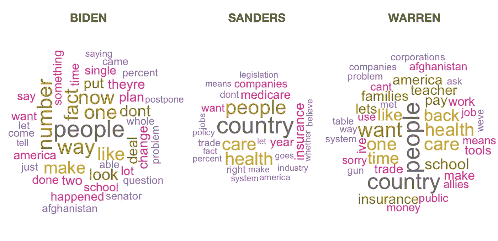

# 第三次民主辩论的数据分析

> 原文：<https://towardsdatascience.com/a-data-analysis-of-the-third-democratic-debate-67094c363083?source=collection_archive---------40----------------------->

## 辩论数据能告诉我们谁赢了吗？

Photo by [Kyle Head](https://unsplash.com/@kyleunderscorehead?utm_source=medium&utm_medium=referral) on [Unsplash](https://unsplash.com?utm_source=medium&utm_medium=referral)

在许多方面，政治似乎已经取代棒球成为全国性的消遣。就像体育博客和 ESPN 争论球类运动一样，新闻网站和 CNN 的专家们也沉迷于政治竞选的细枝末节。

本着体育赛事的政治精神，我认为从这个领域再偷一招——体育统计——会很有趣。内特·西尔弗和其他人完善了民意测验专家的艺术，但我希望能更进一步。正如 Sabermetrics 让我们对棒球世界有了新的认识，我希望政治数据可以让我们对政治前景有更好的看法。为此，我分析了上一次民主党辩论的记录，并分析了数据以寻找趋势。这是我的发现。

# 关注并不总是随着投票而来

就数据而言，新闻报道的一条信息是说话时间。理论上，越受欢迎的候选人应该得到更多的时间，因为观众对他们要说的话更感兴趣。实际上，情况并非如此。

下面是两个对比图。左边是最新早间咨询民意调查的图表。右边是每位候选人在 9 月辩论中的发言字数。

Left — Democratic Polling : Right — Words Spoke during Sept Debate

不出所料，领先的乔·拜登在辩论中获得了最多的字数。然而在他下面，投票和发言时间之间有很大的差异。民调支持率仅为 3%的科里·布克参议员几乎和前副总统说得一样多。当然，大部分都是在辩论接近尾声的时候。尽管如此，它还是说明了当权派候选人是如何在电视上受到优待的。

有趣的是，时间充裕的伯尼·桑德斯在说的单词方面几乎垫底。很明显，他比他的对手说得更慢，用的词更少。我还观察到，他不太愿意超过分配给他的时间，也不需要像其他候选人那样被打断。

最后，不管你怎么看，杨安泽在辩论中被欺骗了。在大多数民意调查中，杨的表现优于奥罗克、布克、卡斯特罗和克洛布查尔。然而，他在电视上只说了少得可怜的 1600 字。这并不奇怪，因为杨经常被主流媒体忽视，以至于他有时会被完全从政治报道中抹去。

# 好斗能获得播出时间

当比较候选人的发言时间和他们的投票时，观察到的最大差异是朱利安·卡斯特罗。尽管民调支持率只有 1%，他说的话甚至比皮特·布蒂吉格还多。这主要是因为卡斯特罗利用他的演讲时间发动了攻势。

冲突造就了好的电视节目，所以卡斯特罗有足够的机会与乔·拜登辩论。这是有数据证明的。如果只看候选人发言的次数(包括简短的交流)，我们会发现卡斯特罗做得非常好。

这一策略是否会提高他的支持率还有待观察，但很明显，继续攻击将会获得更多的播出时间。

# 沃伦和桑德斯最受观众欢迎

辩论笔录中最能说明问题的一句话是“(掌声)”。如果我们计算每个候选人的掌声次数，我们就能知道谁在现场观众中表现最好。

令人惊讶的是，领先的乔·拜登几乎排在名单的末尾。只有艾米·克洛布查尔(Amy Klobuchar)不太受与会者的欢迎(我预计她很快就会退出)。

伯尼·桑德斯和伊丽莎白·沃伦支持的进步议程最受民主党人欢迎，这或许不足为奇。在描述他们的“全民医保”计划时，两人都获得了积极的观众反应。

# 科里·布克会讲笑话

另一个值得注意的词是“(笑声)”。让观众发笑是让他们喜欢你的一个简单方法。在这方面，科里·布克做得最好。他在晚上得到了一些很好的笑点，特别是当他自嘲他的纯素食饮食时。

布克作为一名沟通者如此娴熟，而且他如此受媒体喜爱，这一事实表明他可能是这场竞选中的一匹黑马。如果卡玛拉·哈里斯开始下滑，我预计更优雅的布克将取代她的位置，成为一个迷人和可口的中间派候选人。

# 每个候选人都专注于“人民”

我们可以从这场辩论中收集到的另一个数据是哪些词用得最多。如果去掉“会”、“必须”、“美国人”等无聊的政客词汇，就能统计出每个候选人最常用的词汇。这些术语用下面的单词云表示。

纵观领跑者，无一不是在呼吁“人民”。这个词是最常见的。这些诉求的性质因政治家而异。拜登专注于“事实”和“数字”，表明他试图显得务实。桑德斯和沃伦花更多的时间谈论“医疗保健”、“保险”和“公司”。沃伦从“家庭”的角度谈论个人，而桑德斯从“国家”的角度看待事物。

中间派候选人也对“人民”有吸引力。哈里斯通过她反对“特朗普”，布克通过呼吁“社区”。皮特·布蒂吉格词云的平淡表明他的中心思想是模糊的，难以确定的。

最后，在低层候选人中，我们观察到一些有趣的趋势。奥罗克在提到得克萨斯州和埃尔帕索时大多处于高位。杨想给人们钱，并与私营公司合作解决医疗保健问题。克洛布查尔大概说“我认为”太多，也想“团结”人。最后，卡斯特罗正在努力推动自己的医疗保健“计划”，同时也在攻击其他候选人的计划。

# 最后的想法

《金钱球》出版后，统计数据开始主导体育评论和分析。同样的事情还没有发生在政治上。大多数专家仍然依靠直觉来描述政治形势，只有当民意调查出来时，他们才会接受现实的检验。有了[推特](/which-2020-candidate-is-the-best-at-twitter-fd083d13fb4e)、[新闻报道](/which-democratic-candidate-gets-the-most-news-coverage-aa4312fb53db)，以及现在的电视辩论，我们有了大量的数据来进行更客观的分析。随着时间的推移，我相信这些工具将会有更好的预测能力。