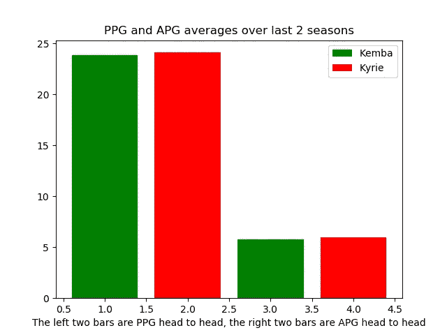

# 肯巴-垂怜经“互换”的数据驱动分析

> 原文：<https://towardsdatascience.com/a-data-driven-analysis-of-the-kemba-kyrie-swap-24241f136d29?source=collection_archive---------26----------------------->

## 使用 Python 的数据科学模块来分解统计数据和高级指标，看看哪个球员更适合波士顿凯尔特人队。

这个 NBA 淡季是整个联盟运动的焰火。仿佛是很久以前，凯里·欧文离开小镇去了布鲁克林和凯文·杜兰特一起打球。不到一年前，垂怜经声称自己热爱波士顿，并将长期留在这里。然而，与其他波斯顿球迷不同的是，我很难将对垂怜经的憎恨藏在心里，因为作为一名球员，我太喜欢他了——这与本文的观点无关。

现在让我们波士顿球迷惊讶的是夏洛特黄蜂队的肯巴·沃克有兴趣来凯尔特人队打球。这很奇怪，因为 1)沃克似乎打算留在黄蜂队，2)波士顿似乎真的是从他想要的比赛目的地冒出来的。我们都知道他在康涅狄格大学做了什么，当他在三月疯狂锦标赛中投篮命中，最终带领哈士奇队赢得男子大学篮球冠军

无论如何，让我们进入这篇文章的主题。让我们试着剖析谁赢得了这场“交换”，谁是更好的球员，以及我们可以期待什么。我们在这里只分析有形的东西，所以我们不能考虑无形的东西，比如化学反应和球员对教练的反应。

在我们真正分解它之前，让我们看看一些基本的统计数据(所有统计数据都来自 basketball-reference.com)。我将使用 Python(尤其是 matplotlib 模块)来生成一些图形。让我们开始吧。

Points Per Game (career)

让我们来看看与控卫位置最相关的数据。传统上和历史上，控球后卫的位置是控制比赛节奏的位置。很自然地，我想到了两个数据:得分和助攻。垂怜经职业生涯 22.2 PPG，肯巴 19.8 PPG。

Assists Per Game (career)

如果我们看看助攻，数据更相似，肯巴是 APG 的 5.5 次，垂怜经是 APG 的 5.7 次。他们职业生涯的平均得分和平均助攻都非常相似。垂怜经是更有天赋的球员，所以我们可以把更高的 PPG 归因于此。虽然垂怜经在职业生涯中受益于更好的队友，但他仍然平均每场比赛只多 0.2 次助攻，这可能表明肯巴可以在球队中服务得更好。即使当垂怜经在凯尔特人，一个可以说更有天赋的球队打球时，他平均只有 6.1 个 APG，只比他在骑士队的平均水平高出 0.6 个 APG，只比他的职业生涯平均水平高出 0.4 个 APG。

既然我们比较了传统控球后卫的标准数据，让我们来看看现代 NBA 中非常重要的东西——三分球。

在我们继续深入之前，值得注意的是，虽然垂怜经和肯巴都打了 8 个赛季——他们都是在 2011 年的选秀中被选中的，分别在第 1 和第 9 选择，肯巴打了 97 场比赛，尽管垂怜经在他参加的所有 508 场比赛中都是首发。让我们来看看三个百分点和总数:

垂怜经和肯巴场均 2.1 3 分。然而，垂怜经的投篮命中率更高，平均每场 5.4 次，而肯巴每场 5.9 次。虽然这看起来不是一个巨大的差异，但实际上肯巴的三分球命中率为 35%，而垂怜经的命中率接近 39%。

总数再次描绘了一幅相似的画面。做出来的 3 个百分点显然和上面一样。肯巴更多的尝试(和失误)可以归因于更多的比赛。然而，话虽如此，肯巴在他职业生涯的 605 场比赛中投进了 1283 个三分球，而克里在 508 场比赛中投进了 1063 个三分球。如果我们假设一切保持线性，让垂怜经打 605 场比赛，他将会投中 1266 个三分球，这在某种程度上是可以比较的。

到目前为止，有两点需要注意——这些数据基本上没有让我们得出更适合的现实结论；也就是说，我们只是看到了两个伟大的控球后卫职业生涯中的平均水平。包含每 36 分钟的统计数据并没有什么意义，因为两位球员都打了首发级别的比赛(肯巴每分钟 34.1 分钟，而垂怜经每分钟 33.8 分钟)。我认为更能说明问题的是最近几个赛季，以及一些更先进的指标。

所以我们来思考一下为什么要看近几季。有几个原因。首先，我们想看看谁更适合波士顿凯尔特人队的整体。这意味着我们只想看看垂怜经的最后两个赛季，并将它们与肯巴的赛季进行比较。我们可以在这个概念上加倍下注，因为肯巴从 2017 赛季开始才成为全明星。无论你是否认为他在那之前应该是全明星球员，这都不会帮助我们，所以让我们深入了解过去两个赛季的统计数据和高级指标。让我们把最基本的东西弄清楚。

PPG，APG 和 3PT%是我们想再看看的。

再一次，这个数据有点不确定，因为在过去的两个赛季中，肯巴场均 23.85 次 PPG，而垂怜经场均 24.1 次 PPG。APG 也是如此，肯巴和垂怜经分别为 5.75 和 6 APG——尽管垂怜经上赛季的确有职业生涯最高的 6.9 APG，这可以归功于更好的队友，我们很快就会看到这一点。

在过去的两个赛季中，垂怜经是一个神奇的三分射手，他的三分命中率为 40.4%，而肯巴只有 37%。垂怜经的能力，尝试和艰难的运球投篮(三分)不能被忽视；联盟中可能没有其他球员更擅长创造自己的投篮机会*勒布朗球迷对我的愤怒加剧*

值得注意的是，在过去的两个赛季中，肯巴几乎参加了所有可能的比赛，只缺席了两场比赛。肯巴打了 162 场比赛，而垂怜经打了 127 场。肯巴的长寿是一个巨大的加分点，但在肯巴的三个全明星赛季中，黄蜂队都没有进入季后赛。在某种程度上，我们可以再次将这归因于他周围的团队，我们将查看一些高级指标，看看谁更适合。

# 高级指标

如前所述，在肯巴的每个全明星赛季，夏洛特黄蜂队都没有资格进入季后赛。垂怜经上赛季无疑拥有他职业生涯中最好的配角，但作为一个团队，凯尔特人队只获得了 49-33，低于上一年的表现。黄蜂队以 39 比 43 结束了比赛。为了更好地了解支持强制转换，让我们更深入地了解指标。

在 37 场比赛中一起出场最多的黄蜂队首发阵容是尼克·巴图姆-杰瑞米·兰布-肯巴·沃克-马文·威廉姆斯-科迪·泽勒。这个阵容取得了 19 胜 18 负的战绩，是他们所有首发阵容中最好的胜率(51.4%)。另一方面，波士顿凯尔特人队的首发阵容一起打了 33 场比赛，19 胜 14 负，胜率为 57.6%。这个问题中的阵容是艾尔·霍福德-凯里·欧文-马库斯·莫里斯-马库斯·斯马特-杰森·塔图姆。这可能会让某些人感到震惊，因为 1)我们付给戈登·海沃德很多钱，对他期望很高，2)杰伦·布朗似乎有退步的迹象。如果我们更深入地观察，我们会发现实际上有两个 5 场比赛的首发阵容非常出色。阿隆·贝恩斯-艾尔·霍福德-凯里·欧文-马库斯·斯马特-杰森·塔图姆的阵容以 80%的胜率取得了 4 比 1 的胜利，艾尔·霍福德-马库斯·莫里斯-特里·罗齐尔-马库斯·斯马特-杰森·塔图姆的首发阵容以明显的 100%胜率取得了 5 比 0 的巨大胜利。

艾尔·霍福德、马库斯·莫里斯和阿隆·贝恩斯已经不在队里了。因此，这将对我们如何让肯巴适应凯尔特人产生明显的影响。在我们尝试将这些放在一起之前，让我们看一下 2018-2019 赛季的 win share 相关指标。我们将关注 VORP(价值超过替代球员)。如果我们把一个玩家的 VORP 乘以 2.7，我们得到他们的战争(胜于替换)。由于比例是线性的(2.7 倍)，所以在数据可视化方面并不重要，所以让我们看看 2018-2019 赛季的 VORP。

这里我们有凯尔特人队首发阵容的 VORP，他们一起打了 33 场比赛。凯里·欧文拥有最高的 VORP，为 4.7，占 VORP 首发阵容的 41.6%。欧文得益于艾尔·霍福德的帮助，他的得分是 3.4。

如果我们看看黄蜂队的 VORP 图表，我们看到肯巴实际上在整个 VORP 中占了更高的百分比，为 41.9%。肯巴的个人 VORP 是 3.9，但没有一个艾尔·霍福德类型的人来帮助他。整个团队中第二高的 VORP 是尼克·巴图姆，1.7 分。所以很明显，垂怜经确实有更好的配角。

为了更好地了解支持阵容，让我们看看没有肯巴和垂怜经的阵容。

很明显，凯尔特人的队友上赛季比黄蜂的队友打得更好，分别是 17.82 分和 14.58 分。

以我们对凯尔特人阵容的了解，让我们看看如果我们把肯巴放入肯巴-马库斯·斯马特-杰森·塔图姆-杰伦·布朗-伊内斯·坎特的最佳阵容会发生什么。我承认这不会是完美的，因为 1)伊内斯·坎特的 VORP 上赛季不会很好，因为他取代了正在经历职业生涯赛季的努尔基奇(所以我们将使用他职业生涯的平均水平 VORP ), 2)我们不知道首发阵容会是什么，这意味着我们不能真正在杰伦·布朗或戈登·海沃德身上下注。

事实上，杰伦·布朗的 VORP 值为 0.0。海沃德的 VORP 指数实际上是 1.2，这让我感到意外，可能也让所有人感到意外。我们应该期待布朗和海沃德在没有垂怜经的情况下在本赛季向前迈进一步。

我会把前面提到的 more 瓦尔和垂怜经/肯巴的对比放在另一张图上，但这并不能说明什么，因为垂怜经的 VORP 是 4.7，而肯巴是 3.9，所以它只会持续 0.8。

所以这些数字告诉我们，就纯生产而言，凯里·欧文和肯巴·沃克之间并没有巨大的差距。正如我之前提到的，我只考虑了有形资产。我试着不偏不倚，但根据这些数据，凯尔特人队的总胜率比上赛季更好并不是不可能的。老实说，VORP/战争的数据告诉我们，霍福德是更大的损失，因为他上赛季 3.4 的 VORP 远远超过了预计的中锋伊内斯·坎特，他上赛季的 VORP 为 0.6(但职业生涯的 VORP 为 2.1，尽管仍有所下降)。

很明显，这不是一篇完美的文章，也不是对名单和两名球员的分析。我这样做有几个原因:

1.  了解篮球运动中的高级指标
2.  使用 Python 中的数据分析模块来实现数据可视化

我会很高兴地感谢任何反馈！我知道网上已经有其他工具来做我所做的这种类型的分解，但我这么做只是为了好玩，因为它结合了我最喜欢的两件事:篮球和编码(尤其是 Python)。我完全打算把这样的东西放在一起，可能会看看科怀·伦纳德和保罗·乔治的新阵容。展望未来，我希望:

*   实施机器学习模块来预测最佳阵容
*   从 Basketball-Reference.com 导入 CSV(逗号分隔值)格式的数据，这样我就不用硬编码值了。通过这种方式，我可以创建一个项目，该项目具有对任何球队的任何球员进行分析的类和函数。
*   与前一个项目相反，因为我可以引入一个 CSV，所以我也可以使用 Pandas 模块。

最后，万一垂怜经或肯巴看到这个:这只是一个软件工程师在找乐子，并试图学习。我对你们以及你们为凯尔特人所做的/将要做的一切只有爱。

感谢阅读！

图像来源:

1.  [https://bleacher report . com/articles/2835452-尼克斯-谣言-凯里-欧文-给予强烈考虑-肯巴-沃克-雷达](https://bleacherreport.com/articles/2835452-knicks-rumors-kyrie-irving-to-give-strong-consideration-kemba-walker-on-radar)
2.  [https://www . nytimes . com/2011/03/11/sports/ncaabasketball/11 uconn . html](https://www.nytimes.com/2011/03/11/sports/ncaabasketball/11uconn.html)