# 人格模型的数据科学方法

> 原文：<https://towardsdatascience.com/a-data-science-approach-to-personality-models-d3c7e18a377?source=collection_archive---------8----------------------->

# **1。简介**

我个人一直觉得人们在行为方式上的差异很有趣，所以这项研究将让我们对此有更多的了解。我们将洞察一个人的特征如何与他们的性格特征和习惯相关联，甚至能够根据一些人口统计数据进行预测。

特别是，大多数当前的性格测试利用了普遍接受的 5 因素模型，也称为海洋，以组成它的 5 个因素的首字母命名。

对经验的开放。(*创新/好奇*vs*一贯/谨慎*)

C .责任心。*(高效/有条理与随和/粗心)*

[E]外向。*(外向/充满活力与孤独/保守)*

宜人性。*(友好/富有同情心与挑战/冷漠)*

神经质。*(敏感/紧张与安全/自信)*

该模型基本上是一种被该领域专家普遍接受的人格特征分类方法，因为它允许捕捉人与人之间最相关的人格差异。然而，它也是辩论和批评对象。

有人认为，作为一种解释性或预测性理论，五大模型的范围是有限的。也有人认为，五大人格量表只占正常人格特质的 56%。

一个常见的批评是五大人格不能解释所有的人类人格，事实上，一些心理学家不同意这个模型，因为他们觉得它忽略了人格的其他方面。由于这个原因，一些人已经开始把五大心理学称为“陌生人心理学”，因为他们指的是陌生人身上相对容易观察到的特质，而其他更私人化或更依赖于背景的个性方面被排除在外。

鉴于范围限制的批评，也许可以开发一个新的心理测量模型，以找到相关的维度或替代的潜在因素来解释人格的差异。因此，这成为本文的核心，我将在下面的章节中详细解释。

# **2。数据**

这个数据集不是以海洋方法为基础的，它是一个有趣的答案集合，通过个人兴趣、性格特征、生活方式和个人特征，回答了从音乐偏好到恐惧症等一系列不同的问题。它是通过调查收集的，调查对象是 1010 名年龄在 15 至 30 岁之间的欧洲人。顺便提一下，答案中几乎没有缺失值，但是由于样本量足够大，我们可以小心地完全删除这些行。要了解问题列表的更多信息，请参考附录。

抽样单位是按行组织的单个回答。在列中，我们可以找到变量。我分析的重点是，一方面是基本特征，另一方面是个性特征。

## 基本特征

**性别。**分类，男，女。

**年龄**。数值变量，但按照以下标准转换为序数变量:

*   1:15–19 哟
*   2:20–24 哟
*   3:25–30 yo(比其他组多花一年时间，但有意义，因为就受访者而言，该组人数较少)

**教育。**序数变量。类别如下:

*   1:小学
*   2:中学
*   3:大专学历
*   4:硕士学位和博士学位(我加入了他们两个，因为受访者中很少有博士)

受访者度过大部分童年时光的地方。类别:

*   村庄
*   城市

## 性格特征

更准确地说，这份名单不仅包括性格特征，还包括对生活的信念和看法，在我看来，这些都可以追溯到性格特征。

它由 54 个问题组成，所有问题都有 1 到 5 级的建议答案，1 表示强烈反对，5 表示强烈同意。实际上有 57 个，但为了简单起见，删除了 3 个，因为它们与其余的性质不同。

## 其他感兴趣的数据

除了个性数据，还有关于兴趣、音乐偏好、恐惧症和生活方面的问题。

答案的范围也是从 1 到 5。

# 3.方法学

为了进一步实现我们的目标，即找到人格特质与一个人的特征之间的关系的有价值的见解，先花些时间研究一下人格特质的问题列表是很方便的。在这个意义上，我们说的是一个**因素分析**。背后的理由是双重的。

首先，我们希望能够在相似的维度上对变量(问题)进行分组，而不损失信息的能力，换句话说，我们希望降维。这很方便的原因是因为向前看，使用几个变量比使用很多变量要方便得多(记住我们在谈论 55 个问题，所以有 55 个变量)；尤其是关于将来使用回归技术的前景。因此，简而言之，这就好像我们在为随后的分析筛选变量。

其次，它将允许我们发现潜在的结构，这些结构也许可以建立一种人格测试的替代心理模型。

因此，由于没有创建变量时使用的模型，或者我们可以与之进行比较的任何参考，我们需要探索是否可以找到潜在的相关维度，因此该分析实际上是一种**探索性因素分析**。

一旦基本原理清楚了，我们该如何进行呢？

首先，对变量之间的相互关系有所了解是有好处的。为此有两个选项，一个是绘制**关联热图矩阵**，另一个是对所有问题运行 **PCA** ，以查看它们在前两个维度上的回归，并观察它们如何相互关联。请注意，主成分分析是一种降维方法，但出于此目的，最好利用其他方法。正如我们将在结果部分看到的，两者都是计算出来的。

特别是，使用基于 Ward 最小方差凝聚法的系统聚类绘制了相关可视化。Ward 的聚类遵循在树的每个节点处合并两个聚类的标准，其中它试图最大化新聚类的均值与其他聚类的均值的分离，这相当于最小化新组合的聚类内的离差。r 包 Corrplot 允许我们计算这个。

在此之后，使用的方法是主轴分析。这里的要点是提取因子后的旋转，以不断寻找潜在结构。使用的旋转方法是 varimax 旋转。R 中的 Factanal 包用于计算这一点。

此时出现的一个问题是，我们需要执行多少次旋转？意思是，我们在哪里停止得到因子或维度？

在这里，scree 图就派上了用场。scree 图描绘了变量(问题)相对于因子数的相关矩阵的特征值。在这个问题上，R 中的 Nscree 包帮助了我们。

一旦我们提出了解释原始变量中观察到的大多数差异的少量因素，我们的想法是根据人的特征回归它们，以便对人进行区分或分类。这是通过**分类和回归树(CART)完成的。**

回归树开发了易于可视化的决策规则，用于根据一些相关变量以某种方式预测分类变量。r 也被用来计算这个，特别是 rpart.plot 包。

这基本上是项目主干中使用的方法。然而，除此之外，我想得到一些其他的见解。特别是，我想分析健康的生活方式。为此，我求助于**对应分析**。其主要目的是在地图(通常从投影到平面上的多维空间)中直观地描述答案之间的关系——从 1 到 5，1 表示非常不同意，5 表示非常同意，回答以下陈述“我过着非常健康的生活方式”；和类别，在这种情况下，变量是性别、年龄(分组)和教育。

# 4.结果

在开始之前，可以在附录中找到的原始问题列表也已经用数字给出，以便于可视化，因为 54 个变量一起有时使得有时难以阅读图表。

## 主成分分析

首先，让我们看一下进入前两个维度的主成分分析。为此，我们需要对数据集应用 PCA，如下面的代码所示。

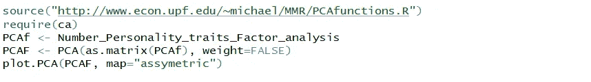

Thanks to Prof. Michael Greenacre for its PCA customized function

运行代码后，结果如下所示:

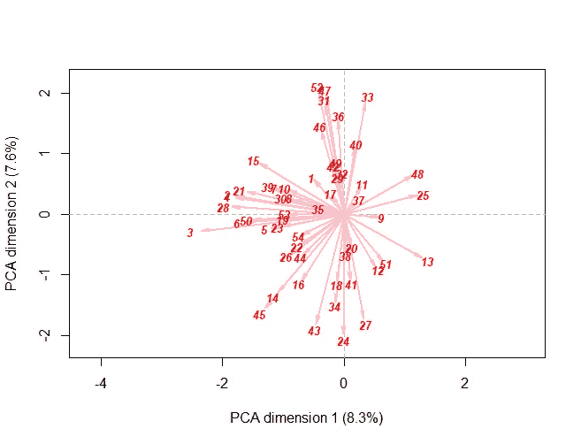

在这里，我们可以对变量在前两个维度中的关系有一个粗略的近似。我们可以看到，他们解释的方差约占 16%，这表明我们最好探索并考虑更多的维度。

查看 PCA，例如在维度 2 中，我们可以看到有一组变量，稍后我们将能够更详细地看到它们，它们是非常负相关的(由相反的箭头表示)，这些是问题 52、47 和 31，即兴趣或爱好、能量水平和朋友数量，而不是问题 27 和 24，即改变过去(悔恨、忧郁)和孤独。正如我们所看到的，双方都唤起了完全相反的感觉。

## 相关性热图矩阵

现在让我们更详细地看看问题之间的关系。下面是相关矩阵。

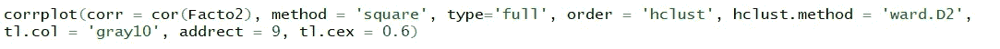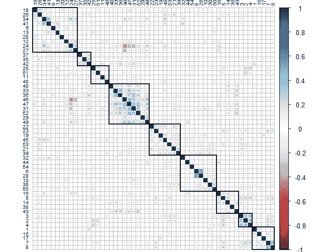

x 和 Y 轴显示了 54 个问题。这种排序已经给出了一些想法和提示，告诉我们在计算因子分析时会发现什么。特别地，矩阵单元中每个正方形的大小和颜色指示了每对之间的皮尔逊相关系数的强度。

此外，我随意突出显示了 9 个矩形，这些矩形显示了相似特征之间的分组。例如，问题 2、3 和 4(从右下角开始的第二个矩形)、“优先处理工作量”、“写笔记”、“工作狂”等概念包含了一个潜在的相似概念，即勤奋，努力工作的动力。(请注意，样本单位是 15 至 30 岁的年轻人，因此在大多数情况下，他们相当于工作的老年人正在学习)。此外，有趣的是，我提到的这个组与问题 25、51(从左上角开始的第三个矩形)、“学校作弊”和“早上起床困难”负相关，这完全说得通。

无论如何，上面的相关性矩阵是一个很好的起点，但是要告诉我们的是调查问题下面的主要潜在因素，是因素分析。

所以让我们开门见山吧。

## 要素分析

首先，我们定义一个函数来画出我们将要得到的维度和它的参数。

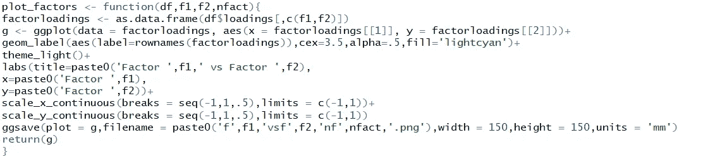

然后，我们调用 factanal 包，使用 varimax 旋转法获得因子。

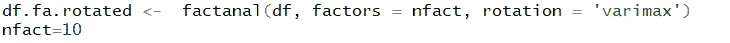

最后，我们在包含因子的变量上调用之前定义的函数。

阅读以下因子图的方法基本上是关注 X 轴和 Y 轴的极值标签，因为它们是表征或解释每个维度的大部分方差的标签。换句话说，它们代表每个因素最高负荷的变量。

## 因素 1

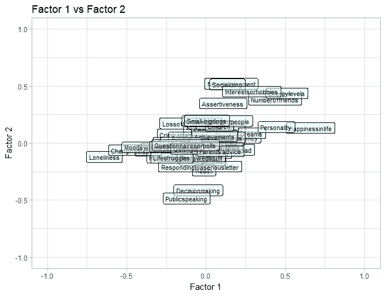

Dimension of factor 1 can be read horizontally and the one for factor 2, vertically

同样，每个变量的含义可以在附录中找到。

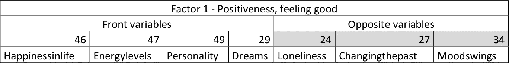

F1\. Positiveness

我称之为积极因素，因为他们与积极的感觉有关，看起来他们是积极的人，感觉快乐，精力充沛，晚上做好梦，对自己和自己的个性有积极的想法。在光谱的另一端，我们发现那些感觉不好的人是因为他们感到孤独(正如我们在前面展示的相关性矩阵中看到的那样，与“生活幸福”和“能量水平”非常负相关)，他们经历负面情绪可能是因为他们不积极，如悔恨和愿意改变过去，以及情绪不稳定。

**因素 2**

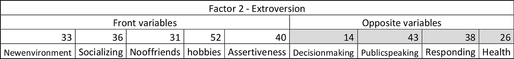

F2\. Extroversion

第二个因素是外向/内向性格维度的有效测量。那些外向的人发现与新的人一起进入和适应新的环境是容易和令人兴奋的，喜欢认识新的人，有大量的朋友，有许多兴趣和爱好，而且他们也更容易变得自信。自信并不总是容易运用的东西，因为关系的另一部分可能不会很好地接受它，一个内向、更敏感和一般朋友较少的人可能想要避开。另一方面，我们看到内向者的典型特征([内向的春天](https://introvertspring.com/what-is-an-introvert/#whatisintrovert))，当被很多人包围时，他们往往会感到不舒服，所以他们往往不喜欢/害怕公开演讲；他们也倾向于反复思考，因此做决定和回复一封严肃的信需要时间。内向的人也倾向于内省，因此平均来说比外向的人更担心健康，这也是有道理的，毕竟，内向的人比外向的人更能意识到他们内心发生的事情，所以发现健康异常并沉思它们对他们来说比外向的人更有可能发生。

**因素三**

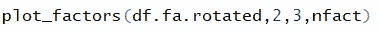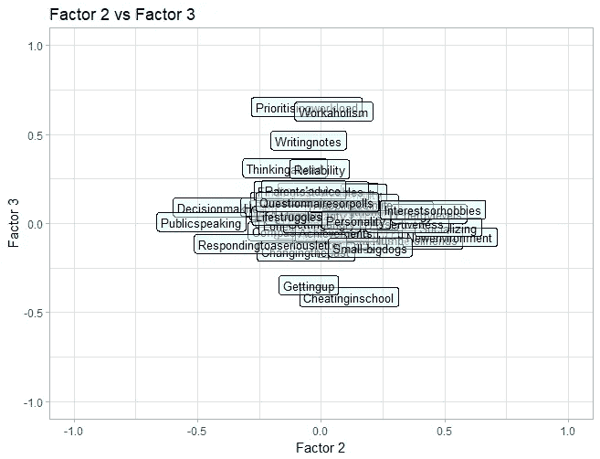

Dimension for factor 3 can be read vertically

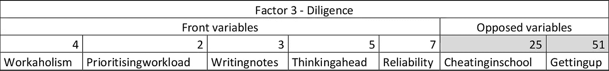

F3 — Diligence

第三个维度是勤奋。正如我们在简要评论 PCA 时提到的，这个因素代表了那些勤奋工作的人，他们可以被认为是有纪律的、勤奋的人，因此也是可靠的。像写笔记和工作狂这样的概念清楚地反映了这一点。其他如优先考虑工作量和提前考虑可能不太明显，但仔细想想，以系统的方式做这件事并不容易，让我们说舒服，所以它显示了一定程度的勤奋和动力，以按时完成任务。另一方面，我们有那些早上起床有困难的人，他们在学校有作弊的倾向，简而言之，这些人通常更懒，也不那么勤奋。

**因素 4**

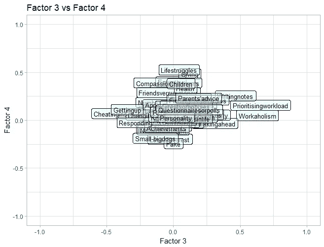

Dimension for factor 4 can be read vertically

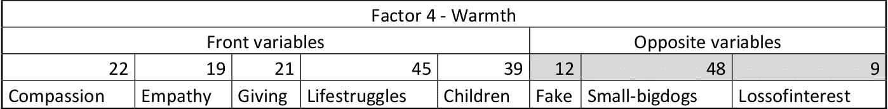

F4 — Warmth

第四个人格维度是“温暖”，是善良、敏感和诚实的概括。它反映了个性的各个方面，例如，对他人的同情，看到他人痛苦时的痛苦，该给礼物时的慷慨，当一个人感到挣扎时的哭泣，以及享受孩子的陪伴。前两个表示同理心，第三个表示善良，第四个表示不克制表达情感如哭泣的人，所以诚实地反映他们的真实情况和感受；第五宫也显示出温暖，毕竟，小孩子很爱玩，经常微笑，这迫使他们以某种方式回报，所以如果有人有点冷淡、严肃或不想被这种事情困扰，就会倾向于喜欢少一些孩子的陪伴。

在光谱的另一端，我们有那些双面的人，那些喜欢大的危险的狗而不是小的狗的人，和那些容易爱上某人但很快失去兴趣的人。它们看起来似乎是毫无关联的话题，但对我来说并非如此，因为它们描绘了那些倾向于在他们周围筑起一堵墙的人，这样其他人就看不到他们是谁或他们的感受。第一个似乎显而易见，因为他们直截了当地说出来，第二个可能与那些通过想要给人留下强大和危险印象而建起一堵墙的人相匹配，第三个反映了那些在敞开心扉、展示真实自我、在更深层次上同情和联系他人方面有很多困难的人，因此他们很快失去兴趣并不断更换伴侣。

**因素五**

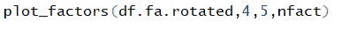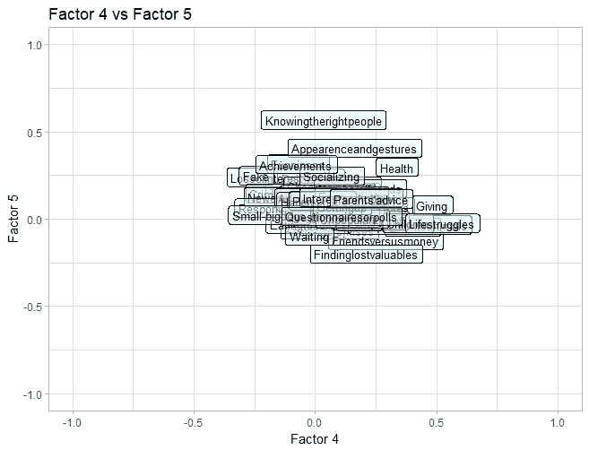

Dimension for factor 5 can be read vertically

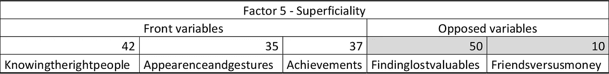

F5 — Superficiality

我把第五个因素称为肤浅，在某种程度上代表了那些把形象和地位看得非常重要的人物，这通常与物质主义、自我中心和浅薄联系在一起。在我看来，第一个变量将个人关系的重点放在了解一个人对他/她可能有多大用处上，这在我看来是自私的，第二个变量与他们对自己身体形象的重视程度有关，第三个变量反映了那些吹嘘自己成就的人。

另一方面，我们有远离物质主义和自私的人格特征，因为第一个问题回答了那些上交丢失物品的人，这些物品虽然有价值，但不是他们的；第二个回答了那些把朋友看得比金钱更重要的人。

到目前为止，我们提出了一些因素，除了有意义之外，它们还解释了变量的值的变化。因此，在这一点上出现的问题是，选择多少因素？

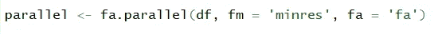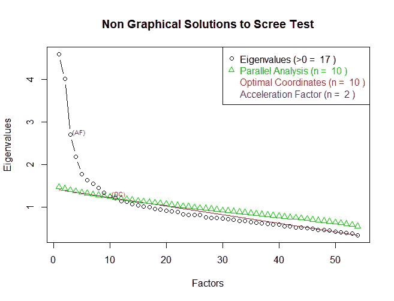

上面的碎石测试对此有所启发。我们可以看到，有 17 个特征值高于 0，这告诉我们，有多达 17 个因素至少可以解释一些方差。10 被认为是因素的最佳数量，然而我尝试了，他们除了没有多大意义之外，几乎不能解释差异。所以，根据我的发现和对特征值曲线上因素数量的直观探索，我们可以看到随着曲线斜率的减小，增加新的因素似乎并不能捕捉和解释大量的方差，所以我决定在 5 个因素处停止。

能够将 54 个问题归结为 5 个维度，并获得所有变量的大部分方差，这似乎很棒。这是因素 1:积极，F2:外向，F3:勤奋，F4:热情，F5:肤浅。

但是在进入分类树之前，还有一个缺口需要填补。

如前所述，这个想法是为了简化变量，我们已经这样做了，但是，我们知道归入因子的变量有相反的符号。如果我们不转换这些因素的组成部分，我们就不能真正反映它的本质。例如，“生活中的快乐”给那些对自己和自己的生活感到非常快乐的人打 5 分，但我们也可以找到“孤独”，它给孤独的最大强度打 5 分，因此如果我们听其自然，一个快乐的人会给“生活中的快乐”打 5 分，给“孤独”打 1 分，所以我们的平均得分是 3 分。然后，一个孤独、消极的人给“生活中的快乐”打 1 分，给“孤独”打 5 分，平均再打 3 分。如果两个完全相反的人，就这种人格特征而言，给维度相同的平均值，我们如何能期望维度在人的特征上正确分类？

似乎很明显，必须进行变革。我所做的是反转“相反”变量的评级，因此转换后的 1 是 5，2 是 4，以此类推。将此应用于所有获得的因素，我们可以计算平均值，并在接下来的分类模型中将其用作解释变量。

## 回归树

我们在这里要做的是分类并预测一个人属于所分析的特征变量的给定类别的概率，给定他们在树的每一层的最有区别的维度上的分数。

## 年龄

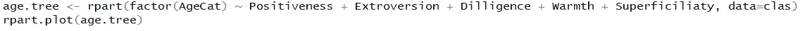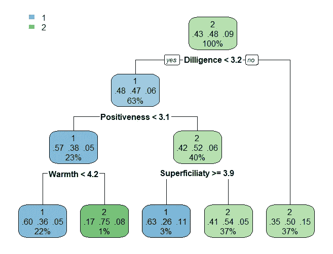

根据数据部分中确定和解释的群体，我们可以从树的顶部节点看到，最大的受访者群体属于 20 至 24 岁的人。顶部节点(和每个节点)的第二行代表分别属于第一、第二和第三组的预期概率(相当于它们的频率)。

我们可以看到，勤奋维度得分 3.2 更有利于预测 25 至 30 岁的人(从观察到的 9%至 15%)。然后，低于 3.2 的勤奋，低于 3.1 的积极，但高于 4.2 的热情是进一步帮助预测有利于“中年”人的组合(从观察到的 48%到 75%)。最后，更好地预测最年轻者(15-19 岁)的组合是勤奋低于 3.2，积极高于 3.2，肤浅高于或等于 3.9。

因此，总之，该树将“年纪最大”的人归类为受访者中最勤奋的人，最年轻的人归类为最肤浅、最不积极和最不热情的人，而“中年人”归类为最积极的人，然而，如果受访者在积极方面的平均得分低于 3.1，根据该模型，他们将是最热情的人。

## 童年地点

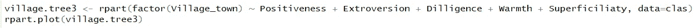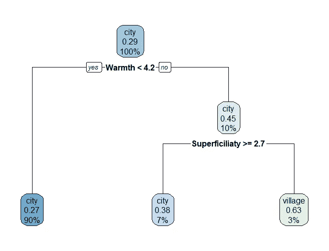

简而言之，该模型预测最热情和最不肤浅的人在乡村度过了相当长的童年时光。平均热情得分高于 4.2 和肤浅低于 2.7 的组合预测回答者有 63%的概率在农村度过童年。如果我们考虑到它们只占观测值的 29%,那就相当高了。所以根据这些因素和这棵树，城市意味着更少的温暖和更多的肤浅，这似乎很准确。

## 性别

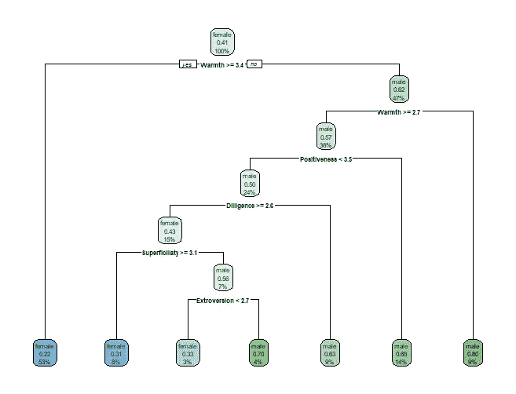

简而言之，更多的温暖(平均分数为 3.4%)预测有利于女性，从 59%的女性受访者中高达 78%。同样，当试图对人们进行性别分类时，最具歧视性且似乎更相关的因素是温暖因素。平均分数低于 2.7 的人有 80%的可能性是男性(41%的男性回答了调查)。

## 对应分析

一旦分析了项目的主干，让我们把注意力从人格特征转移到人们的生活方式上。

特别是，其目的是获得一些关于健康的生活方式是如何由性别、年龄和教育等特征决定的直观见解。

对于“我过着非常健康的生活方式”这个问题，人们被要求强烈同意(5)、同意(4)、中立(3)、不同意(2)或强烈不同意(1)。

这里有一些年龄性别和教育的交叉列表。

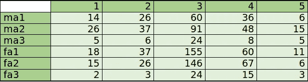

“ma”和“fa”分别代表男性和女性，而 1、2、3 对应于我们在数据部分解释的最年轻、中年和最年长的人。

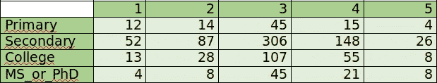

## 性别-年龄

对应分析对我们的目的来说很方便。让我们按性别-年龄来看一看。

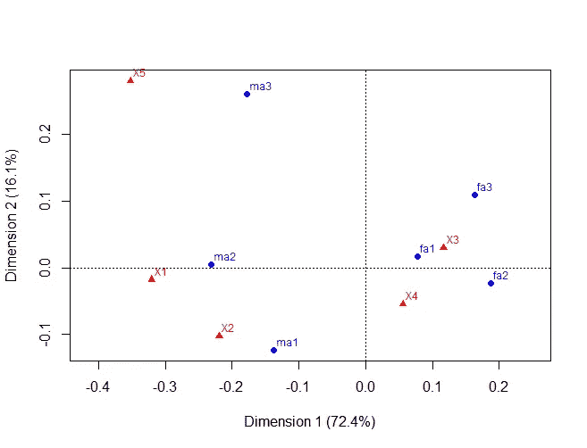

在上面的 CA 图中，我们可以看到所包含的维度分别解释了总惯性的 72.4%和 16.2%，对于二维解决方案，总共解释了 88.6%，这似乎是一个非常高的值，表明与剩余维度相关的其余惯性实际上与解释差异无关，因此所使用的二维是解释类别差异的最佳维度。

从地图上我们可以推断出什么？

第一个维度由生活方式总体健康的人与生活方式极端的人之间的对立决定，也就是说，要么生活方式非常健康，要么生活方式总体不健康。

第二个维度似乎把偏离整体利益的符号分开了。

所以，我们可以在第一维的一边观察女性，在另一边观察男性。这意味着总体而言，年轻女性比年轻男性更关注健康的生活方式，观点的可变性似乎比男性更少分散和“两极化”。而对于男性，我们可以看到最年轻的(15-24 岁)和成年人(25-30 岁)之间的明显区别，成年人遵循非常健康的生活方式，而年轻人则相反，特别是年轻男性，他们似乎平均遵循相当不健康的生活方式。

## 教育

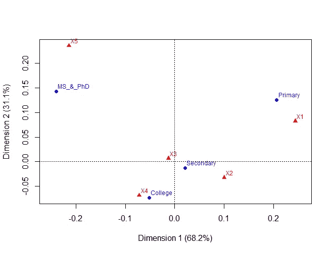

这一次，总惯性的 99.3%由双标图的 2 个维度解释，这证实了这是解释变量间差异的最佳维度数。

特别是，我们可以观察到，与受过高等教育的人相比，受教育程度较低的人的平均生活方式往往不太健康。

无论如何，让我们对此持保留态度，因为由于取样单位的年龄从 15 岁到 30 岁，年龄与研究高度相关。

# 5.结论

我们应用因子分析得出了有趣的个性维度，这些维度可能无法从遵循海洋方法的标准问卷中捕捉到。从他们身上，我们已经能够看到部分不同的人格因素，这些因素可能是替代人格心理测量模型的基础。在对获得的因素使用回归树之后，我们也能够为不同的基本分类特征找到有趣的分类。

限制可能是导致获得 5 个维度的解释性因素分析应该继续进行验证性因素分析，以便建立具有统计显著性因素的模型。这肯定会是我为这种项目设想的扩展。

# 6.参考

[https://www . ka ggle . com/nowaxsky/visualization-and-prediction-of-shopping-habits/data](https://www.kaggle.com/nowaxsky/visualization-and-prediction-of-shopping-habits/data)

[https://cran . r-project . org/web/packages/corr plot/corr plot . pdf](https://cran.r-project.org/web/packages/corrplot/corrplot.pdf)

https://www.statisticssolutions.com/factor-analysis-2/

[https://github . com/rsangole/personalitytracfactoranalysis/blob/master/FA _ Traits。R](https://github.com/rsangole/PersonalityTraitFactorAnalysis/blob/master/FA_Traits.R)

[https://www.statmethods.net/advstats/factor.html](https://www.statmethods.net/advstats/factor.html)

[https://cran . r-project . org/web/packages/nf actors/nf actors . pdf](https://cran.r-project.org/web/packages/nFactors/nFactors.pdf)

[http://www.milbo.org/rpart-plot/prp.pdf](http://www.milbo.org/rpart-plot/prp.pdf)

[http://trevorstephens . com/ka ggle-titanic-tutorial/r-part-3-decision-trees/](http://trevorstephens.com/kaggle-titanic-tutorial/r-part-3-decision-trees/)

[https://en.wikipedia.org/wiki/Big_Five_personality_traits](https://en.wikipedia.org/wiki/Big_Five_personality_traits)

 [## 什么是内向的人？一个深入的解释——内向的春天

### 内向和外向出现在一个谱上。这意味着有不同程度的内向。没有人…

introvertspring.com](https://introvertspring.com/what-is-an-introvert/#whatisintrovert) 

# 7.附录

人格特质陈述/问题列表

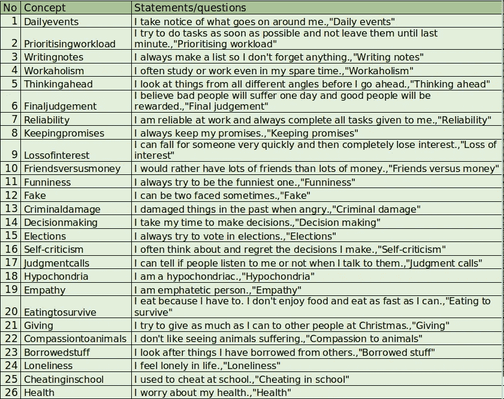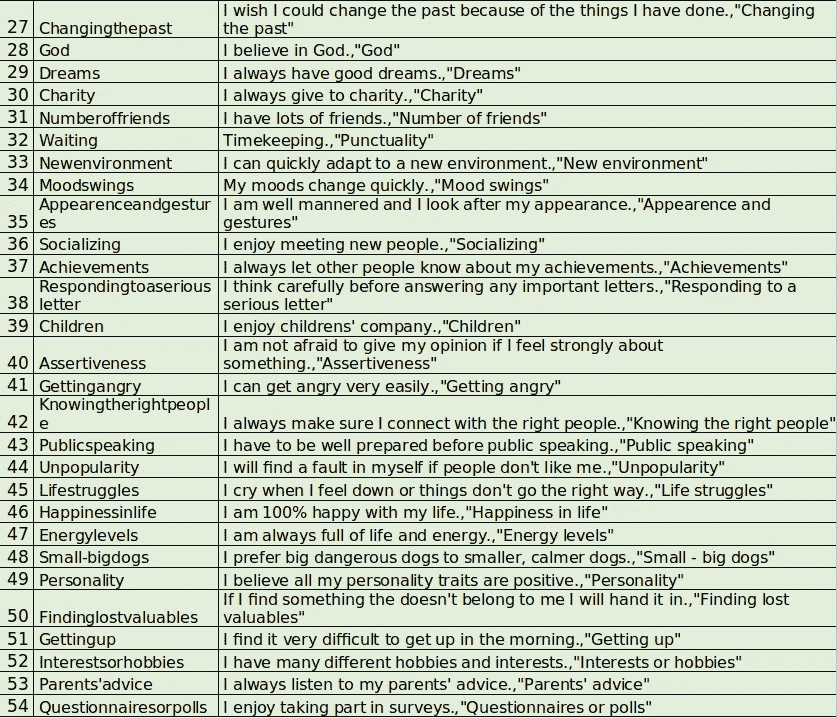