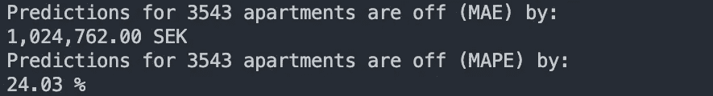

# 斯托克霍姆公寓价格的数据科学方法

> 原文：<https://towardsdatascience.com/a-data-science-approach-to-stockholms-apartment-prices-part-2-13e51772b528?source=collection_archive---------22----------------------->

## [SE 公寓项目](https://medium.com/tag/se-apartment-project)

## 通过机器学习将数据转化为洞察和预测


# 这个故事的目标和上一个故事的摘要。

在[之前的故事](https://medium.com/@gustaf.halvardsson/a-data-science-approach-to-stockholms-apartment-prices-part-1-dcee0212596d)中，我们探索了如何获取和清理数据。虽然清理和过滤的时间比预期的要长，但我们最终得到了一个非常干净的数据集。为了唤起你的记忆，我们现在把这个作为我们的数据集:


Sample of 5 out of 14 171 apartment listings with 9 different features.

# **拆分数据进行验证。**

我们的数据集中大约有 14 000 个条目，这对训练我们的 ML 模型非常有用。训练我们的模型，需要大量的数据，所谓的*训练* *数据*。但是为了检查我们模型的性能，我们还需要数据，即所谓的*验证数据。*在这里，平衡很重要，因为如果我们的训练数据太少，我们的模型将无法在足够的数据上进行训练并且不准确。另一方面，如果我们没有足够的验证数据，我们就不能确定我们的模型在以后测试时的准确性。*注意:我们也可以使用交叉验证，但是因为我们有大量的数据，收益会很小。*

出于这些原因，我选择对数据进行 3/4 分割，这意味着 75%的行用于训练，25%用于验证。

# 建立机器学习模型。

训练我的机器学习(ML)模型的第一步是考虑我应该包括的特征，这也很重要。根据直觉和以前对公寓的了解，我决定选择:**‘日期*’、大小、【附近位置】、【房间】、【纬度】、*** 和***‘经度’。*** 选择要包含和排除的正确特性对于我们模型的性能非常重要，所以我们稍后将返回来对此进行调整。但是让我们从这个开始，看看我们最终会怎样。

# **如何建模**

这个问题将是一个回归任务，很可能会过度拟合。因此我最终决定使用一个 [***随机森林树***](https://scikit-learn.org/stable/modules/generated/sklearn.ensemble.RandomForestRegressor.html) 。因为它是一种*集合*方法(一种使用不同评估平均值的方法)，所以它可以很好地对抗过度拟合，并且通常在很少调整其超参数的情况下产生非常好的结果。

因为它是一个决策树模型，我们也不需要标准化数据来避免某些特性比其他特性更优先。

现在，我们用训练数据训练模型，并对照验证数据进行测试。



I wrote a function that calculates the accuracy in [Mean Absolute Error](https://en.wikipedia.org/wiki/Mean_absolute_error) or [Mean Absolute Error Percentage](https://en.wikipedia.org/wiki/Mean_absolute_percentage_error). Follow the links if you want to learn more but the short story for both measurements is that the closer to 0, the better.

嗯，不完全是一个伟大的公寓价格预测。这意味着**我们的模型的预测将会平均偏离**24%或者超过 1 000 亿 SEK。我们肯定可以改进这一点。那么我们如何优化这一点呢？

# 特征工程和优化

我绘制了特征的相关性，以发现使用我们训练的模型及其特征最好包括哪些特征。

```
feat_importances = pd.Series(trainedModel.feature_importances_, *index*=trainFeatures.columns)
feat_importances.nlargest(numOfFeatures).plot(*kind*='barh')
```


Which feature that has the biggest impact on the price. The higher the value, the bigger the impact. This means Size affects the pricing the most.

我最终决定选择: ***【大小】【邻近点】【纬度】*** 和 ***【经度】*** 因为它们对价格的影响最大，你可以在这里的图表中看到。

我遗漏了租金，因为在这种情况下，我们知道租金但不知道价格，反之亦然，似乎没有必要包括在内。

我在这个实例中使用了大量的优化，但这超出了本文的范围。然而，经过这些优化后，我们最终获得了以下性能:


Shows how close the predictions were to actual pricing (in SEK). X-Axis: What the prediction model predicted the price would be. Y-Axis: Actual Price for the apartment. Each dot represents one apartment listing and the red line is the linear fit of all predictions.

更好的是，**我们的模型可以预测销售价格，平均为 390，000 SEK 或实际价格的 8.4 %。**

这里需要注意是，对于这种精确度，我们只使用 4 个特征:*‘大小’，‘邻近点’，‘纬度’，*和*‘经度’，*来获得这种精确度。因为附近的点、纬度和经度都来自地址，**我们实际上只需要两个特征。**这为什么让人印象深刻？这意味着我们的模型只需要公寓大小和地址就可以达到 91.6%的准确率。

***我们为什么不干脆赋予模型所有的特性呢？* *多多益善吧？***不，这样做通常会导致过度拟合——其中模型学习训练数据太好，意味着噪声和离群值也包括在其预测中，而不是学习一个通用公式，这正是我们要寻找的。

# 结论:将数据转化为见解。

在这一点上，我们有干净和有组织的数据和预测销售价格的 ML 模型。最后，我想总结一下这项研究给了我们哪些有益的启示。

先说实际数据。这是我们所有数据行的汇总。它显示了所有 9 个特征数据的平均值、标准偏差、最大值和最小值。


Summary of 14 171 rows of data.

假设从 Hemnet 获得的*数据代表了斯德哥尔摩的公寓市场*，我们可以得出结论:斯德哥尔摩公寓的**:**

*   中间价是 390 万 SEK。
*   租金中位数是 2 800 SEK。
*   房间数量的中位数是 2。

此外，我们可以比较所有功能之间的关系(它们的相关性),以了解每个功能如何相互影响，而不仅仅是价格。


Shows how much each feature is dependent on each other. For example, the Size is entirely dependent on itself, so its value is 1 (green). The lower (red, -1) or higher (green, 1) the value, the more dependency.

从这个图表中，我们可以看到一些并不令人惊讶的事情，房间很大程度上取决于大小。但我们也可以总结出一些我们之前可能不知道的关于斯德哥尔摩公寓的事情:

*   *经度*很大程度上取决于附近的兴趣点。含义:**附近好玩的地方**(餐馆、酒吧、学校等)的数量。根据 Yelp) **这很有趣，取决于你是住在西斯德哥尔摩还是东斯德哥尔摩，东斯德哥尔摩有更多附近的景点。**
*   PricePerKvm 对经度的依赖程度是纬度的两倍。意思是如果你住在东斯德哥尔摩，你的公寓可能会更贵。

当然，还有很多需要建立的联系，但这些是我个人最喜欢的。

最后，我想再次回到这个关联图，它显示了每个特性对价格的影响程度。


Which feature that has the biggest impact on the price. The higher the value, the bigger the impact. This means Size affects the pricing the most.

我发现最令人惊讶的一点是，房间数量对价格的影响是如此之小。含义:

*   **无论是多一间房还是两间房，一套公寓的价格都没有太大差别。**在这种情况下，最重要的是平方米的大小。

我们还可以从该图中得出结论，大小、邻近点、纬度和经度是对价格影响最大的特征。其中三个完全取决于位置。含义:

*   **位置决定一切**并将极大地影响定价。

为了展示斯德哥尔摩的价格变化，我决定直观地展示一下。


Shows the geographical positions of the most expensive apartments. X-Axis: Latitude, Y-Axis: Longitude, Z-Axis: Sales Price / Square Meters (SalePricePerKvm)

如你所见，模式确实存在。如你所见，最高点(黄色)位于 stermalm 的中部。

# 本案例研究的主要收获

对于斯德哥尔摩的公寓:

*   **中间价**390 万 SEK。
*   租金中位数是 2 800 SEK。
*   房间数的中位数是 2。
*   附近有趣的地方(餐馆、酒吧、学校等)的数量。根据 Yelp) **的说法，这些都很有趣，这取决于你是住在斯德哥尔摩西部还是东部**，那里的东部有更多有趣的地方。
*   如果你住在东斯德哥尔摩**，你的**公寓很可能会更贵。****
*   **一套公寓的定价是**没有明显的不同** **不管它有一个额外的房间还是两个房间，如果它不增加更多的平方米。****

**在这里阅读之前的故事:
[***用 Web 抓取获取和清理数据。***](http://medium.com/p/dcee0212596d/)**

**所有源代码均可在此获得:
[**https://github . com/gustaf VH/Apartment-ML-Predictor-Stockholm _-with-web scraper-and-Data-Insights**](https://github.com/gustafvh/Apartment-ML-Predictor-Stockholm_-with-WebScraper-and-Data-Insights)**