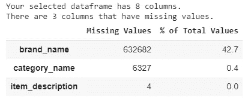
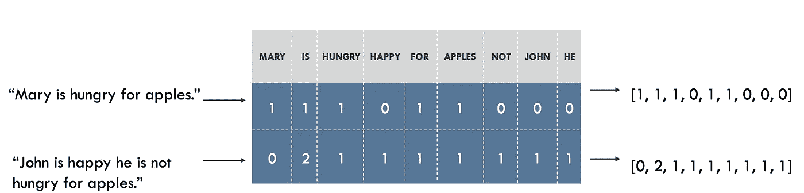

# Python 数据科学案例研究:Mercari 价格预测

> 原文：<https://towardsdatascience.com/a-data-science-case-study-with-python-mercari-price-prediction-4e852d95654?source=collection_archive---------6----------------------->


Photo by [Myriam Jessier](https://unsplash.com/@mjessier?utm_source=medium&utm_medium=referral) on [Unsplash](https://unsplash.com?utm_source=medium&utm_medium=referral)

学习数据科学最有效的方法是解决与数据科学相关的问题。阅读、倾听和记笔记是有价值的，但是一旦你解决了一个问题，概念就会从抽象固化成你有信心使用的工具。通常，一个完整周期的数据科学项目包括以下阶段:

1.  数据收集和争论
2.  数据分析和建模
3.  沟通和部署

在本案例研究中，我们将介绍工作流程中的**分析、建模和沟通**部分。解决数据科学问题的一般步骤如下:

1.  理解问题和数据
2.  数据探索/数据清理
3.  特征工程/特征选择
4.  建立绩效指标
5.  模型评估和选择
6.  模型优化
7.  得出结论并记录工作

**那些不熟悉数据科学领域和 Python 编程语言的人仍然可以继续阅读这篇文章，因为它将提供关于如何处理和解决这类问题的高级概述。**

虽然博客中包含了一些代码片段，但是完整的代码你可以看看这个 [Jupyter 笔记本](https://github.com/geofflobo12/Mercari-Price-Prediction/blob/master/Mercari_Price_Prediction.ipynb)。

# 问题定义

Mercari 是日本最大的社区购物应用程序，人们可以在这里出售和购买不同品牌的各种全新和二手产品，从毛衣到智能手机。现在，Mercari 希望向卖家建议正确的价格，但这很难，因为他们的卖家可以在 Mercari 的市场上放置任何东西或任何一捆东西。

因此，我们的目标是建立一个模型，自动向卖家建议正确的产品价格。我们获得了每种产品的以下信息:

train_id —产品的 id

名称—产品的标题

item_condition_id —卖方提供的产品的状况

类别名称—产品的类别

品牌名称—产品的品牌名称

运费—如果运费由卖方支付，则为 1；如果运费由买方支付，则为 0

item_description —产品的完整描述

价格—产品的销售价格(**这是我们将预测的目标变量**)

这类问题属于监督回归机器学习的范畴:

*   **监督:**我们可以访问特征和目标，我们的目标是训练一个可以学习两者之间映射的模型。
*   **回归:**目标变量价格是一个连续变量。

# 探索性数据分析

EDA 是一个开放式的过程，在这个过程中，我们计算统计数据并制作图表，以发现数据中的趋势、异常、模式或关系。简而言之，EDA 的目标是学习我们的数据能告诉我们什么。它通常从高层次的概述开始，然后随着我们发现数据中感兴趣的部分，缩小到特定的领域。这些发现本身可能是有趣的，或者它们可以用于通知我们的建模选择，例如通过帮助我们决定使用哪些功能。在匆忙进入机器学习阶段时，一些数据科学家要么完全跳过探索过程，要么做一个非常敷衍的工作，但实际上 EDA 是解决数据科学相关问题的最关键步骤之一。

数据集可以从 [Kaggle](https://www.kaggle.com/c/mercari-price-suggestion-challenge/data) 下载。为了验证结果，我们只需要“train.tsv”数据文件。所以让我们开始吧！

```
import numpy as np
import pandas as pd
import matplotlib.pyplot as plt
import seaborn as sns
from sklearn.model_selection import train_test_split
```

我们将把数据分别按 80%和 20%的比例分成训练集和测试集。作为惯例，我们将仅对训练数据集进行 EDA。

```
In:
data = pd.read_csv('train.tsv', sep='\t')train, test = train_test_split(data, test_size=0.2)
print(train.shape, test.shape)Out:
(1186028, 8) (296507, 8)
```

在训练数据中有大约 118 万个数据点/行，在测试数据中有 29.6 万个数据点/行。8 是两组中的列/特征的数量。特性和变量在这里的意思是一样的，所以它们在博客中可以互换使用。

```
#this command displays first few rows of the data set
train.head()
```


# 检查缺少的值

处理真实世界数据时的一个常见问题是缺少值。这些可能由于许多原因而出现，并且必须在我们训练机器学习模型之前填充或移除。首先，让我们了解一下每一列中有多少缺失值。



“brand_name”功能有 42%的缺失值。处理缺失值时通常考虑的一些方法有:

1.  删除缺少值的记录。
2.  如果缺失值的数量高于某个阈值，比如 50%，则移除特征本身。
3.  将“缺失值”视为相应特征本身的另一个类别。

在这个项目中，我们将采用第三种方法。

现在我们将开始逐一分析特性。我们将首先检查目标变量价格，然后开始单独分析预测变量，并查看它如何与价格变量**相互作用。**

# 价格

让我们检查价格变量的分布，并浏览一些基本的统计数据。

```
train['price'].plot.hist(bins=50, figsize=(10,5), edgecolor='white',range=[0,500])
plt.xlabel('Price', fontsize=15)
plt.ylabel('Frequency', fontsize=15)
plt.tick_params(labelsize=15)
plt.title('Price Distribution - Training Set', fontsize=17)
plt.show()
```


```
train['price'].describe()
```


*   价格变量的分布与上述统计数据一致，即分布是**右偏的。**
*   这些商品的中间价格是 17 美元。
*   75%的商品价格低于 29 美元。
*   数据中一个商品的最高价格是 2009 美元。

# 运费

```
In:
train['shipping'].value_counts(normalize=True)*100Out:
0    55.267667
1    44.732333 
Name: shipping, dtype: float64
```

55.26%的商品运费由买家支付。让我们看看运输功能与价格的关系。


如果卖家支付运费，产品的中值价格为 14.0 美元，而如果买家支付运费，产品的中值价格为 20.0 美元。

通常，当我们在网上购买产品时，我们需要支付低于一定价格的产品的运费或送货费。但是这里的趋势有点相反，因为卖家支付运费的项目的中值价格低于买家支付运费的项目的中值价格。

# **项目条件**

“项目条件标识”有五个唯一值，范围从 1 到 5。**数字越低，物品的状况越好。**

```
In:
train['item_condition_id'].value_counts(normalize=True, sort=False)*100Out:
1    43.194511 
2    25.323264 
3    29.166934 
4     2.153153 
5     0.162138 
Name: item_condition_id, dtype: float64
```

43%的项目条件 ID 为 1，而只有 0.16%的项目条件 ID 为 5。让我们看看这个特性与价格的关系。为了比较和可视化分类变量和数值变量之间的关系，箱线图非常有用。下面的代码用于绘制箱线图。

```
#for easier visualization, we are considering the prices from range of 0-100
price_100 = train[train['price']<100]fig, ax = plt.subplots(figsize=(20,7.5))
sns.boxplot(x='item_condition_id', y='price', data=price_100, ax=ax)
plt.xlabel('Item Condition', fontsize=15)
plt.ylabel('Price', fontsize=15)
plt.xticks(fontsize=15)
plt.yticks(fontsize=15)
plt.show()
```


虽然比例较低，但是与具有更好条件的项目相比，**项目条件 ID 为 5** 的项目具有更高的**中值价格**。

在仔细检查了一些数据后，其中项目条件 ID 被给定为 5，大多数具有这种条件的产品，尤其是电子产品被出售，因为它们的零件本身可以被证明是有价值的。这很好地解释了中值价格较高的原因。

# **产品类别**

“类别名称”中有 1268 个独特的类别

```
(train['category_name'].value_counts(normalize=True)*100).head(6)Out:
Women/Athletic Apparel/Pants, Tights, Leggings              4.060365
Women/Tops & Blouses/T-Shirts                               3.134841 Beauty/Makeup/Face                                          2.321684 Beauty/Makeup/Lips                                          2.025398 Electronics/Video Games & Consoles/Games                    1.798039 Beauty/Makeup/Eyes                                          1.720390 Name: category_name, dtype: float64
```

正如我们所看到的，对于每个项目，有三组由“/”分隔的类别。类别根据全面性从上到下排列。因此，我们可以将类别分成三个不同的列。这三个类别将表示主要类别、第一子类别和第二子类别。拆分时，缺少的值将用字符串“类别未知”填充。

作为常见的预处理实践，我们将把所有文本分类值转换成小写。通过下面的例子，这样做的原因将会很清楚:

假设数据中有两行，属于这两行的产品是 iPhone，对应于第一个条目的品牌名称是“Apple ”,第二个条目的品牌名称是“APPLE”。因此，当我们特征化数据以应用机器学习模型时，我们将应用的任何特征化技术都将考虑“苹果”和“苹果”具有两种不同的值，尽管它们意味着相同的东西。因此，为了让我们的模型认为这两个值是相同的，我们将把所有文本分类值转换为小写。实际上，“苹果”和“苹果”将变成“苹果”和“苹果”。

拆分类别后，我们有 **11 个唯一的主类别，114 个唯一的第一子类别，863 个唯一的第二子类别。**

# 主要类别

让我们看看哪一个主要类别在数据中的产品数量最多，并看看主要类别如何根据各自产品的中值价格进行排列。


最多的产品，即全部产品的 44.8%属于“女性”类，其次是“美容”类产品，约占全部产品的 14%，而最少的 1.7%的产品属于“运动和户外”类。

最高中值价格为 21 美元，属于“男士”类别，其次是“女士”类别，中值价格为 19 美元，而“手工”类别的最低中值价格为 12 美元。

# 第一子类别

由于有 114 个独特的子类别，很难将它们全部可视化。因此，我们将看看前 10 个最受欢迎的子类别，以及根据其各自项目的中值价格排序的前 10 个和后 10 个子类别。


最受欢迎的子类别是“运动服装”，这与之前的观察一致，即最受欢迎的主要类别是“女性”，而“运动服装”属于“女性”和“男性”两个类别。9%的产品属于运动服装类。


从商品的中间价格来看，“电脑&平板电脑”子类别的商品具有最高的中间价格，中间价格为 40 美元。


子类别“纸制品”中的商品的最低中间价格为 6 美元。“纸制品”属于“手工制品”一类。这也证实了之前的观察，即“手工”类别的商品在所有主要类别中具有最低的中值价格。

# 商标名称

数据中有 **4535** 个独特品牌。让我们来看看十大最受欢迎的品牌。


Nike 和 Pink 是最受欢迎的两个品牌，数据中 12.6%的产品属于这两个品牌。

当我们检查缺失值时，“品牌名称”功能有 42.7%的缺失值。因此，为了解决这个问题，我们将使用字符串“品牌不可用”来估算缺失的值。

```
train[’brand_name’] = train[’brand_name’].fillna(’brand_unavailable’)
```

因为有 42%的价值缺失，所以当给定或不给定特定产品的品牌名称时，观察价格是否会受到影响将是有趣的。为此，我们将创建一个名为“品牌名称已给定”的新功能，其中值“是”和“否”表示品牌名称是否已给定。让我们来了解一下！


看了箱线图后，虽然有很多重叠，但我们可以说，给出品牌和不给出品牌时，价格有相当大的差异。当给出品牌名称时，产品的中间价格是 20 美元，当没有给出品牌名称时，中间价格是 14 美元。简而言之，这个特性将有助于 ML 模型从中映射某种模式。

# 项目说明

“item_description”功能属于非结构化文本数据类别。对于这种类型的数据，预处理步骤将包括以下操作:

1.  将所有单词转换成小写。
2.  删除常用词，如“或”、“和”、“是”、“the”、“was”等。我们删除它们是因为这些种类的单词将会以很高的比例出现在数据中，而 ML 模型将无法从中生成任何有意义的模式。这些词被称为“停用词”。
3.  删除特殊字符，如“&”、“@”、“！”, '?'等等。

对于可视化，可视化文本数据最有效的方法之一是绘制“单词云”。我们将在下面的词云中看到，当价格上涨时，物品描述中的词是如何比较的。为了检查这一点，我们将根据价格从低到高对数据进行排序，然后将数据分成四个相等的部分。通过这样做，第一季度将有价格最低的产品，因此第四季度将有价格最高的产品。


First Quarter


Second Quarter


Third Quarter


Fourth Quarter

所有的四个字云几乎都是一模一样的。像“全新”、“从未使用过”、“状况良好”、“大小”、“中等”等词。无论价格如何，在大多数产品中都被频繁使用。这表明销售者大部分时间都试图在产品描述部分为他们的产品说好话，这样他们就不会有太多的麻烦来快速卖掉产品。

在第一个词云中有一个有趣的事情是“描述尚未”这几个词。在快速浏览数据后，有些条目中没有给出描述，只有“还没有描述”几个字，有 5.57%的行有这样的字。就像我们对“brand_name”功能所做的那样，我们将验证产品的价格是否会受到描述的影响。


与“brand_name”功能不同，这里没有太大的区别。给出描述时和不给出描述时的产品中值价格几乎相同。给出描述时，产品价格的第 75 个百分位值比未给出描述时的产品价格的第 75 个百分位值多 5 美元。

# 特征工程和选择

我们将选择用于建模的特征是*‘品牌名称’，‘品牌名称给定’，‘项目描述标识’，‘发货’，‘主类别’，‘子类别 1’，‘子类别 2’和‘项目描述’*。

## 一键编码

机器学习模型只能从我们提供的数据中学习，因此确保数据包含我们任务的所有相关信息至关重要。我们刚才分析的所有上述特征将用于制作模型。但 ML 模型无法区分“耐克”和“三星”品牌，也无法区分“化妆品”和“玩具”类别，也无法区分任何分类特征。所以为了解决这个问题，我们需要将我们的分类值转换成数值。我们可以通过**‘一键编码’**我们的分类值来做到这一点。通过下面的例子,“一键编码”的概念将变得清晰。

假设我们有一个名为“颜色”的特征，这个特征有三个唯一的值:红色、蓝色和绿色。通过对该颜色特征应用“一键编码”,将生成三列，每列代表三种颜色，二进制值 1 或 0 表示该颜色是否出现在特定的行/观察中。


One Hot Encoding ([Source](https://www.codeproject.com/Articles/1146582/Introduction-to-Machine-Learning))

借助 Python 中的 Scikit-Learn 库，我们可以对分类数据实现“一键编码”。此外，当我们应用 OHE 时，我们需要将其应用于与列车数据相关的测试数据，以避免数据泄漏。例如，如果测试数据中有另一种颜色“黄色”，而这种颜色在列车数据中不存在，那么为了避免数据泄漏，我们将在对测试数据应用 OHE 时忽略“黄色”，因为测试数据应该总是被视为“不可见的”。

## 一袋单词

现在开始将“item_description”特征表示成数值，我们将应用名为“单词包”的技术。这种技术与“一键编码”相同

在这项技术中，我们将构建一个包含数据集中所有唯一单词的词汇表，并为词汇表中的每个单词关联一个唯一的列。然后，每个句子都被表示为一个列表，其长度与我们的词汇表中不同单词的数量一样长。在列表的每一栏，我们标记出给定单词在句子中出现的次数。这被称为“单词袋”模型，因为它是一种完全忽略句子中单词顺序的表示。通过下面给出的图像，解释将变得清楚。



Representing sentences as a Bag of Words. Sentences on the left, representation on the right. Each index in the vectors represent one particular word ([Source](https://blog.insightdatascience.com/how-to-solve-90-of-nlp-problems-a-step-by-step-guide-fda605278e4e))

# 评估指标

通常，均方根误差(RMSE)度量用于回归任务。但是，由于价格遵循长尾分布(50%的产品低于 17 美元)，为了使低价产品的误差比高价产品的误差更相关，此问题的适当度量标准是均方根对数误差(RMSLE)。因此，我们将对价格目标变量应用对数转换，以使此假设可用于模型训练。下图给出了 RMSLE 的公式以及每个变量的含义。


# **建立基线**

开始建模前的最后一步是建立一个简单的基线。这基本上是一个猜测，我们可以根据它来比较我们的结果。如果机器学习模型没有击败这个猜测，那么我们可能不得不得出结论，机器学习对于这项任务来说是不可接受的，或者我们可能需要尝试一种不同的方法。

对于回归问题，合理的原始基线应该是:对于测试集中的所有示例，相应的价格预测将是训练集中所有示例的价格变量的平均值。这为任何车型设定了相对较低的超越门槛。因此，让我们将对数转换应用于基线模型并对其进行评估。

```
#split the target variable and the predictor variables
x_train, x_test = train.drop(['price'], axis=1), test.drop(['price'], axis=1)
y_train, y_test = train['price'], test['price']#log transformation
y_train_log = np.log1p(y_train)
y_test_log = np.log1p(y_test)#for baseline prediction
y_train_mean = y_train_log.mean()from sklearn.metrics import mean_squared_error
def rmsle(y_test, y_pred):  
    result = (np.sqrt(((y_test-y_pred)**2).mean())).round(4)
    return result

baseline_result = rmsle(y_test_log,y_train_mean)
print(baseline_result)**0.7497**
```

为了让我们说机器学习算法表现良好，从 ML 模型获得的误差应该小于基线误差，即 0.7497。

# 模型选择和超参数调整

有大量的机器学习模型可供选择，决定从哪里开始可能会令人生畏。其中一种方法是尝试几种算法，看看哪一种效果最好！机器学习仍然是一个主要由实验结果而不是理论结果驱动的领域，不可能提前知道哪个模型会做得最好。

我们将评估涵盖复杂性范围的四种不同模型:

*   线性回归
*   支持向量回归
*   决策树回归
*   极端梯度推进回归(XGBoost)

对于上面的每个模型，我们可以通过调整它们各自的超参数来优化它。**模型超参数**最好被认为是机器学习算法的设置，由数据科学家在训练前设置。例如随机森林中的树木数量或 K-最近邻算法中使用的邻居数量。

**模型参数**是模型在训练期间学习的内容，例如线性回归中的权重。

控制超参数通过改变模型中欠拟合和过拟合之间的平衡来影响模型性能。**欠拟合**是指我们的模型**不够复杂**无法学习从特征到目标的映射。一个欠拟合模型有**高偏差**，我们可以通过使我们的模型更复杂来纠正它。

**过拟合**是我们的模型本质上**记忆训练数据**的时候。过度拟合模型具有**高方差**，我们可以通过正则化来限制模型的复杂度，从而对其进行校正。欠拟合和过拟合模型都不能很好地概括测试数据。

选择正确的超参数的问题是，对于每个机器学习问题，最佳集合都是不同的！因此，找到最佳设置的唯一方法是在每个新数据集上尝试多种设置。

我们将应用的特定超参数调整技术是带有 K 倍交叉验证的随机搜索:

*   **随机搜索**指的是我们将用来选择超参数的技术。我们定义一个网格，然后随机抽样不同的组合，并执行 K-fold CV，而不是网格搜索，在网格搜索中，我们穷尽地尝试每一个组合。随机搜索的性能几乎和网格搜索一样好，但运行时间大大减少。
*   **K-Fold CV** 是将给定的数据集分成 K 个部分/折叠，其中每个折叠在某个点被用作测试集。让我们以 5 重交叉验证(K=5)为例。这里，数据集被分成 5 个部分。在第一次迭代中，第一次折叠用于测试模型，其余的用于训练模型。在第二次迭代中，第二个折叠用作测试集，而其余折叠用作训练集。重复该过程，直到 5 个折叠中的每个折叠都被用作测试组。对于特定的超参数组合，来自所有五次迭代的测试误差被平均。随机搜索 CV 完成后，平均测试误差最小的超参数组合被选为最优超参数组合。然后，该组合将用于预测测试数据中示例的价格。


K-Fold Cross Validation with K = 5 ([Source](https://my.oschina.net/Bettyty/blog/751627))

# 在 Scikit-Learn 中实现机器学习模型

我们将使用 Python 中的 Scikit-Learn 库进行建模。一旦您知道如何在 Scikit-Learn 中制作一个模型，您就可以快速实现各种算法。我们可以举例说明模型创建、训练(使用。适合)和测试(使用。预测)与决策树回归以及随机搜索 CV:

```
from sklearn.tree import DecisionTreeRegressor
from sklearn.model_selection import RandomizedSearchCV# Create the model to use for hyperparameter tuning
DT = DecisionTreeRegressor(random_state=42)# Minimum number of samples to split a node
min_samples_split = [25,50,75,100,200]# Maximum depth of each tree
max_depth = [5,10,20,30,50]# Define the grid of hyperparameters to search
params = {'max_depth':max_depth, 'min_samples_split':min_samples_split}# Set up the random search with 4-fold cross validation
RS_DT = RandomizedSearchCV(DT, params, scoring='neg_mean_squared_error', cv=4, n_jobs=-1, random_state=42)# Fit on the training data
RS_DT.fit(x_train_final, y_train_log)# this will return the hyperparameters with lowest CV error
RS_DT.best_params_**Out:
{'max_depth':30, 'min_samples_split':50}**
```

现在我们将使用上述超参数来评估模型在测试集上的性能。

```
# Create the model with the optimal hyperparameters
DT = DecisionTreeRegressor(max_depth=30, min_samples_split=50, random_state=42)# Fit the model on the training data
DT.fit(x_train_final, y_train_log)# Make predictions on the test data
y_pred_dt = DT.predict(x_test_final)# Evaluate the model
dt_error = rmsle(y_test_log, y_pred_dt)
print(dt_error)**Out:
0.582**
```

决策树模型的 RMSLE 为 0.582，比基线模型结果低 22.3%。显然，机器学习适用于我们的问题，因为在基线上有显著的改进！其余选定的 ML 型号也遵循相同的程序。让我们看看其他模型在测试集上的表现如何。


线性回归模型给出了测试集上最低的 RMSLE。这表明更简单的 ML 模型也可以完成这项工作，它们不应该被低估。

此外，两种线性模型(线性回归和支持向量回归)都比两种非线性模型(决策树和 XGBoost 回归)表现得更好。

# **结论**

在本文中，我们完成了一个数据科学案例研究，其中我们理解了问题陈述，进行了探索性数据分析、特征转换并最终选择了 ML 模型，进行了随机搜索和超参数调整，并在测试集上对它们进行了评估并比较了结果。

机器学习往往是一个迭代而非线性的过程。我希望这个案例研究至少给了你一个关于数据科学和机器学习相关问题通常是如何处理和解决的高层次概述。

帮助我写这篇博客的参考资料:

1.  [https://towards data science . com/a-complete-machine-learning-walk-through-in-python-part-one-c 62152 f 39420](/a-complete-machine-learning-walk-through-in-python-part-one-c62152f39420)
2.  [https://towards data science . com/a-complete-machine-learning-project-walk-through-in-python-part-two-300 f1 f 8147 e 2](/a-complete-machine-learning-project-walk-through-in-python-part-two-300f1f8147e2)
3.  [https://towards data science . com/machine-learning-for-retail-price-suggestion-with-python-64531 e 64186d](/machine-learning-for-retail-price-suggestion-with-python-64531e64186d)
4.  [https://medium . com/unstructured/how-I-lost-a-silver-medal-in-kaggles-mercari-price-suggestion-challenge-using-CNN-and-tensor flow-4013660 fcded](https://medium.com/unstructured/how-i-lost-a-silver-medal-in-kaggles-mercari-price-suggestion-challenge-using-cnns-and-tensorflow-4013660fcded)

感谢您的阅读！