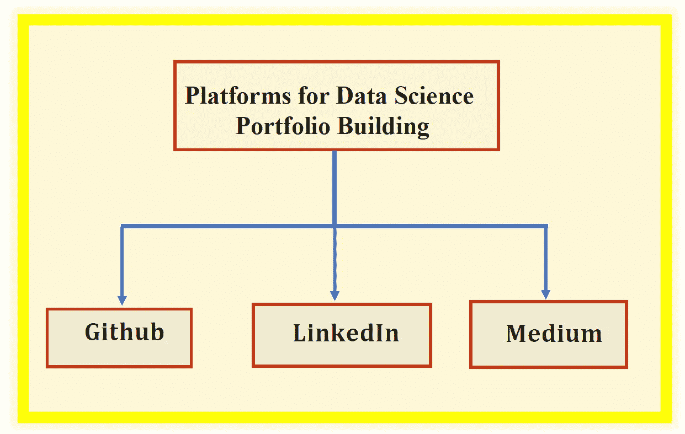

# 数据科学作品集比简历更有价值

> 原文：<https://towardsdatascience.com/a-data-science-portfolio-is-more-valuable-than-a-resume-2d031d6ce518?source=collection_archive---------11----------------------->

## 考察 3 个投资组合构建平台:Github、LinkedIn 和 Medium



Image be Benjamin O. Tayo

数据科学是一个实用的领域。实践技能非常重要，尤其是当你有兴趣作为一名实践数据科学家在学术界之外工作时。

在学术界，你需要更多的理论和研究技能。虽然深入了解数据科学的理论基础很重要，但作为一名实践数据科学家，实践经验非常重要，展示您实践技能的一种方式是通过构建一个非常棒的投资组合。有兴趣雇用你的公司肯定会向你索要投资组合，因为这证明了你在基础数据科学概念方面的优势。

虽然数据科学简历很重要，但数据科学投资组合比简历更有价值。本文将讨论可用于投资组合构建的 3 个重要平台。

在深入探讨构建良好的数据科学组合这一主题之前，让我们首先讨论数据科学组合为何重要的 5 个原因。

# 数据科学产品组合之所以重要的 5 个原因

1.  投资组合有助于展示您的数据科学技能。
2.  投资组合使您能够与其他数据科学专业人员和该领域的领导者建立联系。
3.  投资组合有利于记账。您可以使用它来记录已完成的项目，包括数据集、代码和示例输出文件。这样，如果你不得不在一个类似的项目上工作，你总是可以使用已经写好的代码，只需要很小的修改。
4.  通过建立投资组合并与其他数据科学专业人士和领导者建立联系，您可以接触到该领域的技术变化。由于技术的进步，数据科学是一个不断变化的领域。为了跟上该领域的最新变化和发展，加入数据科学专业人士网络非常重要。
5.  作品集增加了你找到工作的机会——我已经从 LinkedIn 获得了很多机会，比如招聘人员联系我寻找数据科学方面的工作机会。

现在，我们来讨论创建数据科学产品组合的 3 个重要平台。

# 构建数据科学组合的平台

# 1.开源代码库

Github 是一个非常有用的平台，可以展示你的数据科学项目。这个平台使您能够与其他数据科学家或数据科学爱好者共享您的代码。有兴趣雇佣你的雇主会检查你的 github 作品集，评估你完成的一些项目。所以在 github 上建立一个非常强大和专业的投资组合对你来说很重要。

要建立 github 投资组合，首先要做的就是创建一个 github 账户。创建帐户后，您可以继续编辑您的个人资料。编辑您的个人资料时，添加简短的个人简介和专业的个人资料图片是个不错的主意。你可以在这里找到一个 github 概要的例子:[](https://github.com/bot13956)**。**

**现在让我们假设您已经完成了一个重要的数据科学项目，并且您想要为您的项目创建一个 github 存储库。**

****创建存储库的技巧:**确保你为你的存储库选择了一个合适的标题。然后附上一个自述文件，提供项目的概要。然后，您可以上传您的项目文件，包括数据集、jupyter 笔记本和样本输出。**

**下面是一个机器学习项目的 Github 知识库的例子:**

****储存库名称**:bot 13956/ML _ Model _ for _ Predicting _ Ships _ Crew _ Size**

****资源库 URL**:[https://github . com/bot 13956/ML _ Model _ for _ Predicting _ Ships _ Crew _ Size](https://github.com/bot13956/ML_Model_for_Predicting_Ships_Crew_Size)**

****自述文件:****

```
**ML_Model_for_Predicting_Ships_Crew_Size**Author: Benjamin O. TayoDate: 4/8/2019We build a simple model using the cruise_ship_info.csv data set for predicting a ship's crew size. This project is organized as follows: (a) data proprocessing and variable selection; (b) basic regression model; (c) hyper-parameters tuning; and (d) techniques for dimensionality reduction.**cruise_ship_info.csv**: dataset used for model building.**Ship_Crew_Size_ML_Model.ipynb**: the jupyter notebook containing code.
```

# **2.商务化人际关系网**

**LinkedIn 是一个非常强大的平台，可以展示你的技能，并与其他数据科学专业人士和组织建立联系。LinkedIn 现在是发布数据科学工作和招聘数据科学家最著名的平台之一。实际上，我已经通过 LinkedIn 获得了 2 次数据科学面试。**

**确保您的个人资料始终是最新的。列出你的数据科学技能，以及你的经历，包括你已经完成的项目。列出奖项和荣誉也是值得的。你还想让招聘人员知道你正在积极寻找工作。此外，在 LinkedIn 上，您可以关注数据科学的影响者和出版物，如数据科学的[](https://www.linkedin.com/company/towards-data-science/)****和人工智能的**。这些公司发布关于各种主题的有趣数据科学文章的更新，包括机器学习、深度学习和人工智能。********

****从这里找到我在 LinkedIn 上的帖子的例子:[**https://www . LinkedIn . com/in/Benjamin-o-tayo-ph-d-a 2717511/detail/recent-activity/shares/**](https://www.linkedin.com/in/benjamin-o-tayo-ph-d-a2717511/detail/recent-activity/shares/)****

# ****3.中等****

****[Medium](https://medium.com/) 现在被认为是投资组合构建和网络发展最快的平台之一。如果你有兴趣使用这个平台来建立投资组合，第一步是创建一个中型账户。您可以创建一个免费帐户或会员帐户。对于免费帐户，每月实际访问的会员文章数量是有限制的。会员账户需要 5 美元或 50 美元/年的月订阅费。从这里了解更多关于成为中等会员的信息:【https://medium.com/membership】**。******

******创建帐户后，您可以继续创建个人资料。确保附上一张职业照片和一份简短的简历。下面是一个中等配置文件的例子:[**https://medium.com/@benjaminobi**](https://medium.com/@benjaminobi)。******

****在 medium 上，与其他数据科学专业人士交流的一个好方法是成为一名追随者。您还可以关注专注于数据科学的特定媒体出版物。排名前两位的数据科学出版物是面向数据科学的[](https://towardsdatascience.com/)**和面向人工智能的[](https://medium.com/towards-artificial-intelligence)**。********

******提升你的媒体作品的最好方法之一就是成为一名媒体作家。******

********为什么要考虑在 Medium 上写数据科学文章？********

****写中型文章有 5 个主要优势:****

1.  ****它为您提供了展示数据科学知识和技能的途径。****
2.  ****它激励你从事具有挑战性的数据科学项目，从而提高你的数据科学技能。****
3.  ****它使你能够提高你的沟通技巧。这是有用的，因为它使你能够以一种普通大众能够理解的方式传达信息。****
4.  ****每一篇发表在 medium 上的文章都被认为是知识产权，所以你可以在简历中添加一篇 Medium 文章。****
5.  ****你可以从你的文章中赚钱。通过 [**媒介合作伙伴计划**](https://medium.com/creators) ，任何在媒介上发表文章的人都可以获得赚钱的资格。****

****如果您有兴趣成为一名数据科学媒体作者，这里有一些资源可以帮助您入门:****

****[**在介质上写数据科学博客的初学者指南**](https://medium.com/towards-artificial-intelligence/beginners-guide-to-writing-data-science-blogs-on-medium-a74774cf8f66)****

****[**为您的数据科学文章选择合适的精选图片**](https://medium.com/towards-artificial-intelligence/choose-the-right-featured-image-for-your-data-science-article-e101719600cf)****

****总之，我们已经讨论了可用于构建数据科学产品组合的 3 个重要平台。投资组合是您展示技能和与其他数据科学专业人员交流的一种非常重要的方式。一份好的作品集不仅能帮助你跟上该领域的最新发展，还能帮助你在潜在的招聘者面前提高知名度。****