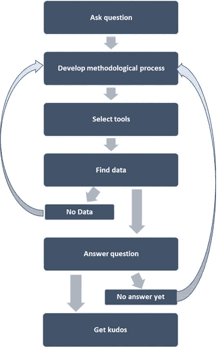

# 数据科学项目周期

> 原文：<https://towardsdatascience.com/a-data-science-project-cycle-af5a1cdef14f?source=collection_archive---------28----------------------->

## 如何更多地关注问题，而不是工具

Photo by [Katie Rodriguez](https://unsplash.com/@katertottz?utm_source=medium&utm_medium=referral) on [Unsplash](https://unsplash.com?utm_source=medium&utm_medium=referral)

作为组织中的一名数据科学家，您经常会发现自己处于以下几种情况:

*   你有一个数据集，你想提取一些有用的信息
*   你有一个业务问题，你想找到一个数据驱动的解决方案

第一种情况实际上是一种常见的情况，基本上，这意味着在您的数据科学之旅中，将您所学的所有内容作为探索性数据分析(EDA)的一部分。在本文中，我将解释如何处理第二种情况。

假设你在你的组织中已经呆了足够长的时间，知道它的业务实践和它产生的所有类型的数据。在这个过程中，你已经形成了一个假设，你想要验证这个假设。或者，也许你的经理/首席执行官/首席技术官正在请求你帮助找到他们遇到困难的问题的答案。如果你有足够的经验，你可能会知道你的下一步，但新手往往很难将他们的思维引向正确的方向。这是一种算法的方式来思考问题，直到找到解决方案。

Data science project cycle ( @DataEnthus)

## 问题是

在第一步，你有一个疑问或问题。如果它很大，如果需要的话，你可以把它分成小块。例如，如果问题是关于预测未来 10 年的销售增长，你可以把它分成几个部分，比如历史销售额是多少？目前的销售趋势如何？市场需求趋势如何？竞争对手表现如何？等等。

你从不同的来源收集尽可能多的信息，从不同的角度理解问题。你首先缩小大图，然后放大与问题相关的具体信息。在这个阶段，你真的从许多不同的角度开始了解手头的问题。这部分类似于学术研究项目中的文献综述。你应该花大量的时间来构思这个问题。

## 该过程

第二步，不，你不是在想用什么模型/工具/可视化技术；还没有。你正在思考一个方法过程，它将引导你回答你的问题。您可以列出一个数据集列表，确定在哪里可以找到它们，还可以列出一个可能有用的工具列表。即使您还没有对数据/工具的细节做出最终决定，在头脑中或在纸上有一个整体过程也会有很大帮助，即使它会随着后来的额外信息而改变。这种方法有点类似于在学术环境中，你在实际执行研究之前写下你的研究提案；随着你进一步研究手头的问题，事情往往会发生变化。

## 工具

在第 3 步中，现在您正在考虑哪些工具可以帮助回答这个问题。如果这是一个预测问题，你会想基于时间序列的模型是否有用？还是反而是线性回归问题？需要 GIS 技术吗？有没有好的 R 或者 Python 的包？

一旦您探索了所有可用的选项并决定了一组特定的工具，您现在就可以开始搜寻数据了。您需要的数据可以是一个数百万行的数据集，也可以是一百个数据点，这取决于您的问题和您选择的模型。

你找到所选模型所需的数据了吗？如果是，你就可以去适应你的模型了。但是如果你没有所有需要的输入，你应该在这里停下来，回到第二步的方法过程。也许还有其他不需要时间序列数据的工具/方法？一个不需要很多参数或者大数据集的[系统动态模型](https://mabalam.github.io//system-dynamics/)怎么样？

## 答案

你已经把你的大问题分成了几个小部分，并单独回答了它们。总的来说，你解决了你开始的那个大问题了吗？如果是的话，恭喜你。如果没有，请返回步骤 2。

沟通是解决问题过程中很重要的一部分。你需要能够说服你的听众(产品经理/同事/外部听众)为什么你的解决方案有意义吗？您还需要对与提议的解决方案相关的不确定性和警告以及您在此过程中所做的假设保持透明。

## 底线

总之，成为一名科学家意味着要经历一个探索/发现的过程。我们经常被我们所知道的工具/模型以及如何用数据来拟合它们所困扰。正如我们所见，选择正确的工具是解决问题过程的一小部分。总是先有问题，后有工具。