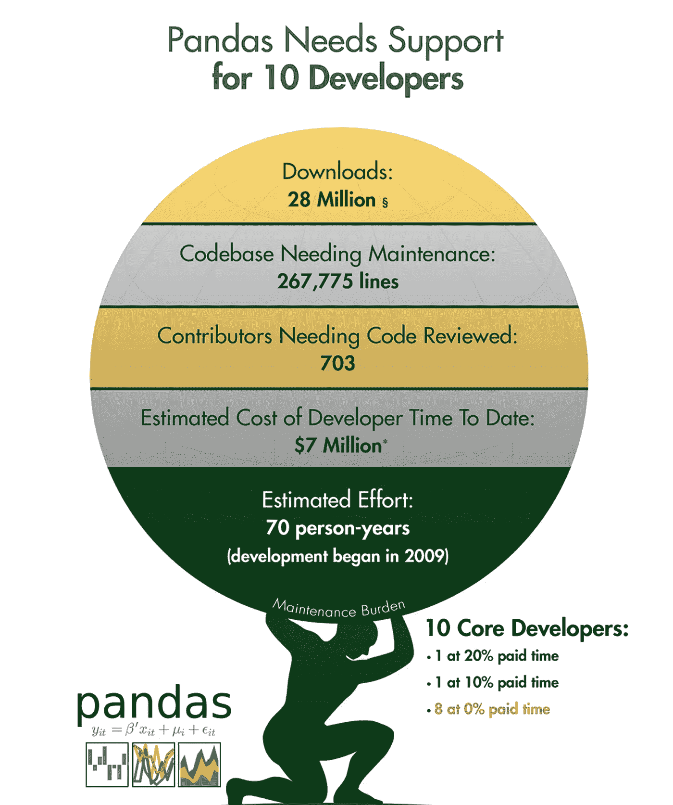

# 数据科学公共服务公告

> 原文：<https://towardsdatascience.com/a-data-science-public-service-announcement-fe81fbe6dc3f?source=collection_archive---------4----------------------->

[(Source)](https://www.pexels.com/photo/aerial-photography-of-mountains-near-body-of-water-1028536/)

## 开源数据科学工具需要你的帮助。幸运的是，现在比以往任何时候都更容易做出贡献——以下是提供帮助的方法

生命中最美好的东西都是免费的:朋友、`pandas`、家人、`numpy`、睡眠、`jupyter notebooks`、欢笑、`python`。严肃地说，令人难以置信的是，数据科学的最佳工具可以免费获得，而且不是由一个拥有无限资源的公司创造的，而是由一个个人社区创造的，其中大多数人无偿从事这些项目。你可以支付[860 美元/年购买 Matlab](https://www.mathworks.com/pricing-licensing.html?intendeduse=comm&s_tid=htb_learn_gtwy_cta1) (外加额外费用以获得更多库)，或者你可以免费下载 Python 和任何库，不用花一分钱就能获得更好的软件和更好的客户支持(以栈溢出和 GitHub 问题的形式)。

[自由和开源软件(FOSS)](https://en.wikipedia.org/wiki/Free_and_open-source_software#Open_source) 运动——你可以自由使用、共享、复制和以任何方式改进软件——极大地改善了公司和个人使用的数字工具，同时将许多领域(包括数据科学)的准入门槛降低到接近于零。对于我们这些在过去几十年中长大的人来说，这是我们唯一知道的模式:软件当然是免费的！然而，我们每天依赖的开源工具现在面临着严重的可持续性问题。

在这篇文章中，我们将探讨自由/开源软件面临的问题，更好的是，你可以采取许多步骤(有些步骤只需 30 秒)来确保你最喜爱的数据科学工具保持免费，并且比付费工具更好。虽然存在一个真正的问题，但我们所有人也有许多解决办法。(本文所依据的信息来自[“道路和桥梁:我们数字基础设施背后看不见的劳动”](https://www.fordfoundation.org/about/library/reports-and-studies/roads-and-bridges-the-unseen-labor-behind-our-digital-infrastructure)以及 [NumFocus 网站](https://numfocus.org/)。)

## 为什么开源数据科学工具需要帮助

想想熊猫图书馆这个神奇的工具。截至 2019 年 2 月 20 日，《熊猫》已被 PyPi 下载超过 8000 万次([详细分析 PyPi 下载在此](https://packaging.python.org/guides/analyzing-pypi-package-downloads/))。根据 [libraries.io](https://libraries.io/) 的说法，在[至少有 25000 个 GitHub 库依赖于](https://libraries.io/pypi/pandas) Pandas，至少有 100 个不同的包需要这个库。栈溢出所有问题中有近 1.8%是关于熊猫的(*5 倍于整个 Matlab 语言的问题数量*)。

Analysis of Stack Overflow Tags. You can do your own exploration [here.](https://insights.stackoverflow.com/trends?tags=pandas%2Cmatlab%2Cnumpy%2Cmatplotlib%2Cplotly%2Cipython)

发展和维护熊猫的工作是由一个相对较小的群体完成的。据 openhub.net 介绍，自从韦斯·麦金尼在 2009 年启动[项目以来，](https://www.datacamp.com/community/podcast/data-science-tool-building)[熊猫知识库](https://github.com/pandas-dev/pandas)只有 1400 名贡献者，他们总共编写了 294000 行代码[。这代表了惊人的 78 年开发者的努力，价值至少 780 万美元。尽管他们的劳动很有价值，但几乎每一个贡献者都是完全免费工作的，他们都渴望构建伟大的数据科学工具。](https://www.openhub.net/p/py-pandas)

然而，要维护和更新熊猫，需要的不仅仅是兼职贡献者。根据 [NumFocus](https://numfocus.org/) (稍后将详细介绍该组织)， [Pandas 需要 10 名全职付费开发人员来实现其目标](https://numfocus.org/wp-content/uploads/2018/07/NumFOCUS-Corporate-Sponsorship-Brochure.pdf)，包括致力于 1.0 版本的发布。目前，这个由数千万人和数千家公司使用的库有 1 个按 20%时间付费的核心开发人员、1 个按 10%时间付费的核心开发人员和 8 个按 0%时间付费的核心开发人员。

From NumFocus (Some of these stats are a little old).

在其他开源数据科学库中也存在类似的问题:matplotlib 需要 14 名全职付费开发人员——目前有 2 名 10%付费时间的开发人员 numpy 需要 12 名——有 2 名 100%付费时间的开发人员(多亏了一笔拨款)。这种付费开发者时间的缺乏损害了开源库:尽管业界广泛依赖，但 Pandas 尚未发布 1.0 版本(被认为是稳定版本)，只能以与其获得的资金水平成比例的速度发布。

维护和改进开源软件这样的共享资源的挑战在[“公地悲剧”](https://en.wikipedia.org/wiki/Tragedy_of_the_commons)中有所体现:许多人利用免费工具，但很少有人回报。没有适当的支持，公地悲剧的最终结果是资源的枯竭和最终的损失。开源软件——不仅仅是在数据科学领域——正越来越多地遇到可持续性问题，因为越来越多的人采用这些工具而不给予回报。

扩大采用是好事——没有人主张关闭自由/开源软件工具——但这意味着生产者与消费者的比率继续下降到不可持续的水平。在开源时代的开始，许多用户也帮助构建工具，但现在，由于个人电脑的令人难以置信的采用，更多的人可以使用这种软件，这给真正构成我们数字基础设施的工具带来了压力。

A quote from Noah Kantrowitz, Python developer and member of the PSF.

在过去的几年里，我们已经开始看到构成我们数字基础设施的开源软件的崩溃(见[道路和桥梁报道](https://www.fordfoundation.org/about/library/reports-and-studies/roads-and-bridges-the-unseen-labor-behind-our-digital-infrastructure))。OpenSSL 是一套被 2/3 的 web 服务器使用的加密工具，多年来一直由一名全职开发人员提供支持。70%的网络依赖于一个人的工作，这一事实并没有激励任何人或任何公司捐款，直到 2014 年[发现“heartbleed”漏洞](http://heartbleed.com/)，将注意力集中在该项目上，并导致急需的捐款。目前，OpenSSL 有足够 4 名全职员工工作 3 年的资金。如果没有另一个重大问题，这种资助的持续性是不确定的。

作为另一个例子， [bash，一种安装在 70%的互联网连接设备上的 Unix shell 和命令语言](http://Bash - GNU Project - Free Software Foundation https://www.gnu.org/software/bash/)(包括每一台 Linux 和 MacOS 机器)，自 1992 年以来一直由一个人维护，Chet Ramey，他在凯斯西储大学工作。同样，这似乎没有困扰任何人，直到 2014 年 bash 中发现了[“shell shock”漏洞](https://en.wikipedia.org/wiki/Shellshock_(software_bug))，引起了急需的媒体关注。

幸运的是，在撰写本文时，我们还没有看到开源数据科学工具中的同等问题。尽管如此，采取行动的时间并不是在灾难发生后，而是尽早阻止灾难发生，防止损失。如果我们想避免真正的公地悲剧，那么我们需要采取行动，把我们心爱的工具放在稳定的基础上。是时候从开源工具的单纯消费者转变为支持者和/或生产者了！

# 解决方案

任何时候你提出一个问题，你都应该在法律上有义务提出一个解决方案，最好是一个读者可以立即接受的方案。在支持开源数据科学工具的情况下，无论您的技术专长或财务状况如何，都有大量的选项可供您选择。在这里，我们将经历三个阶段:

1.  报告问题
2.  解决问题和撰写文档
3.  通过像 NumFocus 这样的组织进行小额捐赠(这需要[30 秒](https://www.flipcause.com/secure/cause_pdetails/MjM2OA==))。

第一种，也许是最简单的帮助方式，是报告问题，这样项目开发人员就知道该修复什么。[莱纳斯定律](https://en.wikipedia.org/wiki/Linus%27s_Law)说“如果有足够多的眼球，所有的[bug](https://en.wikipedia.org/wiki/Software_bug)都是肤浅的”这意味着如果一个项目有足够多的用户，所有的问题最终都会被发现。报告问题很有价值，但需要以有效的方式进行。确保您的问题尚未解决(首先搜索类似问题)，提供重现问题所需的准确代码，并根据要求提供后续信息。此外，尊重项目开发人员:开源贡献者没有义务解决你所有的问题，所以友善点，尽你所能给他们帮助。

如果你有点不确定该不该问，这里有一些在 GitHub 上提交问题的[小技巧，还有如何问一个关于堆栈溢出](https://hackernoon.com/45-github-issues-dos-and-donts-dfec9ab4b612)的[好问题。除了改进开源库之外，这两项技能(提交问题/提问)将帮助你个人成为一名数据科学家，因为如果你使用一个库足够长的时间，你最终会遇到一个别人从未遇到过的问题。当你遇到新问题时，你必须知道如何提问或如何自己解决问题。](https://stackoverflow.com/help/how-to-ask)

这一点让我们想到了第二种贡献方式:解决开源库的突出问题和需求。GitHub 是一个很棒的合作平台，它让你很容易找到你可以贡献的地方。你所需要做的就是去你最喜欢的图书馆的仓库，选择问题，并在你觉得舒服的地方寻找。

这甚至不需要高水平的技术专业知识。GitHub 上有超过 2800 个关于熊猫的公开问题，其中 227 个被标记为“好的第一期”。这些问题中的许多都与文档有关，这意味着您不需要编写代码！这些贡献是一个让你接触开源工作的好地方，也可以帮助你建立一个档案，向雇主展示你对数据科学的承诺(请不要只是为你的档案做象征性的贡献，而是对一个项目做出承诺)。

> 开源的精神是每个问题都应该被视为一个机会:如果你看到一个问题，没有什么可以阻止你为自己和数百万其他人改善图书馆做出贡献。

如果这两个选项都不吸引你，或者你想提供更多的帮助，你可以为开源项目提供财政支持。现在，你可能会说我的捐赠永远不会有所作为，但由于这些项目中的大多数获得的金额极低(2017 年熊猫获得 3000 美元，Numpy 获得 1300 美元)，即使是小额捐赠也可以发挥很大作用。此外，来自许多个人的许多小额捐款加起来:如果每个阅读我的文章的人在一个典型的月中只给开源 1 美元，那将超过 50 万美元来支持我们的数据科学工具！

说到捐赠，有时可能有太多的选择，所以我只给你一个专注于数据科学的选择，NumFocus。该慈善机构的既定目标是“为开源科学数据堆栈中的项目提供一个稳定、独立和专业的家园。”NumFocus 支持开源项目，如`numpy`、`pandas`、`matplotlib`、`project jupyter`、`ipython`、`pymc3`、`pytables`、[等。向 NumFocus 捐款很简单:点击图片，30 秒内你就成为支持会员。](https://numfocus.org/sponsored-projects?_sft_project_category=python-interface)

Click this image and make a difference!

就我个人而言，我每月向 NumFocus 捐赠 2 美元。这是一个很小的数目——以普遍的价值衡量，还不到一个月一杯咖啡——但我很高兴知道我在为我所热爱的图书馆做一点点贡献。成为永久会员也很棒，因为我甚至不需要记得捐款——我只需注册一次，然后自动捐款，每个月都会收到 NumFocus 的感谢邮件。

如果数据科学不是你的领域，或者你想为其他项目做贡献，这里有一些支持开源的组织:

*   [Python 软件基础](https://www.python.org/psf)
*   [阿帕奇软件基金会](https://www.apache.org/)
*   [软件自由保护协会](https://sfconservancy.org/)

(你可以在这里看到一个更大的列表。)同样，我认为重要的是不要不知所措，所以只需选择一两个，自动化您的支持，然后您甚至不必考虑它。

> 最好的自动化让我们不用任何有意识的努力就能让世界变得更好！

如果你想更进一步，让你的公司也成为开源软件的一员。如果我的经验是任何迹象，那么你的公司将很高兴投资这些工具，如果你在你的工作中依赖他们。几周前，我在《熊猫》中遇到了一个奇怪的 bug，我在 [Stack Overflow](https://stackoverflow.com/questions/54755354/strange-behavior-with-pandas-median/54803467#54803467) 和[然后是 GitHub](https://github.com/pandas-dev/pandas/issues/25375) 上发布了这个 bug，在那里它加入了 2800 个其他关于熊猫的公开问题。不久之后，我收到一条评论，将我引向问题的可能来源，8000 行文件中的第 7400 行,形成了 pandas 中数据帧的基础，并被告知欢迎一个拉请求。

不幸的是，我对熊猫的专业技能和知识远没有达到我想去搞乱图书馆内部的水平。因此，我觉得我需要做些什么来帮助他们，于是我向我公司的首席技术官( [Cortex Building Intel](https://get.cortexintel.com/) )询问公司是否愿意每月向 NumFocus 捐款。幸运的是，我们的 CTO 意识到了支持我们日常使用的技术的价值，并乐于提供帮助。

我分享这个故事不是因为我是一个典范，而是因为它表明有多种方式来支持开源。当我脱离我的技术联盟时，我转向另一种方式来有所作为。我还没有天真到认为我一个人的行动就能缓解这个问题，但是如果有足够多的人行动起来，我们就能改善这些工具的可持续性。

尽管认为砸钱就能解决问题有点过于简单，但更多的付费开发时间确实有所帮助。熊猫有一个在 1.0 版本发布前要达到的目标列表，而及时完成这些目标的唯一方法是用资金支持付费开发者。

[Pandas road map (if they get more donations!)](https://pandas.pydata.org/donate.html)

为了使它更有效，你应该这样表达你的信息:支持开源工具是对你公司未来的投资。免费和开源技术让许多初创企业得以起步，现在已经成为许多公司甚至整个互联网的技术核心。现在的捐赠将确保开源继续提升技术领域，加强我们的基础设施，并为我们提供最好的数据科学工具。

## 最后的想法

支持开源不仅仅是拥有有效的免费工具，而是成为更大社区的一部分。解决公地悲剧最有效的方法是培养一种社区意识。让人们感觉他们属于一个共享的团体，他们将努力确保所有成员的资源得到维护。当你开始做出贡献时，你会感受到一种更强烈的团体意识(这是我们这个世界严重缺乏的东西)，并且知道你在帮助自己和他人。

此外，如果你做出了任何形式的贡献，我完全允许你在你所有的社交媒体渠道上夸耀。有些活动——献血、在食物银行做志愿者——天生对世界有益，我永远不会厌倦看到关于它们的帖子。当你向开源捐款的时候，站在你个人的山顶大声喊出来。如果你捐得比我多(是的，这是一个挑战)，那么让我知道，我会很高兴听到。如果有人说你讨厌，不要理会他们:你让世界变得更好，而他们不是。开源数据科学社区只会不断发展，所以让我们努力为我们都使用的工具提供一个可持续的基础。

提醒一下，游戏计划如下:

*   提交质量问题，尽最大努力帮助解决这些问题。
*   去你最喜欢的开源图书馆，挑一个问题(应该有一些标明“好的第一个问题”)并尝试解决它
*   如果你有能力，向 NumFocus 或其他开源组织进行持续捐赠。
*   如果你的公司依赖于开源工具，和某人谈谈如何维持公司对开源软件的支持
*   在任何你想的地方张贴你的捐款。
*   通过对话和写作说服他人也这样做。

一如既往，我欢迎反馈和建设性的批评。你可以在推特上找到我。