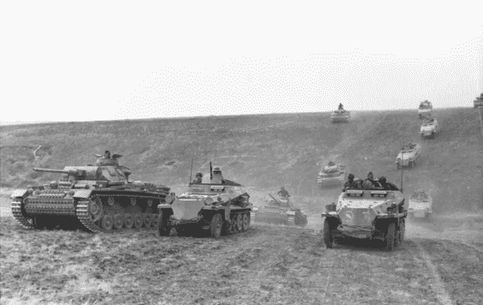
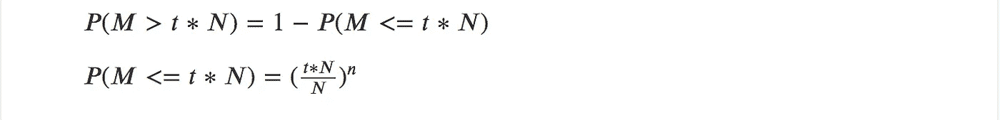
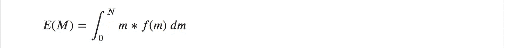
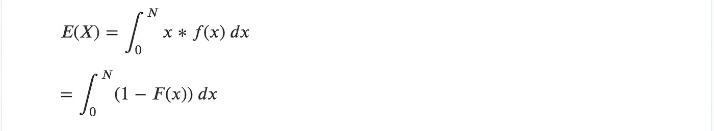
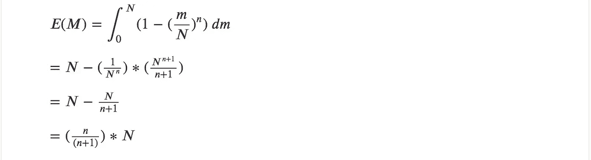
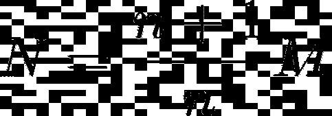
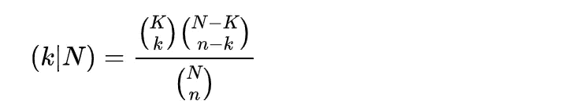
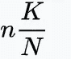
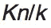

# 阿克巴和伯巴尔时代的一个数据科学问题

> 原文：<https://towardsdatascience.com/a-data-science-question-in-the-times-of-akbar-and-birbal-7e3f1128fe16?source=collection_archive---------22----------------------->

一个著名的印度故事，在那些在印度长大的人中特别受欢迎，是阿克巴-比尔巴的故事，伟大的莫卧儿皇帝阿克巴提出了一个看似不可能回答的问题——“我们王国里有多少只乌鸦？”。

伯巴尔，机智聪明的阿克巴皇帝的大臣，用一个随机数字反驳，当被要求证明其准确性时，以他典型的无与伦比的方式回应，逻辑是阿克巴不可能验证的，因为如果数字不准确，那是由于鸟类的迁徙本性！

## 统计估计问题

然而，我认为这是数据科学中一个完全有效的估计问题，也是一个值得问一群数据科学家(如果不是部长的话)的问题(如果我可以做一个观察的话，他们似乎从来没有对科学有足够的理解！).当然，由于所有的乌鸦看起来都一样或难以区分，这似乎是一个相当困难的问题。

An adjacent problem: Estimating the number of cars in a city

## 邻近的问题

但在我们讨论乌鸦之前，让我们讨论一个稍微相邻的问题——我们如何估计一个城市(如果不是王国)的汽车数量。当然，我们现在拥有的优势是，不像乌鸦，汽车被分配了注册号码，并且在大多数城市或多或少以升序排列。在这一点上，值得思考的一个有趣的问题是——拥有这样的注册号会让您的任务变得容易吗？

这是一个至少在面试中经常问产品经理的问题——答案围绕着一系列关于人口统计、城市条件等的猜测，导致最终的“猜测”。

然而，我意识到这个问题有一个优雅的统计解决方案，因此对于数据科学家的采访来说，这也是一个有趣的问题。当我写下数学证明(我们一会儿就会看到)时，我的一个朋友向我指出了一个令人难以置信的事实，这种技术实际上在近 70 年前的二战中被盟军用来估计德国人一直在制造的坦克数量，并将其命名为 [*德国坦克问题*](https://en.wikipedia.org/wiki/German_tank_problem) *！*

## 德国坦克问题

By Bundesarchiv, Bild 101I-218–0504–36 / Dieck / CC-BY-SA 3.0, CC BY-SA 3.0 de, [https://commons.wikimedia.org/w/index.php?curid=5476517](https://commons.wikimedia.org/w/index.php?curid=5476517)

盟军正利用缴获的坦克进行估算。他们得到的估计是每月生产 270 辆坦克，后来德国战后的记录显示实际数字是 276 辆！所以，事不宜迟，让我们开始吧！

## 估算一个城市的汽车数量！

这里有几个我们需要做的假设——假设汽车的注册号码是按顺序分配的，没有漏洞。此外，在像印度这样的国家，区号是注册号码的一部分——所以在这种情况下，让我们把重点放在估计特定区号内的汽车的问题上。此外，当有字母作为注册号的一部分时，应该不难将它们转换成数字形式，以便注册号真正是一个数字！

在上述假设/条件下，可以对城市中的一些汽车(比如说 n 辆)进行采样，并根据看到的最大注册数量得出一个估计值。

现在让我们来推导一下这个估计值是什么样子的——需要回忆一下你的高中数学，以防你感到数学上的挑战。当然，如果你愿意，请直接跳到这个[公式](https://medium.com/p/7e3f1128fe16#a2e9)。

## 估计值的推导

假设 M 是从“n”个样本中看到的最大注册数。假设 N 是汽车总数或实际分配的最大登记数量。

理想情况下，我们希望 M 尽可能接近 n。

也就是说，我们希望 m 大于𝑡∗𝑁，其中 0 t 更接近于 1)

也就是说，所有的车都是按照注册号顺序从第一辆 *t * N* 开始的样品。

上面的等式可以用来表示随机变量 *M* 的 CDF 函数:

*M* 的预期值可推导如下:

在这种情况下，

因为我们知道 M 可以取 0 到 n 之间的值。此外，我想澄清一下，这实际上是一个离散随机变量，尽管出于计算目的，我将其建模为连续随机变量。

对于正随机变量，

同样的推导参见[链接](https://stats.stackexchange.com/questions/10159/find-expected-value-using-cdf)。

换句话说，N 可以估计为:

那看起来一点也不差！

举个例子，如果你通过看 1000 辆车来估算 M，M 预计是实际值的 99.9%！

## 回到乌鸦队！

现在我们已经有了一个合理的统计方法来解决这个问题，当汽车被编号时，问题就出现了，在*没有编号的*乌鸦的情况下能做什么！好消息是，估计任何物种的数量都是目前研究得很好的课题，并且有技术可以解决这个看似困难的问题。

有两种估算鸟类种群的方法。一种是进行点计数，即计算从一个点可以看到的鸟类，然后跨区域进行推断。另一种方法是从样线计数，事实上，如果记录了斑点鸟的距离信息，它可以用来绘制该地区特定鸟类的密度图。

## 标记并重新捕获

另一种方法是称为[标记和重新捕获](https://en.wikipedia.org/wiki/Mark_and_recapture)的技术。生物学家(或者数据科学家！)标记该物种的一些鸟类，并让它们进入环境。经过足够长的时间后，发现该物种，并计算有标记和无标记鸟类的数量。样本中有标记鸟类与无标记鸟类的比例使他们能够推断出无标记物种的数量，并得到种群的总体估计。对于那些好奇的人来说，乌鸦等鸟类的标记技术可能是喷射荧光染料，这种染料可以粘在鸟类身上。

假设 *K* 只乌鸦被做了标记。假设乌鸦被重新捕获。

在重新捕获的鸟中，假设有 *k* 只被标记。

我们如何确定该地区乌鸦的总数 N？

让我们首先理解这里起作用的条件分布。

P(k | N) =假设总共有 N 只鸟，k 只标记的鸟被重新捕获的概率。

## 概率分布

这原来是一个[超几何分布](https://en.wikipedia.org/wiki/Hypergeometric_distribution)。超几何分布的平均值是

如果我们进行了足够的观察，k 是样本的平均值，那么 N 可以估计为:

这意味着，如果你标记了 100 只乌鸦，并且在你随后的观察中，你看到平均有 2%的乌鸦有标记，那么有标记的乌鸦与无标记的乌鸦的比率可以估计为 1:50，从而给我们一个 5000 只乌鸦的乌鸦种群估计！

请注意，在上述两个问题(乌鸦和汽车)中，出于理解的目的，我使用了所谓的频率主义方法，因为对于这个问题，这是一种更简单但合理的方法，尽管有足够多的情况表明频率主义方法是一种谬误。

## 参考

 [## 如何估算一个城市的汽车数量？

### 我在产品经理面试中遇到过这个问题，答案围绕着一系列…

medium.com](https://medium.com/@vinodh.ravindranath/how-to-estimate-the-number-of-cars-in-a-city-dd40432f12d2)  [## 人口规模、密度和分布

### 如果您看到此消息，这意味着我们在网站上加载外部资源时遇到了问题。如果你是…

www.khanacademy.org](https://www.khanacademy.org/science/high-school-biology/hs-ecology/hs-population-ecology/a/population-size-density-and-dispersal)  [## 鸟类普查技术:数乌鸦(和其他鸟类！)为什么数鸟？描述性研究=…

### 为什么数鸟？(续)评估栖息地需求=询问“鸟类在……中的密度是更高还是更低？”

slideplayer.com](https://slideplayer.com/slide/4490242/)  [## 对话:标记和重新捕获

### 乔利斯的方法也应该提到。是的，这里应该描述一下 cormack jolly seber 方法。这是极端的…

en.wikipedia.org](https://en.wikipedia.org/wiki/Talk:Mark_and_recapture#Statistical_treatment) 

这篇文章最初出现在[印度分析杂志](https://analyticsindiamag.com/a-data-science-question-in-the-times-of-akbar-and-birbal/)上。