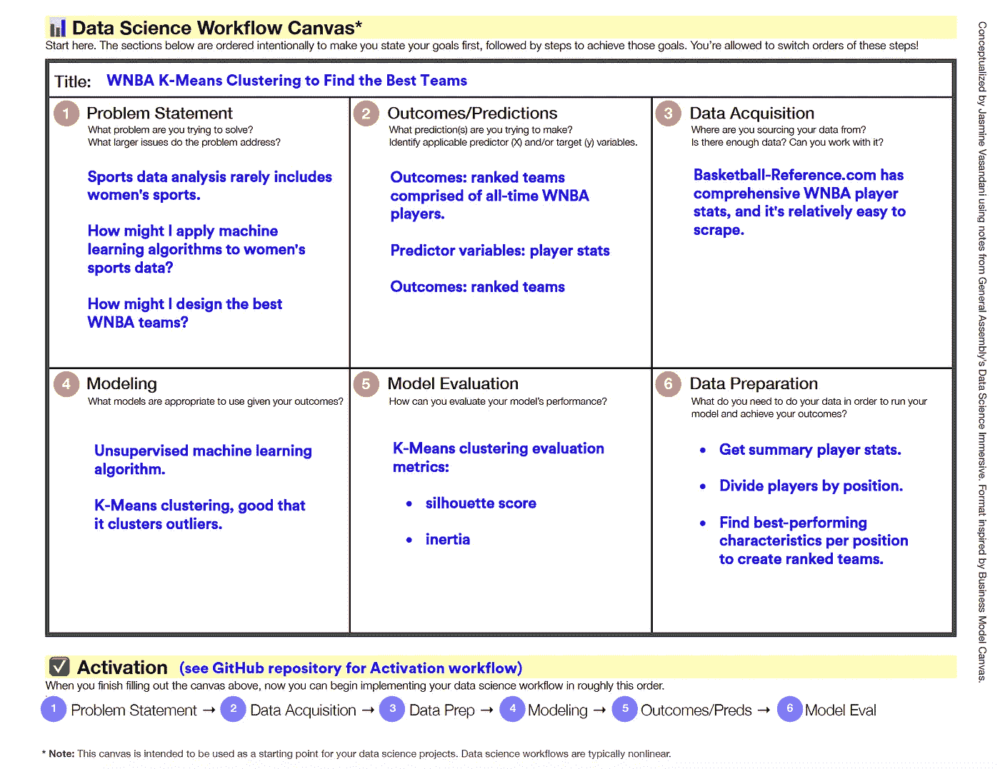

# 启动项目的数据科学工作流画布

> 原文：<https://towardsdatascience.com/a-data-science-workflow-canvas-to-kickstart-your-projects-db62556be4d0?source=collection_archive---------10----------------------->

Photo Credit: [https://www.wocintechchat.com/](https://www.wocintechchat.com/)

## 使用本指南帮助您完成数据科学项目。

从自己的错误和最佳实践中学习，我设计了一个 [**数据科学工作流画布**](http://bit.ly/data-science-canvas) ***** 来帮助他人实现自己的数据科学项目。这张画布可以帮助你先确定目标的优先顺序，然后再努力实现它们。你可以这样想:不是按照食谱中的步骤来做一顿预定的饭，而是首先想象这顿饭看起来和尝起来是什么样子，然后你开始制定食谱。在从事数据科学项目时，您通常没有一套指令来实现预定的结果。相反，*你*必须确定结果和实现这些结果的步骤。这个数据科学工作流画布的设计考虑到了这一过程。在这里，我将带您了解如何使用这个画布，并且我将分享我如何在自己的项目中实现这个画布的例子。

Data Science Workflow Canvas.

> [***下载数据科学工作流画布***](http://bit.ly/data-science-canvas) ***。***

# 如何使用数据科学工作流画布

## 第一步:确定你的问题陈述

你想解决什么问题？这个问题解决了什么更大的问题？这一部分帮助你解决项目的“为什么”。

## 第二步:陈述你的预期结果/预测

是的，你不会知道你的成果是什么，直到你完成了你的项目，但你至少应该有一个你认为它们应该是什么样子的想法。识别潜在的预测变量(`X`)和/或目标变量(`y`)。

## 步骤 3:确定您的数据源

您的数据来自哪里？数据是否足够？你真的能使用它吗？有时候，你可能有现成的[数据集](https://github.com/jasminevasandani/awesome-public-datasets)，或者你可能需要[收集数据](https://towardsdatascience.com/tagged/web-scraping)。

## 第四步:选择你的模型

根据你对这些问题的回答选择你的模型:你的结果是离散的还是连续的？您是否有[标记或未标记的数据集](https://www.quora.com/What-is-the-difference-between-labeled-data-and-non-labeled-data)？你关心离群值吗？您希望如何解释您的结果？根据您的项目，问题列表会有所不同。

## 步骤 5:确定模型评估指标

确定相应的模型评估指标来解释您的结果。每个模型都有自己的一套评估指标。

## 步骤 6:创建数据准备计划

为了运行您的模型并实现您的结果，您需要对您的数据做什么？数据准备包括数据清理、特征选择、特征工程、探索性数据分析等等。

## 将这一切结合在一起

一旦你在画布上完成了你的想法的头脑风暴，是时候把它们都集中起来，激活你的项目了！将项目投入使用时，请参考画布“激活”部分中列出的顺序。

# 数据科学工作流画布示例#1

下面是我在 WNBA 机器学习项目中如何实现数据科学工作流画布的一个例子。阅读关于这个项目的[文章](/how-machine-learning-made-me-fall-in-love-with-the-wnba-278f06eee503?sk=e720b1fe967da38b2c7f4b693a34ca96)或者参考这个画布跟随 GitHub [库](https://github.com/jasminevasandani/WNBA_Teams_Clustering/blob/master/WNBA_Machine_Learning_Clustering.ipynb)。

Data Science Workflow Canvas for the [WNBA Clustering project](/how-machine-learning-made-me-fall-in-love-with-the-wnba-278f06eee503?sk=e720b1fe967da38b2c7f4b693a34ca96).

# 数据科学工作流画布示例#2

这是我在假新闻检测器项目中如何实现数据科学工作流画布的另一个例子。阅读关于这个项目的[文章](/i-built-a-fake-news-detector-using-natural-language-processing-and-classification-models-da180338860e)或者参考这个画布跟随 GitHub [库](https://github.com/jasminevasandani/NLP_Classification_Model_FakeNews/blob/master/FakeNews_NLP_Classification_Modeling.ipynb)。

Data Science Workflow Canvas for the [fake news detector](/i-built-a-fake-news-detector-using-natural-language-processing-and-classification-models-da180338860e) project.

# 结论

要很好地实施这个数据科学工作流画布，请记住以下三点:

1.  不要害怕犯错误。用这块画布作为头脑风暴你最初想法的空间，然后回来完善你的过程。保留有用的，去掉无用的。
2.  专注于你想完成的事情。即使你最初的目标改变了，也要专注于你想要完成的事情。不管你需要多长时间回顾和更新你的目标，只要专注于它们。
3.  **数据科学是一个非线性的迭代过程。**实现数据科学项目没有正确或线性的方法。你可以使用这个画布作为资源来帮助你开始一个项目，但是如果你开发另一个更适合你的过程也没关系。

祝您的数据科学项目好运，愿画布与您同在！

**数据科学工作流画布中的内容灵感来自我在大会期间所做的笔记* [*数据科学沉浸式*](https://generalassemb.ly/education/data-science-immersive) *。画布的结构灵感来自* [*商业模式画布*](https://en.wikipedia.org/wiki/Business_Model_Canvas) *。*

*Jasmine Vasandani 是一名数据科学家、战略家和研究员。你可以在这里了解她的更多:*[*www.jasminev.co/*](http://www.jasminev.co/)