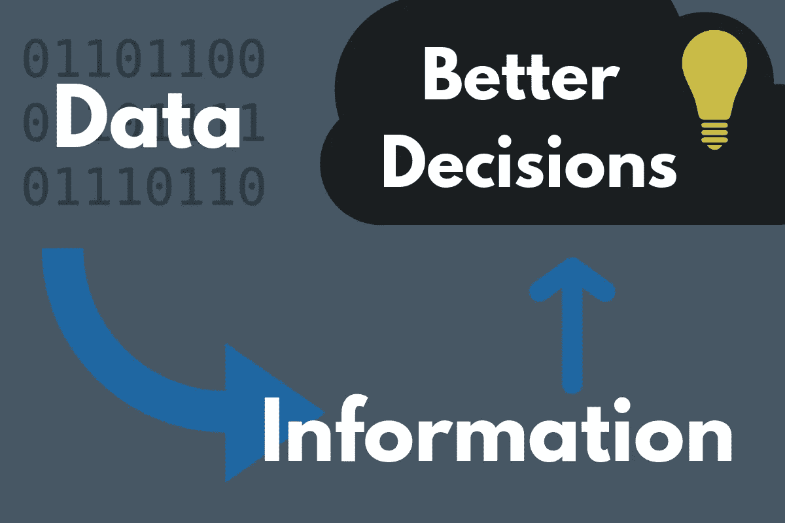
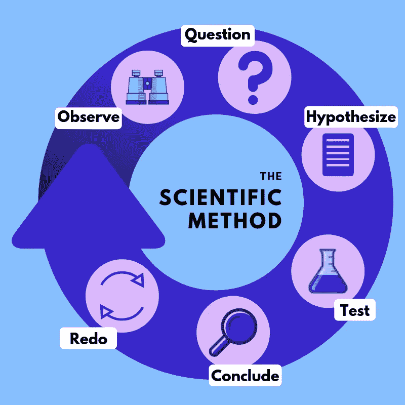
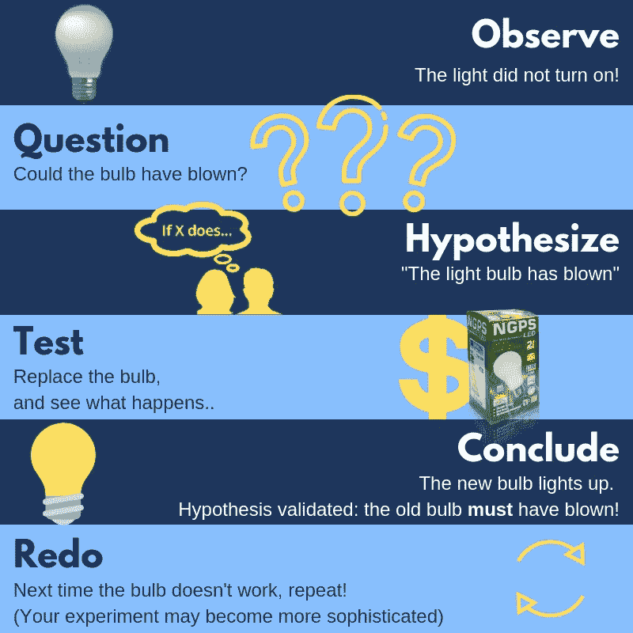
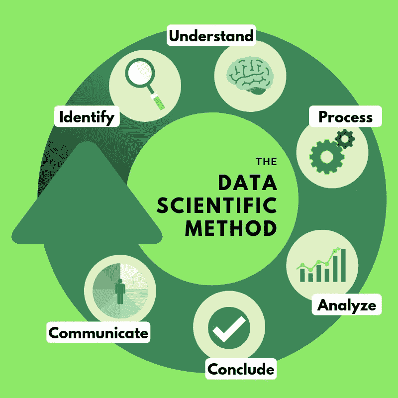
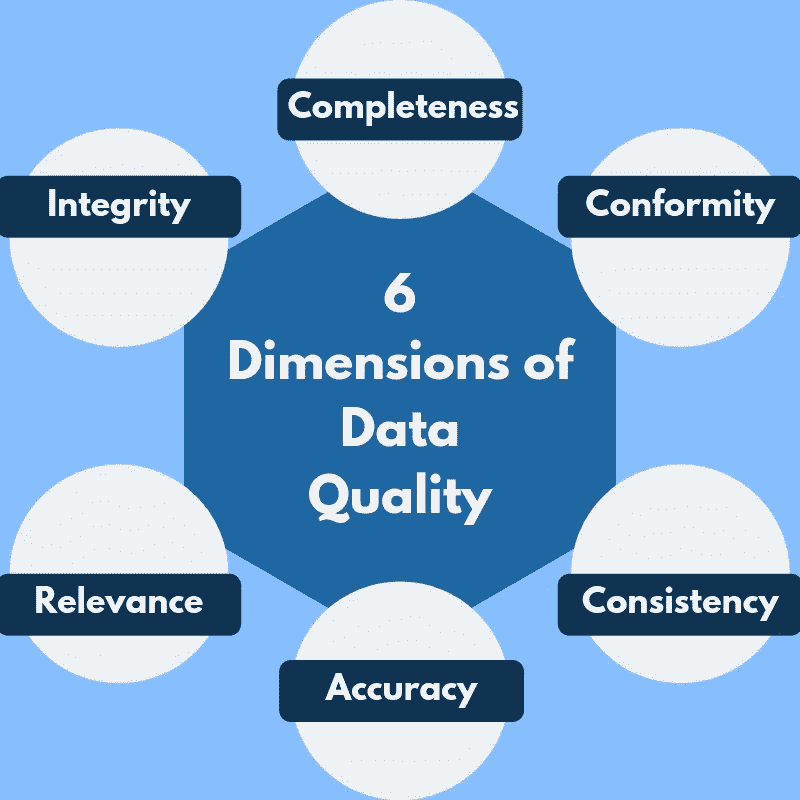
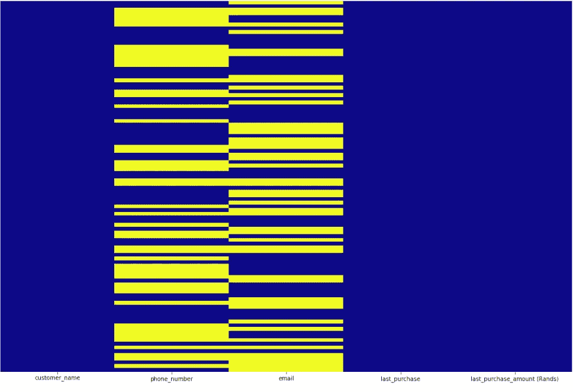
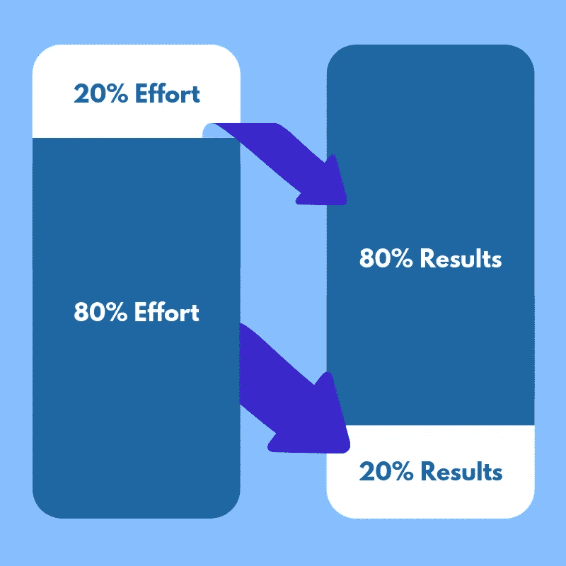
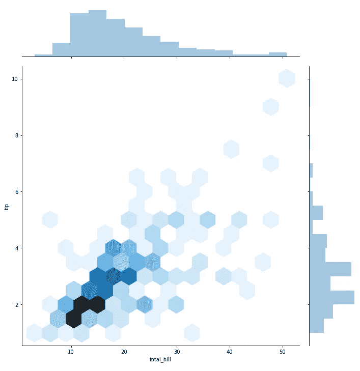
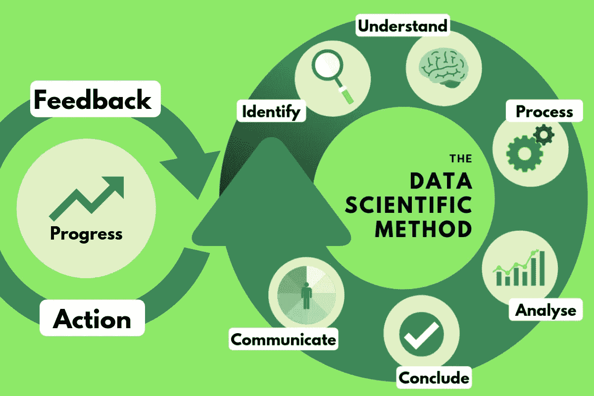

# 数据科学方法

> 原文：<https://towardsdatascience.com/a-data-scientific-method-80caa190dbd4?source=collection_archive---------7----------------------->

## 如何对数据科学采取务实和目标驱动的方法

数据科学的主要目的很简单:从数据中提取价值是*。这个价值在不同的环境中可能有不同的形式——但是，通常，它以 ***更好的决策*** 的形式出现。*

**

*Data Science Should Ensure that Data Results in Better Decisions (CREDIT: Author on [Canva](http://canva.com))*

*随着我们越来越深入地探索 21 世纪，数据在我们决策中扮演的角色变得越来越重要。这是因为可用数据的绝对体积增长，以及我们可以用来存储、处理和分析数据的工具的改进。*

*然而，从更宏观的角度来看，数据科学领域仍处于起步阶段。这是一个出现在其他几个学科交叉领域的领域——仅举几个例子，如统计学、商业智能和计算机科学。随着这些领域的迅猛发展，数据科学也是如此。*

*因此，重要的是要清楚地制定一种方法，从数据中做出更好的决策，以便它可以有系统地应用于新的问题；当然，这个过程可能会以“向黑暗中开枪”开始——但你至少希望你的射击随着时间的推移变得更加准确；您希望您的过程随着每个项目而改进。*

*在 [**高斯工程**](http://www.gauseng.com) 我们做了许多项目，明确的目标是从数据中提取价值；这篇文章将尝试记录我们的一些经验，并为数据科学制定一个流程；我们方法的灵感来源于久经考验的科学方法…*

# ***科学方法***

*自 18 世纪以来，科学方法是自然科学领域的一个特征；它由一系列系统化的步骤组成，这些步骤的最终目的是验证或拒绝一个陈述(假设)。*

**

*The Phases of the Scientific Method (CREDIT: Author on [Canva](http://canva.com))*

*步骤大概是这样的:*

> *1. ***观察*** →进行观察*
> 
> *2. ***提问*** →提问观察，收集信息*
> 
> *3. ***假设*** →形成假设——试图解释观察结果的陈述，根据这个假设做出一些预测*
> 
> *4. ***测试→*** 使用可重复的实验来测试假设(和预测)*
> 
> *5. ***结论→*** 分析结果并得出结论，从而接受或拒绝假设*
> 
> *6. ***重做*** →实验要复制足够的次数，以保证观察值/结果与理论不矛盾。*

*举个例子，想象你刚从学校或工作回到家；你打开卧室的灯，什么也没发生！我们怎样才能用科学方法来确定这个问题呢？*

**

*The Scientific Method Applied to Everyday Life (CREDIT: Author on [Canva](http://canva.com))*

*科学是增进理解的方法论；而科学方法可以被看作是 ***一种迭代的方法来规范进行实验的过程，这样所有的实验都可能产生更有价值、更可靠的结果***——因此，更好的理解。*

*同样，我们希望数据科学有一个标准化的方法；也就是说，一种优先获得与分析目标相关的信息的方法。*

> *“如果它与实验不符，那就错了。这句简单的话就是**科学**的关键理查德·p·费曼*

# *数据科学方法*

**

*The [Gaussian](http://www.gauseng.com) Data Scientific Method (CREDIT: Author on [Canva](http://canva.com))*

*在我们的组织 [**高斯工程**](http://www.gauseng.com) 中，我们找到了一种方法，我们觉得这种方法对我们的项目很有效。像科学方法一样，它由 6 个阶段组成:*

> *1. ***识别****
> 
> *2. ***了解****
> 
> *3. ***流程****
> 
> *4. ***分析****
> 
> *5.**缔结*缔结*缔结***
> 
> *6. ***沟通****

*这些阶段将得到更详细的解释，我将列出我们在每个阶段使用的一些工具/方法(我们的团队用 Python 编程，并使用各种开源工具，所以请原谅我在这方面的偏见)。*

## *识别*

*“识别”阶段涉及数据科学项目目标的制定；它也可以被称为“计划”阶段。*

*我们发现，通过分析所讨论的数据集，非常清楚地了解我们试图实现的目标是非常有帮助的。借用 [PAS 55 实物资产管理标准](https://www.assetmanagementstandards.com/pas-55/)中的一个术语，我们试图确保我们的团队对项目的总体目标有一个清晰的视线**。***

*在这个阶段，我们会问这样的问题:*

*   *根据这些数据需要做出什么决定？*
*   **我们希望回答什么问题？**
*   **对于答案，我们会对什么样的自信水平感到满意？**
*   *我们能阐明与这些问题相关的假设吗？它们是什么？*
*   *我们有多少时间进行探索？*
*   **利益相关者希望从这些数据中做出什么决定？**
*   *理想的结果是什么样的？*
*   *我们如何导出并展示最终结果？*

***对“*识别”*阶段有用的工具/方法:***

*   **研讨会/头脑风暴会议**
*   **制定一个指定的空间将相关的文档和调查结果放在一起(*[*SharePoint*](https://products.office.com/en-za/sharepoint/sharepoint-server)*网站、*[*Dropbox*](https://www.dropbox.com/)*文件夹等)。)**
*   *[*松弛*](https://slack.com/) *或* [*微软团队*](https://products.office.com/en-us/microsoft-teams/free) *(数字协作平台)**
*   *[*特雷罗*](https://trello.com/en) *或* [*阿萨纳*](https://asana.com/) *(帮助项目管理的应用)**

## ****了解****

*这个“理解”阶段就是对数据本身有一个 ***的总体感觉*** 。*

*在你开始迷失在细节中之前；深入各种数据源；在各个领域上进行筛选，在‘增值工作’和‘分析麻痹’之间走着细微的界限，有用的 ***保证你的团队对有什么*** 有更大的画面理解。我们在花了大量时间为我们的项目目标建立了一个**视线**之后才这样做——以便在下一阶段让它们在我们的脑海中保持新鲜。*

*在这个阶段，我们会问这样的问题:*

*   **数据的大小是多少？**
*   **一共有多少档？**
*   *数据在多大程度上来源于不同的来源？*
*   **自动导出还是手动电子表格？**
*   *数据是否有一致的格式(日期、位置等)。)?*
*   **整体数据质量如何？就数据质量的 6 个维度而言？**
*   **需要什么样的清洁水平？**
*   **各个字段是什么意思？**
*   *有哪些领域存在偏见问题？*

**

*Our Take on the Six Dimensions of Data Quality (CREDIT: Author on [Canva](http://canva.com))*

*了解数据的各个方面，例如数据的总体大小，可以帮助您决定如何进行分析；对于较小的数据，您可能希望使用 Python、Jupyter 和 Pandas 或 R；对于较大的数据，您最好将它移动到一个带索引的 SQL 数据库中(对于较大的数据，Hadoop 和/或 Apache Spark 成为选项)。*

*这个阶段特别有趣的是，如果你对自己的目标有一个清晰的视线，那么，随着你对数据 ***有了更好的理解，你就可以确定哪些方面对分析*** 最重要；这些是你可以首先投入大部分精力的领域。这在有严格时间限制的项目中尤其有用。*

***一些对“*理解”*阶段有用的工具/方法:***

*   **研讨会/头脑风暴会议**
*   *[*Python*](https://www.python.org/)*
*   *[*Jupyter 笔记本*](https://jupyter.org/) *(允许共享包含实时代码、公式和可视化的文档)**
*   *[*Numpy*](http://www.numpy.org/) *和* [*熊猫*](https://pandas.pydata.org/) *(Python 库)**
*   *[*Matplotlib*](https://matplotlib.org/)*和*[*Seaborn*](https://seaborn.pydata.org/)*(可以帮助查看缺失数据的 Python 可视化库)**
*   ***(一种面向统计的编程语言)***

****

**Using Python to Visualize Missing Data with a Heatmap (Yellow is indicative of Missing Data) (CREDIT: Author on [J](http://canva.com)upyter Notebook)**

**Code Snippet for Heatmap (‘df’ stands for ‘DataFrame ‘— a Pandas data structure)**

***(以上热图是用随机数据生成的)***

## *****流程*****

**这个“处理”阶段是关于 ***让您的数据进入一种准备好进行分析的状态*** 。**

**我想到了“清洁”、“争吵”和“争吵”这些词。**

**这里给你一个有用的现象是帕累托原则——或“80/20 法则”:**

> **“对于许多事件来说，大约 80%的结果来自 20%的原因”——维尔弗雷多·帕累托**

****

**The Pareto Principle or 80/20 Rule (CREDIT: Author on [Canva](http://canva.com))**

**“流程”阶段通常会占用最多的时间；根据帕累托原则，重要的是优先考虑你投入最多时间的数据的哪些方面；你想先把注意力集中在你认为最重要的事情上，只有在必要和有时间的情况下才回到次要的领域。**

****在此阶段，我们可以执行以下任何或所有操作:****

*   ***将所有数据组合成一个单一的索引数据库(我们使用*[*PostgreSQL*](https://www.postgresql.org/)*)***
*   ***识别并删除与确定的项目目标无关的数据***
*   ***识别并删除重复项***
*   ***确保重要数据的格式(日期、时间、地点)一致***
*   ***删除明显与现实不符的数据，这些异常值不太可能是真实数据***
*   ***修复结构错误(错别字、大小写不一致)***
*   ***处理丢失的数据(nan 和 null——通过丢弃或插值，取决于具体情况)***

**这个阶段的目的实际上是让你在分析阶段的生活变得更容易；处理数据通常需要很长时间，可能是相对乏味的工作，但结果是值得努力的。**

****一些对'*流程'*阶段有用的工具/方法:****

*   **[*MySQL*](https://www.mysql.com/) *，*[*SQLite*](https://www.sqlite.org/index.html)*或*[*PostgreSQL*](https://www.postgresql.org/)**
*   ***巨蟒***
*   **[*Numpy*](http://www.numpy.org/) *和* [*熊猫*](https://pandas.pydata.org/) *(Python 库)***
*   **[*Matplotlib*](https://matplotlib.org/)*和*[*Seaborn*](https://seaborn.pydata.org/)*(可以帮助查看缺失数据的 Python 可视化库)***
*   **[*NLTK*](https://www.nltk.org/) *(自然语言处理工具包——另一个 Python 库)***

## *****分析*****

**这一阶段涉及数据的实际分析；它是对数据进行检查、探索和建模的过程——以 ***发现以前未知的*** 模式和关系。**

**在数据价值链中，这一阶段(以及前一阶段)是数据本身增加最重要价值的地方。这是将数据转换成(潜在的)可用信息的转换阶段。**

**在这一阶段，您可能希望快速可视化您的数据，尝试确定不同字段之间的特定关系。您可能想要探索不同位置或不同时间的字段差异。**

**理想情况下，在 ***识别*** 阶段，你会提出几个关于你想从这些数据中得到什么的问题，甚至可能会陈述几个假设——这是你实施模型来确认或拒绝这些假设的阶段。**

****在此阶段，我们可以执行以下任何一项操作:****

*   ***如果有基于时间的数据，探索某些领域是否存在长期趋势——通常使用基于时间的可视化软件，如* [*超集*](https://superset.incubator.apache.org/) *或* [*格拉法纳*](https://grafana.com/)**
*   ***如果有基于位置的数据，按区域探索某些字段的关系—通常使用制图软件，如* [*传单 JS*](https://leafletjs.com/) *，以及空间查询(我们使用*[*PostgreSQL*](https://www.postgresql.org/)*与*[*PostGIS*](https://postgis.net/)*)***
*   ***探索不同领域之间的相关性(r 值)***
*   ***使用自然语言处理方法(如单词袋模型)对文本进行分类***
*   ***实施各种机器学习技术，以识别多个变量/领域之间的趋势——回归分析可能很有用***
*   ***如果有许多变量/字段，可以使用降维技术(如主成分分析)将其减少到保留大部分信息的较小变量子集***
*   ***深度学习和神经网络有很大的潜力，特别是对于更大的结构化数据集(尽管我们还没有充分利用这一点)***

**分析阶段实际上是橡胶碰到路面的阶段；这也说明了数据科学更性感的一面。**

****

**Visualizing the Distribution of Two Variables Using Seaborn’s Jointplot (CREDIT: Author on Jupyter Notebook)**

**Code Snippet for Jointplot**

****一些对“*分析”*阶段有用的工具/方法:****

***(注意，我们将可视化工具留到最后一节)***

*   **[*mySQL*](https://www.mysql.com/) *，*[*SQLite*](https://www.sqlite.org/index.html)*或*[*PostgreSQL*](https://www.postgresql.org/)*(对于查询，包括空间查询—对于 SQLite，参见*[*SpatiaLite*](https://www.gaia-gis.it/fossil/libspatialite/index)*)***
*   **[*JetBrains data grip*](https://www.jetbrains.com/datagrip/)*(py charm IDE)***
*   ****(一个探索和发布数据的工具)****
*   **[*Jupyter 笔记本*](https://jupyter.org/) *(允许共享包含实时代码、方程式和可视化的文档)***
*   **[*SciPy*](https://www.scipy.org/)*(Python 高级计算库)***
*   **[*【NumPy】*](http://www.numpy.org/)*[*熊猫*](https://pandas.pydata.org/) *(Python 数据分析/操纵库)****
*   **[*Scikit-Learn*](https://scikit-learn.org/)*(Python 机器学习库)***
*   **[*张量流*](https://www.tensorflow.org/) *(Python 机器学习库一般用于深度学习和神经网络)***
*   **[*Keras*](https://keras.io/) *(用于神经网络快速实验的 Python 库)***

## ****缔结*缔结*缔结****

**这个阶段关注的是**从**阶段的分析结果中得出可靠的、有价值的结论。在这个阶段，你可以清楚地回答你的问题；在这个阶段，你可以证明或者否定你的假设。在这个阶段，你还可以利用你的结论，产生可操作的项目，以帮助实现目标(如果合适的话)。**

**我们通常旨在创建一个从分析中得出的结论或“发现”列表，以及一个基于这些发现的后续建议行动列表。列出行动时应该考虑到你的目标受众:他们想简洁地知道 ***发现了什么*** 和 ***他们可以用/关于它做什么*** 。**

****在此阶段，我们可能会执行以下任何一项或全部操作:****

*   ***交叉检查调查结果和原始问题(“识别”阶段)，并确定我们已经回答了什么***
*   ***拒绝或接受“识别”阶段的各种假设***
*   ***对结论/调查结果进行优先排序，哪些结论/调查结果对利益相关方最重要——哪些最重要？***
*   **尝试将结论编织成某种形式的故事**
*   ***确定跟进问题***
*   ***确定行动将产生最有价值结果的高度优先领域(帕累托原则)***
*   ***根据结论制定建议和/或行动(特别是在高度优先领域)***

****一些对“*总结”*阶段有用的工具/方法:****

*   ***研讨会/集思广益会议***
*   ***微软办公软件(Excel、PowerPoint、Word)***
*   **[*【80/20 法则】*](https://en.wikipedia.org/wiki/Pareto_principle)**

## *****传达*****

**可以说，数据科学方法中最重要的步骤是“交流”阶段；在这个阶段，你 ***确保你的客户/观众/利益相关者理解你从他们的数据中得出的结论*** 。**

**还应该以这样一种方式向他们展示这些，以便他们能够采取行动——因此，如果你不建议采取行动，那么应该展示结论，以便激发他们采取行动的想法。**

**在这个阶段，您将自己的发现和结论打包成美观、易于理解的可视化、演示、报告和/或应用程序。**

****

**A Geographic Visualization Using Apache Superset (CREDIT: Apache Superset)**

****在此阶段，我们可能会执行以下任何一项操作:****

*   ***如果有基于时间的数据，使用像* [*【格拉法纳】*](https://grafana.com/) *或* [*超集*](https://superset.incubator.apache.org/) 这样的软件包创建性感的时间序列可视化**
*   ***如果有空间数据，使用* [*传单 JS*](https://leafletjs.com/) *，*[*Plotly*](https://plot.ly/)*或* [*超集*](https://superset.incubator.apache.org/) 等软件包创建性感的地图可视化**
*   ***使用*[*D3 . js*](https://d3js.org/)*，*[*Matplotlib*](https://matplotlib.org/)*或* [*Seaborn*](https://seaborn.pydata.org) 创建统计图**
*   ***将各种可视化嵌入仪表板，并确保它们是可共享的/可移植的(无论是托管的还是作为应用程序构建的)——*[*超集*](https://superset.incubator.apache.org/) *是在组织内实现这一点的绝佳方式***
*   ***使用*[*D3 . js*](https://d3js.org/)*或* [*开发交互式可视化*](https://plot.ly/)**
*   **使用 Angular、Vue.js 或 React(或只是普通的 JavaScript)等 web 技术开发交互式应用程序或 spa(单页应用程序！)—使用 PostgreSQL 的 Psycopg2 等库将这些链接到数据上**

****一些对“*沟通”*阶段有用的工具/方法:****

*   ****(针对时间序列)****
*   **[*Apache 超集*](https://superset.incubator.apache.org/) *(探索与可视化平台；允许创建可共享的仪表板；非常适合各种数据源，包括 SQL 数据库)***
*   **[*Matplotlib*](https://matplotlib.org/) *，* [*Seaborn*](https://seaborn.pydata.org/) *，*[*Bokeh*](https://bokeh.pydata.org/en/latest/)*(Python 可视化库—*[*Seaborn*](https://seaborn.pydata.org/)*更多的是为了统计可视化，是建立在*[*Matplotlib*](https://matplotlib.org/)*)***
*   **[*D3.js*](https://d3js.org/) *(一个直接将 HTML 链接到数据的 JavaScript 库，允许漂亮的、交互式的和高度可定制的浏览器内可视化)***
*   **[*leaflet . js*](https://leafletjs.com/)*(一个用于创建交互式地图的 JavaScript 库)***
*   **[*Plotly*](https://plot.ly/) *，*[*Altair*](https://altair-viz.github.io/)*，以及*[*Pygal*](http://pygal.org/en/stable/)*(Python 库用于交互式可视化)***
*   **[*Jinja 2*](http://jinja.pocoo.org/docs/2.10/)*(Python，HTML 模板库——类似 Django 模板)***
*   **[*psycopg 2*](http://initd.org/psycopg/)*(PostgreSQL 驱动通过 Python 方便数据库连接)***
*   ****[*vue . js*](https://vuejs.org/)*和*[*React*](https://reactjs.org/)*(SPA 库/JavaScript 框架)*****
*   ***微软办公软件(Excel、Word 和 PowerPoint)——用于报告***

# ****信息应导致行动****

**现在，就像到目前为止所陈述的那样，通过这个过程是非常好的；毕竟，它应该会产生一些声音信息。不过，要实现这些数据的任何好处，应该对从中获得的信息做些什么！**

**像科学方法一样，我们的方法是一个迭代的过程，应该包含行动…**

**所以，稍微修改一下我们的图表:**

****

**The Data Scientific Method with Feedback and Action Loop (CREDIT: Author on [Canva](http://canva.com))**

**通常我们也会经历这六个阶段，在我们再次重复之前没有时间采取行动。我们可能会交流发现，立即引发进一步的问题，然后我们可能会陷入另一个循环。然而，从长远来看，行动是使整个工作变得有价值的关键。**

**在[我们的组织](http://www.gauseng.com)中，每个新的数据科学项目都由几个这样的周期组成。交流结果往往会引发新的讨论，并为探索开辟新的问题和途径；如果我们的结论导致产生有利结果的行动？我们知道我们正在做正确的事情。**

> **“没有**数据**，你只是另一个有**观点**的人。”爱德华·戴明**

***本文原文，* [*点击此处*](https://www.gauseng.com/single-post/2019/02/14/A-Data-Scientific-Method) *。感谢* [*杜*](https://jacoduplessis.co.za/) *为数据科学方法整理原始步骤(* [*查看 GitHub 账号*](https://github.com/jacoduplessis/data_guide) *)***