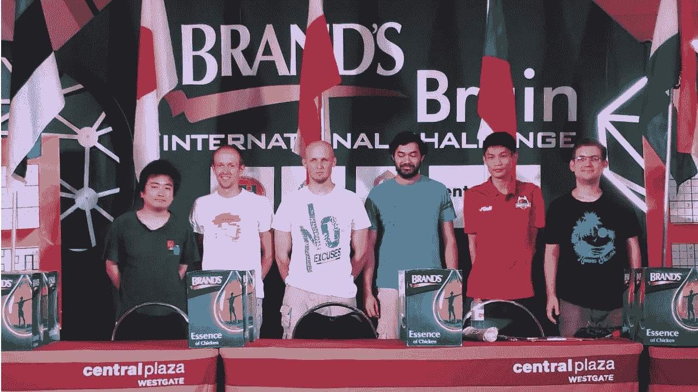
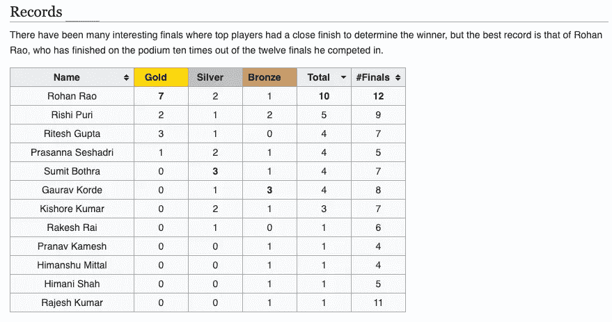
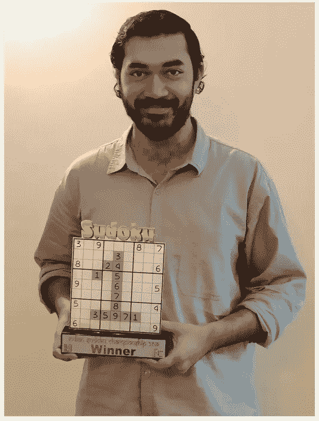
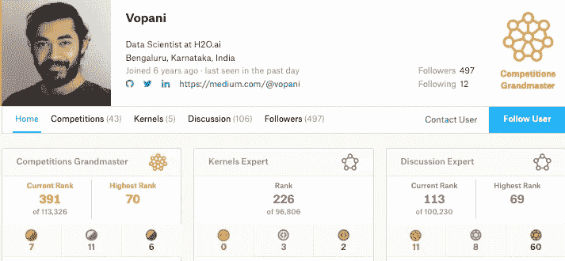
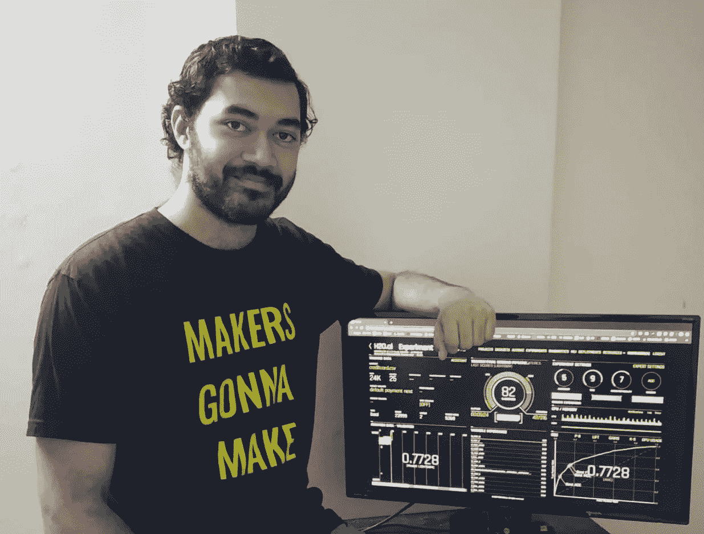

# 一位数据科学家从数独到 Kaggle 的旅程

> 原文：<https://towardsdatascience.com/a-data-scientists-journey-from-sudoku-to-kaggle-120876b7fa33?source=collection_archive---------6----------------------->

## 与 Rohan Rao 的对话:数据科学家、Kaggle 特级大师、印度数独卫冕冠军

Rohan(4th from L)along with other winners of the Brands Brain International Challenge’2019

> 如果你把足够多的聪明人聚集在一个地方，好事就会发生。埃里克·赫斯曼

成为 [H2O.ai](https://www.h2o.ai/) 一员的额外好处之一是，你可以和这个星球上最聪明的人一起工作。在这里，你可以和有丰富经验和专业知识的人近距离接触。这里的一组专家是 [**Kaggle 特级大师**](https://www.h2o.ai/company/team/) ，他们一次又一次地证明了自己在数据科学领域的实力和专业知识。

我有机会与我的同事 [**Rohan Rao**](https://www.linkedin.com/in/vopani/?originalSubdomain=in) 互动，他是一位 Kaggle 特级大师，也是 7 次全国数独冠军，我想将对话分享给社区。通过这次谈话，你将有机会了解他的旅程、灵感和成就。你还将了解是什么激励他去竞争，是什么让他保持动力。

奥汉·拉奥，在 Kaggle 上的名字是 Vopani，他身兼数职。除了是一名**四重** [**Kaggle 特级大师**](https://www.kaggle.com/rohanrao) 和 H2O.ai 的数据科学家之外，他还是一名出色的数独和解谜专家，被广泛认为是印度最好的数独解谜专家。

他是数独和拼图的 15 次全国冠军，是第一个排名世界前 10 的印度人，也是唯一一个在 2018 年和 2019 年亚洲锦标赛上登上领奖台(前 3 名)的印度人。他最近**赢得了**最新一届的全国数独锦标赛，还在今年 7 月曼谷举行的著名的 **Brands Brain 国际挑战赛**中获得了**第二名**。

 [## Rohan Rao -维基百科

### Rohan Rao 是一个印度数独和解谜者，被广泛认为是印度最好的数独解谜者。他是 15 次…

en.wikipedia.org](https://en.wikipedia.org/wiki/Rohan_Rao) 

以下是我与 Rohan 对话的摘录:

*   你是第一个进入数独世界前 10 名的印度人？最初是什么激励你开始玩数独？

Another podium finish — Winner of National Sudoku Championship’2019

***罗汉:*** 我从小就对逻辑、数字、模式、运动着迷。2005 年，在孟买的一场比赛前一天，我学会了解数独，最终我赢得了 U-16 组别的比赛。那是我的转折点，出于兴趣和爱好，我开始积极地追求它。

作为一个天生的问题解决者，我认为数独是一个需要解决的问题。通过消除和输入数字的逻辑路径最终得到解决方案，总是给我一种成就感和幸福感。

多年来的练习、准备、勤奋和努力使我赢得了各种国内和国际冠军。这让我有机会代表我的国家参加这项运动，并帮助我实现了成为第一个进入世界前 10 名和亚洲前 3 名的印度人的目标。

*   ***你是如何对数据科学产生兴趣的？擅长解谜在其中有作用吗？***

***Rohan****:*完成应用统计学硕士学位后，我一直在寻找可以应用统计学解决现实问题的领域。我发现数据科学(DS)是一个令人兴奋的工作领域，它使用了大量的数学和统计学。幸运的是，我在 2013 年获得了我在一家机器学习(ML)咨询公司的第一份工作，在那里我开始了我的职业生涯。

数独和 ML 一开始是独立的兴趣和工作领域。虽然最初很难跟上两者，但逐渐发现了两者重叠的一些领域。

数独教会我思考、制定策略和计划解决一个给定的问题。它帮助我建立了精神上的耐力、速度，以及找到脱颖而出的解决方案的关键要素的能力。

另一方面，ML 教会了我如何巧妙地将理论见解和想法结合到实际的动手解决方案中。它让我体会到分析的重要性，多维度的洞察力，以及将解决方案优化到边缘的概念。

*   成为 Kaggle 特级大师是一项令人印象深刻的壮举，需要极大的毅力和努力。你和 Kaggle 的幽会是如何开始的，是什么让你在你的大师之旅中一直保持动力？

Rohan’s Kaggle Profile

***罗汉:*** 我很幸运在我工作的最初几年有一位伟大的导师，他让我接触了 Kaggle，并与我密切合作。然后，我的竞争精神、渴望和取得成功的动力占据了我的心头，这是我整个旅程中不变的动力。

成为 Kaggle 特级大师无疑是我职业生涯中的一个决定性时刻，这涉及到一些个人牺牲以及来自家人和朋友的大量支持。

*   ***就数据科学而言，您最喜欢的资源是什么？你更喜欢哪种编程语言？***

***罗汉:*** Kaggle、Google、Stackoverflow 会是我的前三名，一点也不奇怪。根据问题陈述的不同，有许多有用的 Github 库和开源库/包都可以为构建解决方案增加价值。

我从 R 开始，它仍然是我首选的 DS 语言。随后我学习了 Python 和 Scala，过去几年我一直在使用 Scala 构建生产就绪的解决方案。

*   很多人，尤其是新手，被 Kaggle 弄得不知所措？对于他们应该如何对待数据科学竞赛，有什么建议吗？

***Rohan***:*ka ggle 已经变得浩如烟海，拥有大量有用的信息、代码、想法、讨论和解决方案。由于可用内容的庞大和深度，一开始可能会有点让人不知所措。*

*我的建议是开辟一条道路，根据目标，确定小任务，花时间完成它们。在最初阶段，最好完全专注于一项比赛。人们可以从探索内核开始，并参与比赛的讨论。接下来可以参加不同类型的比赛，一个接一个地获得最大的曝光率。*

*   ****作为 H2O.ai 的一名数据科学家，你的角色是什么？你在哪个具体领域工作？****

****Rohan****:*作为 H2O.ai 的 Kaggle 特级大师，我的职责主要是开发 H2O 的产品，如无人驾驶 ai，以帮助我们的客户为各种行业的广泛用例构建机器学习解决方案，包括金融科技、制造、零售、医疗保健和营销。我专攻推荐引擎、信用风险建模、数字支付生态系统和优化数字营销活动。*

**

*Makers gonna Make*

*挑战是双重的:为可扩展的机器学习解决方案建立一个行业无关的平台，以及通过与数据或模型或领域专业知识有关的各种方法实现智能，并能够将一切结合到端到端的打包产品中。*

*   *你通过 Kaggle 学到的最好的东西有哪些是你在 H2O.ai 的专业工作中应用到的？*

****罗汉****:*ka ggle 上的问题种类繁多，各有各的处理数据、建立模型、优化解决方案的方式。对我来说，最重要的学习是理解数据集，然后设计数据科学解决方案框架的能力。*

*我自动化了机器学习工作流的许多组件，以提高我在 Kaggle 比赛中的效率。我现在使用其中的许多模块来增强 H2O.ai 的产品，如[无人驾驶 AI](https://www.h2o.ai/products/h2o-driverless-ai/) 用于构建跨各种行业的机器学习解决方案，以便在更广泛的生态系统中可用。*

*   *总的来说，最近有很多关于 ML 和 AI 的炒作。你对此有什么想法？*

****Rohan****:*理解人工智能正在跨行业取得巨大突破，并在围绕其构建的产品和应用中拥有光明的未来是至关重要的。同样重要的是要认识到，几乎所有的创新解决方案都极其难以开发，并且是经过多年研究开发出来的，而不仅仅是魔术。*

*随着时间的推移，它将逐渐成为我们生活中不可或缺的一部分，有望解决世界上的许多问题，它将变得更容易理解、构建和分享。*

*   *你希望在 ML 的哪些特定领域或问题上运用你的专长？*

****Rohan****:*利用数据和 ML 预测全球范围内的犯罪是我最感兴趣的领域之一，它可以在世界上产生重大的积极影响。*

*   ****对刚刚开始或希望开始数据科学之旅的数据科学有志者有什么建议？****

****Rohan****:*DS 正在成为一把巨大的保护伞，拥有许多令人兴奋的工作和项目，涉及各种行业。许多有抱负的人会被信息的内容和深度所困扰。*

*我给其他人的建议是，确定一个适合他们技能的领域，然后朝着这个方向努力解决问题。在任何 ds 工作中亲自动手是必不可少的，因为只有这样，一个人才能理解个人资料的所有细节。作为全职贡献者，作为公司/团队的一部分参与 DS 项目也是更好的选择，因为这样可以暴露 DS 项目的整个工作流程。*

*这需要大量的努力、时间、耐心和牺牲。记住这一点将有助于你更好地准备快节奏的 DS 社区，并增加你成功的机会，同时享受这个过程中的工作和旅程。*

*成功从来都不容易。这往往是一条充满艰难险阻的艰难之路。耐心、毅力和实践是构成成功支柱的三大美德。大师不是一天出来的。相反，他们日复一日、年复一年地不懈努力来实现他们的目标。希望这次谈话也能启发和激励你朝着你渴望的人生目标努力。*