# 将分类变量编码成数字的数据科学家工具包

> 原文：<https://towardsdatascience.com/a-data-scientists-toolkit-to-encode-categorical-variables-to-numeric-d17ad9fae03f?source=collection_archive---------13----------------------->

将分类变量编码成数字变量是数据科学家日常工作的一部分。我一直想为需要编码分类变量的读者写下一些提示。本文中的技巧在我的专业工作中经常使用。我希望本文能够帮助您进行任何额外的转换，以增强您的模型性能。以下是一些技巧:

(A)一个热编码

(B)均值编码(目标编码)

(C)证据的份量

(D)留一编码

顺序编码

(F)散列编码:

因为您可能会为新的变量制作数据可视化展示，所以值得看一看我关于数据可视化的系列文章，包括“ [Pandas-Bokeh 使令人惊叹的交互式绘图变得容易](https://medium.com/analytics-vidhya/pandas-bokeh-to-make-stunning-interactive-plots-easy-d5b72902c88)”、“[使用 Seaborn 使美丽的绘图变得容易](https://medium.com/analytics-vidhya/love-the-ocean-love-seaborn-2e8737bef728)”、“[用 Plotly 实现强大的绘图](https://medium.com/@Dataman.ai/plot-with-plotly-114ac106e25f)”和“[用 Plotly 创建美丽的地理地图](https://medium.com/@Dataman.ai/plotly-for-geomaps-bb75d1de189f)”。我在数据可视化文章中的目标是帮助您轻松地*和熟练地*制作数据可视化展示和见解*。如果您想采用所有这些数据可视化代码或使您的工作更加熟练，请查看它们。我写过关于各种数据科学主题的文章。为了方便使用，你可以将我的总结文章“[数据人学习之路——培养你的技能，推动你的职业发展](https://medium.com/@Dataman.ai/dataman-learning-paths-build-your-skills-drive-your-career-e1aee030ff6e)”加入书签，其中列出了所有文章的链接。*

 [## 通过我的推荐链接加入 Medium-Chris Kuo/data man 博士

### 阅读 Chris Kuo/data man 博士的每一个故事。你的会员费直接支持郭怡广/戴塔曼博士和其他…

dataman-ai.medium.com](https://dataman-ai.medium.com/membership) 

**(A)一键编码**

哑编码和一热编码是一回事；前一个术语来自统计学，后一个术语来自电气工程(电子学)。让我解释一下细微的区别。因为回归模型只能接受数字变量，统计学早就通过将一个 *n* 值的分类变量转换成 *n-1* 虚拟变量解决了这个问题。为什么 *n-1* ？这是为了避免多重共线性的问题(稍后解释)。一键编码将 n 个值的分类变量转换为 n 个虚拟变量。所有创建的变量都有值 1 和 0。然而，今天的软件允许您创建所有的虚拟变量，并让您决定删除哪个虚拟变量，以防止多重共线性问题。

有许多 Python 模块处理一键编码。在这里，我提出了[得到 _ 大熊猫的假人](https://www.ritchieng.com/machinelearning-one-hot-encoding/)和 [OneHotEncoder 的分类 _ 编码器](https://contrib.scikit-learn.org/categorical-encoding/onehot.html)。您可以通过`pip install category_encoders`安装模块`encode_category` 。为了向您展示一个真实的案例，我使用 Kaggle 的数据集[家庭信用违约风险](https://www.kaggle.com/c/home-credit-default-risk/data)来演示编码方法。有 18 个类别加上变量“职业类型”的缺失(NaN)，如下所示。

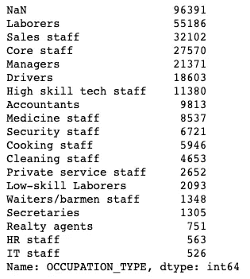

**(A.1)获取 _ 虚拟**

使用`pd.get_dummies(df['OCCPATION_TYPE'],dummy_na=True)`创建虚拟变量。然后，我将虚拟变量追加回数据中。结果变成:

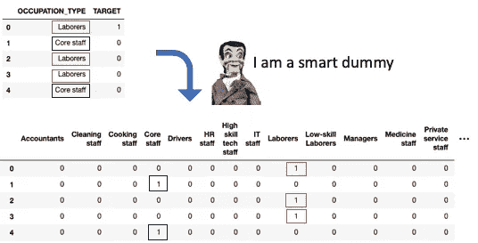

**给你的提示:**

*   删除一个级别以避免回归中的多重共线性:请注意，我删除了虚拟的“劳动者”。我为什么放弃它？如果您正在运行回归模型，则需要删除与其他变量显示多重共线性的变量。但是，如果您正在运行任何基于树的算法，则不需要删除该变量。你可以在我的文章“避免这些致命的建模错误，这些错误可能会让你失去职业生涯”中找到更多的解释。
*   选择可信计数的级别作为基础级别:为什么我删除了“劳动者”而没有删除其他类别？原因是*的可信度*。在回归中，分类变量的删除值成为其他值将引用的基础级别。如果下降值的计数太少，就不好作为其他级别参考的基准级别。例如，假设你有一个变量“state”，按字母顺序排列的第一个状态是只有三个观测值的“AK”。R 等很多语言都是以首字母级别作为参考级别，所以“AK”就成了参考级别。但是，它在您当前的数据集中只有三个观测值！如果重复相同的数据绘制过程，可能会少于三次观察。更好和更常见的做法是设置最频繁的级别或具有足够数量的观察值的级别。
*   不要忘记丢失的值:注意我使用了`dummy_na=True`。如果你不把 *NAs* 明确作为虚拟变量，你可能会忘记它，它将成为你回归的参考水平。如果 NAs 的数量碰巧很少，您将遇到如上所述的可信度问题。还可以看看我的帖子"[避免这些致命的建模错误，这些错误可能会让你失去职业生涯](/avoid-these-deadly-modeling-mistakes-that-may-cost-you-a-career-b9b686d89f2c)"如果一个连续变量有" NA "，" 0 "，"-99 "或"-999 "该怎么办"。

**(a . 2)OneHotEncoder of Category _ encoder**

我指定`handle_unknown='indicator'`来创建未知的类别“OCCUPATION_TYPE_nan ”,它是缺失值的类别。

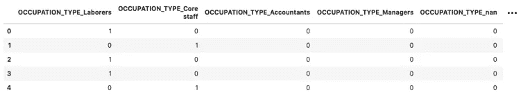

独热编码或哑编码的缺点是，如果一个分类变量有许多类别，它会创建一个非常大的稀疏矩阵。例如，如果您对美国的 41，700+邮政编码使用 one-hot 编码来转换变量“Zip_code ”,您将得到一个巨大的矩阵。你的模型会变得非常低效，容易过度拟合。我们有更好的方法吗？是的。我们来看看下面的技巧。

**(B)均值编码(或称目标编码)**

目标编码只是将每个类别替换为具有该类别的样本的平均目标值。下面的代码将一个类别的平均值分配给一个类别的观察值。

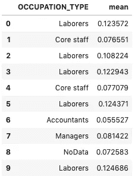

**给你的提示:**

*   目标编码可能会受到过度拟合的严重困扰，因为它使用了有关目标的信息，称为*目标泄漏。*
*   为了克服这个问题，您可以向新变量添加微小的随机值，以便不要过于精确地适应训练数据。你可能会问多小才算小？下面的代码生成从 0 到上限值的噪声，上限值是目标平均值的一部分(=0.3)(您可以将前十个记录与上面的记录进行比较)。这个分数`cntrl`控制随机值的大小。你如何确定这个分数？在建模过程中，您会尝试不同的值。您应该确定一个值，使您的测试数据达到最佳性能。
*   使用模型预测新记录时，不需要向新变量添加随机值。

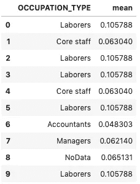

**(C)证据权重(WOE)编码**

证据权重(WOE)是在*信用风险建模*中广泛使用的技术，或称为*违约概率建模*(这种模型预测申请人偿还贷款的能力)。

这种转换的目标是获得与目标变量相关的分类类别之间的最大差异。它计算每个分类类别中响应者和非响应者的数量，然后为每个分类类别分配一个数值。在这种转换中，目标变量的信息已经被利用。当一个分类变量包含许多类别时，WOE 是一个不错的选择。WOE 变换可以扩展到连续因变量。由于其有价值的应用，我在(B.1)和(B.2)中描述了两个场景。

**(B.1)带有二进制目标变量的 WOE**

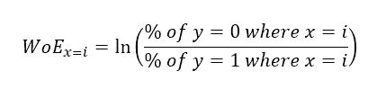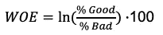

在违约概率模型中，目标值不是好就是坏(违约)。所以在这里，我只是采用流行的 WOE 公式，它仍然使用“好”或“坏”的术语，如下所示:

在 Kaggle 的这个数据集[家庭信用违约风险](https://www.kaggle.com/c/home-credit-default-risk/data)中，目标变量“target”有两个值:“1”表示客户无法偿还贷款(贷款违约，或不良贷款)，“0”表示客户可以偿还贷款(良好贷款)。

下面我写一个简短的 Python 函数来计算 WOE。首先，我创建了一个“NoData”类别，以确保缺失值被算作一个类别。对于每个类别，我计算记录总数和“好”记录的数量。然后，我得出“好”和“坏”记录的百分比。WOE 值是“好”和“坏”百分比之间的奇数比。

图(1)显示了变量“职业类型”的权重系数。请注意，它是按升序排列的。

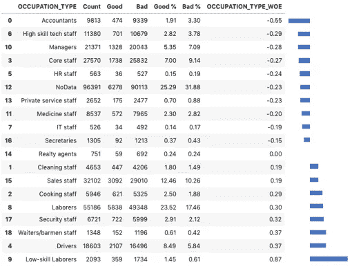

Figure (1)

我将每个类别的 WOE 值追加回原始数据。前十个记录打印在图(2)中。

因为 WOE 转换使用 X 和 Y，所以知道您仅使用训练数据来生成图(1)中的 WOE 表是很重要的。然后将该表追加到训练数据中。您还将把 WOE 表附加到测试数据中。

您也可以使用模块 category_encoders 的函数`WOEEncoder()`来计算 WOE。下面是如何执行 WOE 转换。您会发现无论使用 my 函数还是`WOEEncoder()`，图(2)中的 WOE 值都是相同的。

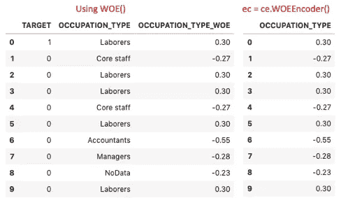

Figure (2)

如果目标是连续变量呢？你可以将预测因子分成 10 或 20 等份，然后计算相应的权重。

**给你的提示:**

*   特别适合逻辑回归:逻辑回归拟合预测因子的线性回归方程，预测 *logit 转换*二元 *Goods/Bads* 目标变量。Logit 转换就是概率的对数。因此，通过在逻辑回归中使用 WOE 转换的预测因子，预测因子被编码为相同的 WOE 等级，并且线性逻辑回归方程中的参数可以直接比较。
*   记住为缺失值创建“NoData”值
*   与目标的单调关系:在目标变量和 WOE 转换变量之间。关于具有单位相关性的响应的对数几率，WoE 变换是严格线性的。
*   没有必要限制或限制离群值:给定分类类别，离群值将落入分类类别。每个箱的 WOE 值是好的到坏的分布，对异常值的关注消失了。
*   您应该只使用您的训练数据来创建图(1)中的 WOE 值。您不应该为测试数据单独创建 WOE 值。

**(B.2)连续目标变量的故障树**

假设现在目标变量是数据中的总收入，我们想在“职业 _ 类型”上回归总收入。因为目标变量是连续的，我们将把 WOE 公式修改为:

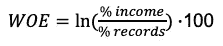

我们的连续目标 WOE Python 函数变成:

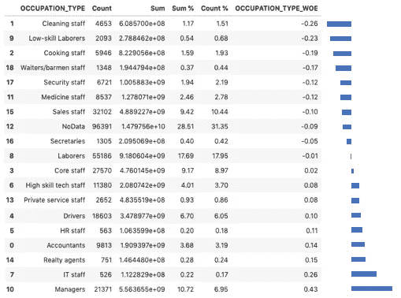

Figure (3)

图(3)显示了连续变量的 WOE。当我将 WOE 值追加回原始数据时，前五条记录具有以下值:

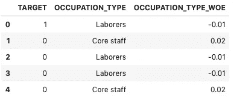

**(D)留一(LOO)编码**

不要混淆留一法(LOO)编码和留一法交叉验证(LOOCV)。LOOCV 是一种模型验证技术，用于评估您的机器学习模型将如何推广到独立的数据集。

正如(C)中所讨论的，目标泄漏——使用关于目标的信息，会导致严重的过拟合问题。泄漏是如何发生的？这是因为目标与数据中的预测值在同一行。当您导出平均值或其他统计数据时，该行被包括在内，目标值被泄露。为了克服这样的挑战，留一编码产生相同分类级别的所有行的目标平均值，不包括行本身。它将行本身的目标值排除在外—因此得名*留一(Leave-One-Out)*。这避免了直接的目标泄漏。

我将首先使用 category_encoders 中的 leave-one-out 函数向您展示这有多容易。然后我写下我的函数，向你展示它是如何产生的。

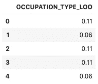

Figure (4)

下面的“我的函数”首先按类别获取计数和总和统计信息，然后将统计信息追加到数据中。现在关键的步骤是第 12 行，它减去该行本身的目标值以获得平均值。

Figure (5)

图(5)中的留一分数与图(4)中的分数相同。

**(E)序数编码**

序号编码使用附加信息将类别变量转换为数值。教育水平就是一个很好的例子，如图 6 所示。它可以用一个标签(EDU_1)来编码，也可以用完成这个级别的年数来编码。[类别编码器模块](https://contrib.scikit-learn.org/categorical-encoding/ordinal.html)使您能够做到这一点。

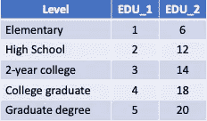

Figure (6)

**给你的提示:**

*   数字差异很重要。所以你需要考虑数字是否有意义，你的解读是否一致。

**(F)哈希编码**

如果使用一键编码来转换高基数分类变量(比如邮政编码)，最终将得到一个巨大的稀疏矩阵。稀疏矩阵效率极低，并且会导致模型不稳定。哈希编码可能是更好的解决方案。散列编码在 Kaggle 竞赛的讨论中变得流行起来。它类似于一键编码，但是投影到的维数要少得多。哈希编码使用哈希函数将 *N* 级转换为 *M ≤ N* 列。

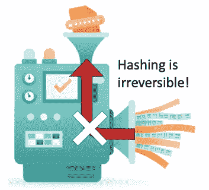

它是如何工作的？让我用图(H)来告诉你细节。首先，通过 MD5 散列函数将每个分类值转换成十六进制值。MD5 算法是一种广泛使用的哈希函数。你可以用这个 [MD5 哈希生成器](https://passwordsgenerator.net/md5-hash-generator/)来玩。第二，十六进制值被转换成十进制值，你可以通过这个[十六进制到十进制转换器](https://www.rapidtables.com/convert/number/hex-to-decimal.html)来模拟。然后十进制值除以列长度(下面的代码示例使用 4)得到余数。你可以用这个[长除法计算器](https://www.calculatorsoup.com/calculators/math/longdivisiondecimals.php)得到余数。最后，余数指示打开或关闭哪一列(1 或 0)。请注意，您无法通过反向查找来确定输入是什么。所以哈希不是*可逆的*。

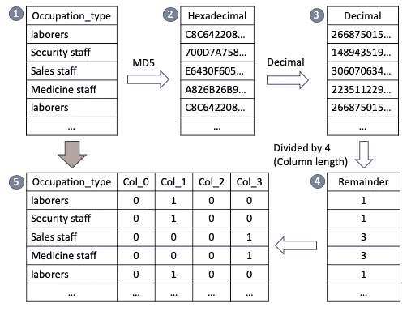

Figure (7): Hashing Encoding Process

模块 category_encoders 可以很容易地完成散列编码。下面显示了代码。我设置了`n_components=4`,所以结果有四列。默认值为 n_components=8。如果您将 n_components 设置为与级别数相同，哈希编码将成为一次性编码。

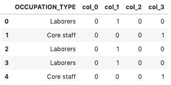

分配给每列的分类级别是什么？我对每一列执行 value_counts()操作，并在下面显示结果。Col_0 只有一个值“NoData”，Col_1 有七个级别，依此类推。这种编码逻辑由图(7)中的过程决定。这个编码过程将一些层次折叠成相同的结果，称为*碰撞*。尽管丢失了一些信息，但有趣的是，除非有大量重叠，否则冲突不会显著影响性能。

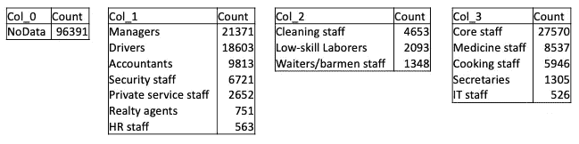

**给你的提示:**

*   哈希编码的缺点是缺乏良好的业务解释。为什么“经理”、“司机”、“人事”都去同一个组？
*   这个过程可能很耗时。
*   如果您想要一个更易解释的结果，您可以手动分组分类级别。

其他一些编码技术，如 CatBoost 编码、多项式编码、求和编码或 James-Stein 编码，在此不做介绍。是因为以上的技巧对于我的大部分专业工作来说已经足够了，或者说未覆盖的技巧是技巧的一些变种。鼓励读者查看[类别编码器](https://pypi.org/project/category-encoders/)以获取更多参考信息。

 [## 通过我的推荐链接加入 Medium-Chris Kuo/data man 博士

### 阅读 Chris Kuo/data man 博士的每一个故事。你的会员费直接支持郭怡广/戴塔曼博士和其他…

dataman-ai.medium.com](https://dataman-ai.medium.com/membership)