# 数据可视化冒险

> 原文：<https://towardsdatascience.com/a-data-visualization-adventure-55876196f7f8?source=collection_archive---------11----------------------->

从原始数据到数据第一名

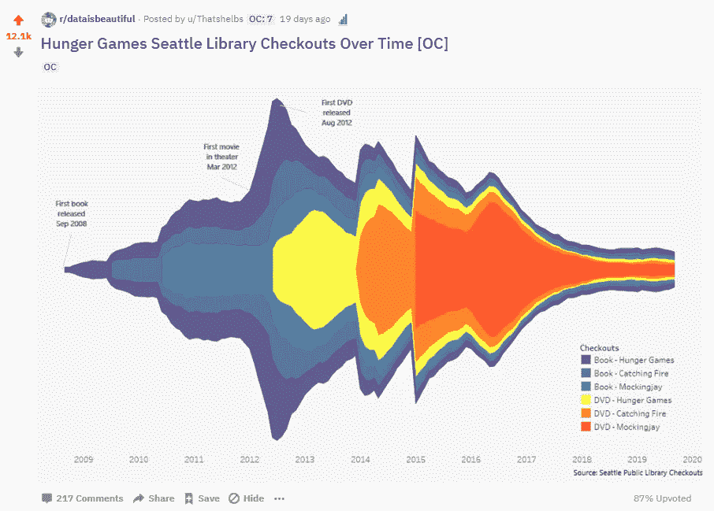

> *数据可视化是艺术还是科学？条形图和折线图的清晰度是否总是胜过不寻常和/或美丽的数据？*

这些是数据 viz 社区中一些两极分化的问题。你们中的一些人大声尖叫“科学！清晰！”而另一些人会快乐地死在艺术山上。

data viz 社区中的这一裂痕使得数据可视化同时受到喜爱和厌恶成为可能。例如，[我的饥饿游戏图片](https://www.reddit.com/r/dataisbeautiful/comments/d7zzg7/hunger_games_seattle_library_checkouts_over_time/)获得了 87%的高票，获得了一个令人敬畏的原创内容奖，同时在评论区被烤得很糟糕。谢谢 Reddit。

这种爱恨交织的情况很常见。第二个例子，在[的一篇博客文章](https://www.perceptualedge.com/blog/?p=1829)中，布莱恩·皮尔斯反驳了比尔·盖茨为《连线》杂志选择的一个形象化的观点。在这篇文章中，他解释了为什么清晰更有优势。

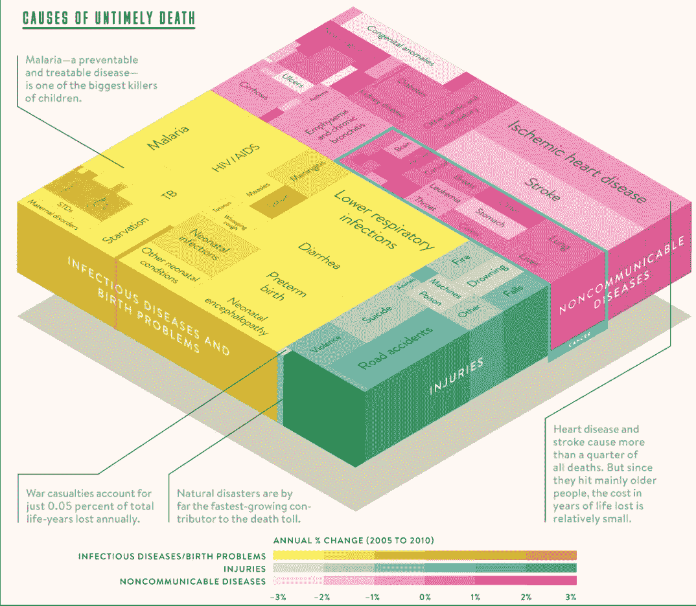

Bill Gates Choice

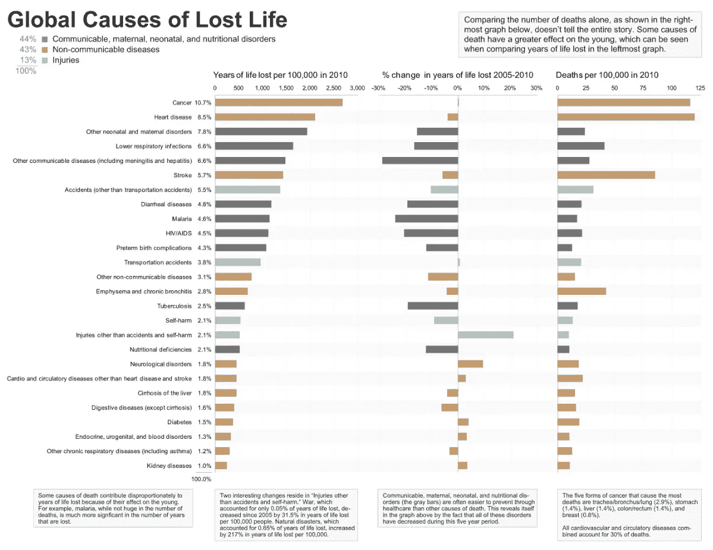

Bryan Pierce’s Remix

谁在这里？我们应该专注于简单明了——还是应该专注于复杂美观？

在分享我的数据可视化项目时，这是一个我不断回到的问题。

除了详述这一困境，我还将介绍其他项目亮点，例如:

*   数据集的起源和饥饿游戏可视化思想
*   我如何使用 Python 将一个 25GB 的文件转换成 Tableau 可以使用的文件
*   我的数据可视化流程
*   在 Reddit 上被烤的娱乐价值
*   整合反馈以获得最终版本

**第一部分:我如何想出数据和饥饿游戏可视化的想法**

这一切都始于一个学校项目。这个项目的目标是讲述一个可视化的故事。我们可以选择任何我们想要的数据集。

我在 Tableau 上有着丰富的工作经验，我可以说我已经融入了这个社区。至少足够了解[#改头换面星期一](https://twitter.com/search?q=%23MakeoverMonday&src=typeahead_click)。对于一年中的所有 52 周，Eva Murray 或 Andy Kriebel 都会发布一组数据，并对其进行改造。你能猜出他们在哪天分享它吗？

这对于有抱负的数据科学家和想从事数据工作的人来说是非常好的。这对于那些想快速找到学校项目数据集的懒人来说也很棒。

就在本周，他们从西雅图公共图书馆开源数据库中分析了詹姆斯·帕特森的结账记录。因为这个文件有 3400 多万行，重 25 千兆字节#改头换面星期一先把范围缩小到只有一个作者。这样，公众可以很容易地使用它。

我认为这将是一个有趣的数据集，因为它可以追溯到 2005 年，包含书籍和 DVD 的借阅。

下一步是找出我想问数据什么问题。我的第一个想法是看看《哈利·波特》,看看图书借阅、电影上映日期和 DVD 借阅之间的关系。

然而，第一本书是在 1997 年出版的，所以我无法了解全貌。我最终转向了其他流行的书籍电影系列。

也许是暮光之城！？！？我很难拒绝。我最终选择了饥饿游戏。

**第二部分:我如何使用 Python 从一个 25GB 的文件获取 Tableau 可以使用的内容**

现在，我的文档中有一个 25，417，394 KB (~25 GB)的文件。尝试将它原样插入 Tableau 可能不是一个好主意。

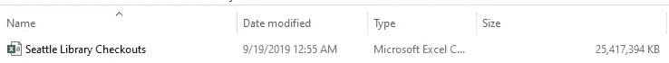

我喜欢 Python。为 Tableau 准备数据只需几个步骤。

*   应用一些逻辑将行标记为饥饿游戏
*   想办法一次只读入一小块数据——文件太大了，会很快锁住你的电脑
*   只保留与饥饿游戏系列有关的结帐

**之前的数据:**

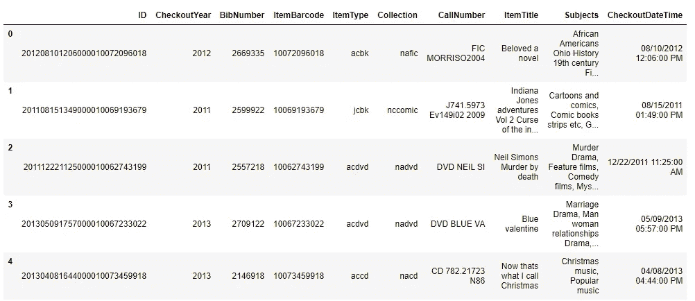

Now that’s what I call Christmas and Indiana Jones in just a 5 row sample

**处理数据的代码:**

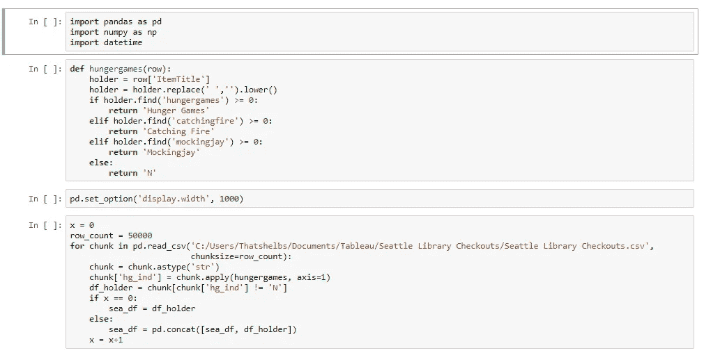

The last cell is where the magic happens — just processing 50,000 rows at a time

**数据后:**

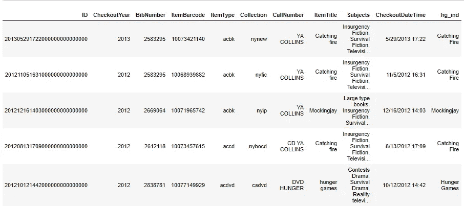

Catching Fire CD?!?! Hmmm…

新文件只有 17，000 KB (.017 GB)。好多了。

**第三部分:我的数据可视化流程**

*在数据科学中，没有比数据可供分析更好的时刻了。*

这个话题我觉得没有争论。尽管数据工程同样重要，也是需要推动的第一张多米诺骨牌——但只有怪人喜欢数据准备。

我们对数据可能告诉我们的东西有自己的想法。这是一个激动人心的时刻，我们将发现我们是对还是错。

我的假设正确吗？我的预测器能预测目标变量吗？我的想法有价值吗？或者所有这些努力都是浪费时间？

现在数据准备已经结束，我们将很快能够回答我们的任何问题。

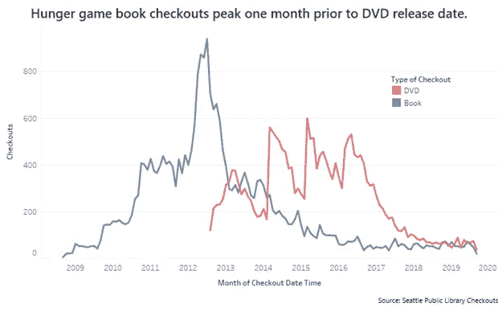

Iteration 1 (made with Tableau)

我做的第一个图表是折线图。这张图表的好处是你可以清楚地看到每月有多少退房。

图书借阅量在第一张 DVD 发行前达到顶峰，但之后图书借阅量就再也没有上升过。

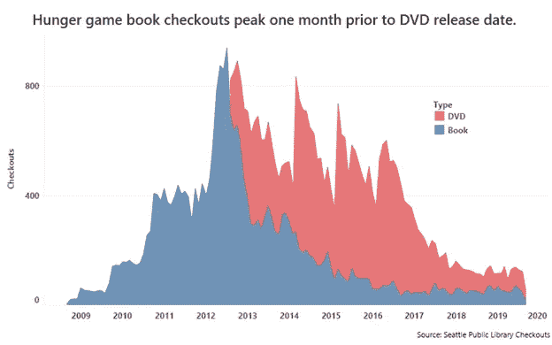

Iteration 2 (made with Tableau)

因为我最感兴趣的是将饥饿游戏的结帐总数可视化，所以我切换到了显示 DVD +图书结帐的面积图。

我也开始关注格式化，清除图表垃圾，减少墨迹。例如，不需要年轴标签，因为它已经很清楚了，我们有一个仅基于年值的时间序列线图。

我认为一个重要的考虑因素可能是电影在影院上映的时间。

如果这个项目是一个商业设置，其中决策和清晰度是最重要的。我可能会就此打住。

然而，我知道我想发布到 DataIsBeautiful。所以我需要继续努力，让一些东西看起来更有趣。

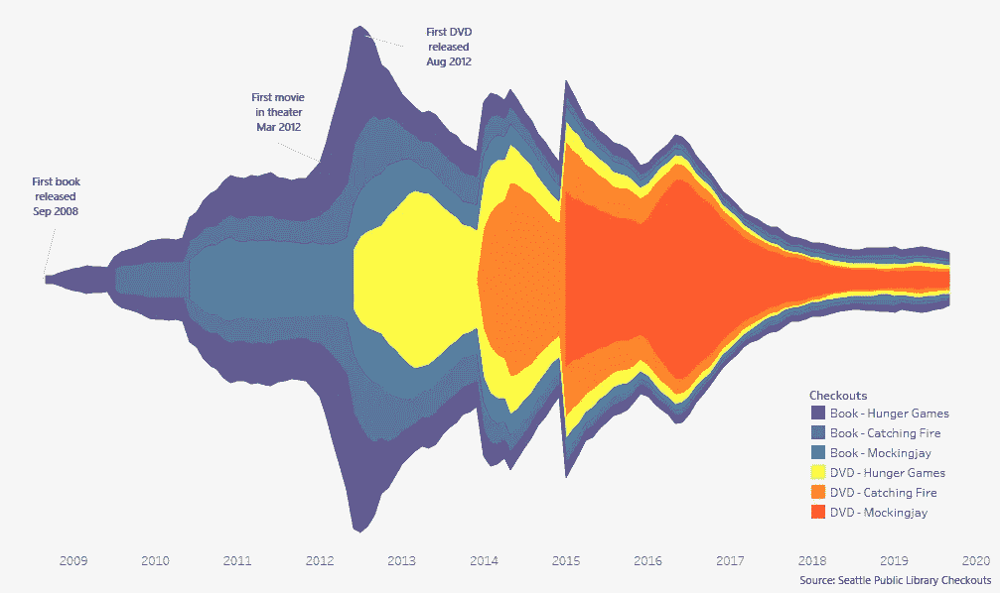

[Iteration 3 (made with Tableau)](https://www.reddit.com/r/dataisbeautiful/comments/d7zzg7/hunger_games_seattle_library_checkouts_over_time/)

所以最后，我们在这里…从清晰走向美丽。我们为什么要这么做？**因为我们的目标和目标受众。**

人们想看新的、有趣的、令人兴奋的东西。所以我用了面积图的表亲，水流图。

在将我的 viz 发布到 DataIsBeautiful 之前，我知道我会因为违反了至少两个数据可视化最佳实践而受到一些负面评论。以下是我做的一些淘气的事情和我的理由:

1.  没有 Y 轴

我希望用户更多地关注书籍和 DVD 之间的相对关系，而不是原始的结帐数量。

2.这个图的镜像本质是多余的，你只需要上半部分就可以了

这是真的，它违背了爱德华·塔夫特的数据可视化原则，只有墨水可以增加更多的洞察力(数据与墨水的比率)。然而，人们也发现，人们喜欢对称的东西。在这种情况下，我觉得对称可以使数据更令人难忘。

**第四部分:Reddit 上被烤的娱乐价值**

建立一个所有人都珍惜的数据可视化并不容易。人们对颜色选择等基本事物有不同的偏好。我很确定不可能让每个人都开心。

想要证据吗？发布一个 viz 到 DataIsBeautiful，拿些爆米花，看混乱展开。读了一些评论后，我甚至很难记起这是 87%的高票。

**烧烤**

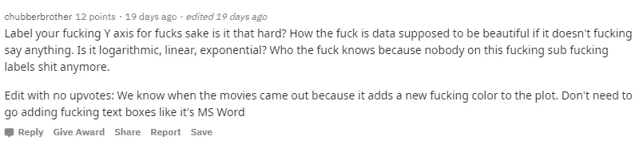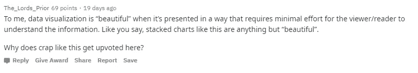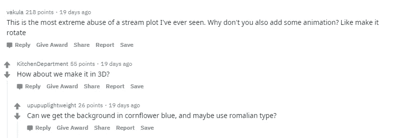

**乐观的**

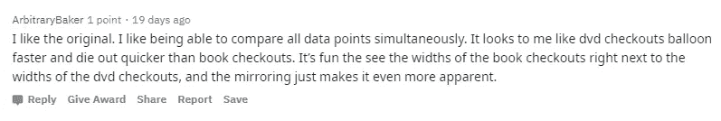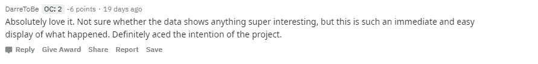

**邱**

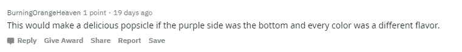

**第五部分:整合反馈以获得最终版本**

发布到 Reddit 不仅仅是娱乐。有些人会给你一些有用的建议，甚至重新编辑你的帖子。我的帖子被重新混合，我添加了他们的贡献来制作我的最终版本:

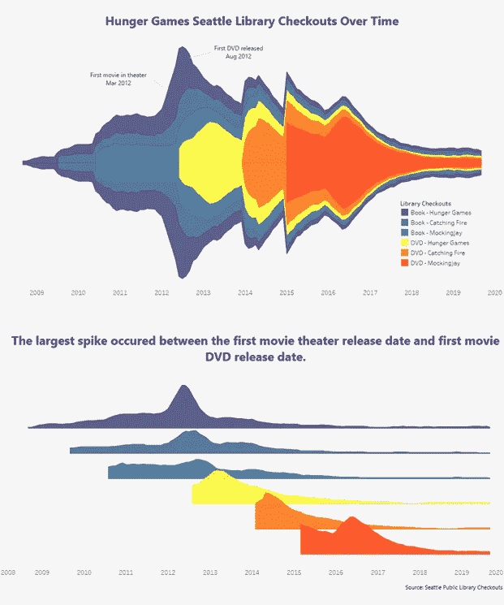

[Iteration 4 (made with Tableau)](https://public.tableau.com/profile/shelby.temple#!/vizhome/HungerGamesCheckouts/HungerGames3)

最后一个假设可能是，在期待第一部电影时，图书借阅量激增。在连续上映的电影中，没有类似的图书高峰。也许是因为任何一个因为电影而倾向于阅读书籍的人已经这样做了。

此外，你会注意到，学舌鸟 DVD 奇怪地有两个尖峰。它作为两个不同的部分在不同的日期发布。

**最终想法:**

你不可能造出对每个人都漂亮的东西。颜色选择有最佳实践。然而，即使这些也不能让你达到 100%的快乐率。87%的竖起大拇指可能就相当不错了。

你不可能做出每个人都清楚的东西。然而，你的目标应该是让尽可能多的人理解你的观点。

我本可以更好地最大化清晰度。然而，如果我没有做出这些选择，我的帖子还会被投票排在第一吗？

**在我看来，数据可视化更接近艺术。**科学大多是由它建立的规则来定义的。数据可视化由不太可靠的最佳实践指导。科学不在乎你的感受和反应。而数据可视化完全是为了迎合其受众。

**有时候，清晰更重要。**想象一家医院使用数据可视化来做出关键决策。这与试图制作一个有趣的数据并发布到 Reddit 上是完全不同的目标。

数据可视化可以从测试和学习中受益。获得反馈是非常宝贵的。更好的办法是运行一个随机的 A 组和 B 组，你可以让每个组接触不同的版本，只改变一件事。如果目标是决策，看看他们会做出什么决定。如果目标是吸引人们，问他们更喜欢哪一个。

**圣杯是清晰而美丽的。**这两件事不一定要互斥。虽然要做到这两点并不容易。当时间有限时，关注你的目标和目标受众。