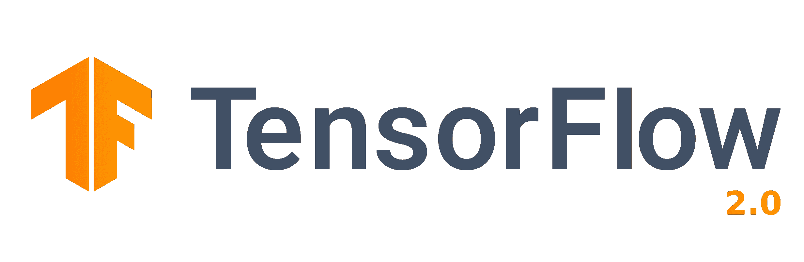
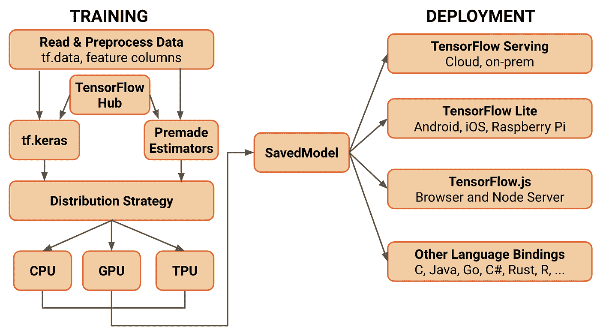

# 班加罗尔 Tensorflow 路演的一天

> 原文：<https://towardsdatascience.com/a-day-at-tensorflow-roadshow-bangalore-8e2f96dea661?source=collection_archive---------34----------------------->

## 活动期间共享的所有信息的摘要。

我有幸参加了谷歌在班加罗尔举办的 Tensorflow 路演，直接看到了 Tensorflow 2.0 的所有最新进展，并与社区中一些最酷的人建立了联系。去年我没有得到确认，但我很高兴这次我有机会目睹这一事件，我决定分享事件过程中发生的所有事情。

总共有 16 场会谈，我想简单介绍一下所有的信息

Source :- [https://hackernoon.com/everything-you-need-to-know-about-tensorflow-2-0-b0856960c074](https://hackernoon.com/everything-you-need-to-know-about-tensorflow-2-0-b0856960c074)

# 主题演讲:ML 的今天和明天

简要概述了哪些发展使深度学习得以快速发展

1.  与以前相比，现在可以获得更多的培训数据。开放数据集，如谷歌的 **OpenImages** 数据集，包含大约**900 万张**图片
2.  计算能力呈指数增长。单个 **TPU** 可以提供 **45 万亿次浮点运算**的计算能力，并且可以堆叠其中的 64 个达到高达 **100 万亿次浮点运算**
3.  深度学习领域的大量**研究**导致了与 7 年前相比，今天可以实现的许多改进。例如 **RNN** 必须按顺序训练，这导致训练花费了大量时间。随着 **transformer** 架构的出现，我们现在可以并行训练，并且能够获得更好的结果，更好地利用计算资源，花费更少的时间。类似地，如果你看到 NLP 部分，随着 BERT 及其变体架构、XLNET 和 T21 等的出现，在过去的 1-2 年里已经有了巨大的进步。

展示了 Tensorflow 在现实世界中的几个**应用**

1.  **峰会**拥有 27000 GPU 的世界上最快的超级计算机使用 Tensorflow 进行极端天气预测
2.  总部位于智利的初创公司 **Notco** 使用 Tensorflow 和深度学习来寻找使食物成为人类所需的所有东西，并试图使用健康的物品提供相同的体验。
3.  印度主要的初创公司都在使用 Tensorflow。 **Sharechat** 利用深度学习发现用户偏好。 **Dunzo** 利用深度学习来估算需求。 **Nobroker** 利用深度学习来理解所有的房子数据。
4.  **IITD** 的学生开发了一款安卓应用程序，利用照片来判断**的空气质量**。他们使用了 **Tensorflow Lite** ，这样所有的计算都在设备上进行，不需要服务器，这样即使没有互联网连接，应用程序也能工作。

# TensorFlow 2.0 更新

1.  Keras api :-通过将 Keras 直接集成到 tensorflow 中，该 api 变得更加简单。
2.  **会话死亡** :- Tensorflow 2.0 带来了急切执行，因此不再有会话。现在不需要运行会话来检查张量内部的值，直接打印张量就可以给出它的值
3.  **Python 代码到 tensorflow graph** :-现在任何用 Python 写的代码都可以通过使用 tf.function decorator 转换成 tensorflow graph。将代码转换为图形的用途是现在可以利用硬件，如 GPU
4.  **访问低级操作** :-低级操作仍然可以使用 tf.raw_ops 进行访问
5.  **移除 tf.contrib** :- tf.contrib 现已移除，少量导入代码移至核心 api
6.  **分配策略** :-提供了许多在 GPU 之间分配工作负载的选项
7.  **Tensorboard 升级** :- Tensorboard 现在支持 colab 和剖析神经网络性能
8.  **向后兼容** :-使用 tf.compat 仍然支持 tensor flow 1 . x。TF _ upgrade _ v2 脚本可用于将代码从 1.0 升级到 2.0
9.  **数据集和教程** :-增加了许多新的数据集和教程
10.  **单一模型序列化** :-单一存储模型可以部署在多个平台上

Source :- [https://medium.com/tensorflow/whats-coming-in-tensorflow-2-0-d3663832e9b8](https://medium.com/tensorflow/whats-coming-in-tensorflow-2-0-d3663832e9b8)

# TF 文本

支持 tensorflow 内置的预处理和标记化

支持**不规则张量**，因为文本的张量大小不需要恒定

讨论了不同类型的记号赋予器，如空白记号赋予器、unicode 记号赋予器和单词块记号赋予器

内置了对词汇的支持，但支持所有语言是一项艰巨的任务。词块词汇生成用于减少词汇

# TF Lite

TF Lite 用于在移动设备和嵌入式设备上部署设备模型。由于延迟、网络连接和隐私原因，设备上的人工智能非常重要。

TF Lite 可以在 Android、IOS、树莓、微控制器等平台上运行。

Source :- [https://ai.googleblog.com/2017/10/portrait-mode-on-pixel-2-and-pixel-2-xl.html](https://ai.googleblog.com/2017/10/portrait-mode-on-pixel-2-and-pixel-2-xl.html)

谷歌的人像模式使用设备上的人工智能

边缘设备上的模型性能可以通过以下三种方法来提高

1.  **量化** :-将 32 位缩减为 8 位。许多硬件加速器，如 GPU，在 uint8 上表现更好
2.  **修剪**:通过移除神经网络中未使用的连接/权重
3.  **硬件加速器** :-现在在 GPU、Edge TPU、DSP 等加速器的支持下，CPU 可以获得更好的性能

在 TF 2.0 中**委托**用于移动需要使用加速器(如 GPU)加速的任务。

Tensorflow Select 作为桥梁支持 Tensorflow Lite 中不受支持的操作，尽管未经优化。TF Lite 允许开发人员通过删除不必要的操作来减少二进制文件的大小。

除了手机，代码还可以在其他嵌入式设备上运行，如 Raspberry、微控制器等。不需要任何改变。

**未来工作** :-

1.  改进转换器，使代码在边缘设备上工作
2.  更好的错误处理诊断
3.  控制流支持
4.  稳定运行时绑定
5.  前后处理支持库
6.  微控制器将增加更多运算。改进的转换和测试工具。支持 Arduino

 [## TensorFlow Lite

### 在移动和物联网设备上部署机器学习模型 TensorFlow Lite 是一个开源的深度学习框架，适用于…

www.tensorflow.org](https://www.tensorflow.org/lite) 

# TF 分销战略

只需几行代码，轻松简单地支持在 GPU 上分配训练负载。支持以下策略

1.  **MirroredStrategy** :-通过在每个 GPU 中镜像相同的过程，支持在多个 GPU 上进行训练
2.  **MultiWorkerMirroredStrategy**:-适用于跨机器培训。类似于镜像策略，将工作负载分布到每台机器和每台机器中的每个 GPU
3.  **参数服务器策略** :-支持参数服务器
4.  **t 策略** :-与上述策略类似，但用于 TPU 而非 GPU

tf.data input pipeline 可与任何分发策略无缝协作

 [## 使用 TensorFlow | TensorFlow Core 进行分布式训练

### tf.distribute.Strategy 是一个 TensorFlow API，用于在多个 GPU、多台机器或 TPU 之间分发训练…

www.tensorflow.org](https://www.tensorflow.org/guide/distributed_training) 

# 张量流 Javascript

Tensorflow Javascript 可以在浏览器或 Node.js 中运行

TF JS 支持运行现有模型的推理，重新训练现有模型或从头开始用 Javascript 编写模型

不需要安装任何东西，TFJS 默认运行。所有数据都保存在客户端，因此具有隐私保护性。

没有服务器端调用，一切都在浏览器上运行。使用 WEBGL 获得计算所需的所有数学运算，而不是从头开始。

代码可以在笔记本电脑、手机以及 Javascript 运行的任何地方运行

TFJS 用 Node.js 运行，python 中用 Tensorflow 训练的模型可以直接用在 Javascript 中。

用于数据处理的 TFJS api 现已推出。

现在增加了反应原生支持。

# 参与 Tensorflow

要想参与 Tensorflow，探索 ML 学院活动正在印度各地举行。有兴趣的同学可以志愿。

Tensorflow 用户组出现在班加罗尔和其他地方，供感兴趣的人使用。

也可以加入 Tensorflow 的任何特殊兴趣小组。

可以对 Tensorflow RFC 的建议或问题进行评论

# 模型优化和量化

模型优化可以在两天内完成，先训练后优化或者边训练边优化。

Source :- [https://medium.com/tensorflow/tensorflow-model-optimization-toolkit-post-training-integer-quantization-b4964a1ea9ba](https://medium.com/tensorflow/tensorflow-model-optimization-toolkit-post-training-integer-quantization-b4964a1ea9ba)

**量化** :-精度从 float32 降低到 float16。它提高了性能，减小了模型大小，但却是一种有损变换。

**后期训练量化** :-训练并保存模型，使用 TF Lite 转换器转换。可以在转换过程中指定优化选项。但是有更多的损失，因为优化是在训练之后进行的

可以使用混合优化仅量化权重，或者可以通过发送代表性数据集来执行权重+激活的完整整数量化。

**量化感知训练** :-在训练期间应用优化，使得网络感知到优化的发生，因此与上面相比可以执行得更好。在这种情况下，优化应用于正向训练，就像它在推理过程中是如何完成的一样。由于现在网络正被训练在它将在推理中看到的那种权重上，它可以更好地优化以在约束内实现好的结果。

更多细节在下面的链接

 [## 张量流模型优化

### TensorFlow 模型优化工具包是一套工具，用于优化 ML 模型的部署和执行…

www.tensorflow.org](https://www.tensorflow.org/model_optimization) 

# 张量流扩展

Tensorflow Extended(TFX)帮助您建立完整的端到端机器学习管道。TFX 与元数据存储集成。这有助于跟踪多个实验，比较结果和模型性能等。

支持使用 Tensorflow 数据可视化(TFDV)进行数据可视化

支持预处理，如使用张量流变换进行标记化

Tensorflow 服务于版本控制并支持多种模型。

提供了一个管道示例，演示如何处理芝加哥 Cab 数据集。

 [## TFX 开发者教程| TensorFlow

### 本教程旨在介绍 TensorFlow Extended (TFX)并帮助您学习创建自己的机器学习…

www.tensorflow.org](https://www.tensorflow.org/tfx/tutorials/tfx/airflow_workshop) 

# Tensorflow 的 Swift

与 python 相比，Swift 的优势在于它速度快，并且它可以直接与 C 和 Python 进行互操作。跨平台，易学易用，开源。支持差分编程。

显示 swift 的演示和 colab 代码。fast.ai 针对 Swift 深度学习的新课程发布。

 [## fast.ai 拥抱 Swift 进行深度学习

### 杰里米的笔记:如果你想加入旧金山大学的下一个深度学习课程，讨论…

www.fast.ai](https://www.fast.ai/2019/03/06/fastai-swift/) 

# 结论:-

总的来说，这是令人兴奋和增长见识的一天。我可以学到很多我以前没有听说过的东西，并了解所有最新的发展。我期待着未来会发生什么。