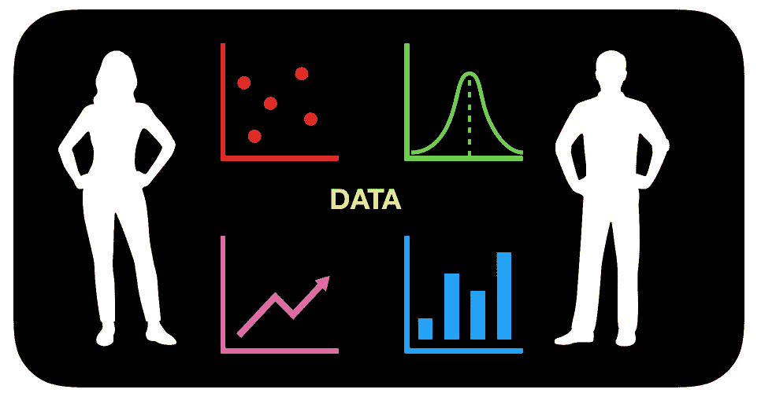
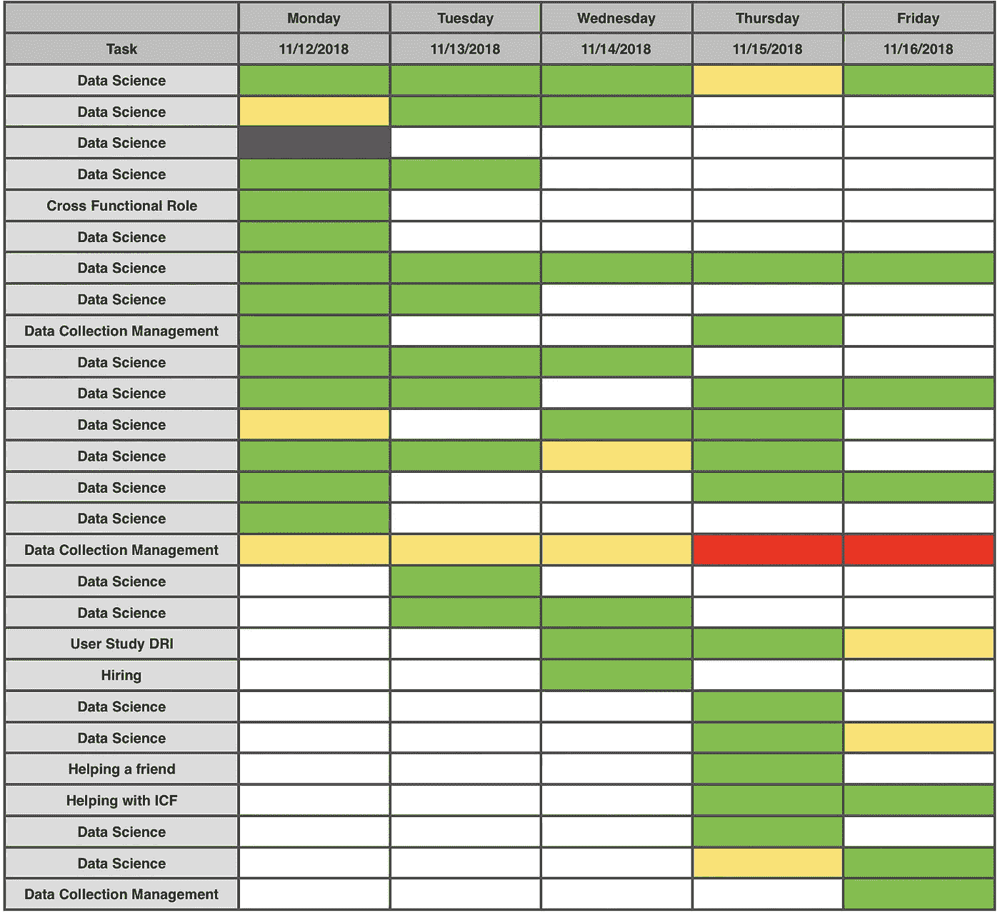
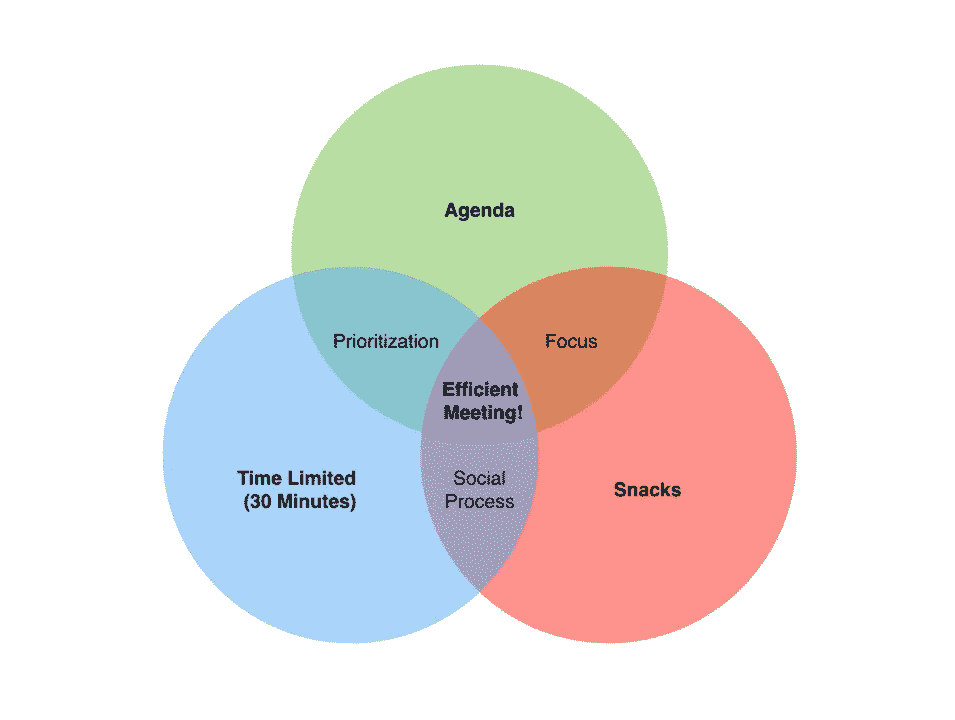
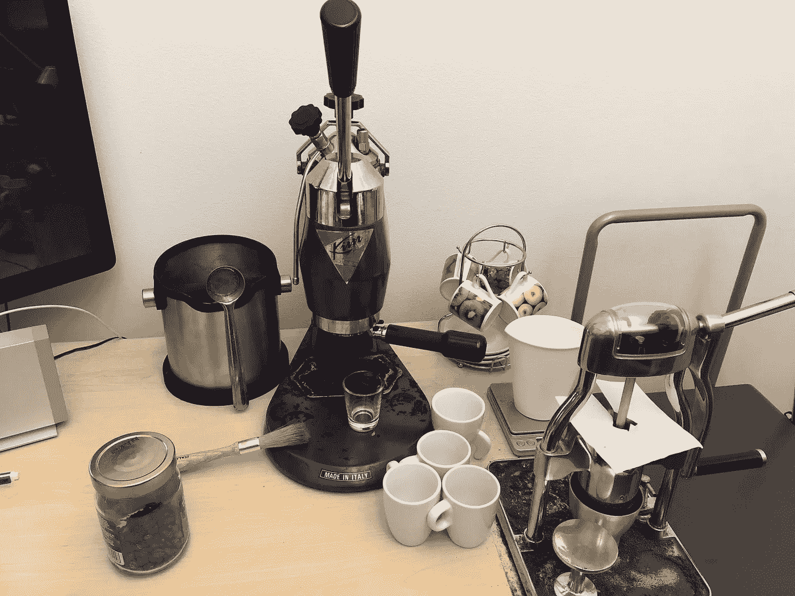

# 数据科学家的一天

> 原文：<https://towardsdatascience.com/a-day-in-the-life-of-a-data-scientist-eb63cdd71edb?source=collection_archive---------15----------------------->

有些人可能想知道，数据科学家的一天是怎样的？这是我作为数据科学家的一天。我还应该说明，我的部分职责与管理相关，因此这些职责占用了我实际从事数据科学的时间，但数据科学部分仍然是我最喜欢的部分。

# 启动

我到办公室后做的第一件事就是喝杯咖啡。这并不意味着有一个社交活动，而是在我的咖啡机预热的时候有片刻的停顿，然后我计划我要做什么。我有一个任务和后续步骤的列表，按天排序，按优先级排序。这让我不会偶然忘记。有时候事情做不完，有时候，我不得不决定无限期地搁置一项任务，这样我就能保持专注。上周显示的是模糊的任务，但是任务的数量是真实的。

然后，我开始工作。这听起来很简单，但是我的思路可以一上午都是散乱的。我并不总是从最重要的事情开始，但是我会从一些事情开始着手。有时候是读一些新闻文章或者开始一个兼职项目。这有助于我集中注意力，进入状态。

# 开销

我的一天通常被人们的来访打断。这些都是很好的干扰，因为牢固的关系会在关键时刻带来高效的团队合作。我把它们视为对未来的投资。

> 我不会一心多用；我能有效地进行单个任务和上下文切换。

然后就是开会。我不惜一切代价避免开会。我更喜欢半小时的会议，议程紧凑，只邀请需要的人。会议是我效率最低的时间，因为即使我试图在会上工作，我的注意力也会分散。当我专注于一项任务时，我工作得更好。我不擅长多任务处理，但我知道如何有效地切换任务。

单一任务专注并不是一件坏事。每个人都喜欢多任务处理的想法，但是说实话，我们一次只能做一件事。一心多用就是一边拍脑袋一边揉肚子。任务切换正在改变我正在做的单个任务，有时非常迅速。

# 最后是数据！

我必须管理我的数据来自哪里，所以通常是从上一个任务的下一步开始的。在我的例子中，数据必须被安排收集，发送到数据库，然后通过我们的管道进行处理。最快两天就能搞定。对我来说，没有太多的工作，但这是一个团队的努力。

> *数据科学是一项团队工作。*

最后，我得到了数据，并为重复的任务编写了脚本，例如本地提取数据、准备数据以及生成所需的图形和表格。结果是，我实际上花了大约 10 分钟来查看数据并确定下一步措施。

最近，我的许多数据都围绕着深度网络学习，并试图通过系统的试错来理解它们是如何工作的。不过，通常我会花几周，有时几个月的时间来获取足够的数据，以了解某个功能或问题，而我花在查看数据上的时间实在是太少了。我认为关键不仅仅是准备，而是训练，这样我只需要很短的时间来理解数据。

对于长期数据任务，我会查看数据。我研究数据。我制作了不同的有趣的图表，看看我是否能够将数据形象化，以便对正在发生的事情有一个清晰的理解。这些任务通常是更长的，有时几分钟，有时几天，有时几周。

# 休息

我工作日的一个重要组成部分是从工作中休息一下。我想理清思路，这样我就能以不同的方式思考，或者获得新的视角。这给了我在旧数据中发现错误或提出新问题的最佳机会。我的休息时间通常是喝咖啡的休息时间，我经常和我的工作朋友或陌生人一起喝咖啡，因为我在工作中投资网络。

淋浴是我想出最多点子的地方。当你洗澡的时候，除了洗和思考，你不会做太多别的事情。我已经想出了新的想法，在精神上遍历代码以找到 bug，并以一般的方式清理了我的头脑。

# 深夜

因为我的工作很有弹性，而且从研究生院开始就是如此，所以我倾向于白天少工作几个小时，晚上再补上。作为一名经理，我晚上更多的工作是回复电子邮件，但通常情况下，一周有几次，我发现自己在深夜当家里的每个人都睡着了的时候处理一些数据。我发现有一次或几次两个小时没有被任何人或任何电子邮件打扰，我已经能够赶上(或者甚至提前)我想去的地方。

第二天的前一天晚上也是我回顾我的任务清单的时候，这样我就可以寻找我错过的事情，应该优先处理的事情，以及我本周不会去做的事情。然后到了早上，我就准备跑步了。

如果你愿意，可以在 Twitter 和 YouTube 上关注我，我会在那里发布不同机器上的浓缩咖啡视频和浓缩咖啡相关的东西。你也可以在 [LinkedIn](https://www.linkedin.com/in/robert-mckeon-aloe-01581595) 上找到我。

**我的进一步阅读:**

[咖啡数据表](/coffee-data-sheet-d95fd241e7f6)

[断续浓缩咖啡:提升浓缩咖啡](/overthinking-life/staccato-espresso-leveling-up-espresso-70b68144f94)

[30 多岁开始学开车](/overthinking-life/learning-how-to-drive-in-my-30s-ce6de2547c72)

[不训练如何跑马拉松](/overthinking-life/how-to-run-a-marathon-without-training-2a2e5b37af6c)

[管理敌对的经理](/overthinking-life/managing-a-hostile-manager-9d80b9da65dd)

[乐高:毁灭的故事](/@rmckeon/legos-stories-of-destruction-64e8416ac06)

[崩溃！石头穿过我的窗户](/overthinking-life/crash-goes-the-rock-through-my-living-room-window-6b626f5de063)

[工匠咖啡价格过高](https://link.medium.com/PJwoAMYpuT)

[被盗浓缩咖啡机的故事](https://link.medium.com/pxCY5yrquT)