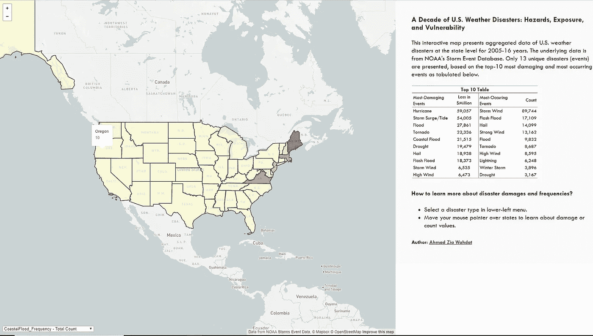

# 美国十年气象灾害:危害、暴露和脆弱性

> 原文：<https://towardsdatascience.com/a-decade-of-u-s-weather-disasters-hazards-exposure-and-vulnerability-7eeef46b3699?source=collection_archive---------27----------------------->

在过去的四十年里，美国面临了 241 次自然灾害事件，这些事件被称为“十亿美元”事件，每次事件的成本都大于或等于 10 亿美元( [NCEI，2019](https://www.ncdc.noaa.gov/billions/) )。关于这些灾害，一个令人担忧的事实是，随着时间的推移，它们的频率越来越高，随之而来的是生命损失以及对基础设施和农业的经济破坏。作为世界银行和 Mapbox 发起的#VizRisk 挑战的一部分，我决定制作一张美国天气灾害的[互动地图](https://awahdat.github.io/vizrisk_2020/)，让人们和组织看到各种灾害的发生和破坏。我展示的数据来自[风暴事件数据库](https://www.ncdc.noaa.gov/stormevents/)，这是美国国家海洋和大气管理局(NOAA)国家气象局的产品。

A static image of the interactive map

呈现灾害风险数据的一个挑战是维度，空间(跨地理)和时间(跨时间)维度使得很难以有意义和可理解的方式总结数据。因为我显示灾难数据的目的是帮助您理解，所以我必须做出几个关于数据减少的决定。

首先，我决定不呈现每年的数据点，而是呈现 2005 年至 2016 年所有年份的总和。第二，在我的数据中有多达 48 个独特的事件，所以我决定只呈现最令人担忧的事件。我在确定 10 个最具破坏性和 10 个最常发生的事件的基础上，仅列出 13 个独特的灾难事件(两个列表中有些事件重叠)。我不改变空间维度。

Top 10 table for selecting 13 unique disaster events

作为最终输出，您可以在下拉列表中选择一场灾难，并检查其损失价值(以百万美元计)或检查其在美国各州的发生频率。

# 我是如何构建我的交互式地图的？

为了构建我的交互式地图，我主要依赖 Mapbox 的底图、ap I 和图形库；GitHub 用于文件版本控制和托管网站；数据争论的 Stata 和 NOAA 网站获取灾害数据。生成交互式地图的[代码](https://github.com/awahdat/vizrisk_2020/blob/master/index.html)完全可以通过我的 GitHub [帐户](https://github.com/awahdat/vizrisk_2020)获得，所以在本文中我不会过多地讨论它的细节。

最初，我用 Mapbox 创建了一个帐户，这样我就可以获得自己的 Mapbox API 令牌，因为它是使 Mapbox javascript 元素正常工作所必需的。我还获得了底图图层的令牌，这是一个“浅色”图层。

Access tokens

我选择了 light 图层，因为它为 choropleth 美国地图图层提供了一个很好的背景。

Choropleth map over a light basemap layer

一旦我有了一个浅色底图图层，我希望添加三个交互功能。首先是美国的 choropleth 地图，其次是根据下拉菜单中选择的灾难类型更新的 choropleth 地图。第三，用户可以通过在地图上自由移动鼠标指针来读取州名及其数据值。简而言之，我能够从 Mapbox 中学习两个例子并创建自己的地图。第一个例子结合了[多个 Choropleth 映射](https://docs.mapbox.com/mapbox.js/example/v1.0.0/choropleth-joined-data-multiple-variables/)。第二个例子提供了[可视化数据元素](https://docs.mapbox.com/mapbox.js/example/v1.0.0/choropleth/)的指南(使用鼠标指针)。别忘了，我在网页的右侧添加了填充来解释我的地图等。为了这个，我效仿了拉法·古铁雷斯的[范例代码](https://gist.github.com/geografa/a16ffa888f692f68a80f9bdd53f6b845#file-index-html)。我还要感谢来自 Mapbox 团队的 Deven Diliberto 和 Madison Draper，他们在我工作的不同阶段通过电子邮件提供了支持。

Interactive features of the map

创建一个 GitHub 账户并托管一个网站是一次很酷的冒险。我不知道 GitHub 能在多大程度上简化与代码相关的工作。我可以和其他初学 GitHubbers 的人分享两个关键的经验。为了能够在您的 index.html 中调用 JSON 或 GEOJSON 文件格式，请通过单击“Raw”按钮获得正确的链接。

The Raw button

如果你想上传一张图片到 GitHub 并在你的网页上重复使用，请在你的 GitHub 中创建一个文件夹(例如，“images”文件夹)，然后在你的 index.html 中调用正确的文件路径。

灾难数据争论是我工作中最耗时的部分。这也是最关键的部分。值得庆幸的是，我已经在普渡大学攻读博士学位时研究过这些数据。数据清理和分析部分花了我整整两个月的时间，因为这些数据的范围相当大。我使用 Stata 进行所有的数据工作，但后来我不得不使用 [convertcsv](http://www.convertcsv.com/csv-to-json.htm) 网站将汇总的数据转换为 JSON 文件格式。

就这样了，伙计们！如果你需要的话，你可以用我的完全可用的[代码](https://github.com/awahdat/vizrisk_2020/blob/master/index.html)来工作。如果您有任何问题，也可以通过 [LinkedIn](https://www.linkedin.com/in/ahmad-zia-wahdat-04475510/) 联系我。我希望你喜欢这个互动地图，至少找出受灾最频繁、损失最大的州。